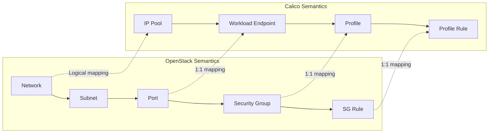

# How to Scale OpenStack Semantics in Calico

Author: [nawazdhandala](https://github.com/nawazdhandala)

Tags: OpenStack, Calico, Semantics, Scaling, Networking

Description: A guide to scaling the semantic mapping between OpenStack networking concepts and Calico data model at large scale, covering resource mapping optimization, metadata handling, and policy semantic...

---

## Introduction

OpenStack and Calico have different networking semantics. OpenStack thinks in terms of networks, subnets, ports, and security groups, while Calico thinks in terms of workload endpoints, IP pools, profiles, and network policies. At small scale, the translation between these models is straightforward. At large scale, the semantic mapping becomes a performance consideration and a source of operational complexity.

This guide addresses scaling the semantic translation layer between OpenStack and Calico, covering how to optimize resource mapping, handle metadata efficiently, and ensure that policy semantics remain consistent as the number of resources grows into the thousands.

Understanding semantic differences is important because what appears to be a Calico issue may actually be a translation issue, and vice versa. At scale, these translation edge cases multiply.

## Prerequisites

- An OpenStack deployment with Calico at scale (1000+ VMs)
- Understanding of both OpenStack Neutron and Calico data models
- `calicoctl` and `openstack` CLI tools configured
- Access to Neutron plugin logs and Calico datastore
- Monitoring for both OpenStack and Calico resources

## Understanding the Semantic Mapping

Document how OpenStack concepts map to Calico at scale.



Key semantic differences at scale:

```markdown
# Semantic Mapping Reference

## Networks
- OpenStack: Isolated L2 domain with a name and tenant
- Calico: No direct equivalent; routing is L3-only
- Scale impact: Calico does not create per-network resources,
  so network count does not affect Calico performance

## Subnets
- OpenStack: IP range within a network with DHCP configuration
- Calico: Maps to IPAM pool or block allocations
- Scale impact: More subnets = more IPAM blocks to manage

## Ports
- OpenStack: Network endpoint with MAC, IP, security groups
- Calico: WorkloadEndpoint with IP, labels, profiles
- Scale impact: 1:1 mapping; port count directly affects endpoint count

## Security Groups
- OpenStack: Named collection of firewall rules
- Calico: Profile with ingress/egress rules
- Scale impact: Each SG = one profile; rules multiply Felix computation
```

## Optimizing Semantic Translation at Scale

Tune the Calico Neutron plugin for efficient translation.

```bash
# Neutron plugin optimization for semantic mapping
cat << 'EOF' | sudo tee /etc/neutron/neutron.conf.d/semantic-scale.conf
[calico]
# Batch endpoint updates to reduce datastore writes
# When creating multiple ports rapidly, batch updates together
endpoint_reporting_delay = 2

# Cache security group lookups to avoid repeated DB queries
# Useful when many ports reference the same security group
security_group_cache_timeout = 60
EOF

sudo systemctl restart neutron-server
```

Configure Calico to handle the semantic translation efficiently:

```yaml
# felix-semantic-tuning.yaml
# Felix tuning for large OpenStack semantic mappings
apiVersion: projectcalico.org/v3
kind: FelixConfiguration
metadata:
  name: default
spec:
  # Increase the max number of active profiles (security groups)
  # Default may be too low for large multi-tenant OpenStack
  maxIpsetSize: 1048576
  # Reduce iptables refresh frequency for stable deployments
  iptablesRefreshInterval: 120s
  # Log only warnings to reduce I/O from semantic translation events
  logSeverityScreen: Warning
```

## Managing Metadata at Scale

OpenStack attaches metadata to ports that Calico translates to endpoint labels. At scale, metadata management affects performance.

```bash
#!/bin/bash
# audit-metadata-scale.sh
# Audit metadata and label usage at scale

echo "=== Metadata Scale Audit ==="

# Count total endpoints
TOTAL=$(calicoctl get workloadendpoints --all-namespaces -o json 2>/dev/null |   python3 -c "import json,sys; print(len(json.load(sys.stdin).get('items',[])))")
echo "Total endpoints: ${TOTAL}"

# Average labels per endpoint
AVG_LABELS=$(calicoctl get workloadendpoints --all-namespaces -o json 2>/dev/null |   python3 -c "
import json, sys
data = json.load(sys.stdin)
items = data.get('items', [])
if items:
    total = sum(len(i.get('metadata',{}).get('labels',{})) for i in items)
    print(f'{total/len(items):.1f}')
else:
    print('0')
")
echo "Average labels per endpoint: ${AVG_LABELS}"

# Profile (security group) count
PROFILES=$(calicoctl get profiles -o name 2>/dev/null | wc -l)
echo "Total profiles (security groups): ${PROFILES}"

# Average rules per profile
echo "Checking rule density..."
calicoctl get profiles -o json 2>/dev/null |   python3 -c "
import json, sys
data = json.load(sys.stdin)
items = data.get('items', [])
if items:
    total_rules = 0
    for item in items:
        spec = item.get('spec', {})
        total_rules += len(spec.get('ingress', []))
        total_rules += len(spec.get('egress', []))
    print(f'Average rules per profile: {total_rules/len(items):.1f}')
"
```

## Scaling Policy Semantics

Ensure policy semantics remain consistent as OpenStack resources grow.

```yaml
# semantic-consistency-policy.yaml
# Policy that bridges OpenStack and Calico semantics
apiVersion: projectcalico.org/v3
kind: GlobalNetworkPolicy
metadata:
  name: openstack-default-deny
  annotations:
    openstack.semantic: "default-security-group-behavior"
spec:
  # OpenStack default: deny all ingress unless explicitly allowed
  # This matches the OpenStack semantic in Calico
  selector: has(projectcalico.org/openstack-project-id)
  types:
    - Ingress
  ingress: []
  # This policy runs at a lower priority than security group profiles
  order: 1000
```

## Verification

```bash
#!/bin/bash
# verify-semantics.sh
echo "=== Semantic Mapping Verification ==="

echo "OpenStack resources:"
echo "  Networks: $(openstack network list --all-projects -f value | wc -l)"
echo "  Subnets: $(openstack subnet list --all-projects -f value | wc -l)"
echo "  Ports: $(openstack port list --all-projects -f value | wc -l)"
echo "  Security Groups: $(openstack security group list --all-projects -f value | wc -l)"

echo ""
echo "Calico resources:"
echo "  IP Pools: $(calicoctl get ippools -o name 2>/dev/null | wc -l)"
echo "  Endpoints: $(calicoctl get workloadendpoints --all-namespaces -o name 2>/dev/null | wc -l)"
echo "  Profiles: $(calicoctl get profiles -o name 2>/dev/null | wc -l)"

echo ""
echo "Consistency check:"
OS_PORTS=$(openstack port list --all-projects -f value | wc -l)
CAL_EP=$(calicoctl get workloadendpoints --all-namespaces -o name 2>/dev/null | wc -l)
echo "  Port-to-endpoint ratio: ${OS_PORTS}:${CAL_EP}"
```

## Troubleshooting

- **Endpoint count does not match port count**: Some Neutron ports (DHCP, router) may not create Calico endpoints. Check for port device_owner types that Calico skips.
- **Security group rules not reflected in Calico profiles**: Check the Neutron plugin logs for translation errors. Verify the Calico plugin version supports all security group rule types in use.
- **Felix slow to process semantic updates**: Large numbers of profiles with many rules increase Felix computation time. Consider consolidating security groups with identical rules.
- **Metadata labels missing on endpoints**: Check the Neutron-to-Calico metadata mapping configuration. Verify that OpenStack VM properties are being translated to Calico endpoint labels.

## Conclusion

Scaling the semantic mapping between OpenStack and Calico requires understanding where the two models differ and optimizing the translation layer. By tuning the Neutron plugin, managing metadata efficiently, and auditing resource consistency, you ensure that the semantic bridge between OpenStack and Calico remains reliable as your deployment grows. Monitor the port-to-endpoint ratio as a key health indicator for the semantic mapping layer.
