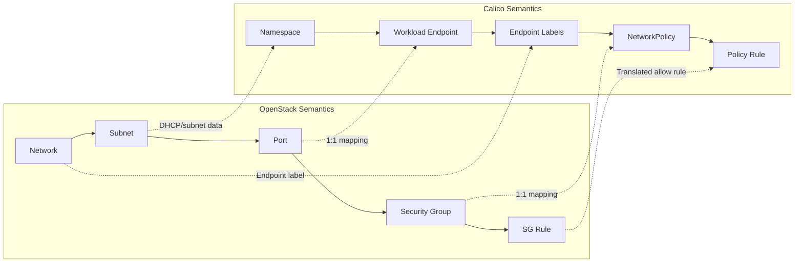

# How to Scale OpenStack Semantics in Calico

Author: [nawazdhandala](https://github.com/nawazdhandala)

Tags: OpenStack, Calico, Semantics, Scaling, Networking

Description: A guide to scaling the semantic mapping between OpenStack networking concepts and Calico data model at large scale, covering resource mapping optimization, metadata handling, and policy semantic...

---

## Introduction

OpenStack and Calico have different networking semantics. OpenStack thinks in terms of networks, subnets, ports, and security groups, while Calico thinks in terms of workload endpoints, endpoint labels, namespace-scoped network policies, and operator network policies. At small scale, the translation between these models is straightforward. At large scale, the semantic mapping becomes a performance consideration and a source of operational complexity.

This guide addresses scaling the semantic translation layer between OpenStack and Calico, covering how to optimize resource mapping, handle endpoint labels efficiently, and ensure that policy semantics remain consistent as the number of resources grows into the thousands.

Understanding semantic differences is important because what appears to be a Calico issue may actually be a translation issue, and vice versa. At scale, these translation edge cases multiply.

## Prerequisites

- An OpenStack deployment with Calico at scale (1000+ VMs)
- Understanding of both OpenStack Neutron and Calico data models
- `calicoctl` and `openstack` CLI tools configured
- Access to Neutron plugin logs and Calico datastore
- Monitoring for both OpenStack and Calico resources

## Understanding the Semantic Mapping

Document how OpenStack concepts map to Calico at scale.


```mermaid
graph LR
    subgraph "OpenStack Semantics"
        N[Network] --> S[Subnet]
        S --> P[Port]
        P --> SG[Security Group]
        SG --> SGR[SG Rule]
    end
    subgraph "Calico Semantics"
        NS[Namespace] --> WE[Workload Endpoint]
        WE --> L[Endpoint Labels]
        L --> NP[NetworkPolicy]
        NP --> NPR[Policy Rule]
    end
    N -.->|"Endpoint label"| L
    S -.->|"DHCP/subnet data"| NS
    P -.->|"1:1 mapping"| WE
    SG -.->|"1:1 mapping"| NP
    SGR -.->|"Translated allow rule"| NPR
```

Key semantic differences at scale:

```markdown
# Semantic Mapping Reference

## Networks
- OpenStack: Isolated L2 domain with a name and tenant
- Calico: No L2 isolation equivalent; routing is L3-only, and network
  membership is represented on endpoints with labels and annotations
- Scale impact: Network count mainly affects endpoint label/annotation data
  and Neutron-side objects, not a separate Calico L2 dataplane

## Subnets
- OpenStack: IP range within a network with DHCP configuration
- Calico: DHCP-enabled Neutron subnets are synchronized as subnet data for
  Calico's OpenStack components
- Scale impact: More DHCP-enabled subnets = more subnet state to synchronize

## Ports
- OpenStack: Network endpoint with MAC, IP, security groups
- Calico: WorkloadEndpoint with IP, labels, and interface metadata
- Scale impact: 1:1 mapping; port count directly affects endpoint count

## Security Groups
- OpenStack: Named collection of firewall rules
- Calico: NetworkPolicy with ingress/egress allow rules selected by
  generated security-group labels on WorkloadEndpoints
- Scale impact: Each SG = one NetworkPolicy; rules multiply Felix computation
```

## Optimizing Semantic Translation at Scale

Tune the Calico Neutron plugin for efficient translation.

```bash
# Neutron plugin optimization for semantic mapping

cat << 'EOF' | sudo tee /etc/neutron/neutron.conf.d/semantic-scale.conf
[calico]
# Increase the number of background threads used for port status DB updates.
num_port_status_threads = 8

# Tune periodic reconciliation of Calico state against the Neutron DB.
resync_interval_secs = 120
resync_max_interval_secs = 3600

# Cache project names used for OpenStack endpoint labels.
project_name_cache_max = 1000
EOF

sudo systemctl restart neutron-server
```

Configure Calico to handle the semantic translation efficiently:

```yaml
# felix-semantic-tuning.yaml
# Felix tuning for large OpenStack semantic mappings
apiVersion: projectcalico.org/v3
kind: FelixConfiguration
metadata:
  name: default
spec:
  # Log only warnings to reduce I/O from semantic translation events
  logSeverityScreen: Warning
```

## Managing Labels at Scale

Calico's OpenStack driver adds labels to WorkloadEndpoints for OpenStack projects, networks, security groups, and namespaces. At scale, label management affects selector performance and policy rendering.

```bash
#!/bin/bash
# audit-label-scale.sh
# Audit OpenStack label usage at scale

echo "=== Label Scale Audit ==="

# Count total endpoints
TOTAL=$(calicoctl get workloadendpoints --all-namespaces -o json 2>/dev/null |   python3 -c "import json,sys; print(len(json.load(sys.stdin).get('items',[])))")
echo "Total endpoints: ${TOTAL}"

# Average labels per endpoint
AVG_LABELS=$(calicoctl get workloadendpoints --all-namespaces -o json 2>/dev/null |   python3 -c "
import json, sys
data = json.load(sys.stdin)
items = data.get('items', [])
if items:
    total = sum(len(i.get('metadata',{}).get('labels',{})) for i in items)
    print(f'{total/len(items):.1f}')
else:
    print('0')
")
echo "Average labels per endpoint: ${AVG_LABELS}"

# Security group policy count
SG_POLICIES=$(calicoctl get networkpolicies --all-namespaces -o name 2>/dev/null | grep -c '/ossg.default.' || true)
echo "Total security group policies: ${SG_POLICIES}"

# Average rules per security group policy
echo "Checking rule density..."
calicoctl get networkpolicies --all-namespaces -o json 2>/dev/null |   python3 -c "
import json, sys
data = json.load(sys.stdin)
items = [
    item for item in data.get('items', [])
    if item.get('metadata', {}).get('name', '').startswith('ossg.default.')
]
if items:
    total_rules = 0
    for item in items:
        spec = item.get('spec', {})
        total_rules += len(spec.get('ingress', []))
        total_rules += len(spec.get('egress', []))
    print(f'Average rules per security group policy: {total_rules/len(items):.1f}')
"
```

## Scaling Policy Semantics

Ensure policy semantics remain consistent as OpenStack resources grow.

```yaml
# semantic-consistency-policy.yaml
# Operator policy that is enforced before OpenStack security groups
apiVersion: projectcalico.org/v3
kind: GlobalNetworkPolicy
metadata:
  name: openstack-operator-deny-example
  annotations:
    openstack.semantic: "operator-policy-before-security-groups"
spec:
  # Policies with an explicit order are enforced before policies derived
  # from OpenStack security groups.
  order: 10
  selector: "projectcalico.org/openstack-project-name == 'restricted'"
  types:
    - Ingress
  ingress:
    - action: Deny
      source:
        selector: "projectcalico.org/openstack-project-name == 'blocked'"
```

## Verification

```bash
#!/bin/bash
# verify-semantics.sh
echo "=== Semantic Mapping Verification ==="

echo "OpenStack resources:"
echo "  Networks: $(openstack network list -f value | wc -l)"
echo "  Subnets: $(openstack subnet list -f value | wc -l)"
echo "  Ports: $(openstack port list -f value | wc -l)"
echo "  Security Groups: $(openstack security group list -f value | wc -l)"

echo ""
echo "Calico resources:"
echo "  Endpoints: $(calicoctl get workloadendpoints --all-namespaces -o name 2>/dev/null | wc -l)"
echo "  Security Group Policies: $(calicoctl get networkpolicies --all-namespaces -o name 2>/dev/null | grep -c '/ossg.default.' || true)"

echo ""
echo "Consistency check:"
OS_PORTS=$(openstack port list -f value | wc -l)
CAL_EP=$(calicoctl get workloadendpoints --all-namespaces -o name 2>/dev/null | wc -l)
echo "  Port-to-endpoint ratio: ${OS_PORTS}:${CAL_EP}"
```

## Troubleshooting

- **Endpoint count does not match port count**: Some Neutron ports (DHCP, router) may not create Calico endpoints. Check for port device_owner types that Calico skips.
- **Security group rules not reflected in Calico policies**: Check the Neutron plugin logs for translation errors. Verify the Calico plugin version supports all security group rule types in use.
- **Felix slow to process semantic updates**: Large numbers of policies with many rules increase Felix computation time. Consider consolidating security groups with identical rules.
- **OpenStack labels missing on endpoints**: Check the Calico OpenStack driver logs and Keystone privileges. Project-name and parent-project labels require Neutron to have sufficient Keystone access.

## Conclusion

Scaling the semantic mapping between OpenStack and Calico requires understanding where the two models differ and optimizing the translation layer. By tuning the Neutron plugin, managing endpoint labels efficiently, and auditing resource consistency, you ensure that the semantic bridge between OpenStack and Calico remains reliable as your deployment grows. Monitor the port-to-endpoint ratio as a key health indicator for the semantic mapping layer.
