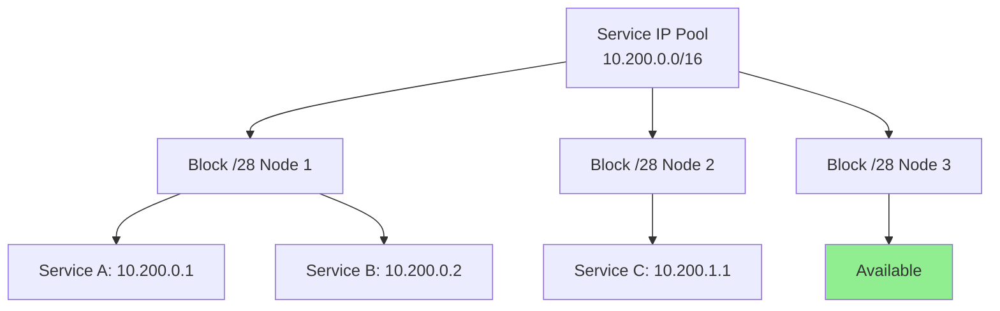

# How to Scale OpenStack Service IPs with Calico

Author: [nawazdhandala](https://github.com/nawazdhandala)

Tags: OpenStack, Calico, Service IPs, Scaling, Networking

Description: A guide to scaling OpenStack service IP management with Calico for large deployments, covering IP pool sizing, address allocation optimization, and service endpoint management.

---

## Introduction

Service IPs in OpenStack with Calico provide stable endpoints for services running on VMs. As deployments grow, managing the allocation, routing, and policy enforcement for service IPs becomes a scaling challenge. Each service IP adds routes to the data plane and requires policy rules for access control.

This guide covers scaling strategies for service IP management with Calico, including IP pool sizing for large deployments, efficient address allocation, route aggregation for service IPs, and monitoring allocation usage to prevent pool exhaustion.

The key scaling consideration for service IPs is that unlike VM IPs which are typically allocated from large pools, service IPs often come from smaller, dedicated pools that can exhaust more quickly and cause service deployment failures.

## Prerequisites

- An OpenStack deployment with Calico networking
- Understanding of Calico IP pool and IPAM concepts
- `calicoctl` configured with datastore access
- Monitoring infrastructure for IP allocation tracking
- Planning data for expected service growth

## Configuring Service IP Pools

Create dedicated IP pools for service endpoints to separate them from VM networking.

```yaml
# service-ippool.yaml
# Dedicated IP pool for OpenStack service endpoints
apiVersion: projectcalico.org/v3
kind: IPPool
metadata:
  name: openstack-service-ips
spec:
  # Use a /16 for large-scale service IP allocation
  cidr: 10.200.0.0/16
  # Smaller block size for service IPs (more granular allocation)
  blockSize: 28
  # Services typically need NAT for external access
  natOutgoing: true
  # No encapsulation for direct routing
  encapsulation: None
  # Restrict to nodes labeled for service hosting
  nodeSelector: service-host == 'true'
```

```bash
# Apply the service IP pool
calicoctl apply -f service-ippool.yaml

# Verify pool creation
calicoctl get ippools -o wide
```

## Monitoring IP Allocation

Track IP pool usage to prevent exhaustion.

```bash
#!/bin/bash
# monitor-service-ips.sh
# Monitor service IP allocation

echo "=== Service IP Allocation Report ==="
echo "Date: $(date)"

# Show IPAM allocation summary
calicoctl ipam show

echo ""
echo "=== Per-Pool Usage ==="
calicoctl ipam show --show-blocks 2>/dev/null

echo ""
echo "=== Allocation by Node ==="
for node in $(calicoctl get nodes -o name 2>/dev/null); do
  blocks=$(calicoctl ipam show --show-blocks 2>/dev/null | grep -c "${node}")
  echo "  ${node}: ${blocks} IPAM blocks"
done

# Alert if pool utilization exceeds 80%
echo ""
echo "=== Utilization Alerts ==="
calicoctl ipam show 2>/dev/null | while read line; do
  if echo "${line}" | grep -qP '\d+% allocated'; then
    pct=$(echo "${line}" | grep -oP '\d+(?=% allocated)')
    if [ "${pct}" -gt 80 ]; then
      echo "WARNING: Pool utilization at ${pct}%"
    fi
  fi
done
```



## Optimizing Route Aggregation for Service IPs

Aggregate service IP routes to reduce route table size.

```yaml
# bgp-service-aggregation.yaml
# BGP configuration to aggregate service IP advertisements
apiVersion: projectcalico.org/v3
kind: BGPConfiguration
metadata:
  name: default
spec:
  nodeToNodeMeshEnabled: false
  asNumber: 64512
  # Advertise the aggregate service IP range
  prefixAdvertisements:
    - cidr: 10.200.0.0/16
      communities:
        - "64512:200"
```

## Implementing Service IP Policies

Create policies that scale with the number of services.

```yaml
# service-access-policy.yaml
# Global policy for service IP access control
apiVersion: projectcalico.org/v3
kind: GlobalNetworkPolicy
metadata:
  name: service-ip-access
spec:
  # Apply to all endpoints with service IPs
  selector: has(service-name)
  types:
    - Ingress
  ingress:
    # Allow from authorized consumers
    - action: Allow
      source:
        selector: has(service-consumer)
      protocol: TCP
    # Allow health checks from monitoring
    - action: Allow
      source:
        selector: role == 'monitoring'
      protocol: TCP
      destination:
        ports:
          - 8080
```

## Verification

```bash
#!/bin/bash
# verify-service-ip-scale.sh
echo "=== Service IP Scaling Verification ==="

echo "Service IP Pool:"
calicoctl get ippools openstack-service-ips -o yaml

echo ""
echo "Allocated Service IPs:"
calicoctl ipam show

echo ""
echo "Route count for service IPs:"
for node in $(calicoctl get nodes -o name 2>/dev/null | head -3); do
  node_name=$(echo ${node} | sed 's|node/||')
  echo "  ${node_name}: checking routes..."
done
```

## Troubleshooting

- **Service IP pool exhausted**: Check for IP leaks from terminated services. Run `calicoctl ipam show --show-blocks` to identify over-allocated nodes. Consider expanding the pool CIDR.
- **Routes for service IPs not propagating**: Verify BGP configuration includes the service IP CIDR in `prefixAdvertisements`. Check route reflector BGP sessions.
- **Service IP conflicts**: Ensure the service IP pool CIDR does not overlap with VM pools or infrastructure networks. Use `calicoctl get ippools` to verify all pool CIDRs.
- **Policy not applying to service endpoints**: Verify endpoints have the expected labels. Check that the policy selector matches the labels on service endpoints.

## Conclusion

Scaling service IPs in OpenStack with Calico requires dedicated IP pools, proactive allocation monitoring, route aggregation, and efficient policy management. By separating service IPs from VM IPs, monitoring utilization, and implementing aggregate route advertisements, you prevent service IP exhaustion and maintain efficient routing as your deployment grows.
