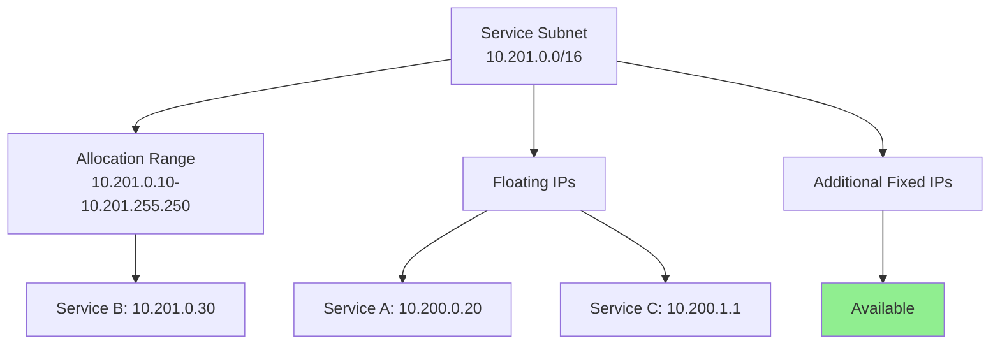

# How to Scale OpenStack Service IPs with Calico

Author: [nawazdhandala](https://github.com/nawazdhandala)

Tags: OpenStack, Calico, Service IPs, Scaling, Networking

Description: A guide to scaling OpenStack service IP management with Calico for large deployments, covering IP pool sizing, address allocation optimization, and service endpoint management.

---

## Introduction

Service IPs in OpenStack with Calico provide stable endpoints for services running on VMs. Calico supports these endpoints using standard Neutron mechanisms: floating IPs, or additional fixed IPs on the relevant Neutron port. As deployments grow, managing the allocation, routing, and policy enforcement for service IPs becomes a scaling challenge. Additional fixed IPs are routed directly to the VM, while floating IP traffic is DNAT'd to the VM's fixed IP.

This guide covers scaling strategies for service IP management with Calico, including Neutron pool sizing for large deployments, efficient address allocation, BGP route management for service IPs, and monitoring allocation usage to prevent pool exhaustion.

The key scaling consideration for service IPs is that unlike VM IPs which are typically allocated from large tenant pools, service IPs often come from smaller, dedicated Neutron allocation pools that can exhaust more quickly and cause service deployment failures.

## Prerequisites

- An OpenStack deployment with Calico networking
- Understanding of Neutron subnets, allocation pools, ports, and floating IPs
- `calicoctl` configured with datastore access
- OpenStack CLI configured for the target cloud
- Monitoring infrastructure for IP allocation tracking
- Planning data for expected service growth

## Configuring Service IP Pools

Create dedicated Neutron allocation pools for service endpoints. In Calico for OpenStack, service IPs are assigned with Neutron floating IPs or additional fixed IPs rather than by creating a Calico `IPPool`. Additional fixed IPs must come from a subnet on the VM port's network; floating IPs come from an external/provider network.

```bash
# Create an external/provider range for floating service IPs
openstack network create --external --share public
openstack subnet create public-service-subnet \
  --network public \
  --subnet-range 10.200.0.0/16 \
  --allocation-pool start=10.200.0.10,end=10.200.255.250 \
  --gateway none \
  --no-dhcp

# Create a service subnet on the target VM network for additional fixed IPs
openstack subnet create service-subnet \
  --network <target-vm-network> \
  --subnet-range 10.201.0.0/16 \
  --allocation-pool start=10.201.0.10,end=10.201.255.250 \
  --gateway none \
  --no-dhcp

# Allocate a floating IP for a service endpoint
openstack floating ip create --floating-ip-address 10.200.0.20 public
openstack floating ip set --port <target-vm-port-id> 10.200.0.20

# Or add an additional fixed IP directly to the VM port
openstack port set <target-vm-port-id> \
  --fixed-ip subnet=service-subnet,ip-address=10.201.0.30
```

## Monitoring IP Allocation

Track service subnet usage to prevent exhaustion.

```bash
#!/bin/bash
# monitor-service-ips.sh
# Monitor service IP allocation

echo "=== Service IP Allocation Report ==="
echo "Date: $(date)"

# Show allocated floating IPs
openstack floating ip list --long

echo ""
echo "=== Service Subnet Usage ==="
openstack port list --fixed-ip subnet=service-subnet

echo ""
echo "=== Allocation Summary ==="
allocated=$(openstack port list --fixed-ip subnet=service-subnet -f value -c ID | wc -l)
total=65521
pct=$((allocated * 100 / total))
echo "Allocated service IPs: ${allocated}"
echo "Approximate utilization: ${pct}%"

# Alert if pool utilization exceeds 80%
echo ""
echo "=== Utilization Alerts ==="
if [ "${pct}" -gt 80 ]; then
  echo "WARNING: Service subnet utilization at ${pct}%"
fi
```


```mermaid
graph TD
    A[Service Subnet<br>10.201.0.0/16] --> B[Allocation Range<br>10.201.0.10-10.201.255.250]
    A --> C[Floating IPs]
    A --> D[Additional Fixed IPs]
    C --> C1[Service A: 10.200.0.20]
    C --> C2[Service C: 10.200.1.1]
    B --> B1[Service B: 10.201.0.30]
    D --> D1[Available]
    style D1 fill:#90EE90
```

## Optimizing Route Aggregation for Service IPs

Use Calico BGP controls to keep route distribution manageable. In larger OpenStack deployments, route reflectors reduce the scaling cost of node-to-node BGP peering; `prefixAdvertisements` can attach communities to a service prefix for upstream routing policy, but it does not replace the need to plan where summarization is performed.

```yaml
# bgp-service-aggregation.yaml
# BGP configuration to tag the service prefix for upstream policy
apiVersion: projectcalico.org/v3
kind: BGPConfiguration
metadata:
  name: default
spec:
  nodeToNodeMeshEnabled: false
  asNumber: 64512
  # Add BGP communities to advertisements for the service prefix
  prefixAdvertisements:
    - cidr: 10.200.0.0/16
      communities:
        - "64512:200"
    - cidr: 10.201.0.0/16
      communities:
        - "64512:200"
```

## Implementing Service IP Policies

Create policies that scale with the number of services.

```yaml
# service-access-policy.yaml
# Global policy for service endpoint access control
apiVersion: projectcalico.org/v3
kind: GlobalNetworkPolicy
metadata:
  name: service-ip-access
spec:
  order: 10
  # Apply to VMs in the OpenStack service project
  selector: "projectcalico.org/openstack-project-name == 'service-project'"
  types:
    - Ingress
  ingress:
    # Allow from authorized consumers
    - action: Allow
      source:
        selector: "projectcalico.org/openstack-project-name == 'service-consumers'"
      protocol: TCP
    # Allow health checks from monitoring
    - action: Allow
      source:
        selector: "projectcalico.org/openstack-project-name == 'monitoring'"
      protocol: TCP
      destination:
        ports:
          - 8080
```

## Verification

```bash
#!/bin/bash
# verify-service-ip-scale.sh
echo "=== Service IP Scaling Verification ==="

echo "Service subnet:"
openstack subnet show service-subnet

echo ""
echo "Allocated floating IPs:"
openstack floating ip list --long

echo ""
echo "Route count for service IPs:"
ip route | grep -Ec '^(10\.200\.|10\.201\.)'
```

## Troubleshooting

- **Service IP pool exhausted**: Check for stale floating IPs and unused additional fixed IPs on terminated services. Use `openstack floating ip list` and `openstack port list --fixed-ip subnet=service-subnet` to identify allocations. Consider expanding the Neutron subnet allocation pool or adding another service subnet.
- **Routes for service IPs not propagating**: Verify the service IP was added to the Neutron port or associated as a floating IP. Check BIRD and route reflector BGP sessions on the relevant compute nodes.
- **Service IP conflicts**: Ensure the service subnet CIDR does not overlap with VM pools or infrastructure networks. Use `openstack subnet list` to verify all subnet CIDRs.
- **Policy not applying to service endpoints**: Verify endpoints have the expected OpenStack-derived Calico labels. Check that the policy selector matches labels such as `projectcalico.org/openstack-project-name` or the relevant security group label.

## Conclusion

Scaling service IPs in OpenStack with Calico requires dedicated Neutron allocation pools, proactive allocation monitoring, BGP route planning, and efficient policy management. By separating service IPs from VM IPs, monitoring utilization, and managing route distribution, you prevent service IP exhaustion and maintain efficient routing as your deployment grows.
