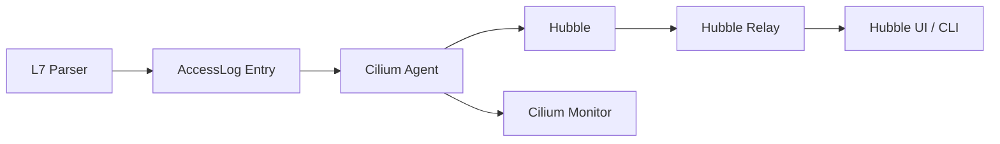

# Securing Access Logging in Cilium Network Security

Author: [nawazdhandala](https://github.com/nawazdhandala)

Tags: Cilium, Network Security, Access Logging, L7 Proxy, Observability

Description: Implement secure access logging in Cilium L7 parsers that captures audit-relevant events without exposing sensitive data, with proper log rotation, structured formatting, and tamper detection.

---

## Introduction

Access logging in Cilium L7 parsers records every policy decision made by the proxy — which requests were allowed, which were denied, and relevant metadata about each transaction. This data is essential for security auditing, compliance, incident investigation, and troubleshooting.

However, access logs themselves become a security concern if they contain sensitive data (passwords, tokens, personal information) or if they can be tampered with. Secure access logging requires careful selection of what to log, structured formatting for machine parsing, and protection of the log stream.

This guide covers implementing secure access logging in Cilium L7 parsers following the patterns established by Cilium's existing HTTP and Kafka access logs.

## Prerequisites

- A working Cilium L7 parser with policy decisions
- Understanding of Cilium's access log architecture
- Familiarity with Cilium Hubble for flow observation
- Go 1.21 or later
- Kubernetes cluster with Cilium and Hubble enabled

## Understanding Cilium's Access Log Architecture

Cilium access logs flow through a structured pipeline:



```bash
# View existing access log configuration
kubectl exec -n kube-system ds/cilium -- cilium config | grep -i "access-log\|proxy-access"

# Check Hubble L7 flow visibility
hubble observe --type l7 --protocol myprotocol
```

## Implementing Structured Access Log Entries

Create log entries using Cilium's accesslog package:

```go
package myprotocol

import (
    "time"

    "github.com/cilium/cilium/proxylib/accesslog"
)

// logAccess creates a structured access log entry for a parsed request
func (p *Parser) logAccess(reply bool, command byte, requestID uint32, verdict accesslog.FlowVerdict) {
    entry := &accesslog.LogRecord{
        // Timestamp in UTC for consistency
        Timestamp: time.Now().UTC().Format(time.RFC3339Nano),

        // Connection metadata from Cilium
        SourceEndpoint:      p.connection.SrcEndpoint,
        DestinationEndpoint: p.connection.DstEndpoint,
        SourceIdentity:      p.connection.SrcIdentity,
        DestinationIdentity: p.connection.DstIdentity,

        // Protocol-specific fields
        Type:     accesslog.TypeRequest,
        Verdict:  verdict,
        Protocol: "myprotocol",

        // Custom L7 fields — only non-sensitive metadata
        L7: map[string]string{
            "command":    commandName(command),
            "request_id": fmt.Sprintf("%d", requestID),
        },
    }

    if reply {
        entry.Type = accesslog.TypeResponse
    }

    // Send to Cilium's access log pipeline
    accesslog.Log(entry)
}
```

## Filtering Sensitive Data

Never log sensitive protocol content:

```go
// sensitiveCommands lists commands whose payloads may contain credentials
var sensitiveCommands = map[byte]bool{
    0x10: true, // AUTH command
    0x11: true, // LOGIN command
}

// sanitizeForLogging removes sensitive content from log entries
func sanitizeForLogging(command byte, fields map[string]string) map[string]string {
    safe := make(map[string]string, len(fields))

    for k, v := range fields {
        switch k {
        case "password", "token", "secret", "credential", "auth_data":
            safe[k] = "[REDACTED]"
        case "payload", "body", "data":
            if sensitiveCommands[command] {
                safe[k] = "[REDACTED]"
            } else {
                // Truncate non-sensitive payloads to prevent log bloat
                if len(v) > 256 {
                    safe[k] = v[:256] + "...[truncated]"
                } else {
                    safe[k] = v
                }
            }
        default:
            safe[k] = v
        }
    }

    return safe
}

// Integration with the parser
func (p *Parser) logAccessSecure(reply bool, command byte, requestID uint32,
    verdict accesslog.FlowVerdict, extraFields map[string]string) {

    // Sanitize before logging
    safeFields := sanitizeForLogging(command, extraFields)
    safeFields["command"] = commandName(command)
    safeFields["request_id"] = fmt.Sprintf("%d", requestID)

    entry := &accesslog.LogRecord{
        Timestamp:           time.Now().UTC().Format(time.RFC3339Nano),
        SourceIdentity:      p.connection.SrcIdentity,
        DestinationIdentity: p.connection.DstIdentity,
        Type:                accesslog.TypeRequest,
        Verdict:             verdict,
        Protocol:            "myprotocol",
        L7:                  safeFields,
    }

    accesslog.Log(entry)
}
```

## Integrating with Hubble

Make access logs visible through Hubble's flow observation:

```bash
# Observe L7 flows for your protocol
hubble observe --type l7 --protocol myprotocol -o json

# Filter for denied requests
hubble observe --type l7 --verdict DENIED --protocol myprotocol

# Export to JSON for analysis
hubble observe --type l7 --protocol myprotocol -o jsonpb > flows.json
```

Configure Hubble to include your protocol's L7 fields:

```yaml
# Cilium ConfigMap additions
apiVersion: v1
kind: ConfigMap
metadata:
  name: cilium-config
  namespace: kube-system
data:
  hubble-enabled: "true"
  hubble-listen-address: ":4244"
  hubble-metrics-enabled: "dns:query;drop;tcp;flow;port-distribution;icmp;http"
```

## Preventing Log Injection Attacks

Sanitize any client-controlled data that appears in logs:

```go
// sanitizeLogField prevents log injection by removing control characters
func sanitizeLogField(s string) string {
    var buf strings.Builder
    buf.Grow(len(s))
    for _, r := range s {
        switch {
        case r == '\n' || r == '\r':
            buf.WriteString("\\n")
        case r == '\t':
            buf.WriteString("\\t")
        case r < 0x20:
            // Skip other control characters
            buf.WriteString(fmt.Sprintf("\\x%02x", r))
        default:
            buf.WriteRune(r)
        }
    }
    return buf.String()
}
```

## Verification

Test access logging:

```bash
# Run logging-specific tests
go test ./proxylib/myprotocol/... -v -run TestLogAccess

# Verify no sensitive data in logs
go test ./proxylib/myprotocol/... -v -run TestSanitizeForLogging

# Test in cluster
kubectl apply -f test-l7-policy.yaml
kubectl exec test-client -- protocol-client send --command GET --target myservice:9000

# Check Hubble output
hubble observe --type l7 -n default --last 10

# Check Cilium monitor
kubectl exec -n kube-system ds/cilium -- cilium monitor --type l7
```

## Troubleshooting

**Problem: Access logs not appearing in Hubble**
Verify Hubble is enabled in the Cilium configuration. Check that the `accesslog.Log()` function is being called by adding debug logging before the call.

**Problem: Logs contain sensitive data despite filtering**
Review all code paths that create log entries. Sensitive data may be logged through Go's `log` package or `fmt.Printf` statements outside the structured logging path.

**Problem: Log volume is too high**
Implement sampling for high-traffic connections. Log all denied requests (security-relevant) but sample allowed requests at a configurable rate.

**Problem: Log entries have wrong timestamps**
Always use `time.Now().UTC()` for consistency. Different nodes in the cluster may have clock skew; consider using Cilium's monotonic timestamp if available.

## Conclusion

Secure access logging in Cilium L7 parsers requires careful data selection, sensitive field redaction, log injection prevention, and integration with Cilium's observability pipeline through Hubble. By logging only the metadata needed for security auditing and sanitizing all client-controlled content, you create an audit trail that supports incident response without becoming a liability. Always test that sensitive data is properly redacted before deploying logging changes to production.
