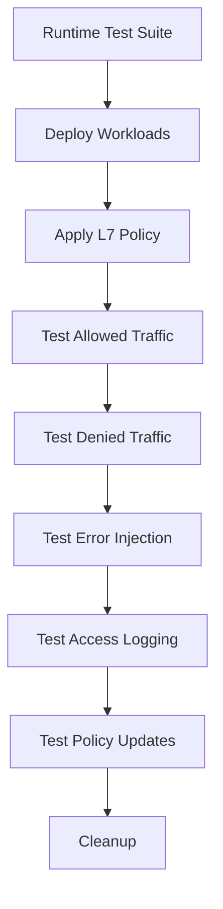

# Securing Runtime Tests for Cilium Network Security

Author: [nawazdhandala](https://github.com/nawazdhandala)

Tags: Cilium, Network Security, Runtime Tests, Integration Testing, L7 Proxy

Description: Build secure runtime integration tests for Cilium L7 parsers that validate parser behavior in a live Kubernetes cluster with real network traffic, policy enforcement, and observability pipeline...

---

## Introduction

Runtime tests validate Cilium L7 parsers in their actual execution environment - inside the Cilium agent, processing real network traffic through the Envoy proxy. Unlike unit tests that exercise parser code in isolation, runtime tests confirm that the parser integrates correctly with Cilium's policy engine, BPF datapath, proxy redirects, and observability infrastructure.

Security in runtime testing means ensuring that tests do not weaken the cluster's security posture, that test traffic is isolated from production workloads, and that the tests themselves validate security properties (policy enforcement, access logging) rather than just functional correctness.

## Prerequisites

- Kubernetes cluster with Cilium installed
- Cilium test framework (`cilium/cilium` repository with test infrastructure)
- Go 1.21 or later
- Docker for building test images
- `kubectl`, `cilium`, and `hubble` CLIs

## Setting Up the Runtime Test Framework

Cilium's runtime test framework provides the foundation for integration tests:

```go
// proxylib/myprotocol/myprotocol_runtime_test.go
//go:build integration

package myprotocol_test

import (
    "context"
    "fmt"
    "testing"
    "time"

    "github.com/cilium/cilium/test/helpers"
)

// TestMyProtocolRuntime runs the full runtime test suite
func TestMyProtocolRuntime(t *testing.T) {
    // Initialize the test VM or Kind cluster
    kubectl := helpers.CreateKubectl(t)
    defer kubectl.Delete()

    // Deploy test workloads
    t.Run("deploy", func(t *testing.T) {
        kubectl.Apply(helpers.ManifestGet("myprotocol-test-deployment.yaml"))
        err := kubectl.WaitForPods("cilium-test", "app=myprotocol-server", 60*time.Second)
        if err != nil {
            t.Fatalf("Server pods not ready: %v", err)
        }
    })

    // Run test scenarios
    t.Run("allowed_traffic", testAllowedTraffic(kubectl))
    t.Run("denied_traffic", testDeniedTraffic(kubectl))
    t.Run("error_injection", testErrorInjection(kubectl))
    t.Run("access_logging", testAccessLogging(kubectl))
    t.Run("policy_update", testPolicyUpdate(kubectl))
}
```

## Writing Secure Runtime Test Cases

Each test case validates a specific security property:

```go
func testAllowedTraffic(kubectl *helpers.Kubectl) func(t *testing.T) {
    return func(t *testing.T) {
        // Apply L7 policy allowing GET commands
        kubectl.Apply(helpers.ManifestGet("myprotocol-allow-get-policy.yaml"))
        time.Sleep(5 * time.Second) // Wait for policy propagation

        // Send allowed request
        output, err := kubectl.Exec("cilium-test", "test-client",
            "protocol-client send --command GET --key testkey --target myprotocol-server:9000")
        if err != nil {
            t.Fatalf("Allowed request failed: %v\nOutput: %s", err, output)
        }

        // Verify the request succeeded
        if !containsSuccess(output) {
            t.Errorf("Expected success response, got: %s", output)
        }

        // Verify the server received the request
        serverLogs, _ := kubectl.Logs("cilium-test", "myprotocol-server")
        if !containsGetRequest(serverLogs) {
            t.Error("Server did not receive the GET request")
        }
    }
}

func testDeniedTraffic(kubectl *helpers.Kubectl) func(t *testing.T) {
    return func(t *testing.T) {
        // Send denied request (DELETE not in policy)
        output, err := kubectl.Exec("cilium-test", "test-client",
            "protocol-client send --command DELETE --key testkey --target myprotocol-server:9000")

        // The command may return an error, which is expected
        if containsSuccess(output) {
            t.Error("Denied request should not succeed")
        }

        // Verify the server did NOT receive the request
        serverLogs, _ := kubectl.Logs("cilium-test", "myprotocol-server")
        if containsDeleteRequest(serverLogs) {
            t.Error("Server received a request that should have been denied")
        }

        // Verify Cilium logged the denial
        ciliumOutput, _ := kubectl.ExecInCilium(
            "cilium monitor --type l7 --last 10")
        if !containsDenial(ciliumOutput) {
            t.Error("No denial recorded in Cilium monitor")
        }
        _ = err
    }
}
```



## Test Manifests

Create the Kubernetes manifests for runtime tests:

```yaml
# myprotocol-test-deployment.yaml
apiVersion: apps/v1
kind: Deployment
metadata:
  name: myprotocol-server
  namespace: cilium-test
spec:
  replicas: 1
  selector:
    matchLabels:
      app: myprotocol-server
  template:
    metadata:
      labels:
        app: myprotocol-server
    spec:
      containers:
        - name: server
          image: myprotocol-test-server:latest
          ports:
            - containerPort: 9000
---
apiVersion: apps/v1
kind: Deployment
metadata:
  name: test-client
  namespace: cilium-test
spec:
  replicas: 1
  selector:
    matchLabels:
      app: test-client
  template:
    metadata:
      labels:
        app: test-client
    spec:
      containers:
        - name: client
          image: myprotocol-test-client:latest
          command: ["sleep", "infinity"]
---
apiVersion: v1
kind: Service
metadata:
  name: myprotocol-server
  namespace: cilium-test
spec:
  selector:
    app: myprotocol-server
  ports:
    - port: 9000
```

```yaml
# myprotocol-allow-get-policy.yaml
apiVersion: cilium.io/v2
kind: CiliumNetworkPolicy
metadata:
  name: allow-get-only
  namespace: cilium-test
spec:
  endpointSelector:
    matchLabels:
      app: myprotocol-server
  ingress:
    - fromEndpoints:
        - matchLabels:
            app: test-client
      toPorts:
        - ports:
            - port: "9000"
              protocol: TCP
          rules:
            l7proto: myprotocol
            l7:
              - command: "GET"
```

## Testing Policy Lifecycle

Verify the parser handles policy changes correctly:

```go
func testPolicyUpdate(kubectl *helpers.Kubectl) func(t *testing.T) {
    return func(t *testing.T) {
        // Start with restrictive policy (GET only)
        kubectl.Apply(helpers.ManifestGet("myprotocol-allow-get-policy.yaml"))
        time.Sleep(5 * time.Second)

        // Verify DELETE is denied
        output, _ := kubectl.Exec("cilium-test", "test-client",
            "protocol-client send --command DELETE --key test --target myprotocol-server:9000")
        if containsSuccess(output) {
            t.Error("DELETE should be denied under GET-only policy")
        }

        // Update policy to allow DELETE
        kubectl.Apply(helpers.ManifestGet("myprotocol-allow-all-policy.yaml"))
        time.Sleep(5 * time.Second)

        // Verify DELETE is now allowed
        output, _ = kubectl.Exec("cilium-test", "test-client",
            "protocol-client send --command DELETE --key test --target myprotocol-server:9000")
        if !containsSuccess(output) {
            t.Error("DELETE should be allowed under permissive policy")
        }

        // Revert to restrictive policy
        kubectl.Apply(helpers.ManifestGet("myprotocol-allow-get-policy.yaml"))
        time.Sleep(5 * time.Second)

        // Verify DELETE is denied again
        output, _ = kubectl.Exec("cilium-test", "test-client",
            "protocol-client send --command DELETE --key test --target myprotocol-server:9000")
        if containsSuccess(output) {
            t.Error("DELETE should be denied after policy revert")
        }
    }
}
```

## Verification

Run the runtime tests:

```bash
# Build test images
docker build -t myprotocol-test-server:latest -f test/Dockerfile.server .
docker build -t myprotocol-test-client:latest -f test/Dockerfile.client .

# Run runtime tests
go test -tags=integration ./proxylib/myprotocol/... -v -timeout 10m

# Or run with the Cilium test framework
make -C test/ TESTFLAGS="-run TestMyProtocolRuntime" runtime-tests
```

## Troubleshooting

**Problem: Runtime tests timeout waiting for pods**
Increase the timeout and check that test images are available in the cluster's container registry. For Kind clusters, load images with `kind load docker-image`.

**Problem: Tests pass individually but fail together**
Tests may have ordering dependencies. Ensure each test cleans up its policy changes. Add explicit policy deletion between tests.

**Problem: Policy propagation is slow**
The 5-second sleep may not be sufficient on all clusters. Use a polling loop that checks policy status rather than a fixed sleep.

**Problem: Cannot connect to test service after policy application**
Check that the policy's `endpointSelector` and `fromEndpoints` labels match the actual pod labels. Use `kubectl get pods --show-labels` to verify.

## Conclusion

Runtime tests provide the highest confidence that a Cilium L7 parser works correctly in its production environment. By testing allowed traffic, denied traffic, error injection, access logging, and policy lifecycle in a real cluster, you validate the full integration stack. Secure runtime testing requires isolated test namespaces, dedicated test workloads, and cleanup procedures that leave no test artifacts behind.
