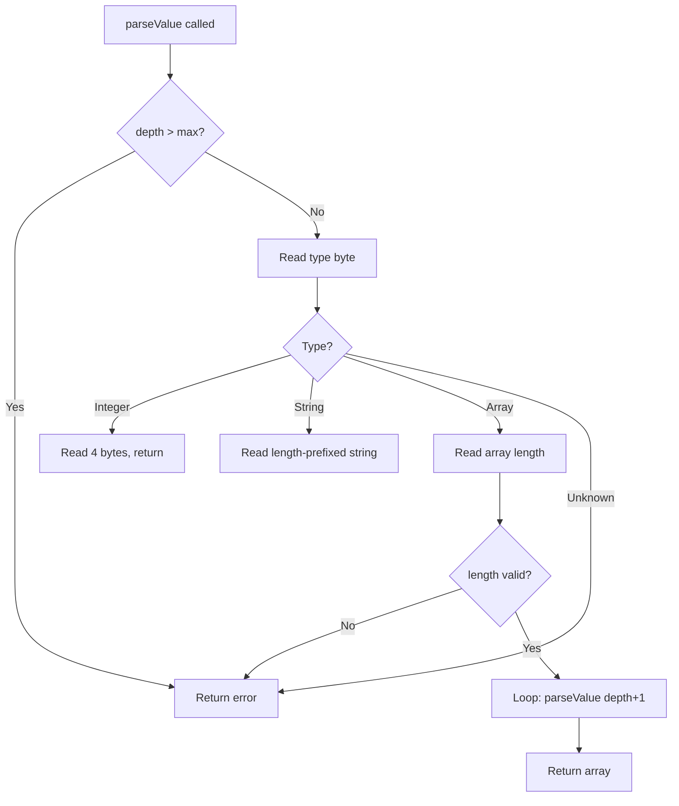

# Securing Advanced Parsing in Cilium Network Security

Author: [nawazdhandala](https://github.com/nawazdhandala)

Tags: Cilium, Network Security, Advanced Parsing, L7 Proxy, Protocol Security

Description: Learn how to implement secure advanced parsing techniques in Cilium L7 parsers, including nested structure handling, variable-length fields, and complex protocol state machines with proper...

---

## Introduction

Once a basic parser skeleton is in place, advanced parsing adds support for the full complexity of real-world protocols: nested data structures, variable-length fields, optional parameters, and multi-step request-response exchanges. Each layer of complexity introduces new attack surface.

Advanced parsing in Cilium requires maintaining the same strict security discipline established in the basic skeleton — bounded allocations, validated lengths, and explicit error handling — while dealing with significantly more complex data structures. Protocols like Cassandra, Kafka, and MySQL have nested message formats that can be exploited through deeply nested or self-referencing structures.

This guide covers secure implementation patterns for advanced protocol parsing within Cilium's proxylib framework.

## Prerequisites

- A working basic parser in Cilium's proxylib
- Go 1.21 or later
- Detailed protocol specification for your target protocol
- Understanding of binary encoding formats (big-endian, varint, etc.)
- Familiarity with Cilium's existing parser implementations

## Parsing Variable-Length Fields Safely

Variable-length fields are the most common source of parser vulnerabilities:

```go
const (
    maxStringLen    = 65536      // 64 KB per string field
    maxArrayLen     = 10000      // Maximum array elements
    maxNestingDepth = 10         // Maximum nested structure depth
)

// readString reads a length-prefixed string from the data buffer.
// Returns the string, bytes consumed, and any error.
func readString(data []byte, offset int) (string, int, error) {
    // Need at least 2 bytes for the length prefix
    if len(data) < offset+2 {
        return "", 0, fmt.Errorf("insufficient data for string length at offset %d", offset)
    }

    // Read 16-bit big-endian length
    strLen := int(data[offset])<<8 | int(data[offset+1])

    // Validate length
    if strLen < 0 {
        return "", 0, fmt.Errorf("negative string length %d at offset %d", strLen, offset)
    }
    if strLen > maxStringLen {
        return "", 0, fmt.Errorf("string length %d exceeds max %d at offset %d",
            strLen, maxStringLen, offset)
    }

    // Check data availability
    totalNeeded := offset + 2 + strLen
    if len(data) < totalNeeded {
        return "", 0, fmt.Errorf("insufficient data for string body at offset %d", offset)
    }

    // Safe to read the string
    str := string(data[offset+2 : offset+2+strLen])
    return str, 2 + strLen, nil
}
```

## Handling Nested Structures with Depth Limits

Prevent stack overflow and resource exhaustion from deeply nested structures:

```go
// parseValue recursively parses a protocol value with depth tracking
func parseValue(data []byte, offset int, depth int) (interface{}, int, error) {
    // Enforce maximum nesting depth
    if depth > maxNestingDepth {
        return nil, 0, fmt.Errorf("maximum nesting depth %d exceeded", maxNestingDepth)
    }

    if len(data) <= offset {
        return nil, 0, fmt.Errorf("no data at offset %d", offset)
    }

    // Read type byte
    typeByte := data[offset]
    consumed := 1

    switch typeByte {
    case 0x01: // Integer
        if len(data) < offset+consumed+4 {
            return nil, 0, fmt.Errorf("insufficient data for integer")
        }
        val := int32(data[offset+consumed])<<24 |
               int32(data[offset+consumed+1])<<16 |
               int32(data[offset+consumed+2])<<8 |
               int32(data[offset+consumed+3])
        return val, consumed + 4, nil

    case 0x02: // String
        str, n, err := readString(data, offset+consumed)
        if err != nil {
            return nil, 0, err
        }
        return str, consumed + n, nil

    case 0x03: // Array — recurse with incremented depth
        if len(data) < offset+consumed+4 {
            return nil, 0, fmt.Errorf("insufficient data for array length")
        }
        arrayLen := int(data[offset+consumed])<<24 |
                    int(data[offset+consumed+1])<<16 |
                    int(data[offset+consumed+2])<<8 |
                    int(data[offset+consumed+3])
        consumed += 4

        if arrayLen < 0 || arrayLen > maxArrayLen {
            return nil, 0, fmt.Errorf("invalid array length %d", arrayLen)
        }

        result := make([]interface{}, 0, arrayLen)
        for i := 0; i < arrayLen; i++ {
            val, n, err := parseValue(data, offset+consumed, depth+1)
            if err != nil {
                return nil, 0, fmt.Errorf("array element %d: %w", i, err)
            }
            result = append(result, val)
            consumed += n
        }
        return result, consumed, nil

    default:
        return nil, 0, fmt.Errorf("unknown type byte %x at offset %d", typeByte, offset)
    }
}
```



## Implementing Protocol Command Dispatch

Route different command types to specialized handlers:

```go
// commandHandler processes a specific protocol command
type commandHandler func(parser *Parser, body []byte, reply bool) (proxylib.OpType, int)

// commandRegistry maps command bytes to handlers
var commandRegistry = map[byte]commandHandler{
    0x01: handleGetCommand,
    0x02: handleSetCommand,
    0x03: handleDeleteCommand,
    0x04: handleListCommand,
}

func (p *Parser) dispatchCommand(command byte, body []byte, reply bool, totalLen int) (proxylib.OpType, int) {
    handler, exists := commandRegistry[command]
    if !exists {
        log.WithField("command", command).Warn("Unknown command type")
        // Policy decision: drop unknown commands for security
        return proxylib.DROP, 0
    }

    op, _ := handler(p, body, reply)
    if op == proxylib.PASS {
        return proxylib.PASS, totalLen
    }
    return op, 0
}

// handleGetCommand parses and validates a GET command
func handleGetCommand(p *Parser, body []byte, reply bool) (proxylib.OpType, int) {
    if len(body) < 1 {
        return proxylib.DROP, 0
    }

    // Parse the key name from the body
    key, _, err := readString(body, 0)
    if err != nil {
        log.WithError(err).Warn("Failed to parse GET key")
        return proxylib.DROP, 0
    }

    // Check policy
    if !p.connection.Matches("GET", key) {
        log.WithField("key", key).Info("GET denied by policy")
        return proxylib.DROP, 0
    }

    return proxylib.PASS, 0
}
```

## Managing Parser State Across Messages

Advanced parsers track state across multiple messages in a request-response exchange:

```go
// requestTracker tracks pending requests for response correlation
type requestTracker struct {
    pendingRequests map[uint32]requestInfo
    maxPending      int
}

type requestInfo struct {
    command   byte
    timestamp int64
}

func newRequestTracker(maxPending int) *requestTracker {
    return &requestTracker{
        pendingRequests: make(map[uint32]requestInfo),
        maxPending:      maxPending,
    }
}

// trackRequest records a new outgoing request
func (rt *requestTracker) trackRequest(requestID uint32, command byte) error {
    if len(rt.pendingRequests) >= rt.maxPending {
        return fmt.Errorf("too many pending requests (%d)", rt.maxPending)
    }
    rt.pendingRequests[requestID] = requestInfo{
        command:   command,
        timestamp: time.Now().UnixNano(),
    }
    return nil
}

// matchResponse finds and removes the matching request for a response
func (rt *requestTracker) matchResponse(requestID uint32) (requestInfo, bool) {
    info, exists := rt.pendingRequests[requestID]
    if exists {
        delete(rt.pendingRequests, requestID)
    }
    return info, exists
}
```

## Verification

Test advanced parsing features thoroughly:

```bash
# Run all parser tests including advanced parsing
go test ./proxylib/myprotocol/... -v -race

# Fuzz the advanced parsing functions
go test ./proxylib/myprotocol/... -fuzz=FuzzParseValue -fuzztime=60s

# Check coverage of advanced parsing code
go test ./proxylib/myprotocol/... -coverprofile=cover.out
go tool cover -func=cover.out | grep -E "parseValue|readString|dispatch"

# Benchmark parsing performance
go test ./proxylib/myprotocol/... -bench=BenchmarkParseComplex -benchmem
```

## Troubleshooting

**Problem: Stack overflow on deeply nested input**
Ensure `maxNestingDepth` is enforced at every recursive call. If the protocol specification does not define a maximum depth, choose a conservative value (10 or less).

**Problem: Parsing is slow for large messages**
Avoid copying data unnecessarily. Use slice views into the original buffer rather than creating new byte slices. Profile with `pprof` to identify hot spots.

**Problem: Request-response tracking grows unbounded**
Enforce `maxPending` and implement a cleanup mechanism for stale entries (requests that never received responses). Use timestamps to identify and evict old entries.

**Problem: Unknown command types cause connection drops**
Decide on a clear policy: either drop unknown commands (more secure) or pass them through (more compatible). Document the choice and make it configurable.

## Conclusion

Advanced parsing in Cilium requires extending the security discipline of basic parsing to handle nested structures, variable-length fields, and multi-message state tracking. By enforcing depth limits on recursion, size limits on every variable-length field, and capacity limits on state tracking structures, you build a parser that handles the full complexity of real-world protocols without introducing vulnerabilities. Each new parsing feature should be developed with tests first and validated through fuzzing before deployment.
