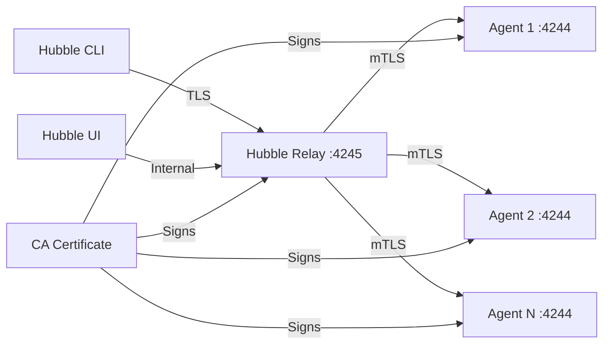

# How to Secure Basic Configuration in Cilium Hubble

Author: [nawazdhandala](https://github.com/nawazdhandala)

Tags: Cilium, Hubble, Security, Configuration, Kubernetes

Description: Learn how to secure Cilium Hubble's basic configuration by enabling TLS, restricting component access, hardening pod security contexts, and controlling who can view flow data.

---

## Introduction

A default Hubble installation prioritizes ease of setup over security. The observer listens on an unencrypted Unix socket, the relay communicates with agents over plain gRPC, and the UI may be accessible to anyone who can port-forward to the service. For production environments, these defaults need to be hardened.

Securing the basic Hubble configuration involves enabling TLS for all inter-component communication, restricting access to the observer socket, applying proper pod security contexts, and ensuring that the UI is behind authentication.

This guide covers the essential security measures for a production-ready Hubble deployment, building on top of the basic configuration with minimal complexity.

## Prerequisites

- Kubernetes cluster with Cilium and Hubble enabled
- Helm 3 for configuration management
- kubectl with cluster-admin access
- cert-manager (optional, for automated TLS certificate management)

## Enabling TLS for All Hubble Communication

The most critical security measure is encrypting communication between Hubble components:

```yaml
# hubble-secure-basic.yaml
hubble:
  enabled: true
  tls:
    enabled: true
    auto:
      enabled: true
      method: cronJob
      certValidityDuration: 1095
      schedule: "0 0 1 */4 *"
  relay:
    enabled: true
    tls:
      server:
        enabled: true
  ui:
    enabled: true
```

```bash
helm upgrade cilium cilium/cilium -n kube-system \
  --reuse-values \
  --values hubble-secure-basic.yaml

kubectl -n kube-system rollout status daemonset/cilium
kubectl -n kube-system rollout status deployment/hubble-relay
```

Verify TLS is active:

```bash
# Check TLS certificates exist
kubectl -n kube-system get secrets | grep hubble

# Verify the relay is using TLS
kubectl -n kube-system logs deploy/hubble-relay --tail=20 | grep -i tls

# Test TLS connection through the CLI
cilium hubble port-forward &
hubble status
```



## Hardening Pod Security Contexts

Apply restrictive security contexts to Hubble components:

```yaml
# hubble-security-contexts.yaml
hubble:
  relay:
    securityContext:
      runAsNonRoot: true
      runAsUser: 65532
      runAsGroup: 65532
    podSecurityContext:
      fsGroup: 65532
      seccompProfile:
        type: RuntimeDefault

  ui:
    securityContext:
      runAsNonRoot: true
      runAsUser: 1001
      runAsGroup: 1001
    podSecurityContext:
      fsGroup: 1001
      seccompProfile:
        type: RuntimeDefault
```

```bash
helm upgrade cilium cilium/cilium -n kube-system \
  --reuse-values \
  --values hubble-security-contexts.yaml
```

Verify security contexts are applied:

```bash
# Check relay security context
kubectl -n kube-system get deploy hubble-relay -o jsonpath='{.spec.template.spec.containers[0].securityContext}' | python3 -m json.tool

# Check UI security context
kubectl -n kube-system get deploy hubble-ui -o jsonpath='{.spec.template.spec.containers[0].securityContext}' | python3 -m json.tool

# Verify pods are running as non-root
kubectl -n kube-system exec deploy/hubble-relay -- id
kubectl -n kube-system exec deploy/hubble-ui -c frontend -- id
```

## Restricting Network Access to Hubble Services

Apply CiliumNetworkPolicies to control access:

```yaml
# hubble-network-security.yaml
apiVersion: cilium.io/v2
kind: CiliumNetworkPolicy
metadata:
  name: hubble-relay-ingress
  namespace: kube-system
spec:
  endpointSelector:
    matchLabels:
      k8s-app: hubble-relay
  ingress:
    - fromEndpoints:
        - matchLabels:
            k8s-app: hubble-ui
      toPorts:
        - ports:
            - port: "4245"
              protocol: TCP
    - fromEndpoints:
        - matchLabels:
            app.kubernetes.io/name: prometheus
            io.kubernetes.pod.namespace: monitoring
      toPorts:
        - ports:
            - port: "9966"
              protocol: TCP
  egressDeny:
    - toEntities:
        - world
---
apiVersion: cilium.io/v2
kind: CiliumNetworkPolicy
metadata:
  name: hubble-ui-ingress
  namespace: kube-system
spec:
  endpointSelector:
    matchLabels:
      k8s-app: hubble-ui
  ingress:
    - fromEntities:
        - cluster
      toPorts:
        - ports:
            - port: "8081"
              protocol: TCP
```

```bash
kubectl apply -f hubble-network-security.yaml
```

## Adding Authentication to the Hubble UI

The Hubble UI does not include built-in authentication. Add it through an ingress or proxy:

```yaml
# hubble-ui-oauth-proxy.yaml
apiVersion: apps/v1
kind: Deployment
metadata:
  name: hubble-ui-auth-proxy
  namespace: kube-system
spec:
  replicas: 1
  selector:
    matchLabels:
      app: hubble-ui-auth
  template:
    metadata:
      labels:
        app: hubble-ui-auth
    spec:
      containers:
        - name: oauth2-proxy
          image: quay.io/oauth2-proxy/oauth2-proxy:v7.5.1
          args:
            - --upstream=http://hubble-ui.kube-system.svc:80
            - --http-address=0.0.0.0:4180
            - --provider=github
            - --email-domain=*
            - --cookie-secure=true
            - --cookie-httponly=true
          envFrom:
            - secretRef:
                name: hubble-ui-oauth-config
          ports:
            - containerPort: 4180
---
apiVersion: v1
kind: Service
metadata:
  name: hubble-ui-authenticated
  namespace: kube-system
spec:
  selector:
    app: hubble-ui-auth
  ports:
    - port: 80
      targetPort: 4180
```

## Verification

Confirm all security measures are active:

```bash
# 1. TLS enabled
kubectl -n kube-system get secrets | grep hubble-tls

# 2. Non-root pods
kubectl -n kube-system exec deploy/hubble-relay -- whoami 2>/dev/null || echo "Running as non-root (expected)"

# 3. Network policies applied
kubectl -n kube-system get cnp | grep hubble

# 4. Hubble still functional
cilium hubble port-forward &
hubble observe --last 5

# 5. Unauthorized access blocked
kubectl run test --image=curlimages/curl --rm -it --restart=Never -- \
  curl -s --connect-timeout 3 http://hubble-relay.kube-system:4245 2>&1
```

## Troubleshooting

- **TLS certificate rotation fails**: Check the CronJob that rotates certificates: `kubectl -n kube-system get cronjobs | grep hubble`. View recent job logs if rotation failed.

- **Relay cannot connect after enabling TLS**: Ensure both agent and relay TLS settings are consistent. A common mistake is enabling TLS on the relay but not on the agent, or vice versa.

- **Network policy blocks legitimate traffic**: Temporarily delete the policy to confirm it is the cause, then fix the label selectors.

- **OAuth proxy not forwarding requests**: Check that the upstream URL is correct and the proxy can resolve the Hubble UI service DNS name.

## Conclusion

Securing Hubble's basic configuration is a straightforward process that dramatically improves your security posture. Enable TLS to encrypt all inter-component communication, apply restrictive security contexts to prevent privilege escalation, use network policies to control access, and add authentication to the UI. These measures ensure that your observability data remains protected while still being accessible to authorized operators.
