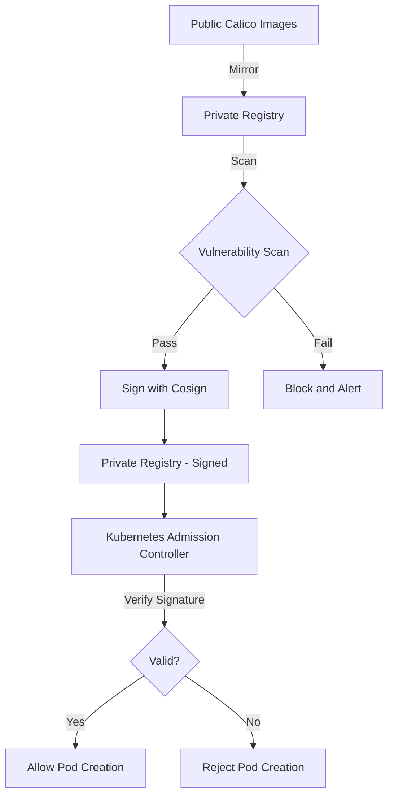

# Securing Calico Alternate Registry Configuration

Author: [nawazdhandala](https://github.com/nawazdhandala)

Tags: Calico, Container Registry, Security, Kubernetes, Image Signing

Description: Learn how to secure your Calico alternate registry configuration with image signing, vulnerability scanning, access controls, and supply chain security practices.

---

## Introduction

When you configure Calico to pull images from an alternate registry, you take ownership of the image supply chain. This means you are responsible for ensuring that the images in your private registry are authentic, unmodified, and free of known vulnerabilities. Without proper security controls, a compromised registry can inject malicious code into your cluster networking layer.

Securing the alternate registry configuration involves multiple layers: controlling who can push images, verifying image signatures, scanning for vulnerabilities, enforcing registry access through Kubernetes admission policies, and auditing image pulls.

This guide covers practical security measures for Calico alternate registry deployments, from image signing to admission controller enforcement.

## Prerequisites

- Kubernetes cluster with Calico using an alternate registry
- Private container registry with access controls
- cosign for image signing and verification
- A vulnerability scanner (Trivy, Grype, or equivalent)
- kubectl with admin access

## Image Signing with Cosign

Sign Calico images after mirroring them to verify authenticity:

```bash
#!/bin/bash
# sign-calico-images.sh
# Sign mirrored Calico images with cosign

set -euo pipefail

CALICO_VERSION="${CALICO_VERSION:-v3.27.0}"
PRIVATE_REGISTRY="${PRIVATE_REGISTRY:-registry.example.com/calico}"

IMAGES=(
  "node:${CALICO_VERSION}"
  "cni:${CALICO_VERSION}"
  "kube-controllers:${CALICO_VERSION}"
  "typha:${CALICO_VERSION}"
)

for image in "${IMAGES[@]}"; do
  full_image="${PRIVATE_REGISTRY}/${image}"
  echo "Signing: $full_image"

  # Sign with cosign using keyless signing (Fulcio/Rekor)
  cosign sign --yes "$full_image"

  # Or sign with a private key
  # cosign sign --key cosign.key "$full_image"
done

echo "All images signed successfully"
```

Verify signatures before deployment:

```bash
# Verify image signatures
cosign verify registry.example.com/calico/node:v3.27.0 \
  --certificate-identity=your-email@example.com \
  --certificate-oidc-issuer=https://accounts.google.com

# Or verify with a public key
# cosign verify --key cosign.pub registry.example.com/calico/node:v3.27.0
```

## Vulnerability Scanning Pipeline

Scan images after mirroring and before deployment:

```bash
#!/bin/bash
# scan-calico-images.sh
# Scan Calico images for vulnerabilities

set -euo pipefail

CALICO_VERSION="${CALICO_VERSION:-v3.27.0}"
PRIVATE_REGISTRY="${PRIVATE_REGISTRY:-registry.example.com/calico}"
SEVERITY_THRESHOLD="CRITICAL,HIGH"

IMAGES=(
  "node:${CALICO_VERSION}"
  "cni:${CALICO_VERSION}"
  "kube-controllers:${CALICO_VERSION}"
  "typha:${CALICO_VERSION}"
)

SCAN_FAILED=0

for image in "${IMAGES[@]}"; do
  full_image="${PRIVATE_REGISTRY}/${image}"
  echo "Scanning: $full_image"

  # Scan with Trivy
  if ! trivy image --severity "$SEVERITY_THRESHOLD" --exit-code 1 "$full_image"; then
    echo "WARNING: Vulnerabilities found in $full_image"
    SCAN_FAILED=1
  fi
done

if [ "$SCAN_FAILED" -eq 1 ]; then
  echo "ALERT: Some images have critical or high vulnerabilities"
  exit 1
fi

echo "All images passed vulnerability scanning"
```

## Registry Access Control

Configure your registry with least-privilege access:

```yaml
# Harbor project configuration example
# Create a dedicated project for Calico images
# Project: calico
# Access Level: Private
# Robot Accounts:
#   - calico-pull (read-only, for Kubernetes nodes)
#   - calico-push (write, for CI/CD pipeline only)
```

```bash
# Create a Kubernetes pull secret with read-only credentials
kubectl create secret docker-registry calico-registry-pull \
  -n calico-system \
  --docker-server=registry.example.com \
  --docker-username=calico-pull \
  --docker-password="${PULL_TOKEN}"

# Verify the operator uses the pull secret
kubectl get installation default -o yaml | grep -A 3 imagePullSecrets
```

## Admission Controller for Image Policy

Enforce that only signed images from your registry are used:

```yaml
# kyverno-calico-image-policy.yaml
apiVersion: kyverno.io/v1
kind: ClusterPolicy
metadata:
  name: verify-calico-images
spec:
  validationFailureAction: Enforce
  background: false
  rules:
    - name: verify-calico-registry
      match:
        resources:
          kinds:
            - Pod
          namespaces:
            - calico-system
      validate:
        message: "Calico images must come from registry.example.com/calico"
        pattern:
          spec:
            containers:
              - image: "registry.example.com/calico/*"
    - name: verify-calico-signatures
      match:
        resources:
          kinds:
            - Pod
          namespaces:
            - calico-system
      verifyImages:
        - imageReferences:
            - "registry.example.com/calico/*"
          attestors:
            - entries:
                - keys:
                    publicKeys: |-
                      -----BEGIN PUBLIC KEY-----
                      <your-cosign-public-key>
                      -----END PUBLIC KEY-----
```

```bash
# Apply the admission policy
kubectl apply -f kyverno-calico-image-policy.yaml
```



## Verification

```bash
# Verify image signatures
cosign verify registry.example.com/calico/node:v3.27.0

# Verify vulnerability scan results
trivy image --severity CRITICAL registry.example.com/calico/node:v3.27.0

# Verify admission policy is enforced
kubectl get cpol verify-calico-images -o yaml | grep validationFailureAction

# Test that unauthorized images are blocked
kubectl run test --image=docker.io/calico/node:v3.27.0 -n calico-system --dry-run=server
# Should be rejected by the admission controller
```

## Troubleshooting

- **Cosign verification fails**: The signing key or identity does not match. Check the signing identity with `cosign verify` and compare with the signing pipeline configuration.
- **Trivy timeout on large images**: Configure a local Trivy database cache or use a remote Trivy server to speed up scans.
- **Admission controller blocks operator updates**: Ensure the admission policy allows the new image tags before upgrading Calico. Update the policy or sign the new images first.
- **Pull secret rotation**: When registry credentials expire, update the Kubernetes secret and restart affected pods with `kubectl rollout restart daemonset -n calico-system calico-node`.

## Conclusion

Securing Calico alternate registry configuration protects your cluster networking from supply chain attacks. By combining image signing with cosign, vulnerability scanning with Trivy, registry access controls, and Kubernetes admission policies, you create a defense-in-depth strategy that ensures only verified, scanned, and authorized images run as part of your Calico deployment. Integrate these security checks into your CI/CD pipeline to maintain continuous assurance.
