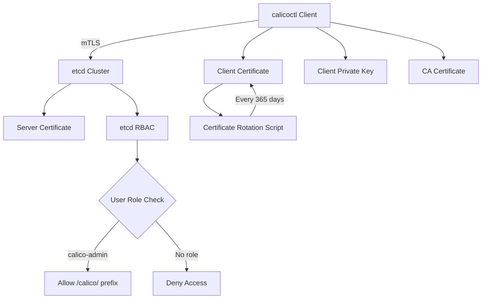

# Securing Calicoctl etcd Configuration

Author: [nawazdhandala](https://github.com/nawazdhandala)

Tags: Calico, etcd, Security, TLS, Calicoctl

Description: Learn how to secure your calicoctl etcd datastore configuration with mutual TLS, certificate rotation, etcd RBAC, encrypted secrets management, and audit logging best practices.

---

## Introduction

When calicoctl connects directly to etcd, it has access to the raw Calico datastore -- network policies, IP allocations, BGP configurations, and node information. Unlike the Kubernetes API datastore path, there is no Kubernetes RBAC layer between calicoctl and the data. This makes securing the etcd connection critically important.

A compromised etcd connection allows an attacker to modify network policies, redirect traffic, or disrupt the entire cluster networking layer. The primary defense is mutual TLS authentication combined with strict certificate management and access controls.

This guide covers practical security measures for calicoctl etcd configurations, including mutual TLS setup, certificate rotation, etcd role-based access control, and credential management.

## Prerequisites

- Calico cluster using the etcd datastore backend
- calicoctl v3.27 or later
- openssl or cfssl for certificate generation
- Access to the etcd cluster for RBAC configuration
- Understanding of TLS/PKI concepts

## Setting Up Mutual TLS Authentication

Mutual TLS (mTLS) ensures both the client (calicoctl) and server (etcd) authenticate each other. Generate dedicated client certificates for calicoctl:

```bash
# Generate a private key for calicoctl
openssl genrsa -out calicoctl-key.pem 4096

# Create a certificate signing request
openssl req -new -key calicoctl-key.pem -out calicoctl.csr \
  -subj "/CN=calicoctl/O=calico-admins"

# Sign the CSR with your etcd CA
openssl x509 -req -in calicoctl.csr \
  -CA /etc/etcd/pki/ca.pem \
  -CAkey /etc/etcd/pki/ca-key.pem \
  -CAcreateserial \
  -out calicoctl-cert.pem \
  -days 365 \
  -sha256

# Install the certificates securely
sudo mkdir -p /etc/calicoctl/certs
sudo cp calicoctl-key.pem /etc/calicoctl/certs/key.pem
sudo cp calicoctl-cert.pem /etc/calicoctl/certs/cert.pem
sudo cp /etc/etcd/pki/ca.pem /etc/calicoctl/certs/ca.pem
sudo chmod 600 /etc/calicoctl/certs/*.pem
sudo chmod 700 /etc/calicoctl/certs

# Clean up temporary files
rm -f calicoctl-key.pem calicoctl-cert.pem calicoctl.csr
```

Configure calicoctl to use the certificates:

```yaml
# /etc/calicoctl/calicoctl.cfg
apiVersion: projectcalico.org/v3
kind: CalicoAPIConfig
metadata:
spec:
  datastoreType: "etcdv3"
  etcdEndpoints: "https://etcd1:2379,https://etcd2:2379,https://etcd3:2379"
  etcdKeyFile: "/etc/calicoctl/certs/key.pem"
  etcdCertFile: "/etc/calicoctl/certs/cert.pem"
  etcdCACertFile: "/etc/calicoctl/certs/ca.pem"
```

## Implementing etcd Role-Based Access Control

etcd supports its own RBAC system. Create a dedicated role that limits calicoctl to only the Calico key prefix:

```bash
# Enable etcd authentication (if not already enabled)
etcdctl --endpoints=https://etcd1:2379 \
  --cert=/etc/etcd/pki/admin-cert.pem \
  --key=/etc/etcd/pki/admin-key.pem \
  --cacert=/etc/etcd/pki/ca.pem \
  user add root --new-user-password="<root-password>"

etcdctl --endpoints=https://etcd1:2379 \
  --cert=/etc/etcd/pki/admin-cert.pem \
  --key=/etc/etcd/pki/admin-key.pem \
  --cacert=/etc/etcd/pki/ca.pem \
  auth enable

# Create a Calico-specific role with limited key access
etcdctl --endpoints=https://etcd1:2379 \
  --cert=/etc/etcd/pki/admin-cert.pem \
  --key=/etc/etcd/pki/admin-key.pem \
  --cacert=/etc/etcd/pki/ca.pem \
  --user root \
  role add calico-admin

# Grant read-write access only to the /calico prefix
etcdctl --endpoints=https://etcd1:2379 \
  --cert=/etc/etcd/pki/admin-cert.pem \
  --key=/etc/etcd/pki/admin-key.pem \
  --cacert=/etc/etcd/pki/ca.pem \
  --user root \
  role grant-permission calico-admin readwrite /calico/ --prefix

# Create a user and assign the role
etcdctl --endpoints=https://etcd1:2379 \
  --cert=/etc/etcd/pki/admin-cert.pem \
  --key=/etc/etcd/pki/admin-key.pem \
  --cacert=/etc/etcd/pki/ca.pem \
  --user root \
  user add calico-operator --new-user-password="<password>"

etcdctl --endpoints=https://etcd1:2379 \
  --cert=/etc/etcd/pki/admin-cert.pem \
  --key=/etc/etcd/pki/admin-key.pem \
  --cacert=/etc/etcd/pki/ca.pem \
  --user root \
  user grant-role calico-operator calico-admin
```

## Automating Certificate Rotation

Create a certificate rotation script to prevent expiry-related outages:

```bash
#!/bin/bash
# rotate-calicoctl-certs.sh
# Rotates calicoctl client certificates

set -euo pipefail

CERT_DIR="/etc/calicoctl/certs"
CA_CERT="/etc/etcd/pki/ca.pem"
CA_KEY="/etc/etcd/pki/ca-key.pem"
DAYS_VALID=365

echo "Generating new calicoctl client certificate..."

# Generate new key and certificate
openssl genrsa -out "${CERT_DIR}/key-new.pem" 4096
openssl req -new -key "${CERT_DIR}/key-new.pem" -out /tmp/calicoctl-new.csr \
  -subj "/CN=calicoctl/O=calico-admins"
openssl x509 -req -in /tmp/calicoctl-new.csr \
  -CA "$CA_CERT" -CAkey "$CA_KEY" -CAcreateserial \
  -out "${CERT_DIR}/cert-new.pem" -days "$DAYS_VALID" -sha256

# Verify new certificate works
export DATASTORE_TYPE=etcdv3
export ETCD_KEY_FILE="${CERT_DIR}/key-new.pem"
export ETCD_CERT_FILE="${CERT_DIR}/cert-new.pem"
export ETCD_CA_CERT_FILE="${CERT_DIR}/ca.pem"
export ETCD_ENDPOINTS="https://etcd1:2379"

if calicoctl get nodes > /dev/null 2>&1; then
    echo "New certificate verified successfully"
    # Swap certificates atomically
    mv "${CERT_DIR}/key.pem" "${CERT_DIR}/key-old.pem"
    mv "${CERT_DIR}/cert.pem" "${CERT_DIR}/cert-old.pem"
    mv "${CERT_DIR}/key-new.pem" "${CERT_DIR}/key.pem"
    mv "${CERT_DIR}/cert-new.pem" "${CERT_DIR}/cert.pem"
    chmod 600 "${CERT_DIR}/key.pem" "${CERT_DIR}/cert.pem"
    echo "Certificate rotation complete"
else
    echo "ERROR: New certificate failed verification, keeping old certificates"
    rm -f "${CERT_DIR}/key-new.pem" "${CERT_DIR}/cert-new.pem"
    exit 1
fi

rm -f /tmp/calicoctl-new.csr
```



## Securing Credential Storage

Use a secrets manager to store etcd credentials instead of plain files:

```bash
# Store certificates in HashiCorp Vault
vault kv put secret/calico/etcd \
  ca_cert=@/etc/calicoctl/certs/ca.pem \
  client_cert=@/etc/calicoctl/certs/cert.pem \
  client_key=@/etc/calicoctl/certs/key.pem

# Retrieve certificates at runtime
vault kv get -field=ca_cert secret/calico/etcd > /tmp/ca.pem
vault kv get -field=client_cert secret/calico/etcd > /tmp/cert.pem
vault kv get -field=client_key secret/calico/etcd > /tmp/key.pem
chmod 600 /tmp/*.pem

# Use the temporary certificates
export DATASTORE_TYPE=etcdv3
export ETCD_CA_CERT_FILE=/tmp/ca.pem
export ETCD_CERT_FILE=/tmp/cert.pem
export ETCD_KEY_FILE=/tmp/key.pem
calicoctl get nodes

# Clean up after use
rm -f /tmp/ca.pem /tmp/cert.pem /tmp/key.pem
```

## Verification

```bash
# Verify mTLS is working
openssl s_client -connect etcd1:2379 \
  -cert /etc/calicoctl/certs/cert.pem \
  -key /etc/calicoctl/certs/key.pem \
  -CAfile /etc/calicoctl/certs/ca.pem \
  -verify_return_error < /dev/null 2>&1 | grep "Verify return code"

# Verify certificate expiry
openssl x509 -in /etc/calicoctl/certs/cert.pem -noout -dates

# Verify etcd RBAC restricts access
export DATASTORE_TYPE=etcdv3
calicoctl get nodes -o wide

# Verify file permissions
ls -la /etc/calicoctl/certs/
# Expected: -rw------- for all .pem files
```

## Troubleshooting

- **"authentication is not enabled"**: etcd auth was not enabled. Run `etcdctl auth enable` with root credentials first.
- **"permission denied" from etcd RBAC**: The etcd user does not have the calico-admin role. Verify with `etcdctl user get calico-operator`.
- **Certificate rotation breaks connectivity**: The new certificate may not match the CA. Verify with `openssl verify -CAfile ca.pem cert-new.pem` before swapping.
- **"x509: certificate has expired"**: Run the rotation script immediately, or temporarily use the `--insecure-skip-tls-verify` flag only for emergency diagnostics (never in production).

## Conclusion

Securing calicoctl etcd configuration requires defense in depth: mutual TLS for transport security, etcd RBAC for access control, automated certificate rotation to prevent expiry, and proper credential storage to avoid secret sprawl. These measures ensure that only authorized clients can access and modify your Calico datastore, protecting the integrity of your cluster networking configuration.
