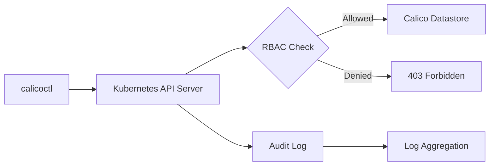

# Securing Calicoctl Kubernetes API Datastore Configuration

Author: [nawazdhandala](https://github.com/nawazdhandala)

Tags: Calico, Kubernetes, Security, Networking, calicoctl

Description: Learn how to secure your calicoctl Kubernetes API datastore configuration by implementing RBAC, TLS certificates, and least-privilege access patterns to protect your Calico network policy...

---

## Introduction

When calicoctl is configured to use the Kubernetes API datastore, it communicates directly with the Kubernetes API server to manage Calico resources such as NetworkPolicy, GlobalNetworkPolicy, IPPool, and BGPConfiguration. This means the security of your calicoctl configuration is directly tied to the security of your entire cluster networking layer.

A misconfigured or overly permissive calicoctl setup can allow unauthorized users to modify network policies, disrupt pod-to-pod communication, or exfiltrate sensitive configuration data. In production environments, securing this configuration is not optional -- it is a critical part of your cluster hardening strategy.

This guide walks you through practical steps to lock down calicoctl when using the Kubernetes API datastore, covering RBAC policies, kubeconfig management, service account restrictions, and audit logging.

## Prerequisites

- A running Kubernetes cluster (v1.24 or later)
- calicoctl installed (v3.27 or later)
- Calico installed with the Kubernetes API datastore backend
- kubectl access with cluster-admin privileges (for initial setup)
- Familiarity with Kubernetes RBAC concepts

## Understanding the Kubernetes API Datastore Connection

When calicoctl uses the Kubernetes API datastore, it relies on a kubeconfig file or in-cluster service account credentials to authenticate. By default, calicoctl looks for the `KUBECONFIG` environment variable or the `~/.kube/config` file.

The datastore type is configured via environment variable or configuration file:

```bash
# Set the datastore type to Kubernetes
export DATASTORE_TYPE=kubernetes

# Verify the connection
calicoctl get nodes -o wide
```

Alternatively, you can use a calicoctl configuration file:

```yaml
# calicoctl.cfg
apiVersion: projectcalico.org/v3
kind: CalicoAPIConfig
metadata:
spec:
  datastoreType: "kubernetes"
  kubeconfig: "/path/to/secure/kubeconfig"
```

```bash
# Use the configuration file explicitly
calicoctl get nodes --config=./calicoctl.cfg
```

## Implementing Least-Privilege RBAC for Calicoctl

Instead of granting cluster-admin access to calicoctl users, create dedicated RBAC roles that limit permissions to only the Calico resources needed.

### Read-Only Role for Auditors

```yaml
# calico-readonly-role.yaml
apiVersion: rbac.authorization.k8s.io/v1
kind: ClusterRole
metadata:
  name: calico-readonly
rules:
  # Allow reading Calico custom resources
  - apiGroups: ["projectcalico.org"]
    resources:
      - networkpolicies
      - globalnetworkpolicies
      - globalnetworksets
      - networksets
      - ippools
      - bgpconfigurations
      - bgppeers
      - felixconfigurations
      - clusterinformations
    verbs: ["get", "list", "watch"]
  # Allow reading Kubernetes network policies
  - apiGroups: ["networking.k8s.io"]
    resources: ["networkpolicies"]
    verbs: ["get", "list", "watch"]
  # Required for calicoctl node status
  - apiGroups: [""]
    resources: ["nodes"]
    verbs: ["get", "list"]
```

### Network Policy Operator Role

```yaml
# calico-netpol-operator-role.yaml
apiVersion: rbac.authorization.k8s.io/v1
kind: ClusterRole
metadata:
  name: calico-netpol-operator
rules:
  - apiGroups: ["projectcalico.org"]
    resources:
      - networkpolicies
      - globalnetworkpolicies
      - globalnetworksets
      - networksets
    verbs: ["get", "list", "watch", "create", "update", "patch", "delete"]
  - apiGroups: [""]
    resources: ["namespaces"]
    verbs: ["get", "list", "watch"]
```

### Binding Roles to Service Accounts

```yaml
# calico-operator-binding.yaml
apiVersion: v1
kind: ServiceAccount
metadata:
  name: calico-operator
  namespace: kube-system
---
apiVersion: rbac.authorization.k8s.io/v1
kind: ClusterRoleBinding
metadata:
  name: calico-netpol-operator-binding
subjects:
  - kind: ServiceAccount
    name: calico-operator
    namespace: kube-system
roleRef:
  kind: ClusterRole
  name: calico-netpol-operator
  apiGroup: rbac.authorization.k8s.io
```

Apply these resources and generate a kubeconfig for the service account:

```bash
# Apply RBAC resources
kubectl apply -f calico-readonly-role.yaml
kubectl apply -f calico-netpol-operator-role.yaml
kubectl apply -f calico-operator-binding.yaml

# Create a token for the service account
kubectl create token calico-operator -n kube-system --duration=8760h > /tmp/calico-token

# Generate a restricted kubeconfig
kubectl config set-credentials calico-operator \
  --token=$(cat /tmp/calico-token)

kubectl config set-context calico-context \
  --cluster=$(kubectl config current-context) \
  --user=calico-operator

# Clean up the token file
rm /tmp/calico-token
```

## Securing the Kubeconfig File

The kubeconfig file used by calicoctl contains sensitive credentials. Protect it with proper file permissions and storage practices.

```bash
# Create a dedicated directory for calicoctl config
mkdir -p /etc/calicoctl
chmod 700 /etc/calicoctl

# Move the kubeconfig to the secure directory
cp ~/.kube/calico-config /etc/calicoctl/kubeconfig
chmod 600 /etc/calicoctl/kubeconfig
chown root:root /etc/calicoctl/kubeconfig

# Set the environment variable for calicoctl
export CALICO_KUBECONFIG=/etc/calicoctl/kubeconfig
export DATASTORE_TYPE=kubernetes
export KUBECONFIG=$CALICO_KUBECONFIG
```

For additional security, use short-lived tokens rather than long-lived service account tokens:

```bash
# Generate a short-lived token (1 hour)
TOKEN=$(kubectl create token calico-operator -n kube-system --duration=1h)

# Use it with calicoctl directly
calicoctl get networkpolicies --all-namespaces \
  --config=/etc/calicoctl/calicoctl.cfg
```

## Enabling Audit Logging for Calicoctl Operations

Configure Kubernetes API audit logging to track all calicoctl operations against Calico resources:

```yaml
# audit-policy.yaml
apiVersion: audit.k8s.io/v1
kind: Policy
rules:
  # Log all changes to Calico resources at RequestResponse level
  - level: RequestResponse
    resources:
      - group: "projectcalico.org"
        resources:
          - networkpolicies
          - globalnetworkpolicies
          - ippools
          - bgpconfigurations
    verbs: ["create", "update", "patch", "delete"]
  # Log read operations at Metadata level
  - level: Metadata
    resources:
      - group: "projectcalico.org"
    verbs: ["get", "list", "watch"]
```



## Verification

Verify your security configuration is working correctly:

```bash
# Test that the restricted service account can read policies
DATASTORE_TYPE=kubernetes calicoctl get globalnetworkpolicies -o yaml

# Test that unauthorized operations are denied (should fail)
# Attempt to modify Felix configuration with a read-only account
DATASTORE_TYPE=kubernetes calicoctl apply -f - <<EOF
apiVersion: projectcalico.org/v3
kind: FelixConfiguration
metadata:
  name: default
spec:
  logSeverityScreen: Debug
EOF

# Verify audit logs capture the operations
kubectl logs -n kube-system -l component=kube-apiserver | grep projectcalico
```

## Troubleshooting

- **"Unauthorized" errors**: Verify the kubeconfig file path is correct and the token has not expired. Regenerate the token with `kubectl create token`.
- **"Forbidden" errors**: The RBAC role does not include the required verb or resource. Check the ClusterRole definition and ensure the binding references the correct service account.
- **Connection refused**: Ensure the Kubernetes API server address in the kubeconfig is reachable from the machine running calicoctl. Check firewall rules and network connectivity.
- **Stale credentials**: If using mounted service account tokens in pods, verify the token automount is enabled and the projected volume is refreshing correctly.

## Conclusion

Securing calicoctl's Kubernetes API datastore configuration requires a layered approach: restrict access through RBAC, protect credential files with proper permissions, use short-lived tokens, and monitor all operations through audit logging. By following these practices, you ensure that your Calico network policy management plane remains protected against unauthorized access and accidental misconfigurations. Regularly review and rotate credentials, and audit RBAC bindings to maintain a strong security posture as your cluster evolves.
