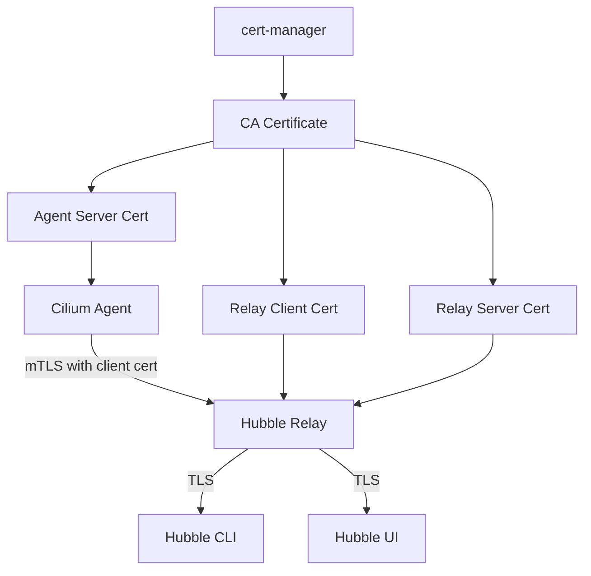

# How to Secure Cilium TLS with Hubble Configuration

Author: [nawazdhandala](https://github.com/nawazdhandala)

Tags: Cilium, TLS, Hubble, Security, Encryption

Description: Learn how to properly secure TLS configuration for Cilium Hubble, including certificate management best practices, mTLS enforcement, cipher suite selection, and certificate rotation automation.

---

## Introduction

TLS is the encryption foundation for Hubble communication. Without proper TLS, flow data travels unencrypted between Cilium agents and the Hubble relay, making it vulnerable to interception. Even with TLS enabled, weak configurations -- such as outdated cipher suites, long-lived certificates, or missing mTLS -- can leave your observability data exposed.

A secure TLS configuration for Hubble involves mutual TLS (mTLS) between all components, automated certificate rotation, restricted access to certificate secrets, and proper cipher suite selection. This guide provides a complete security hardening approach for Hubble TLS.

## Prerequisites

- Kubernetes cluster with Cilium and Hubble deployed
- Helm 3 for configuration management
- cert-manager installed (recommended for production)
- Understanding of TLS and PKI concepts

## Configuring mTLS for All Hubble Components

Enable mutual TLS so both the agent and relay authenticate each other:

```yaml
# hubble-mtls-config.yaml
hubble:
  enabled: true
  tls:
    enabled: true
    auto:
      enabled: true
      method: certmanager  # Recommended for production
      certManagerIssuerRef:
        group: cert-manager.io
        kind: ClusterIssuer
        name: hubble-ca-issuer
      certValidityDuration: 365  # 1 year
  relay:
    enabled: true
    tls:
      server:
        enabled: true  # Relay serves TLS to CLI/UI
      client:
        # Not a Helm value directly, but relay uses client certs to connect to agents
```

First, set up the cert-manager ClusterIssuer:

```yaml
# hubble-ca-issuer.yaml
apiVersion: cert-manager.io/v1
kind: ClusterIssuer
metadata:
  name: hubble-ca-issuer
spec:
  selfSigned: {}
---
# Create a CA certificate
apiVersion: cert-manager.io/v1
kind: Certificate
metadata:
  name: hubble-ca
  namespace: kube-system
spec:
  isCA: true
  commonName: hubble-ca
  secretName: hubble-ca-secret
  duration: 8760h  # 1 year
  renewBefore: 720h  # 30 days before expiry
  issuerRef:
    name: hubble-ca-issuer
    kind: ClusterIssuer
---
# Create a CA issuer using the CA certificate
apiVersion: cert-manager.io/v1
kind: ClusterIssuer
metadata:
  name: hubble-issuer
spec:
  ca:
    secretName: hubble-ca-secret
```

```bash
kubectl apply -f hubble-ca-issuer.yaml
helm upgrade cilium cilium/cilium -n kube-system \
  --reuse-values \
  --values hubble-mtls-config.yaml
```



## Restricting Access to Certificate Secrets

Certificate private keys must be protected:

```yaml
# cert-secret-rbac.yaml
apiVersion: rbac.authorization.k8s.io/v1
kind: Role
metadata:
  name: hubble-cert-reader
  namespace: kube-system
rules:
  # Only Cilium and Hubble relay service accounts can read certs
  - apiGroups: [""]
    resources: ["secrets"]
    resourceNames:
      - hubble-ca-secret
      - hubble-server-certs
      - hubble-relay-client-certs
    verbs: ["get"]
---
apiVersion: rbac.authorization.k8s.io/v1
kind: RoleBinding
metadata:
  name: cilium-cert-access
  namespace: kube-system
subjects:
  - kind: ServiceAccount
    name: cilium
    namespace: kube-system
  - kind: ServiceAccount
    name: hubble-relay
    namespace: kube-system
roleRef:
  kind: Role
  name: hubble-cert-reader
  apiGroup: rbac.authorization.k8s.io
```

```bash
kubectl apply -f cert-secret-rbac.yaml

# Verify that other service accounts cannot read cert secrets
kubectl auth can-i get secrets/hubble-server-certs -n kube-system \
  --as=system:serviceaccount:default:default
# Should return "no"
```

## Automating Certificate Rotation

Certificates should rotate regularly without manual intervention:

```bash
# With cert-manager, rotation is automatic
# Check certificate renewal status
kubectl -n kube-system get certificates -o custom-columns=\
'NAME:.metadata.name,READY:.status.conditions[0].status,EXPIRY:.status.notAfter,RENEWAL:.status.renewalTime'

# With CronJob method, verify the schedule
kubectl -n kube-system get cronjobs | grep hubble
```

For CronJob-based rotation, ensure the schedule is correct:

```yaml
# Helm values for CronJob rotation
hubble:
  tls:
    auto:
      enabled: true
      method: cronJob
      certValidityDuration: 1095  # 3 years
      schedule: "0 0 1 */4 *"     # Every 4 months
```

Monitor certificate expiration with Prometheus:

```bash
# Create a recording rule for certificate expiration
# If using cert-manager, the metric is already available:
# certmanager_certificate_expiration_timestamp_seconds

# Manual check across all Hubble certificates
for secret in hubble-ca-secret hubble-server-certs hubble-relay-client-certs; do
  EXPIRY=$(kubectl -n kube-system get secret $secret -o jsonpath='{.data.tls\.crt}' 2>/dev/null | \
    base64 -d 2>/dev/null | openssl x509 -noout -enddate 2>/dev/null | cut -d= -f2)
  if [ -z "$EXPIRY" ]; then
    EXPIRY=$(kubectl -n kube-system get secret $secret -o jsonpath='{.data.ca\.crt}' 2>/dev/null | \
      base64 -d 2>/dev/null | openssl x509 -noout -enddate 2>/dev/null | cut -d= -f2)
  fi
  echo "$secret expires: $EXPIRY"
done
```

## Hardening TLS Configuration

Ensure strong cipher suites and protocol versions:

```bash
# Verify the TLS version and cipher suite used by the agent
kubectl -n kube-system exec ds/cilium -- sh -c '
  echo | openssl s_client -connect localhost:4244 2>/dev/null | grep -E "Protocol|Cipher"
'

# Check the relay server TLS configuration
kubectl -n kube-system exec deploy/hubble-relay -- sh -c '
  echo | openssl s_client -connect localhost:4245 2>/dev/null | grep -E "Protocol|Cipher"
'
```

## Verification

Confirm TLS security is properly configured:

```bash
# 1. All certificate secrets exist
kubectl -n kube-system get secrets | grep hubble | grep -E "ca|cert"

# 2. Certificates are valid and not expiring soon
for secret in hubble-server-certs hubble-relay-client-certs; do
  kubectl -n kube-system get secret $secret -o jsonpath='{.data.tls\.crt}' | \
    base64 -d | openssl x509 -noout -checkend 2592000  # 30 days
  echo "$secret: $([ $? -eq 0 ] && echo 'OK - valid for >30 days' || echo 'WARNING - expires within 30 days')"
done

# 3. mTLS is active (relay successfully connects)
kubectl -n kube-system logs deploy/hubble-relay --tail=10 | grep -i "connect"
cilium hubble port-forward &
hubble status

# 4. Certificate chain is valid
CA_CERT=$(kubectl -n kube-system get secret hubble-ca-secret -o jsonpath='{.data.ca\.crt}' | base64 -d)
SERVER_CERT=$(kubectl -n kube-system get secret hubble-server-certs -o jsonpath='{.data.tls\.crt}' | base64 -d)
echo "$CA_CERT" > /tmp/hubble-ca.pem
echo "$SERVER_CERT" > /tmp/hubble-server.pem
openssl verify -CAfile /tmp/hubble-ca.pem /tmp/hubble-server.pem
rm /tmp/hubble-ca.pem /tmp/hubble-server.pem

# 5. Unauthorized access cannot establish TLS
# (Only pods with the correct client cert can connect to agents)
```

## Troubleshooting

- **cert-manager not issuing certificates**: Check the ClusterIssuer status and cert-manager logs. The CA secret may not exist yet. Run `kubectl -n kube-system describe certificate hubble-server-certs`.

- **Certificates rotate but relay does not pick up new certs**: The relay may need a restart to reload certificates. Some versions support automatic reload.

- **TLS handshake timeout**: Network policies may be blocking the TLS ports. Ensure ports 4244 (agent) and 4245 (relay) are open between components.

- **"certificate signed by unknown authority"**: The CA certificate used to sign agent certs does not match the CA the relay trusts. Regenerate all certificates from the same CA.

## Conclusion

Proper TLS configuration for Hubble requires mTLS between all components, automated certificate rotation, restricted access to certificate secrets, and monitoring for expiration. Use cert-manager for production deployments as it handles the entire certificate lifecycle automatically. Regularly verify that certificates are valid and that the TLS chain is intact to prevent unexpected Hubble outages due to expired or mismatched certificates.
