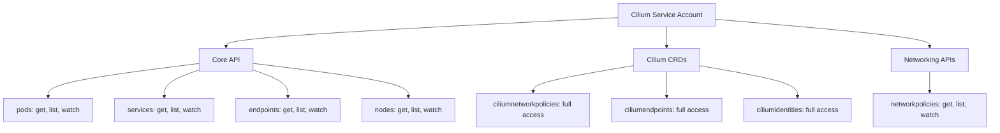

# How to Secure Controllers in Cilium Observability

Author: [nawazdhandala](https://github.com/nawazdhandala)

Tags: Cilium, Controller, Security, Kubernetes, RBAC

Description: Learn how to secure Cilium's controller subsystem by applying RBAC policies, restricting metrics access, and hardening the controller management interface against unauthorized access.

---

## Introduction

Cilium controllers manage the reconciliation of networking state across your cluster. They have broad access to Kubernetes resources, BPF maps, and endpoint configurations. If compromised or misconfigured, controller access could allow an attacker to manipulate network policies, disrupt endpoint connectivity, or exfiltrate sensitive observability data.

Securing Cilium controllers involves restricting who can query controller state, ensuring that the service account running Cilium has minimal necessary permissions, and protecting the metrics endpoints that expose controller operational data.

This guide covers practical security measures for Cilium's controller subsystem, focusing on RBAC hardening, metrics endpoint protection, and audit logging for controller operations.

## Prerequisites

- Kubernetes cluster with Cilium installed via Helm
- kubectl with cluster-admin access for RBAC changes
- Understanding of Kubernetes RBAC model
- Prometheus deployed for metrics collection
- Familiarity with Cilium's architecture

## Restricting Access to Controller Data

Controller state is accessible through the Cilium agent's API socket and the cilium CLI. Lock down who can access this information:

```bash
# Check current RBAC for the Cilium service account
kubectl get clusterrole cilium -o yaml | head -40
kubectl get clusterrolebinding cilium -o yaml

# Audit who has exec access to Cilium pods (controller data is accessible via exec)
kubectl auth can-i create pods/exec -n kube-system --as=system:serviceaccount:default:default
```

Create a restricted role for operators who only need to view controller status:

```yaml
# cilium-controller-viewer.yaml
apiVersion: rbac.authorization.k8s.io/v1
kind: ClusterRole
metadata:
  name: cilium-controller-viewer
rules:
  # Allow exec only for read-only cilium commands
  - apiGroups: [""]
    resources: ["pods/exec"]
    verbs: ["create"]
    # Note: K8s RBAC cannot restrict exec to specific commands.
    # Use admission webhooks for finer control.
  - apiGroups: [""]
    resources: ["pods"]
    verbs: ["get", "list"]
    # Restrict to kube-system namespace via RoleBinding
---
apiVersion: rbac.authorization.k8s.io/v1
kind: RoleBinding
metadata:
  name: cilium-controller-viewer
  namespace: kube-system
subjects:
  - kind: Group
    name: cilium-operators
    apiGroup: rbac.authorization.k8s.io
roleRef:
  kind: ClusterRole
  name: cilium-controller-viewer
  apiGroup: rbac.authorization.k8s.io
```

```bash
kubectl apply -f cilium-controller-viewer.yaml
```

## Hardening the Cilium Service Account

The Cilium service account needs broad permissions, but you should audit and minimize them:

```bash
# List all permissions granted to the Cilium service account
kubectl get clusterrole cilium -o json | python3 -c "
import json, sys
role = json.load(sys.stdin)
for rule in role['rules']:
    resources = ', '.join(rule.get('resources', ['*']))
    verbs = ', '.join(rule.get('verbs', ['*']))
    groups = ', '.join(rule.get('apiGroups', ['*']))
    print(f'  {groups}/{resources}: {verbs}')
"
```



If you are running Cilium without certain features, you can create a custom ClusterRole:

```yaml
# cilium-minimal-role.yaml
apiVersion: rbac.authorization.k8s.io/v1
kind: ClusterRole
metadata:
  name: cilium-minimal
rules:
  # Core resources - read only
  - apiGroups: [""]
    resources: ["pods", "services", "endpoints", "namespaces", "nodes"]
    verbs: ["get", "list", "watch"]
  # Cilium CRDs - full access required for reconciliation
  - apiGroups: ["cilium.io"]
    resources: ["*"]
    verbs: ["*"]
  # Events - for reporting controller status
  - apiGroups: [""]
    resources: ["events"]
    verbs: ["create", "patch"]
  # Node status updates
  - apiGroups: [""]
    resources: ["nodes/status"]
    verbs: ["patch"]
```

## Securing the Metrics Endpoint

Controller metrics exposed on port 9962 can reveal sensitive operational data. Protect this endpoint:

```yaml
# Network policy to restrict who can access Cilium metrics
apiVersion: cilium.io/v2
kind: CiliumNetworkPolicy
metadata:
  name: restrict-cilium-metrics-access
  namespace: kube-system
spec:
  endpointSelector:
    matchLabels:
      k8s-app: cilium
  ingress:
    # Only allow Prometheus to scrape metrics
    - fromEndpoints:
        - matchLabels:
            app.kubernetes.io/name: prometheus
            io.kubernetes.pod.namespace: monitoring
      toPorts:
        - ports:
            - port: "9962"
              protocol: TCP
            - port: "9965"
              protocol: TCP
    # Allow health checks from kubelet
    - fromEntities:
        - host
      toPorts:
        - ports:
            - port: "9879"
              protocol: TCP
```

```bash
kubectl apply -f restrict-cilium-metrics-access.yaml
```

Additionally, configure Helm to bind metrics only to the pod IP rather than all interfaces:

```yaml
# cilium-values.yaml - secure metrics binding
prometheus:
  enabled: true
  # Metrics are served on the agent's pod IP by default
  # Ensure they are not exposed via NodePort or LoadBalancer
  serviceMonitor:
    enabled: true
```

## Enabling Audit Logging for Controller Operations

Track when controller state is queried or modified:

```bash
# Enable Kubernetes audit logging for Cilium-related operations
# Add this to your kube-apiserver audit policy:
```

```yaml
# audit-policy.yaml (relevant section)
apiVersion: audit.k8s.io/v1
kind: Policy
rules:
  # Log all exec operations into kube-system pods
  - level: RequestResponse
    resources:
      - group: ""
        resources: ["pods/exec"]
    namespaces: ["kube-system"]
    verbs: ["create"]

  # Log modifications to Cilium CRDs
  - level: Metadata
    resources:
      - group: "cilium.io"
        resources: ["*"]
    verbs: ["create", "update", "delete", "patch"]

  # Log access to Cilium secrets (TLS certs, etc.)
  - level: Metadata
    resources:
      - group: ""
        resources: ["secrets"]
    namespaces: ["kube-system"]
    verbs: ["get", "list"]
```

## Verification

Confirm your security measures are in place:

```bash
# 1. Verify RBAC restrictions
kubectl auth can-i create pods/exec -n kube-system \
  --as=system:serviceaccount:default:default
# Should return "no"

# 2. Verify metrics endpoint is restricted
# From a non-Prometheus pod, this should fail
kubectl run test-access --image=curlimages/curl --rm -it --restart=Never -- \
  curl -s --connect-timeout 5 http://cilium-agent.kube-system:9962/metrics
# Should timeout or be refused

# 3. Verify Prometheus can still scrape
kubectl exec -n monitoring $(kubectl get pods -n monitoring -l app.kubernetes.io/name=prometheus -o name | head -1) \
  -c prometheus -- wget -qO- --timeout=5 http://cilium-agent.kube-system:9962/metrics 2>&1 | head -3

# 4. Check audit logs for recent Cilium-related events
kubectl logs -n kube-system $(kubectl get pods -n kube-system -l component=kube-apiserver -o name | head -1) \
  --tail=50 | grep -i "cilium\|exec"
```

## Troubleshooting

- **Prometheus cannot scrape after applying network policy**: Verify the label selectors in the CiliumNetworkPolicy match the actual labels on the Prometheus pods. Use `kubectl get pods -n monitoring --show-labels`.

- **RBAC too restrictive and Cilium is failing**: Check Cilium agent logs for authorization errors. If you tightened the ClusterRole too much, the operator or agent may not be able to reconcile resources.

- **Audit logs are too verbose**: Narrow the audit policy rules to specific resources and verbs rather than capturing all operations.

- **Cannot apply CiliumNetworkPolicy to protect Cilium itself**: Cilium agents are running as a DaemonSet in kube-system. Ensure the policy targets the correct labels and that it does not block Cilium-to-Cilium communication needed for clustering.

## Conclusion

Securing Cilium controllers is about applying defense in depth: RBAC to control who can access controller data, network policies to restrict metrics endpoint access, and audit logging to track operations. These measures protect the integrity of your networking layer without interfering with Cilium's ability to reconcile state. Review these security controls regularly as part of your cluster security posture assessments.
