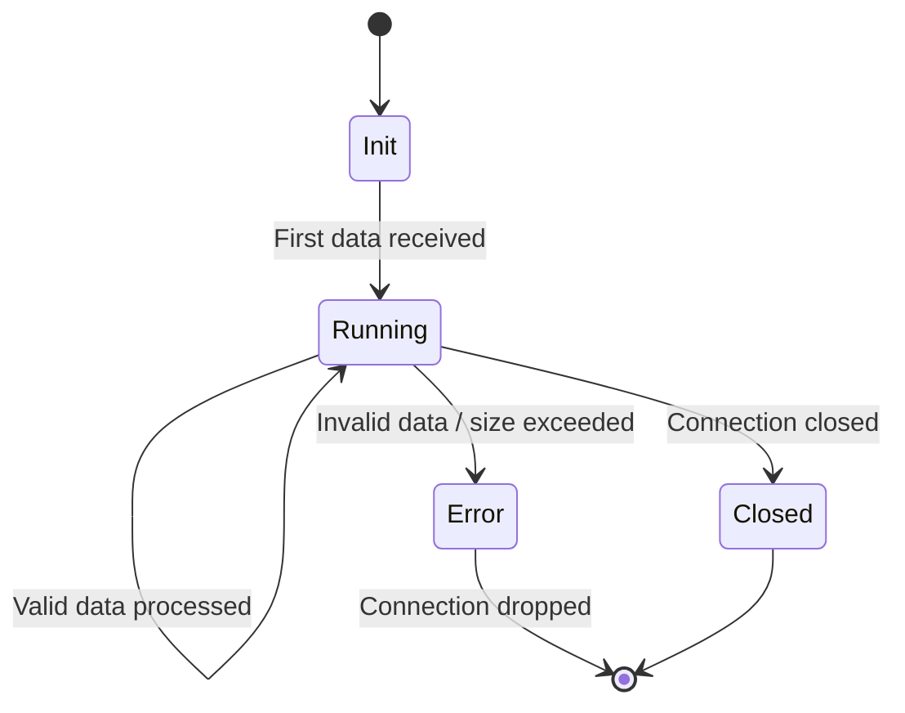

# Securing a New Proxy Skeleton in Cilium Network Security

Author: [nawazdhandala](https://github.com/nawazdhandala)

Tags: Cilium, Network Security, Proxy, L7 Policy, Go

Description: A step-by-step guide to creating a secure new proxy skeleton in Cilium's proxylib framework, with proper input validation, connection handling, and policy integration from the start.

---

## Introduction

When adding support for a new Layer 7 protocol in Cilium, the first coding step is creating a proxy skeleton — the minimal structure that registers with the proxylib framework and handles connection lifecycle events. Getting security right at this stage is critical because the skeleton establishes the foundation for all future parsing and policy enforcement.

A poorly structured skeleton can introduce vulnerabilities such as unbounded memory allocation, missing authentication hooks, or improper connection state management. These issues become increasingly difficult to fix once more complex parsing logic is layered on top.

This guide walks you through creating a new proxy skeleton in Cilium's proxylib with security best practices baked in from the beginning. We will cover factory registration, connection initialization, safe memory patterns, and integration with Cilium's policy engine.

## Prerequisites

- Cloned Cilium repository (v1.15+)
- Go 1.21 or later
- Understanding of Cilium's proxylib interface (Parser and ParserFactory)
- Familiarity with CiliumNetworkPolicy L7 rules
- A Kubernetes cluster with Cilium for end-to-end testing

## Setting Up the Proxy Directory Structure

Create a well-organized directory for your new protocol parser:

```bash
cd cilium

# Create the new parser directory
mkdir -p proxylib/myprotocol

# Create the required files
touch proxylib/myprotocol/myprotocolparser.go
touch proxylib/myprotocol/myprotocolparser_test.go
```

The naming convention follows existing parsers — the directory name matches the protocol, and the main file is named `<protocol>parser.go`.

## Implementing the Secure Parser Factory

The ParserFactory is responsible for creating parser instances per connection. Security starts here with proper validation.

```go
// proxylib/myprotocol/myprotocolparser.go
package myprotocol

import (
    "github.com/cilium/cilium/proxylib/proxylib"
    log "github.com/sirupsen/logrus"
)

const (
    // ParserName is the name used in CiliumNetworkPolicy L7 rules
    ParserName = "myprotocol"

    // maxMessageSize prevents memory exhaustion from malformed packets
    maxMessageSize = 1 << 20 // 1 MB

    // maxConnectionsPerEndpoint limits resource consumption
    maxConnectionsPerEndpoint = 10000
)

// ParserFactory creates MyProtocol parser instances
type ParserFactory struct{}

// Create returns a new parser for the given connection.
// The connection parameter provides metadata about the endpoints.
func (f *ParserFactory) Create(connection *proxylib.Connection) interface{} {
    log.WithFields(log.Fields{
        "srcIdentity":  connection.SrcIdentity,
        "dstIdentity":  connection.DstIdentity,
        "origEndpoint": connection.OrigEndpoint,
    }).Debug("Creating new MyProtocol parser")

    return &Parser{
        connection: connection,
        state:      stateInit,
    }
}

// Register the parser factory during init
func init() {
    proxylib.RegisterParserFactory(ParserName, &ParserFactory{})
}
```

## Implementing the Secure Parser Skeleton

The Parser struct maintains per-connection state. Design it with bounded resources and clear state transitions:

```go
// parserState tracks the connection state machine
type parserState int

const (
    stateInit    parserState = iota
    stateRunning
    stateError
    stateClosed
)

// Parser implements the proxylib.Parser interface for MyProtocol
type Parser struct {
    connection *proxylib.Connection
    state      parserState
    // bytesRead tracks total bytes to enforce limits
    bytesRead  uint64
    // maxBytes is the per-connection byte limit (0 = unlimited)
    maxBytes   uint64
}

// OnData is called when data arrives on the connection.
// reply is true for response traffic, false for request traffic.
func (p *Parser) OnData(reply bool, reader *proxylib.Reader) (proxylib.OpType, int) {
    // Reject data on errored or closed connections
    if p.state == stateError || p.state == stateClosed {
        log.Warn("Data received on closed/errored MyProtocol connection")
        return proxylib.DROP, 0
    }

    // Transition from init to running on first data
    if p.state == stateInit {
        p.state = stateRunning
    }

    // Check available data length
    dataLen := reader.Length()
    if dataLen == 0 {
        // Need more data
        return proxylib.MORE, 1
    }

    // Enforce maximum message size
    if dataLen > maxMessageSize {
        log.WithField("dataLen", dataLen).
            Warn("MyProtocol message exceeds maximum size")
        p.state = stateError
        return proxylib.DROP, 0
    }

    // Placeholder: forward all data for now
    // Real parsing logic will replace this in subsequent steps
    return proxylib.PASS, dataLen
}
```



## Integrating with Cilium Policy

Wire the new parser into CiliumNetworkPolicy by updating the import chain and defining the policy rule structure:

```go
// Add to proxylib/myprotocol/myprotocolparser.go

// MyProtocolRule represents an L7 rule for the protocol
type MyProtocolRule struct {
    // AllowedCommands restricts which protocol commands are permitted
    AllowedCommands []string
}

// Matches checks if the parsed request matches this policy rule
func (r *MyProtocolRule) Matches(command string) bool {
    if len(r.AllowedCommands) == 0 {
        // Empty rule matches everything — explicit allow-all
        return true
    }
    for _, allowed := range r.AllowedCommands {
        if allowed == command {
            return true
        }
    }
    return false
}
```

Ensure the parser is imported in the proxylib main package:

```go
// Add this import to proxylib/proxylib.go or the appropriate init file
import (
    _ "github.com/cilium/cilium/proxylib/myprotocol"
)
```

A CiliumNetworkPolicy using your parser would look like:

```yaml
apiVersion: cilium.io/v2
kind: CiliumNetworkPolicy
metadata:
  name: myprotocol-l7-policy
spec:
  endpointSelector:
    matchLabels:
      app: myservice
  ingress:
    - fromEndpoints:
        - matchLabels:
            app: client
      toPorts:
        - ports:
            - port: "9000"
              protocol: TCP
          rules:
            l7proto: myprotocol
            l7:
              - command: "GET"
              - command: "LIST"
```

## Verification

Run tests to verify the skeleton compiles and passes basic checks:

```bash
# Build the proxylib to verify compilation
go build ./proxylib/...

# Run the parser tests
go test ./proxylib/myprotocol/... -v

# Run with race detection
go test ./proxylib/myprotocol/... -race -v

# Verify the parser registers correctly
go test -run TestParserRegistration ./proxylib/... -v
```

Check that the parser appears in the registered parsers list:

```bash
# Search for your parser in the registration output
grep -rn "myprotocol" proxylib/ --include="*.go"
```

## Troubleshooting

**Problem: Parser not found when applying CiliumNetworkPolicy**
Ensure the parser package is imported with a blank import (`_`) in the proxylib main package. Without this, the `init()` function never runs and the factory is never registered.

**Problem: All connections are being dropped**
Check the parser state machine. If the initial state is set incorrectly or the state transitions have a logic error, the parser may immediately enter the error state. Add debug logging to `OnData` to trace state transitions.

**Problem: Memory usage grows unbounded**
Verify that `maxMessageSize` is set appropriately for your protocol. Also ensure that the parser does not accumulate data across calls without bounds — each `OnData` invocation should either consume or drop data.

**Problem: Policy rules not matching**
Verify the `l7proto` field in your CiliumNetworkPolicy matches the `ParserName` constant exactly. The match is case-sensitive.

## Conclusion

Creating a secure proxy skeleton in Cilium requires attention to resource bounds, state management, and policy integration from the very first lines of code. By establishing maximum message sizes, implementing a clear state machine, and wiring into Cilium's L7 policy framework early, you create a foundation that is both secure and extensible. The skeleton demonstrated here follows the patterns established by Cilium's existing parsers and provides a safe starting point for implementing full protocol parsing in subsequent steps.
