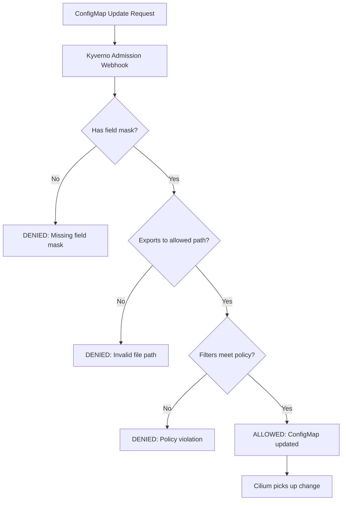

# How to Secure Dynamic Exporter Configuration in Cilium Hubble

Author: [nawazdhandala](https://github.com/nawazdhandala)

Tags: Cilium, Hubble, Dynamic Exporter, Security, RBAC

Description: Learn how to secure the Cilium Hubble dynamic exporter by restricting ConfigMap access, validating export rules, and preventing unauthorized data collection.

---

## Introduction

The dynamic exporter ConfigMap is a powerful control point in Cilium. Anyone who can modify it can change what network flow data is collected and where it is written. An attacker with ConfigMap write access could silently add an exporter that captures all L7 traffic to a file they can later exfiltrate, or they could remove security-focused exporters to create monitoring blind spots.

Securing the dynamic exporter means controlling who can modify the ConfigMap, validating that export rules conform to your data governance policies, and auditing all changes to the exporter configuration.

This guide covers the security controls needed to use the dynamic exporter safely in production.

## Prerequisites

- Kubernetes cluster with Cilium and Hubble dynamic exporter enabled
- kubectl with cluster-admin access for RBAC configuration
- Understanding of Kubernetes RBAC
- Admission controller (Kyverno or OPA Gatekeeper) for policy enforcement

## Restricting ConfigMap Access with RBAC

The dynamic exporter ConfigMap should only be modifiable by authorized personnel:

```yaml
# dynamic-exporter-rbac.yaml
apiVersion: rbac.authorization.k8s.io/v1
kind: Role
metadata:
  name: hubble-export-manager
  namespace: kube-system
rules:
  - apiGroups: [""]
    resources: ["configmaps"]
    resourceNames: ["cilium-hubble-export-config"]
    verbs: ["get", "update", "patch"]
---
apiVersion: rbac.authorization.k8s.io/v1
kind: RoleBinding
metadata:
  name: hubble-export-manager-binding
  namespace: kube-system
subjects:
  - kind: Group
    name: security-team
    apiGroup: rbac.authorization.k8s.io
roleRef:
  kind: Role
  name: hubble-export-manager
  apiGroup: rbac.authorization.k8s.io
---
# Read-only access for auditors
apiVersion: rbac.authorization.k8s.io/v1
kind: Role
metadata:
  name: hubble-export-viewer
  namespace: kube-system
rules:
  - apiGroups: [""]
    resources: ["configmaps"]
    resourceNames: ["cilium-hubble-export-config"]
    verbs: ["get"]
---
apiVersion: rbac.authorization.k8s.io/v1
kind: RoleBinding
metadata:
  name: hubble-export-viewer-binding
  namespace: kube-system
subjects:
  - kind: Group
    name: auditors
    apiGroup: rbac.authorization.k8s.io
roleRef:
  kind: Role
  name: hubble-export-viewer
  apiGroup: rbac.authorization.k8s.io
```

```bash
kubectl apply -f dynamic-exporter-rbac.yaml

# Verify access restrictions
kubectl auth can-i update configmaps/cilium-hubble-export-config \
  -n kube-system --as=system:serviceaccount:default:default
# Should return "no"
```

## Validating Export Rules with Admission Control

Use an admission webhook to validate export rules before they are applied:

```yaml
# kyverno-export-policy.yaml
apiVersion: kyverno.io/v1
kind: ClusterPolicy
metadata:
  name: validate-hubble-export-config
spec:
  validationFailureAction: Enforce
  rules:
    - name: validate-export-rules
      match:
        resources:
          kinds:
            - ConfigMap
          namespaces:
            - kube-system
          names:
            - cilium-hubble-export-config
      validate:
        message: "Hubble export rules must include field masks and must not export L7 data"
        foreach:
          - list: "request.object.data"
            deny:
              conditions:
                any:
                  # Every rule must have a field mask
                  - key: "{{ parse_json(@).fieldMask || '' }}"
                    operator: Equals
                    value: ""
```

```bash
kubectl apply -f kyverno-export-policy.yaml
```



## Auditing Dynamic Exporter Changes

Track all modifications to the exporter ConfigMap:

```yaml
# audit-policy-dynamic-export.yaml (kube-apiserver audit policy section)
apiVersion: audit.k8s.io/v1
kind: Policy
rules:
  - level: RequestResponse
    resources:
      - group: ""
        resources: ["configmaps"]
    namespaces: ["kube-system"]
    verbs: ["create", "update", "patch", "delete"]
    omitStages:
      - RequestReceived
```

```bash
# Check recent audit events for the ConfigMap
kubectl logs -n kube-system $(kubectl get pods -n kube-system -l component=kube-apiserver -o name | head -1) \
  --tail=200 | grep "cilium-hubble-export-config" | tail -10

# Create a Prometheus alert for ConfigMap changes
```

```yaml
# export-config-change-alert.yaml
apiVersion: monitoring.coreos.com/v1
kind: PrometheusRule
metadata:
  name: hubble-export-config-alerts
  namespace: monitoring
spec:
  groups:
    - name: hubble-dynamic-export
      rules:
        - alert: HubbleExportConfigChanged
          expr: |
            changes(kube_configmap_info{namespace="kube-system",configmap="cilium-hubble-export-config"}[5m]) > 0
          for: 0m
          labels:
            severity: info
          annotations:
            summary: "Hubble dynamic export configuration was modified"
```

## Preventing Unauthorized Data Collection

Ensure dynamic exporters cannot be used to capture data outside approved boundaries:

```bash
# Regular audit: check all active export rules
kubectl -n kube-system get configmap cilium-hubble-export-config -o json | python3 -c "
import json, sys

ALLOWED_PATHS_PREFIX = '/var/run/cilium/hubble/'
FORBIDDEN_FIELDS = {'l7', 'IP.source', 'IP.destination', 'ethernet'}

cm = json.load(sys.stdin)
for key, value in cm.get('data', {}).items():
    try:
        cfg = json.loads(value)

        # Check file path
        path = cfg.get('filePath', '')
        if not path.startswith(ALLOWED_PATHS_PREFIX):
            print(f'VIOLATION {key}: file path outside allowed directory: {path}')

        # Check field mask for sensitive fields
        mask = set(cfg.get('fieldMask', []))
        forbidden = mask.intersection(FORBIDDEN_FIELDS)
        if forbidden:
            print(f'VIOLATION {key}: exports sensitive fields: {forbidden}')

        # Check if there is no field mask (exports everything)
        if not mask:
            print(f'WARNING {key}: no field mask - exports all fields')

        # Check for missing expiration
        if 'end' not in cfg:
            print(f'WARNING {key}: no expiration set')

    except json.JSONDecodeError:
        print(f'ERROR {key}: invalid JSON')
"
```

## Verification

Confirm security controls are in place:

```bash
# 1. RBAC prevents unauthorized access
kubectl auth can-i update configmaps -n kube-system \
  --as=system:serviceaccount:default:default
# Should return "no"

# 2. Admission policy is active
kubectl get clusterpolicy validate-hubble-export-config -o jsonpath='{.status.conditions}' 2>/dev/null | python3 -m json.tool

# 3. All current rules pass validation
kubectl -n kube-system get configmap cilium-hubble-export-config -o json | python3 -c "
import json, sys
cm = json.load(sys.stdin)
for key, value in cm.get('data', {}).items():
    cfg = json.loads(value)
    has_mask = bool(cfg.get('fieldMask'))
    has_path = cfg.get('filePath','').startswith('/var/run/cilium/hubble/')
    print(f'{key}: mask={has_mask}, valid_path={has_path}')
"

# 4. Audit trail exists
echo "Check your audit log system for recent changes to cilium-hubble-export-config"
```

## Troubleshooting

- **Admission webhook blocks legitimate updates**: Check the policy rules carefully. You may need to adjust the validation conditions. Test changes in a staging cluster first.

- **RBAC prevents Cilium from reading the ConfigMap**: The Cilium service account needs `get` and `watch` permissions on the ConfigMap. This is separate from the operator RBAC.

- **Audit logs not showing ConfigMap changes**: Ensure the audit policy is loaded by the kube-apiserver. Check the apiserver flags for `--audit-policy-file`.

- **Unauthorized exporter found**: Remove it immediately from the ConfigMap and investigate who created it through audit logs. Tighten RBAC if needed.

## Conclusion

The dynamic exporter ConfigMap is a sensitive control point that requires proper security governance. RBAC restricts who can modify export rules, admission webhooks validate that rules conform to policy, and audit logging tracks all changes. Together, these controls allow you to use the dynamic exporter's flexibility while preventing unauthorized data collection. Regular audits of active export rules should be part of your security operations routine.
