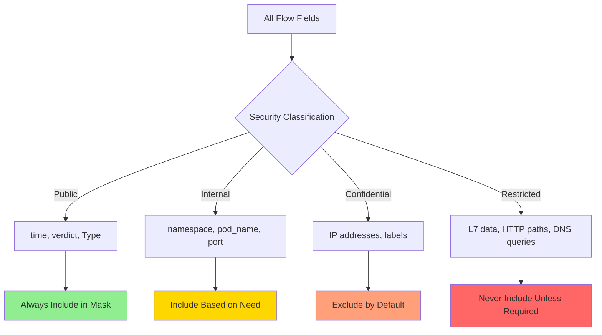

# How to Secure Field Mask in Cilium Hubble

Author: [nawazdhandala](https://github.com/nawazdhandala)

Tags: Cilium, Hubble, Field Mask, Security, Data Minimization

Description: Use Hubble field masks as a security control to enforce data minimization, prevent exposure of sensitive network information, and comply with data governance policies.

---

## Introduction

Field masks in Hubble serve a dual purpose: they optimize performance by reducing export size, and they enforce data minimization by preventing sensitive fields from being written to disk. From a security perspective, the field mask is your primary control for determining what network metadata leaves the Cilium agent's memory and becomes persistent.

IP addresses can reveal network topology. L7 metadata can expose API paths and query parameters. Ethernet addresses can fingerprint devices. By applying strict field masks, you ensure that only the data necessary for your observability use case is persisted, reducing the blast radius if exported data is compromised.

This guide focuses on using field masks as a security control, with recommendations for different compliance requirements.

## Prerequisites

- Kubernetes cluster with Cilium and Hubble exporter enabled
- Understanding of your data classification requirements
- Helm 3 for configuration management
- Knowledge of relevant compliance frameworks (GDPR, SOC2, PCI-DSS)

## Security-First Field Mask Design

Design your field mask starting from zero fields and adding only what is necessary:

```yaml
# Minimal security-first field mask
hubble:
  export:
    static:
      enabled: true
      filePath: /var/run/cilium/hubble/events.log
      fieldMask:
        # Timing - needed for correlation
        - time

        # Identity without IP addresses
        - source.namespace
        - source.pod_name
        - destination.namespace
        - destination.pod_name

        # Port for service identification
        - destination.port

        # Security verdict
        - verdict
        - drop_reason

        # Event classification
        - Type

        # Deliberately excluded:
        # - source.labels (may contain sensitive label values)
        # - IP.source/IP.destination (reveals network topology)
        # - ethernet (reveals MAC addresses)
        # - l7 (contains HTTP paths, DNS queries, request bodies)
        # - source.identity/destination.identity (numeric but correlatable)
        # - node_name (reveals infrastructure topology)
```

```bash
helm upgrade cilium cilium/cilium -n kube-system \
  --reuse-values \
  --values security-field-mask.yaml
```



## Compliance-Specific Field Masks

### SOC2 Compliance

```yaml
# SOC2 - focus on access control and security events
fieldMask:
  - time
  - source.namespace
  - source.pod_name
  - destination.namespace
  - destination.pod_name
  - destination.port
  - verdict
  - drop_reason
  - Type
  - event_type
```

### GDPR Compliance

```yaml
# GDPR - minimize personal data exposure
# IP addresses are considered personal data under GDPR
fieldMask:
  - time
  - source.namespace
  - source.pod_name  # Pod names are not personal data
  - destination.namespace
  - destination.pod_name
  - destination.port
  - verdict
  - Type
  # NO IP addresses
  # NO L7 data (may contain user identifiers in URLs)
  # NO labels (may contain user-identifying annotations)
```

### PCI-DSS Compliance

```yaml
# PCI-DSS - protect cardholder data environment
fieldMask:
  - time
  - source.namespace
  - source.pod_name
  - destination.namespace
  - destination.pod_name
  - destination.port
  - verdict
  - drop_reason
  - l4.TCP  # Connection state for network segmentation verification
  - Type
  # NO L7 data (may capture payment data in transit)
  # NO IP addresses of PCI zone
```

## Validating Field Mask Security

Create automated checks to verify the mask is enforced:

```bash
# Validation script - run as a CronJob or CI check
kubectl -n kube-system exec ds/cilium -- tail -100 /var/run/cilium/hubble/events.log | python3 -c "
import json, sys

# Define sensitive fields that should NOT appear
FORBIDDEN_FIELDS = {
    'IP',           # Network topology
    'ethernet',     # MAC addresses
    'l7',           # Application-layer data
    'node_name',    # Infrastructure topology
}

violations = []
count = 0
for line in sys.stdin:
    count += 1
    flow = json.loads(line).get('flow', {})
    for field in FORBIDDEN_FIELDS:
        if field in flow:
            violations.append(f'Event {count}: forbidden field \"{field}\" present')

if violations:
    print(f'SECURITY VIOLATION: {len(violations)} events contain forbidden fields')
    for v in violations[:5]:
        print(f'  {v}')
    sys.exit(1)
else:
    print(f'OK: {count} events checked, no forbidden fields found')
"
```

## Preventing Field Mask Tampering

Ensure the field mask configuration cannot be changed without authorization:

```yaml
# Use Kyverno or OPA/Gatekeeper to enforce field mask policy
# Example Kyverno policy:
apiVersion: kyverno.io/v1
kind: ClusterPolicy
metadata:
  name: enforce-hubble-field-mask
spec:
  validationFailureAction: Enforce
  rules:
    - name: require-field-mask
      match:
        resources:
          kinds:
            - ConfigMap
          namespaces:
            - kube-system
          names:
            - cilium-config
      validate:
        message: "Hubble exporter must have a field mask configured"
        pattern:
          data:
            hubble-export-field-mask: "?*"
```

## Verification

Confirm field mask security controls:

```bash
# 1. No IP addresses in export
kubectl -n kube-system exec ds/cilium -- cat /var/run/cilium/hubble/events.log | python3 -c "
import json, sys, re
ip_pattern = re.compile(r'\d{1,3}\.\d{1,3}\.\d{1,3}\.\d{1,3}')
count = 0
ip_found = 0
for line in sys.stdin:
    count += 1
    if ip_pattern.search(line):
        ip_found += 1
print(f'Checked {count} events: {ip_found} contain IP-like patterns')
"

# 2. No L7 data
kubectl -n kube-system exec ds/cilium -- head -20 /var/run/cilium/hubble/events.log | python3 -c "
import json, sys
for line in sys.stdin:
    flow = json.loads(line).get('flow', {})
    if 'l7' in flow:
        print('FAIL: L7 data found')
        break
else:
    print('PASS: No L7 data in export')
"

# 3. Field mask matches Helm values
helm get values cilium -n kube-system -o yaml | grep -A20 fieldMask

# 4. Export data is still useful
kubectl -n kube-system exec ds/cilium -- tail -3 /var/run/cilium/hubble/events.log | python3 -c "
import json, sys
for line in sys.stdin:
    f = json.loads(line).get('flow', {})
    print(f\"{f.get('source',{}).get('namespace','?')}/{f.get('source',{}).get('pod_name','?')} -> {f.get('destination',{}).get('namespace','?')}/{f.get('destination',{}).get('pod_name','?')} [{f.get('verdict','?')}]\")
"
```

## Troubleshooting

- **Field mask too restrictive for debugging**: Create a separate exporter configuration for temporary debugging with broader field masks. Remove it after the investigation.

- **Compliance audit fails despite field mask**: Check if there are other data paths (Hubble relay, CLI access, Prometheus metrics) that expose the restricted fields. Field masks only apply to the file exporter.

- **Pod names reveal sensitive information**: If pod names contain sensitive data (e.g., customer IDs), you may need to mask `source.pod_name` and `destination.pod_name` as well, relying only on namespace-level identification.

- **Kyverno policy blocks legitimate Cilium updates**: Add an exception for the Cilium Helm release service account in the Kyverno policy.

## Conclusion

Field masks are your primary data minimization control for Hubble exports. Design masks starting from zero and adding only necessary fields, following the principle of least privilege for data. Align your mask configuration with compliance requirements, validate regularly with automated checks, and protect the mask configuration from unauthorized changes. This approach ensures that your Hubble observability does not become a data governance liability.
