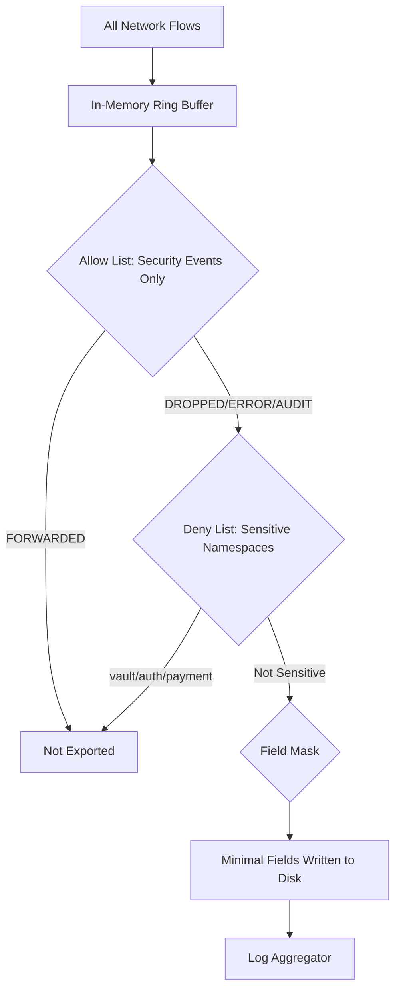

# How to Secure Filters in Cilium Hubble

Author: [nawazdhandala](https://github.com/nawazdhandala)

Tags: Cilium, Hubble, Filters, Security, Data Protection

Description: Learn how to use Hubble filters as a security control to limit data exposure, enforce data minimization principles, and protect sensitive flow information from unauthorized access.

---

## Introduction

Hubble filters are not just a convenience feature for debugging -- they serve as a critical security control. Without proper filtering, Hubble exposes detailed information about every network flow in your cluster, including pod communication patterns, DNS queries, HTTP paths, and port usage. This data can reveal application architecture, internal APIs, and potentially sensitive business logic.

Using filters as a security mechanism means applying them at the exporter level to control what data is persisted, at the relay level to restrict what is served to clients, and at the access level to control who can query specific namespaces or workloads.

This guide shows you how to apply filters strategically to minimize data exposure while retaining the observability capabilities you need.

## Prerequisites

- Kubernetes cluster with Cilium and Hubble deployed
- Understanding of data classification requirements
- kubectl and Helm 3 access
- Familiarity with Hubble filter syntax

## Applying Exporter Filters for Data Minimization

The exporter is where data first leaves the in-memory buffer and becomes persistent. This is the most important filtering point:

```yaml
# secure-exporter-filters.yaml
hubble:
  export:
    static:
      enabled: true
      filePath: /var/run/cilium/hubble/events.log
      fileMaxSizeMb: 10
      fileMaxBackups: 5

      # Only export security-relevant events
      allowList:
        # Policy-relevant events
        - '{"verdict":["DROPPED"]}'
        - '{"verdict":["ERROR"]}'
        - '{"verdict":["AUDIT"]}'

      # Never export flows involving sensitive workloads
      denyList:
        # Secrets management
        - '{"source_pod":["vault/"]}'
        - '{"destination_pod":["vault/"]}'
        # Authentication services
        - '{"source_pod":["auth/"]}'
        - '{"destination_pod":["auth/"]}'
        # Payment processing
        - '{"source_pod":["payment/"]}'
        - '{"destination_pod":["payment/"]}'

      # Minimize exported fields
      fieldMask:
        - time
        - source.namespace
        - source.pod_name
        - destination.namespace
        - destination.pod_name
        - destination.port
        - verdict
        - drop_reason
        - Type
```

```bash
helm upgrade cilium cilium/cilium -n kube-system \
  --reuse-values \
  --values secure-exporter-filters.yaml
```



## Restricting Hubble CLI Access by Namespace

While Hubble CLI does not natively support RBAC-based namespace filtering, you can achieve namespace isolation through tooling:

```bash
# Create a restricted wrapper script for team-specific access
cat > /usr/local/bin/hubble-team-frontend << 'SCRIPT'
#!/bin/bash
# Restricted Hubble access for the frontend team
# Only allows observing flows in the frontend namespace
exec hubble observe --namespace frontend "$@"
SCRIPT
chmod +x /usr/local/bin/hubble-team-frontend

# For Kubernetes-based access, create namespace-scoped RBAC
```

```yaml
# namespace-scoped-hubble-access.yaml
apiVersion: rbac.authorization.k8s.io/v1
kind: Role
metadata:
  name: hubble-frontend-viewer
  namespace: frontend
rules:
  - apiGroups: [""]
    resources: ["pods"]
    verbs: ["get", "list"]
---
apiVersion: rbac.authorization.k8s.io/v1
kind: RoleBinding
metadata:
  name: hubble-frontend-binding
  namespace: frontend
subjects:
  - kind: Group
    name: frontend-team
    apiGroup: rbac.authorization.k8s.io
roleRef:
  kind: Role
  name: hubble-frontend-viewer
  apiGroup: rbac.authorization.k8s.io
```

## Protecting Sensitive L7 Data with Filters

L7 flow data (HTTP, DNS, gRPC) is especially sensitive. Apply filters to redact or exclude it:

```yaml
# l7-security-config.yaml
hubble:
  # Enable built-in redaction
  redact:
    enabled: true
    httpURLQuery: true
    httpUserInfo: true
    kafkaApiKey: true

  # Only enable L7 metrics for non-sensitive namespaces
  metrics:
    enabled:
      - dns
      - drop
      - tcp
      - flow
      # HTTP metrics only with namespace-level labels
      - "httpV2:labelsContext=source_namespace,destination_namespace"

  export:
    static:
      enabled: true
      filePath: /var/run/cilium/hubble/events.log
      # Exclude L7 fields from export entirely
      fieldMask:
        - time
        - source.namespace
        - source.pod_name
        - destination.namespace
        - destination.pod_name
        - destination.port
        - verdict
        - drop_reason
        - l4.TCP
        - l4.UDP
        - Type
        # Deliberately NOT including l7 field
```

```bash
helm upgrade cilium cilium/cilium -n kube-system \
  --reuse-values \
  --values l7-security-config.yaml
```

## Audit Logging for Filter Changes

Track when exporter filters are modified:

```bash
# Monitor Helm release changes that affect filters
helm history cilium -n kube-system --max 10

# Set up a Kubernetes audit policy for Cilium ConfigMap changes
```

```yaml
# audit-policy-filters.yaml (relevant section)
apiVersion: audit.k8s.io/v1
kind: Policy
rules:
  - level: RequestResponse
    resources:
      - group: ""
        resources: ["configmaps"]
    namespaces: ["kube-system"]
    verbs: ["update", "patch"]
    # This captures changes to Cilium's configuration
```

## Verification

Confirm security filters are working:

```bash
# 1. Verify sensitive namespaces are excluded from export
kubectl -n kube-system exec ds/cilium -- cat /var/run/cilium/hubble/events.log | python3 -c "
import json, sys
sensitive_ns = {'vault', 'auth', 'payment'}
violations = []
for line in sys.stdin:
    f = json.loads(line)
    flow = f.get('flow', {})
    src_ns = flow.get('source', {}).get('namespace', '')
    dst_ns = flow.get('destination', {}).get('namespace', '')
    if src_ns in sensitive_ns or dst_ns in sensitive_ns:
        violations.append(f'{src_ns} -> {dst_ns}')
if violations:
    print(f'VIOLATION: {len(violations)} flows from sensitive namespaces found')
else:
    print('OK: No flows from sensitive namespaces in export')
"

# 2. Verify L7 data is excluded
kubectl -n kube-system exec ds/cilium -- tail -20 /var/run/cilium/hubble/events.log | python3 -c "
import json, sys
for line in sys.stdin:
    f = json.loads(line)
    if 'l7' in f.get('flow', {}):
        print('WARNING: L7 data found in export')
        break
else:
    print('OK: No L7 data in export')
"

# 3. Verify field mask is working
kubectl -n kube-system exec ds/cilium -- head -1 /var/run/cilium/hubble/events.log | python3 -c "
import json, sys
f = json.load(sys.stdin)
flow_keys = set(f.get('flow', {}).keys())
print(f'Exported fields: {flow_keys}')
if 'IP' in str(f):
    print('WARNING: IP addresses present')
"

# 4. Only security verdicts exported
kubectl -n kube-system exec ds/cilium -- cat /var/run/cilium/hubble/events.log | python3 -c "
import json, sys
from collections import Counter
verdicts = Counter()
for line in sys.stdin:
    f = json.loads(line)
    v = f.get('flow', {}).get('verdict', 'UNKNOWN')
    verdicts[v] += 1
for v, count in verdicts.most_common():
    print(f'{v}: {count}')
"
```

## Troubleshooting

- **Sensitive data appearing in export despite deny list**: Check the exact namespace names. The deny list uses prefix matching, so `vault/` matches any pod in the `vault` namespace. Verify namespace names with `kubectl get ns`.

- **Redaction not working**: Ensure `hubble.redact.enabled=true` is set and Cilium pods have been restarted. Redaction only applies to new flows after the restart.

- **Filter changes not taking effect**: Exporter filter changes require a pod restart. Run `kubectl -n kube-system rollout restart ds/cilium`.

- **Too much data still being exported**: Tighten the allow list. If you only need security events, restrict to `DROPPED` and `ERROR` verdicts.

## Conclusion

Hubble filters serve as a data minimization control that reduces the exposure of sensitive network information. Apply deny lists to exclude sensitive namespaces, use field masks to strip unnecessary data fields, enable redaction for L7 content, and restrict the allow list to security-relevant events. These measures ensure that your observability pipeline provides security value without becoming a data exposure risk.
