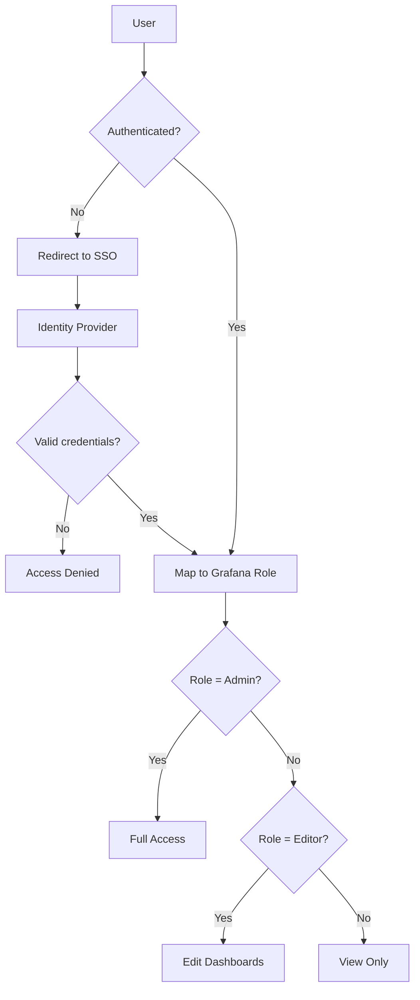

# Securing Grafana Access for Cilium Observability

Author: [nawazdhandala](https://github.com/nawazdhandala)

Tags: Cilium, Observability, Grafana, Security, Authentication, RBAC

Description: Harden Grafana access for Cilium observability with authentication integration, role-based access control, network restrictions, and audit logging to protect sensitive cluster monitoring data.

---

## Introduction

Grafana dashboards for Cilium expose sensitive information about your cluster's network topology, policy enforcement, traffic patterns, and internal service communication. Unauthorized access to these dashboards could reveal attack paths, identify unprotected services, or expose compliance-sensitive traffic data.

Securing Grafana access requires authentication hardening, role-based access control (RBAC), network-level restrictions, TLS encryption, and audit logging. This guide covers each security layer for Grafana in a Cilium observability deployment.

## Prerequisites

- Grafana deployed in the Kubernetes cluster
- Cilium with observability enabled
- Identity provider (LDAP, OIDC, or SAML) for authentication
- cert-manager for TLS certificates
- Understanding of organizational access policies

## Configuring Authentication

Replace default admin credentials with enterprise authentication:

```yaml
# grafana-auth-values.yaml
grafana:
  grafana.ini:
    server:
      root_url: https://grafana.example.com
    auth:
      disable_login_form: false
      disable_signout_menu: false
    auth.generic_oauth:
      enabled: true
      name: "SSO"
      allow_sign_up: true
      client_id: grafana-client-id
      client_secret: ${OAUTH_CLIENT_SECRET}
      scopes: openid profile email
      auth_url: https://sso.example.com/authorize
      token_url: https://sso.example.com/token
      api_url: https://sso.example.com/userinfo
      role_attribute_path: "contains(groups[*], 'platform-admin') && 'Admin' || contains(groups[*], 'platform-viewer') && 'Viewer'"
    security:
      admin_password: ${GRAFANA_ADMIN_PASSWORD}
      cookie_secure: true
      cookie_samesite: strict
      strict_transport_security: true
      content_security_policy: true
```

```bash
# Create secret for OAuth credentials
kubectl create secret generic grafana-oauth -n monitoring \
    --from-literal=client-secret=your-oauth-secret

# Apply authentication configuration
helm upgrade grafana grafana/grafana \
    --namespace monitoring \
    -f grafana-auth-values.yaml
```

## Implementing Role-Based Access Control

Define Grafana organizations and roles:

```bash
# Create a read-only organization for general users
curl -s -u admin:admin -X POST http://localhost:3000/api/orgs \
    -H "Content-Type: application/json" \
    -d '{"name": "Cilium Monitoring"}'

# Create teams with specific dashboard access
curl -s -u admin:admin -X POST http://localhost:3000/api/teams \
    -H "Content-Type: application/json" \
    -d '{"name": "Network Security Team"}'

curl -s -u admin:admin -X POST http://localhost:3000/api/teams \
    -H "Content-Type: application/json" \
    -d '{"name": "Platform Team"}'
```

Configure dashboard-level permissions:

```bash
# Get dashboard UID
DASH_UID=$(curl -s -u admin:admin http://localhost:3000/api/search?query=Cilium | jq -r '.[0].uid')

# Set permissions: Network Security Team = Editor, Platform Team = Viewer
curl -s -u admin:admin -X POST "http://localhost:3000/api/dashboards/uid/$DASH_UID/permissions" \
    -H "Content-Type: application/json" \
    -d '{
        "items": [
            {"teamId": 1, "permission": 2},
            {"teamId": 2, "permission": 1}
        ]
    }'
```



## Enabling TLS for Grafana

Encrypt Grafana traffic with TLS:

```yaml
# grafana-tls-cert.yaml
apiVersion: cert-manager.io/v1
kind: Certificate
metadata:
  name: grafana-tls
  namespace: monitoring
spec:
  secretName: grafana-tls
  issuerRef:
    name: cluster-issuer
    kind: ClusterIssuer
  dnsNames:
    - grafana.example.com
    - grafana.monitoring.svc
```

```yaml
# Grafana Helm values for TLS
grafana:
  ingress:
    enabled: true
    hosts:
      - grafana.example.com
    tls:
      - secretName: grafana-tls
        hosts:
          - grafana.example.com
```

## Restricting Network Access

Use Cilium network policies to limit who can access Grafana:

```yaml
# grafana-network-policy.yaml
apiVersion: cilium.io/v2
kind: CiliumNetworkPolicy
metadata:
  name: grafana-access-control
  namespace: monitoring
spec:
  endpointSelector:
    matchLabels:
      app.kubernetes.io/name: grafana
  ingress:
    # Allow ingress controller access
    - fromEndpoints:
        - matchLabels:
            app.kubernetes.io/name: ingress-nginx
      toPorts:
        - ports:
            - port: "3000"
              protocol: TCP
  egress:
    # Allow Grafana to reach Prometheus
    - toEndpoints:
        - matchLabels:
            app: prometheus
      toPorts:
        - ports:
            - port: "9090"
              protocol: TCP
    # Allow Grafana to reach SSO provider
    - toFQDNs:
        - matchName: sso.example.com
      toPorts:
        - ports:
            - port: "443"
              protocol: TCP
    # Allow DNS
    - toEndpoints:
        - matchLabels:
            k8s-app: kube-dns
      toPorts:
        - ports:
            - port: "53"
              protocol: UDP
```

```bash
kubectl apply -f grafana-network-policy.yaml
```

## Enabling Audit Logging

Track who accesses what in Grafana:

```yaml
# Grafana audit logging configuration
grafana:
  grafana.ini:
    log:
      mode: console
      level: info
    log.console:
      format: json
    analytics:
      reporting_enabled: false
      check_for_updates: false
```

Monitor access patterns:

```bash
# View Grafana access logs
kubectl logs -n monitoring deploy/grafana | jq 'select(.logger == "context") | {timestamp: .t, user: .uname, action: .msg, path: .path}'

# Look for suspicious activity
kubectl logs -n monitoring deploy/grafana | jq 'select(.msg | contains("failed")) | {timestamp: .t, user: .uname, msg: .msg}'
```

## Verification

Verify the security configuration:

```bash
# Test authentication is required
curl -s -o /dev/null -w "%{http_code}" http://localhost:3000/api/dashboards/home
# Expected: 401 (Unauthorized)

# Test SSO login works
curl -s -o /dev/null -w "%{http_code}" -u admin:admin http://localhost:3000/api/org
# Expected: 200

# Test TLS
curl -s -o /dev/null -w "%{http_code}" https://grafana.example.com/login
# Expected: 200

# Test network policy
kubectl run policy-test --image=curlimages/curl --rm -it --restart=Never -- \
    curl -s -m 5 http://grafana.monitoring.svc:3000/login 2>&1
# Expected: Timeout (blocked by network policy unless from ingress)

# Verify RBAC
curl -s -u viewer:viewerpass http://localhost:3000/api/datasources
# Expected: 403 (Forbidden for non-admin users)
```

## Troubleshooting

**Problem: SSO login redirects to wrong URL**
Check the `root_url` setting in grafana.ini. It must match the external URL users access.

**Problem: Users authenticated but see no dashboards**
Check team assignments and dashboard permissions. Users without team membership may not have access to any dashboard.

**Problem: Network policy blocks Grafana startup**
Grafana needs DNS resolution and connectivity to Prometheus during startup. Ensure egress rules allow both before applying the policy.

**Problem: Audit logs are too verbose**
Set `level: warn` instead of `info` for production. Or filter the logs to capture only authentication and authorization events.

## Conclusion

Securing Grafana access for Cilium observability requires authentication integration (SSO/OIDC), role-based access control (teams and permissions), TLS encryption, network-level restrictions (Cilium policies), and audit logging. Each layer addresses a different threat: authentication prevents unauthorized access, RBAC limits what authenticated users can see, TLS protects data in transit, network policies provide defense in depth, and audit logging supports incident investigation. Implement all layers for production environments where Cilium observability data is sensitive.
