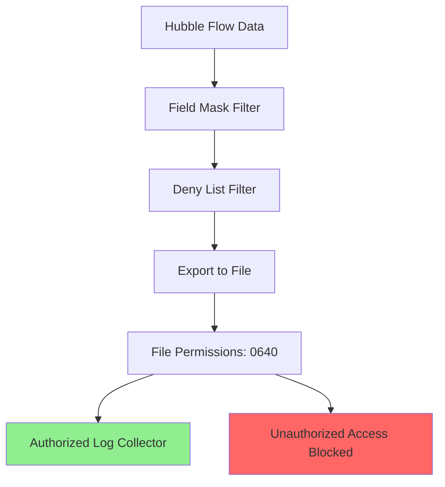

# How to Secure Cilium Hubble Exporter Configuration

Author: [nawazdhandala](https://github.com/nawazdhandala)

Tags: Cilium, Hubble, Exporter, Security, Data Protection

Description: Learn how to secure the Cilium Hubble exporter by protecting exported flow data, restricting file access, applying field masks to redact sensitive information, and encrypting data at rest.

---

## Introduction

The Hubble exporter writes network flow data to files on each Cilium agent node. This data contains detailed information about pod-to-pod communication patterns, DNS queries, HTTP paths, and port usage. If this data is accessed by unauthorized parties, it could reveal application architecture, internal service dependencies, and potentially sensitive request parameters.

Securing the exporter involves multiple layers: controlling who can access the exported files, filtering out sensitive fields before they are written, ensuring the export directory has proper permissions, and integrating with encrypted storage where possible.

This guide provides practical steps to harden the Hubble exporter configuration and protect the flow data it produces.

## Prerequisites

- Kubernetes cluster with Cilium 1.15+ and Hubble exporter enabled
- kubectl and Helm 3 access
- Understanding of Linux file permissions
- Familiarity with Hubble field masks and filters

## Applying Field Masks to Redact Sensitive Data

Field masks control which flow fields are included in the export. Use them to exclude sensitive information:

```yaml
# cilium-secure-export.yaml
hubble:
  enabled: true
  export:
    static:
      enabled: true
      filePath: /var/run/cilium/hubble/events.log
      fileMaxSizeMb: 10
      fileMaxBackups: 3
      # Only export the fields you need - exclude IPs and L7 details
      fieldMask:
        - time
        - source.namespace
        - source.pod_name
        - source.labels
        - destination.namespace
        - destination.pod_name
        - destination.labels
        - destination.port
        - verdict
        - drop_reason
        - l4.TCP.flags
        - Type
        # Deliberately excluding:
        # - source.IP (pod IPs can reveal network topology)
        # - l7 (HTTP paths, DNS queries may contain sensitive data)
        # - ethernet (MAC addresses)
```

```bash
helm upgrade cilium cilium/cilium -n kube-system \
  --reuse-values \
  --values cilium-secure-export.yaml
```

Verify the field mask is applied:

```bash
kubectl -n kube-system exec ds/cilium -- tail -1 /var/run/cilium/hubble/events.log | python3 -c "
import json, sys
flow = json.load(sys.stdin)
fields = list(flow.get('flow', {}).keys())
print(f'Exported fields: {fields}')
# Should NOT contain 'IP', 'l7', or 'ethernet'
src = flow.get('flow',{}).get('source',{})
if 'IP' in str(src):
    print('WARNING: IP addresses are being exported')
else:
    print('OK: IP addresses are masked')
"
```

## Restricting File System Access

The export directory must be accessible only to the Cilium agent and authorized log collectors:

```yaml
# SecurityContext for the Cilium agent (already set by Helm, verify it)
# The export file inherits the Cilium agent's process permissions
```

```bash
# Check current file permissions on the export directory
kubectl -n kube-system exec ds/cilium -- ls -la /var/run/cilium/hubble/

# Verify the file is only readable by the Cilium agent user
kubectl -n kube-system exec ds/cilium -- stat -c '%U:%G %a' /var/run/cilium/hubble/events.log

# On the node, verify host path permissions
# (Run this on a node where Cilium is running)
# ls -la /var/run/cilium/hubble/
```



If your log collector runs as a different user, use a shared group:

```yaml
# fluent-bit-daemonset-security.yaml
apiVersion: apps/v1
kind: DaemonSet
metadata:
  name: fluent-bit-hubble
  namespace: kube-system
spec:
  template:
    spec:
      containers:
        - name: fluent-bit
          securityContext:
            runAsUser: 0   # Required to read Cilium export files
            readOnlyRootFilesystem: true
          volumeMounts:
            - name: hubble-export
              mountPath: /var/run/cilium/hubble
              readOnly: true  # Read-only access prevents tampering
      volumes:
        - name: hubble-export
          hostPath:
            path: /var/run/cilium/hubble
            type: DirectoryOrCreate
```

## Filtering Sensitive Namespaces and Workloads

Exclude flows from sensitive namespaces to prevent exposure of security infrastructure:

```yaml
# cilium-export-denylist.yaml
hubble:
  export:
    static:
      enabled: true
      filePath: /var/run/cilium/hubble/events.log
      denyList:
        # Exclude secrets-management namespace
        - '{"source_pod":["vault/","cert-manager/"]}'
        - '{"destination_pod":["vault/","cert-manager/"]}'
        # Exclude authentication services
        - '{"source_pod":["auth-system/"]}'
        - '{"destination_pod":["auth-system/"]}'
```

```bash
helm upgrade cilium cilium/cilium -n kube-system \
  --reuse-values \
  --values cilium-export-denylist.yaml
```

## Enabling Data Redaction for L7 Flows

If you must export L7 data, enable Hubble's built-in redaction:

```bash
helm upgrade cilium cilium/cilium -n kube-system \
  --reuse-values \
  --set hubble.redact.enabled=true \
  --set hubble.redact.httpURLQuery=true \
  --set hubble.redact.httpUserInfo=true \
  --set hubble.redact.kafkaApiKey=true
```

Verify redaction is working:

```bash
# Generate some HTTP traffic
kubectl run curl-test --image=curlimages/curl --rm -it --restart=Never -- \
  curl -s "http://httpbin.default/get?secret=mysecretvalue&token=abc123"

# Check the exported flow for redacted fields
kubectl -n kube-system exec ds/cilium -- tail -20 /var/run/cilium/hubble/events.log | python3 -c "
import json, sys
for line in sys.stdin:
    f = json.loads(line)
    l7 = f.get('flow',{}).get('l7',{}).get('http',{})
    if l7:
        url = l7.get('url','')
        print(f'URL: {url}')
        if 'secret' in url.lower() or 'token' in url.lower():
            print('WARNING: Sensitive query params not redacted!')
        else:
            print('OK: Query params redacted or not present')
"
```

## Verification

Confirm all security measures are in place:

```bash
# 1. Field mask is applied (no IPs in export)
kubectl -n kube-system exec ds/cilium -- tail -5 /var/run/cilium/hubble/events.log | python3 -c "
import json, sys
for line in sys.stdin:
    f = json.loads(line)
    flow = f.get('flow',{})
    has_ip = 'IP' in str(flow.get('source',{})) or 'IP' in str(flow.get('destination',{}))
    print(f'Has IP: {has_ip}')
"

# 2. Deny list is working (no flows from excluded namespaces)
kubectl -n kube-system exec ds/cilium -- cat /var/run/cilium/hubble/events.log | python3 -c "
import json, sys
sensitive = set()
for line in sys.stdin:
    f = json.loads(line)
    flow = f.get('flow',{})
    for direction in ['source','destination']:
        ns = flow.get(direction,{}).get('namespace','')
        if ns in ['vault','cert-manager','auth-system']:
            sensitive.add(ns)
if sensitive:
    print(f'WARNING: Flows from sensitive namespaces found: {sensitive}')
else:
    print('OK: No flows from excluded namespaces')
"

# 3. File permissions are restrictive
kubectl -n kube-system exec ds/cilium -- ls -la /var/run/cilium/hubble/events.log

# 4. Redaction is active
helm get values cilium -n kube-system | grep -A5 redact
```

## Troubleshooting

- **Field mask too restrictive**: If you masked too many fields and your log pipeline cannot parse the output, incrementally add fields back to the mask list.

- **Deny list not filtering**: Verify the JSON filter syntax. The format must be valid JSON with array values. Test by checking the actual namespace names in your cluster.

- **Redaction not applied to some flows**: Redaction only applies to L7 flows. L3/L4 flows do not have HTTP or DNS fields to redact.

- **Log collector cannot read export file**: Check that the volume mount is correct and that the collector has the appropriate securityContext to read files owned by the Cilium agent.

## Conclusion

Securing the Hubble exporter is about controlling what data is written and who can read it. Field masks remove unnecessary fields, deny lists exclude sensitive namespaces, redaction strips query parameters and credentials from L7 data, and file permissions prevent unauthorized access. Apply these measures as part of your defense-in-depth strategy to ensure that network observability does not become a data leakage vector.
