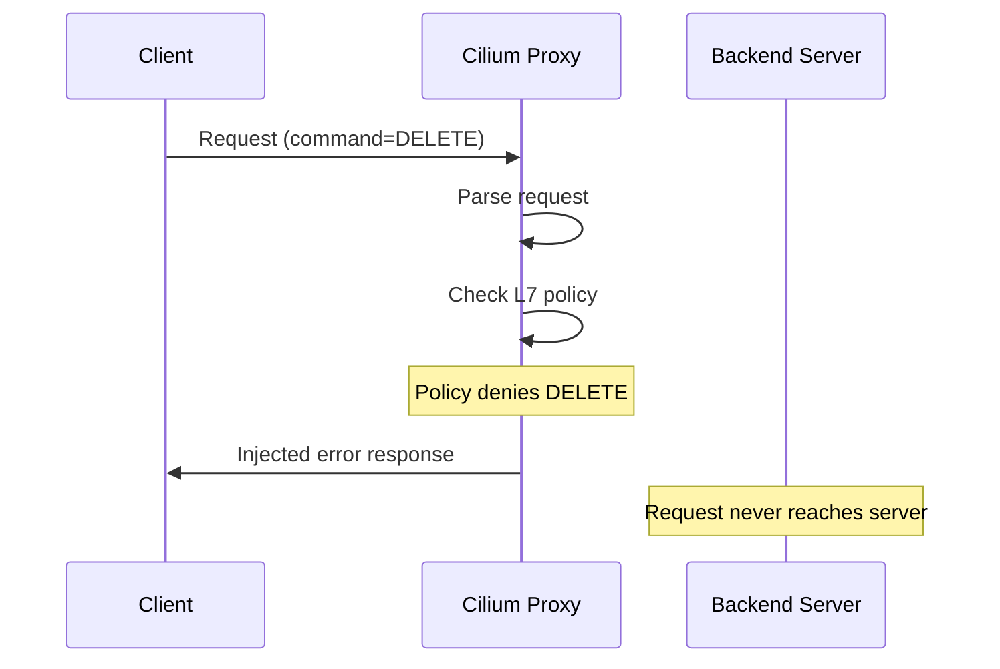

# Securing Error Response Injection in Cilium Network Security

Author: [nawazdhandala](https://github.com/nawazdhandala)

Tags: Cilium, Network Security, Error Injection, L7 Proxy, Policy Enforcement

Description: Learn how to securely implement error response injection in Cilium L7 parsers to send protocol-appropriate denial messages when policy blocks a request, without introducing information leakage or denial-of-service risks.

---

## Introduction

When a Cilium L7 policy denies a request, the parser should not simply drop the connection silently. Instead, it should inject a protocol-appropriate error response that informs the client why the request was rejected. This is similar to how Cilium's HTTP proxy returns a 403 Forbidden response when an HTTP request violates policy.

Error response injection must be implemented carefully to avoid two classes of problems: information leakage (revealing internal policy details to potentially malicious clients) and denial of service (where crafting error responses consumes excessive resources or allows amplification attacks).

This guide covers secure patterns for implementing error response injection in Cilium's proxylib framework.

## Prerequisites

- A working Cilium L7 parser with policy matching
- Understanding of your protocol's error response format
- Familiarity with proxylib's InjectResponse API
- Go 1.21 or later
- Test infrastructure for verifying injected responses

## Understanding the Injection API

The proxylib framework provides mechanisms to inject response data back to the client:

```go
// When OnData returns DROP, the proxy can inject an error response
// The injection happens through the connection's Inject method

func (p *Parser) OnData(reply bool, reader *proxylib.Reader) (proxylib.OpType, int) {
    // ... parse request ...

    if !p.matchesPolicy(command) {
        // Inject a protocol-formatted error response
        errorResp := p.buildErrorResponse(command, requestID, "access denied")
        p.connection.Inject(true, errorResp) // true = inject as reply

        return proxylib.DROP, 0
    }

    return proxylib.PASS, totalLen
}
```



## Building Safe Error Responses

Error responses must follow the protocol format exactly:

```go
const (
    // Error codes — use protocol-standard values
    errAccessDenied   = 0x01
    errInvalidCommand = 0x02

    // Maximum error message length to prevent amplification
    maxErrorMessageLen = 256
)

// buildErrorResponse creates a protocol-formatted error response
func (p *Parser) buildErrorResponse(command byte, requestID uint32, message string) []byte {
    // Truncate message to prevent amplification
    if len(message) > maxErrorMessageLen {
        message = message[:maxErrorMessageLen]
    }

    // Calculate body length: 1 (error flag) + 1 (error code) + 4 (request ID) + 2 (msg len) + msg
    bodyLen := 1 + 1 + 4 + 2 + len(message)

    response := make([]byte, 4+bodyLen)

    // Length header (big-endian)
    response[0] = byte(bodyLen >> 24)
    response[1] = byte(bodyLen >> 16)
    response[2] = byte(bodyLen >> 8)
    response[3] = byte(bodyLen)

    // Error flag
    response[4] = 0xFF

    // Error code
    response[5] = errAccessDenied

    // Request ID (echo back for client correlation)
    response[6] = byte(requestID >> 24)
    response[7] = byte(requestID >> 16)
    response[8] = byte(requestID >> 8)
    response[9] = byte(requestID)

    // Error message length
    response[10] = byte(len(message) >> 8)
    response[11] = byte(len(message))

    // Error message
    copy(response[12:], message)

    return response
}
```

## Preventing Information Leakage

Error responses should not reveal internal policy details:

```go
// BAD: Leaks policy information
func (p *Parser) buildErrorMessage(command byte) string {
    // This reveals policy rules to the client
    return fmt.Sprintf("Policy rule 'deny-delete-on-prod' blocked command %d "+
        "from identity %d to identity %d",
        command, p.connection.SrcIdentity, p.connection.DstIdentity)
}

// GOOD: Generic error message
func (p *Parser) buildErrorMessage(command byte) string {
    // Generic message that does not reveal policy internals
    return "request denied by policy"
}

// Log the detailed information server-side instead
func (p *Parser) logPolicyDenial(command byte, requestID uint32) {
    log.WithFields(log.Fields{
        "command":     command,
        "requestID":   requestID,
        "srcIdentity": p.connection.SrcIdentity,
        "dstIdentity": p.connection.DstIdentity,
    }).Info("L7 policy denied request")
}
```

## Preventing Amplification Attacks

Ensure error responses are not larger than the requests that trigger them:

```go
// amplificationCheck verifies the error response is not disproportionately
// large compared to the request that triggered it
func (p *Parser) amplificationCheck(requestLen int, responseLen int) bool {
    // Error response should not exceed 2x the request size or 512 bytes,
    // whichever is larger
    maxResponseLen := requestLen * 2
    if maxResponseLen < 512 {
        maxResponseLen = 512
    }
    return responseLen <= maxResponseLen
}

func (p *Parser) injectError(command byte, requestID uint32, requestLen int) {
    errorResp := p.buildErrorResponse(command, requestID, "request denied by policy")

    if !p.amplificationCheck(requestLen, len(errorResp)) {
        // Response too large relative to request — just drop without injection
        log.Warn("Error response exceeds amplification limit, dropping silently")
        return
    }

    p.connection.Inject(true, errorResp)
    p.logPolicyDenial(command, requestID)
}
```

## Rate Limiting Error Injections

Prevent clients from flooding the proxy with denied requests to consume injection resources:

```go
const (
    maxErrorsPerSecond  = 100
    errorBurstAllowance = 10
)

type rateLimiter struct {
    tokens    int
    maxTokens int
    lastRefill time.Time
    refillRate int // tokens per second
}

func newRateLimiter(rate int, burst int) *rateLimiter {
    return &rateLimiter{
        tokens:     burst,
        maxTokens:  burst,
        lastRefill: time.Now(),
        refillRate: rate,
    }
}

func (rl *rateLimiter) allow() bool {
    now := time.Now()
    elapsed := now.Sub(rl.lastRefill)
    rl.lastRefill = now

    // Refill tokens
    newTokens := int(elapsed.Seconds() * float64(rl.refillRate))
    rl.tokens += newTokens
    if rl.tokens > rl.maxTokens {
        rl.tokens = rl.maxTokens
    }

    // Check availability
    if rl.tokens > 0 {
        rl.tokens--
        return true
    }
    return false
}
```

## Verification

Test error injection thoroughly:

```bash
# Run injection-specific tests
go test ./proxylib/myprotocol/... -v -run TestErrorInjection

# Verify error response format compliance
go test ./proxylib/myprotocol/... -v -run TestBuildErrorResponse

# Test rate limiting
go test ./proxylib/myprotocol/... -v -run TestRateLimiter

# Run with race detector
go test ./proxylib/myprotocol/... -race -count=1
```

Test in a live cluster:

```bash
# Apply policy that denies specific commands
kubectl apply -f deny-policy.yaml

# Send denied requests and verify error responses
kubectl exec test-client -- protocol-client send --command DELETE --target protocol-server:9000

# Check Cilium logs for denial entries
kubectl logs -n kube-system ds/cilium -c cilium-agent | grep "denied"
```

## Troubleshooting

**Problem: Client receives malformed error response**
Verify the error response format byte-by-byte against the protocol specification. Use a packet capture to examine the exact bytes sent.

**Problem: Error injection causes connection reset**
Some protocols do not support unsolicited server messages. Verify that your protocol allows the server to send an error response to an incomplete or denied request.

**Problem: Rate limiter blocks legitimate error responses**
Tune the rate limit parameters based on expected traffic patterns. Monitor the `tokens` counter to ensure it does not consistently reach zero during normal operation.

**Problem: Error responses reveal too much information**
Audit all strings in error responses. Replace any dynamic content that could reveal policy names, identity numbers, or internal network topology with generic messages.

## Conclusion

Secure error response injection in Cilium L7 parsers requires attention to protocol format compliance, information leakage prevention, amplification control, and rate limiting. By building error responses with bounded sizes, generic messages, and rate controls, you provide useful feedback to clients while maintaining security. Always log detailed denial information server-side for audit purposes rather than including it in client-facing error messages.
