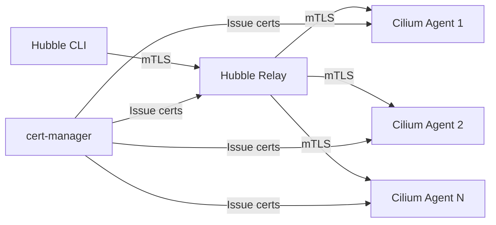

# How to Secure Kubernetes in Cilium Observability

Author: [nawazdhandala](https://github.com/nawazdhandala)

Tags: Cilium, Kubernetes, Security, Observability, RBAC

Description: Learn how to secure the Kubernetes integration layer of Cilium observability, including restricting Hubble access, protecting flow data, and applying network policies to observability components.

---

## Introduction

Cilium observability exposes detailed information about your cluster's network activity. Hubble flow data reveals which pods communicate with which services, what DNS queries are made, and what HTTP endpoints are called. This data is incredibly useful for debugging but also sensitive from a security perspective.

Securing Cilium observability in Kubernetes means controlling who can access flow data, protecting the communication channels between Hubble components, and ensuring that the observability stack itself does not become an attack vector.

This guide covers practical security measures for Cilium's Kubernetes observability features, from RBAC restrictions to TLS configuration and network policy hardening.

## Prerequisites

- Kubernetes cluster with Cilium and Hubble enabled
- kubectl with cluster-admin access
- Helm 3 for managing Cilium configuration
- cert-manager installed (optional, for automated TLS)
- Understanding of Kubernetes RBAC and NetworkPolicy concepts

## Restricting Access to Hubble Flow Data

Hubble flow data can reveal application behavior and internal architecture. Restrict who can access it:

```bash
# Check current access to Hubble relay
kubectl auth can-i create pods/portforward -n kube-system \
  --as=system:serviceaccount:default:default

# Audit who has access to port-forward (needed for Hubble CLI)
kubectl get clusterrolebindings -o json | python3 -c "
import json, sys
data = json.load(sys.stdin)
for binding in data['items']:
    role = binding.get('roleRef', {}).get('name', '')
    subjects = binding.get('subjects', [])
    for s in subjects:
        print(f'{s.get(\"kind\")}/{s.get(\"name\")} -> {role}')
" | head -20
```

Create a dedicated role for Hubble access:

```yaml
# hubble-access-role.yaml
apiVersion: rbac.authorization.k8s.io/v1
kind: ClusterRole
metadata:
  name: hubble-viewer
rules:
  - apiGroups: [""]
    resources: ["pods/portforward"]
    verbs: ["create"]
  - apiGroups: [""]
    resources: ["pods"]
    verbs: ["get", "list"]
---
apiVersion: rbac.authorization.k8s.io/v1
kind: RoleBinding
metadata:
  name: hubble-viewer-binding
  namespace: kube-system
subjects:
  - kind: Group
    name: network-observers
    apiGroup: rbac.authorization.k8s.io
roleRef:
  kind: ClusterRole
  name: hubble-viewer
  apiGroup: rbac.authorization.k8s.io
```

```bash
kubectl apply -f hubble-access-role.yaml
```

## Enabling TLS for Hubble Communication

Hubble relay communicates with Cilium agents over gRPC. Enable TLS to encrypt this channel:

```yaml
# cilium-tls-values.yaml
hubble:
  enabled: true
  tls:
    enabled: true
    auto:
      enabled: true
      method: cronJob  # Options: cronJob, certmanager, helm
      certValidityDuration: 1095  # 3 years in days
      schedule: "0 0 1 */4 *"    # Rotate every 4 months
  relay:
    enabled: true
    tls:
      server:
        enabled: true
```

```bash
helm upgrade cilium cilium/cilium -n kube-system \
  --reuse-values \
  --values cilium-tls-values.yaml

# Verify TLS is enabled
kubectl -n kube-system exec ds/cilium -- cilium status | grep -i tls
```

If using cert-manager for TLS automation:

```yaml
# cilium-certmanager-values.yaml
hubble:
  tls:
    enabled: true
    auto:
      enabled: true
      method: certmanager
      certManagerIssuerRef:
        group: cert-manager.io
        kind: ClusterIssuer
        name: ca-issuer
```



## Applying Network Policies to Observability Components

Protect Hubble components with CiliumNetworkPolicies:

```yaml
# hubble-relay-policy.yaml
apiVersion: cilium.io/v2
kind: CiliumNetworkPolicy
metadata:
  name: hubble-relay-policy
  namespace: kube-system
spec:
  endpointSelector:
    matchLabels:
      k8s-app: hubble-relay
  ingress:
    # Allow Hubble UI to connect
    - fromEndpoints:
        - matchLabels:
            k8s-app: hubble-ui
      toPorts:
        - ports:
            - port: "4245"
              protocol: TCP
    # Allow Prometheus to scrape
    - fromEndpoints:
        - matchLabels:
            app.kubernetes.io/name: prometheus
            io.kubernetes.pod.namespace: monitoring
      toPorts:
        - ports:
            - port: "9966"
              protocol: TCP
  egress:
    # Allow relay to connect to Cilium agents
    - toEndpoints:
        - matchLabels:
            k8s-app: cilium
      toPorts:
        - ports:
            - port: "4244"
              protocol: TCP
---
# hubble-ui-policy.yaml
apiVersion: cilium.io/v2
kind: CiliumNetworkPolicy
metadata:
  name: hubble-ui-policy
  namespace: kube-system
spec:
  endpointSelector:
    matchLabels:
      k8s-app: hubble-ui
  ingress:
    # Only allow ingress controller
    - fromEndpoints:
        - matchLabels:
            app.kubernetes.io/name: ingress-nginx
            io.kubernetes.pod.namespace: ingress-nginx
      toPorts:
        - ports:
            - port: "8081"
              protocol: TCP
  egress:
    # Allow UI to connect to relay
    - toEndpoints:
        - matchLabels:
            k8s-app: hubble-relay
      toPorts:
        - ports:
            - port: "4245"
              protocol: TCP
```

```bash
kubectl apply -f hubble-relay-policy.yaml
```

## Filtering Sensitive Data from Hubble Flows

Hubble can capture sensitive information in L7 flow data. Use redaction and filtering:

```yaml
# cilium-redact-values.yaml
hubble:
  enabled: true
  redact:
    enabled: true
    httpURLQuery: true   # Redact URL query parameters
    httpUserInfo: true   # Redact user info from URLs
    kafkaApiKey: true    # Redact Kafka API keys
```

```bash
helm upgrade cilium cilium/cilium -n kube-system \
  --reuse-values \
  --set hubble.redact.enabled=true \
  --set hubble.redact.httpURLQuery=true \
  --set hubble.redact.httpUserInfo=true \
  --set hubble.redact.kafkaApiKey=true
```

## Verification

Confirm security measures are effective:

```bash
# 1. Verify TLS is active on Hubble relay
kubectl -n kube-system exec deploy/hubble-relay -- \
  ls /var/lib/hubble-relay/tls/

# 2. Verify network policies are applied
kubectl get cnp -n kube-system | grep hubble

# 3. Test that unauthorized access is blocked
kubectl run test-unauthorized --image=curlimages/curl --rm -it --restart=Never -- \
  curl -s --connect-timeout 5 http://hubble-relay.kube-system:4245 2>&1
# Should fail/timeout

# 4. Verify redaction is working
hubble observe --protocol http --last 10 -o json 2>/dev/null | python3 -c "
import json, sys
for line in sys.stdin:
    f = json.loads(line).get('flow',{})
    l7 = f.get('l7',{}).get('http',{})
    if l7:
        url = l7.get('url','')
        if '?' in url:
            print(f'WARNING: URL query not redacted: {url}')
        else:
            print(f'URL properly handled: {url}')
"

# 5. Verify RBAC restrictions
kubectl auth can-i create pods/portforward -n kube-system \
  --as=system:serviceaccount:default:default
```

## Troubleshooting

- **Hubble CLI fails after enabling TLS**: You need to pass TLS certificates to the Hubble CLI or use `--tls-allow-server-name` flag. With `cilium hubble port-forward`, TLS is handled automatically.

- **Network policy blocks legitimate Hubble traffic**: Check the label selectors carefully. Use `kubectl get pods -n kube-system --show-labels` to verify the actual labels on Hubble components.

- **Redaction not working for HTTP flows**: Redaction requires Cilium 1.15+. Verify your version with `cilium version`. Also ensure L7 visibility is enabled for the relevant endpoints.

- **cert-manager not issuing certificates**: Check the ClusterIssuer status with `kubectl get clusterissuer ca-issuer -o yaml` and cert-manager logs with `kubectl logs -n cert-manager deploy/cert-manager`.

## Conclusion

Securing Cilium observability in Kubernetes is essential for protecting sensitive network data. By combining RBAC restrictions, TLS encryption, network policies, and data redaction, you create a defense-in-depth strategy that allows authorized operators to use Hubble effectively while preventing unauthorized access to flow data. Review these security measures regularly as your cluster evolves and new users or services are added.
