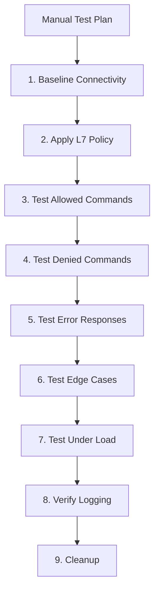

# Securing Manual Testing for Cilium Network Security

Author: [nawazdhandala](https://github.com/nawazdhandala)

Tags: Cilium, Network Security, Manual Testing, L7 Proxy, Security Testing

Description: A guide to conducting secure manual testing of Cilium L7 parsers in controlled environments, with test isolation, traffic generation, policy verification, and safe handling of test credentials.

---

## Introduction

Manual testing of Cilium L7 parsers validates behavior that automated tests cannot easily capture: real client interactions, complex multi-step protocols, edge cases in network conditions, and the end-to-end user experience when policy blocks a request. Manual testing also serves as the final validation step before a parser enters production.

Security during manual testing is itself a concern. Test environments must be isolated from production, test credentials must be managed carefully, and test traffic must not leak into production monitoring systems. A poorly secured test environment can expose internal network details or create pathways for lateral movement.

This guide covers setting up secure manual testing environments and executing structured test plans for Cilium L7 parsers.

## Prerequisites

- A dedicated test Kubernetes cluster (not production)
- Cilium installed with L7 policy support
- Protocol-specific client and server test applications
- `kubectl` and `cilium` CLI access
- Network isolation between test and production environments

## Setting Up an Isolated Test Environment

Create a dedicated namespace with strict isolation:

```bash
# Create isolated test namespace
kubectl create namespace cilium-parser-test

# Label the namespace for network policy targeting
kubectl label namespace cilium-parser-test purpose=testing environment=isolated

# Apply namespace-level isolation policy
kubectl apply -f - <<EOF
apiVersion: cilium.io/v2
kind: CiliumNetworkPolicy
metadata:
  name: test-namespace-isolation
  namespace: cilium-parser-test
spec:
  endpointSelector: {}
  egress:
    - toEndpoints:
        - matchLabels:
            "k8s:io.kubernetes.pod.namespace": cilium-parser-test
    - toEntities:
        - kube-apiserver
      toPorts:
        - ports:
            - port: "6443"
              protocol: TCP
    - toCIDR:
        - 0.0.0.0/0
      toPorts:
        - ports:
            - port: "53"
              protocol: UDP
EOF
```

Deploy test server and client:

```yaml
# test-server.yaml
apiVersion: apps/v1
kind: Deployment
metadata:
  name: test-server
  namespace: cilium-parser-test
spec:
  replicas: 1
  selector:
    matchLabels:
      app: test-server
  template:
    metadata:
      labels:
        app: test-server
        role: server
    spec:
      containers:
        - name: server
          image: myprotocol-server:test
          ports:
            - containerPort: 9000
          env:
            - name: LOG_LEVEL
              value: "debug"
---
apiVersion: v1
kind: Service
metadata:
  name: test-server
  namespace: cilium-parser-test
spec:
  selector:
    app: test-server
  ports:
    - port: 9000
      targetPort: 9000
```

## Executing Manual Test Plans

Follow a structured test plan that covers all parser functionality:

```bash
# Test 1: Basic connectivity without L7 policy
echo "=== Test 1: Baseline connectivity ==="
kubectl exec -n cilium-parser-test deploy/test-client -- \
    protocol-client ping --target test-server:9000

# Test 2: Apply L7 policy
echo "=== Test 2: Apply L7 policy ==="
kubectl apply -f - <<EOF
apiVersion: cilium.io/v2
kind: CiliumNetworkPolicy
metadata:
  name: l7-test-policy
  namespace: cilium-parser-test
spec:
  endpointSelector:
    matchLabels:
      app: test-server
  ingress:
    - fromEndpoints:
        - matchLabels:
            role: client
      toPorts:
        - ports:
            - port: "9000"
              protocol: TCP
          rules:
            l7proto: myprotocol
            l7:
              - command: "GET"
              - command: "SET"
EOF

# Test 3: Allowed command
echo "=== Test 3: Allowed command (GET) ==="
kubectl exec -n cilium-parser-test deploy/test-client -- \
    protocol-client send --command GET --key testkey --target test-server:9000

# Test 4: Denied command
echo "=== Test 4: Denied command (DELETE) ==="
kubectl exec -n cilium-parser-test deploy/test-client -- \
    protocol-client send --command DELETE --key testkey --target test-server:9000
# Expected: error response from proxy

# Test 5: Monitor through Hubble
echo "=== Test 5: Observe L7 flows ==="
hubble observe --namespace cilium-parser-test --type l7 --last 20
```



## Testing Edge Cases Manually

Test scenarios that are hard to automate:

```bash
# Test large messages
kubectl exec -n cilium-parser-test deploy/test-client -- \
    protocol-client send --command SET --key largekey \
    --value-size 1048576 --target test-server:9000

# Test rapid connection cycling
for i in $(seq 1 100); do
    kubectl exec -n cilium-parser-test deploy/test-client -- \
        protocol-client send --command GET --key "key$i" --target test-server:9000 &
done
wait

# Test connection persistence (multiple messages on one connection)
kubectl exec -n cilium-parser-test deploy/test-client -- \
    protocol-client session --target test-server:9000 \
    --commands "GET:key1,SET:key2:value2,GET:key2,DELETE:key1"

# Test with slow client (simulates network latency)
kubectl exec -n cilium-parser-test deploy/test-client -- \
    protocol-client send --command GET --key testkey \
    --target test-server:9000 --send-delay 100ms
```

## Secure Cleanup

Remove all test resources after testing:

```bash
# Delete test policies
kubectl delete ciliumnetworkpolicy -n cilium-parser-test --all

# Delete test deployments
kubectl delete all -n cilium-parser-test --all

# Delete the test namespace
kubectl delete namespace cilium-parser-test

# Verify cleanup
kubectl get all -n cilium-parser-test
```

## Verification

Document test results:

```bash
# Generate test summary
echo "=== Manual Test Results ==="
echo "Date: $(date -u)"
echo "Cilium version: $(kubectl exec -n kube-system ds/cilium -- cilium version)"
echo ""
echo "Test 1 - Baseline: PASS/FAIL"
echo "Test 2 - Policy apply: PASS/FAIL"
echo "Test 3 - Allowed command: PASS/FAIL"
echo "Test 4 - Denied command: PASS/FAIL"
echo "Test 5 - Hubble flows: PASS/FAIL"
```

## Troubleshooting

**Problem: Test client cannot connect to test server**
Check that both pods are running and the service is correctly configured. Verify the network policy allows intra-namespace traffic.

**Problem: L7 policy does not take effect**
Check that Cilium has processed the policy: `kubectl exec -n kube-system ds/cilium -- cilium policy get`. Verify endpoint labels match the policy selectors.

**Problem: Cannot observe L7 flows in Hubble**
Ensure Hubble is enabled and the Hubble relay is running. Check that the L7 proxy redirect is active: `kubectl exec -n kube-system ds/cilium -- cilium bpf proxy list`.

**Problem: Test environment leaks to production**
Verify namespace isolation policy is applied. Check that the test namespace does not have access to production services by attempting connections.

## Conclusion

Secure manual testing of Cilium L7 parsers requires an isolated test environment, a structured test plan covering all parser functionality, careful edge case exploration, and thorough cleanup afterward. Manual testing complements automated testing by validating end-to-end behavior, real client compatibility, and the user experience of policy enforcement. Document all test results for audit trails and regression tracking.
