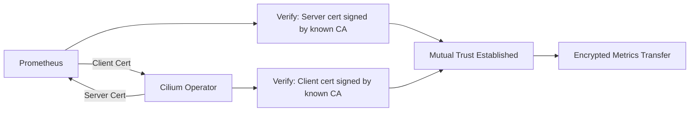

# Securing Operator Prometheus TLS Configuration in Cilium Observability

Author: [nawazdhandala](https://github.com/nawazdhandala)

Tags: Cilium, Observability, Prometheus, TLS, Security, mTLS

Description: Harden the TLS configuration for Cilium Operator Prometheus metrics with mutual TLS, certificate rotation, cipher suite restrictions, and access controls to protect sensitive cluster metrics.

---

## Introduction

Basic TLS encryption for Prometheus metrics is a starting point, but production security requires additional hardening: mutual TLS (mTLS) to authenticate Prometheus scrapers, restricted cipher suites to prevent downgrade attacks, automated certificate rotation to limit exposure from compromised keys, and network-level access controls as defense in depth.

This guide covers advanced TLS security measures for the Cilium Operator's Prometheus metrics endpoint, ensuring metrics data is protected to the standard required by security-conscious environments.

## Prerequisites

- Cilium with basic Operator TLS metrics configured
- cert-manager installed and operational
- Understanding of TLS mutual authentication
- Network policy enforcement enabled in Cilium
- Compliance requirements documentation

## Implementing Mutual TLS (mTLS)

Require Prometheus to authenticate itself with a client certificate:

```yaml
# prometheus-client-cert.yaml
apiVersion: cert-manager.io/v1
kind: Certificate
metadata:
  name: prometheus-client-cert
  namespace: monitoring
spec:
  secretName: prometheus-client-tls
  duration: 8760h
  renewBefore: 720h
  issuerRef:
    name: cluster-issuer
    kind: ClusterIssuer
  commonName: prometheus
  usages:
    - client auth
```

```bash
# Apply the client certificate
kubectl apply -f prometheus-client-cert.yaml

# Verify certificate was issued
kubectl get certificate -n monitoring prometheus-client-cert
```

Update the ServiceMonitor for mTLS:

```yaml
# operator-servicemonitor-mtls.yaml
apiVersion: monitoring.coreos.com/v1
kind: ServiceMonitor
metadata:
  name: cilium-operator-mtls
  namespace: kube-system
spec:
  selector:
    matchLabels:
      name: cilium-operator
  endpoints:
    - port: operator-prometheus
      scheme: https
      tlsConfig:
        ca:
          secret:
            name: cilium-operator-metrics-tls
            key: ca.crt
        cert:
          secret:
            name: prometheus-client-tls
            key: tls.crt
        keySecret:
          name: prometheus-client-tls
          key: tls.key
        serverName: cilium-operator.kube-system.svc
        insecureSkipVerify: false
```



## Configuring Certificate Rotation

Set up automated rotation with short-lived certificates:

```yaml
# short-lived-operator-cert.yaml
apiVersion: cert-manager.io/v1
kind: Certificate
metadata:
  name: cilium-operator-metrics-tls
  namespace: kube-system
spec:
  secretName: cilium-operator-metrics-tls
  duration: 720h    # 30 days
  renewBefore: 168h  # 7 days before expiry
  issuerRef:
    name: cluster-issuer
    kind: ClusterIssuer
  dnsNames:
    - cilium-operator.kube-system.svc
    - cilium-operator.kube-system.svc.cluster.local
  usages:
    - server auth
  privateKey:
    algorithm: ECDSA
    size: 256
```

Handle certificate rotation in the operator:

```bash
# Option 1: Use a sidecar that watches for certificate changes
# The sidecar signals the operator to reload TLS config

# Option 2: Restart the operator on certificate renewal
# cert-manager can trigger this with a deployment annotation
kubectl annotate deployment -n kube-system cilium-operator \
    "cert-manager.io/inject-ca-from=kube-system/cilium-operator-metrics-tls"
```

## Restricting Network Access

Layer network policies on top of TLS:

```yaml
# operator-metrics-network-policy.yaml
apiVersion: cilium.io/v2
kind: CiliumNetworkPolicy
metadata:
  name: operator-metrics-access
  namespace: kube-system
spec:
  endpointSelector:
    matchLabels:
      name: cilium-operator
  ingress:
    # Only allow Prometheus to access the metrics port
    - fromEndpoints:
        - matchLabels:
            app.kubernetes.io/name: prometheus
            app.kubernetes.io/instance: monitoring
      toPorts:
        - ports:
            - port: "9963"
              protocol: TCP
    # Allow cluster-internal communication on other ports
    - fromEndpoints:
        - matchLabels:
            k8s-app: cilium
      toPorts:
        - ports:
            - port: "443"
              protocol: TCP
```

```bash
# Apply network restriction
kubectl apply -f operator-metrics-network-policy.yaml

# Verify only Prometheus can reach the metrics port
# From a non-Prometheus pod — should be blocked
kubectl run test-access --image=curlimages/curl --rm -it --restart=Never -- \
    curl -s -m 5 https://cilium-operator.kube-system.svc:9963/metrics 2>&1
# Expected: Connection timeout or refused
```

## Monitoring TLS Security

Set up alerts for TLS-related issues:

```yaml
# tls-alerts.yaml
apiVersion: monitoring.coreos.com/v1
kind: PrometheusRule
metadata:
  name: cilium-tls-alerts
  namespace: monitoring
spec:
  groups:
    - name: cilium-tls
      rules:
        - alert: CiliumOperatorCertExpiringSoon
          expr: |
            (certmanager_certificate_expiration_timestamp_seconds{name="cilium-operator-metrics-tls"} - time()) < 86400 * 7
          for: 1h
          labels:
            severity: warning
          annotations:
            summary: "Cilium Operator metrics certificate expiring within 7 days"

        - alert: CiliumOperatorScrapeFailure
          expr: |
            up{job="cilium-operator"} == 0
          for: 5m
          labels:
            severity: critical
          annotations:
            summary: "Prometheus cannot scrape Cilium Operator metrics"
```

## Verification

Verify the complete security configuration:

```bash
# Verify mTLS is enforced
# Without client cert — should fail
kubectl run mtls-test --image=curlimages/curl --rm -it --restart=Never -- \
    curl -s --cacert /tmp/ca.crt https://cilium-operator.kube-system.svc:9963/metrics 2>&1
# Expected: TLS handshake failure (no client cert)

# With client cert — should succeed
# (test from within Prometheus pod)

# Verify certificate rotation
kubectl get certificate -n kube-system cilium-operator-metrics-tls -o yaml | grep -A5 "status:"

# Verify network policy blocks unauthorized access
kubectl exec test-pod -- curl -s -m 5 https://cilium-operator.kube-system.svc:9963/metrics 2>&1
# Expected: Timeout (blocked by network policy)

# Verify alerts are configured
curl -s http://localhost:9090/api/v1/rules | jq '.data.groups[] | select(.name == "cilium-tls")'
```

## Troubleshooting

**Problem: mTLS blocks legitimate Prometheus scraping**
Verify the client certificate is mounted in the Prometheus pod and referenced in the ServiceMonitor `tlsConfig`. Check that both certificates are signed by the same CA.

**Problem: Certificate rotation causes brief scrape failures**
This is expected during rotation. Reduce the impact by setting `renewBefore` to a longer period and configuring the operator to gracefully reload certificates.

**Problem: Network policy is too restrictive**
Check the Prometheus pod labels match the `fromEndpoints` selector. Use `kubectl get pods -n monitoring --show-labels` to verify.

**Problem: Alert fires but certificate appears valid**
The alert may use a different metric source than the actual certificate check. Verify the `certmanager_certificate_expiration_timestamp_seconds` metric is reporting correctly.

## Conclusion

Securing the Cilium Operator Prometheus TLS configuration requires defense in depth: mTLS for mutual authentication, short-lived certificates with automated rotation, network policies restricting access to authorized scrapers only, and monitoring alerts for certificate and connectivity issues. Each layer addresses a different threat vector, creating a robust security posture for metrics collection that meets enterprise compliance requirements.
