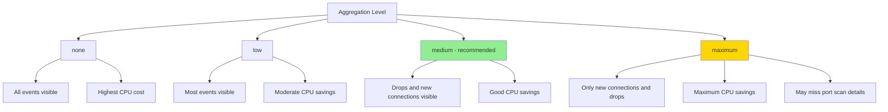

# How to Secure Performance Tuning in Cilium Hubble

Author: [nawazdhandala](https://github.com/nawazdhandala)

Tags: Cilium, Hubble, Performance, Security, Kubernetes

Description: Learn how to apply security-conscious performance tuning to Cilium Hubble, ensuring that optimization decisions do not create security blind spots or expose sensitive data.

---

## Introduction

Performance tuning and security often pull in opposite directions. Reducing monitor aggregation gives you more detailed flow data for security analysis, but increases CPU overhead. Adding IP-level labels to metrics helps with incident investigation, but creates data exposure risks. Aggressive buffering retains more history for forensics, but increases the attack surface if the buffer is compromised.

When tuning Hubble for performance, every optimization decision should be evaluated through a security lens. You need to ensure that performance shortcuts do not create blind spots in your security monitoring, and that the data you retain for performance reasons is properly protected.

This guide shows you how to tune Hubble performance while maintaining a strong security posture.

## Prerequisites

- Kubernetes cluster with Cilium and Hubble deployed
- Understanding of Hubble performance parameters
- Security requirements documented (compliance frameworks, threat model)
- Prometheus and alerting configured

## Balancing Aggregation with Security Visibility

Monitor aggregation reduces CPU usage but can hide security-relevant events:

```yaml
# Security-conscious aggregation settings
# Use 'medium' not 'maximum' to preserve drop visibility
monitorAggregation: medium
monitorAggregationInterval: 5s

# Ensure drop events are never aggregated away
monitorAggregationFlags: "all"
```

```bash
# Verify that drop events are still visible with current aggregation
hubble observe --verdict DROPPED --last 50

# Compare drop counts at different aggregation levels
kubectl -n kube-system exec ds/cilium -- \
  wget -qO- http://localhost:9962/metrics 2>/dev/null | \
  grep "cilium_drop_count_total"
```



Critical: never use `maximum` aggregation if you need to detect:
- Port scanning (individual connection attempts are aggregated)
- Data exfiltration patterns (TCP flag details lost)
- Lateral movement (short-lived connections may be missed)

## Securing Performance Metric Endpoints

Performance-tuned metrics still need protection:

```yaml
# Metric configuration with security considerations
hubble:
  metrics:
    enabled:
      # Keep drop metrics for security monitoring
      - drop

      # DNS for detecting data exfiltration and C2 channels
      - "dns:query;ignoreAAAA"

      # TCP for connection tracking
      - tcp

      # Flow for baseline metrics
      - flow

      # HTTP with namespace-level labels only (not IP-level)
      - "httpV2:labelsContext=source_namespace,source_workload,destination_namespace,destination_workload"

    serviceMonitor:
      enabled: true
      labels:
        release: prometheus
```

Protect the metrics endpoint from unauthorized access:

```yaml
# metrics-security-policy.yaml
apiVersion: cilium.io/v2
kind: CiliumNetworkPolicy
metadata:
  name: hubble-metrics-security
  namespace: kube-system
spec:
  endpointSelector:
    matchLabels:
      k8s-app: cilium
  ingress:
    - fromEndpoints:
        - matchLabels:
            app.kubernetes.io/name: prometheus
            io.kubernetes.pod.namespace: monitoring
      toPorts:
        - ports:
            - port: "9965"
              protocol: TCP
```

```bash
kubectl apply -f metrics-security-policy.yaml
```

## Configuring Secure Event Buffering

The event buffer should be sized for both performance and security forensics:

```yaml
# Security-conscious buffer sizing
hubble:
  # Keep enough history for incident investigation
  # 30 minutes of flows at medium aggregation ~= 16384 events
  eventBufferCapacity: "16384"

  # Enable export for long-term forensic retention
  export:
    static:
      enabled: true
      filePath: /var/run/cilium/hubble/events.log
      fileMaxSizeMb: 50      # Larger for security retention
      fileMaxBackups: 10     # More backups for forensics
      # Export security-relevant fields only
      fieldMask:
        - time
        - source.namespace
        - source.pod_name
        - source.labels
        - destination.namespace
        - destination.pod_name
        - destination.labels
        - destination.port
        - verdict
        - drop_reason
        - Type
      # Focus on security-relevant events
      allowList:
        - '{"verdict":["DROPPED"]}'
        - '{"verdict":["ERROR"]}'
```

```bash
helm upgrade cilium cilium/cilium -n kube-system \
  --reuse-values \
  --set hubble.eventBufferCapacity="16384" \
  --set hubble.export.static.enabled=true
```

## Resource Limits as a Security Boundary

Resource limits prevent a compromised or malfunctioning Hubble from consuming node resources:

```yaml
# Strict resource limits
hubble:
  relay:
    resources:
      requests:
        cpu: 100m
        memory: 128Mi
      limits:
        cpu: 500m
        memory: 512Mi  # Hard limit prevents memory-based DoS

resources:
  # Cilium agent limits (includes Hubble observer)
  requests:
    cpu: 200m
    memory: 256Mi
  limits:
    cpu: 2000m
    memory: 2Gi  # Prevents memory exhaustion on the node
```

```bash
# Verify resource limits are in place
kubectl -n kube-system get ds cilium -o jsonpath='{.spec.template.spec.containers[0].resources}' | python3 -m json.tool
kubectl -n kube-system get deploy hubble-relay -o jsonpath='{.spec.template.spec.containers[0].resources}' | python3 -m json.tool
```

## Verification

Confirm that security is maintained after performance tuning:

```bash
# 1. Drop events are still captured
hubble observe --verdict DROPPED --last 5
# Should return results if any drops occurred

# 2. DNS queries are visible (important for security monitoring)
hubble observe --type l7 --protocol dns --last 5

# 3. Metrics endpoint is restricted
kubectl run test --image=curlimages/curl --rm -it --restart=Never -- \
  curl -s --connect-timeout 3 http://cilium-agent.kube-system:9965/metrics 2>&1
# Should fail

# 4. Resource limits are enforced
kubectl -n kube-system describe ds cilium | grep -A5 "Limits"

# 5. Export is capturing security events
kubectl -n kube-system exec ds/cilium -- tail -5 /var/run/cilium/hubble/events.log 2>/dev/null | python3 -c "
import json, sys
for line in sys.stdin:
    f = json.loads(line)
    verdict = f.get('flow',{}).get('verdict','')
    print(f'Verdict: {verdict}')
"
```

## Troubleshooting

- **Drop events disappearing after aggregation change**: Never use `maximum` aggregation for security-critical clusters. Switch back to `medium`.

- **Resource limits causing OOM kills**: Check if the event buffer is too large for the memory limit. Reduce `eventBufferCapacity` or increase the memory limit.

- **Security export growing too fast**: Add more restrictive filters to the export allow list. Focus on dropped and error verdicts only.

- **Metrics cardinality too low for security investigation**: If you removed too many labels from metrics, add back namespace-level context. Avoid IP-level context unless absolutely necessary.

## Conclusion

Security-conscious performance tuning of Hubble requires deliberate choices about which data to retain and which to aggregate away. Keep monitor aggregation at `medium` to preserve drop visibility, protect metric endpoints with network policies, size the event buffer for forensic retention, and enforce resource limits as a defense boundary. Every performance optimization should be validated against your security monitoring requirements before being applied to production.
