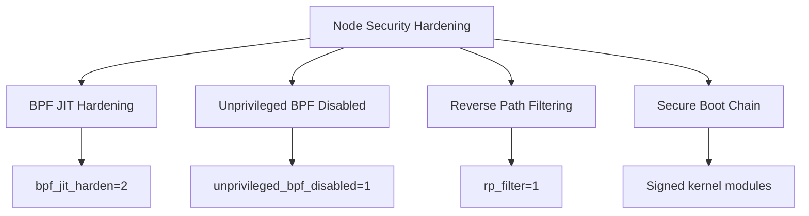

# How to Secure Pre-Requisites in Cilium Hubble

Author: [nawazdhandala](https://github.com/nawazdhandala)

Tags: Cilium, Hubble, Prerequisites, Security, Hardening

Description: Learn how to secure the prerequisite infrastructure for Cilium Hubble, including kernel hardening, RBAC setup, secure Helm practices, and node-level security configurations.

---

## Introduction

The security of your Cilium Hubble deployment starts with the prerequisites. A secure kernel configuration, properly restricted RBAC, and hardened node settings form the foundation that Cilium builds upon. If these prerequisites are insecure, no amount of Cilium configuration will compensate.

This guide focuses on the security aspects of prerequisite setup, ensuring that your cluster's foundation is hardened before Cilium and Hubble are installed. This includes kernel security settings, RBAC for installation, Helm repository integrity, and node-level hardening.

## Prerequisites

- Access to cluster nodes for kernel configuration
- kubectl with cluster-admin access
- Understanding of Linux kernel security settings
- Familiarity with Kubernetes RBAC

## Kernel Security Configuration

Configure kernel security settings that complement Cilium's eBPF-based networking:

```bash
# Apply security-focused kernel settings on each node
kubectl debug node/$(kubectl get nodes -o jsonpath='{.items[0].metadata.name}') \
  -it --image=ubuntu -- bash -c '
# Enable BPF JIT (required, also better security than interpreter mode)
sysctl -w net.core.bpf_jit_enable=1

# Harden BPF JIT against speculative execution attacks
sysctl -w net.core.bpf_jit_harden=2

# Disable unprivileged BPF access (only root/CAP_BPF can use BPF)
sysctl -w kernel.unprivileged_bpf_disabled=1

# Enable reverse path filtering
sysctl -w net.ipv4.conf.all.rp_filter=1

# Disable IP forwarding for non-router interfaces (Cilium manages this)
# Note: Cilium will enable forwarding as needed

# Make settings persistent
cat >> /etc/sysctl.d/99-cilium-security.conf << EOF
net.core.bpf_jit_enable=1
net.core.bpf_jit_harden=2
kernel.unprivileged_bpf_disabled=1
net.ipv4.conf.all.rp_filter=1
EOF
'
```



## Securing RBAC for Installation

Create least-privilege RBAC for the Cilium installation process:

```yaml
# cilium-installer-rbac.yaml
apiVersion: rbac.authorization.k8s.io/v1
kind: ClusterRole
metadata:
  name: cilium-installer
rules:
  # Helm needs these for Cilium installation
  - apiGroups: [""]
    resources: ["configmaps", "secrets", "serviceaccounts", "services", "pods"]
    verbs: ["create", "get", "list", "update", "delete"]
  - apiGroups: ["apps"]
    resources: ["daemonsets", "deployments"]
    verbs: ["create", "get", "list", "update", "delete"]
  - apiGroups: ["rbac.authorization.k8s.io"]
    resources: ["clusterroles", "clusterrolebindings"]
    verbs: ["create", "get", "list", "update", "delete"]
  - apiGroups: ["apiextensions.k8s.io"]
    resources: ["customresourcedefinitions"]
    verbs: ["create", "get", "list", "update"]
  - apiGroups: ["cilium.io"]
    resources: ["*"]
    verbs: ["*"]
---
apiVersion: rbac.authorization.k8s.io/v1
kind: ClusterRoleBinding
metadata:
  name: cilium-installer-binding
subjects:
  - kind: ServiceAccount
    name: cilium-installer
    namespace: kube-system
roleRef:
  kind: ClusterRole
  name: cilium-installer
  apiGroup: rbac.authorization.k8s.io
```

```bash
kubectl apply -f cilium-installer-rbac.yaml
```

## Verifying Helm Chart Integrity

Ensure the Cilium Helm chart has not been tampered with:

```bash
# Verify the Helm repository URL is correct
helm repo list | grep cilium
# Should show: https://helm.cilium.io/

# Download and verify the chart
helm pull cilium/cilium --version 1.15.0 --untar

# Check chart provenance if available
helm verify cilium-1.15.0.tgz 2>/dev/null || echo "Provenance file not available"

# Compare chart digest with official release
helm pull cilium/cilium --version 1.15.0
sha256sum cilium-1.15.0.tgz
# Compare with digest listed on the Cilium releases page
```

## Securing Node-Level Prerequisites

Ensure nodes are hardened before Cilium installation:

```bash
# Verify node security settings
kubectl get nodes -o json | python3 -c "
import json, sys
nodes = json.load(sys.stdin)
for node in nodes['items']:
    name = node['metadata']['name']
    conditions = {c['type']: c['status'] for c in node['status']['conditions']}

    # Check for security-relevant conditions
    checks = {
        'MemoryPressure': conditions.get('MemoryPressure', 'Unknown'),
        'DiskPressure': conditions.get('DiskPressure', 'Unknown'),
        'PIDPressure': conditions.get('PIDPressure', 'Unknown'),
        'Ready': conditions.get('Ready', 'Unknown'),
    }

    issues = [k for k, v in checks.items() if k == 'Ready' and v != 'True' or k != 'Ready' and v != 'False']
    if issues:
        print(f'WARNING {name}: issues with {issues}')
    else:
        print(f'OK {name}: all conditions healthy')
"

# Verify container runtime is supported and up to date
kubectl get nodes -o jsonpath='{range .items[*]}{.metadata.name}: {.status.nodeInfo.containerRuntimeVersion}{"\n"}{end}'
```

## Verification

Confirm all security prerequisites are met:

```bash
echo "=== Security Prerequisites Check ==="

# Kernel security
echo "1. Kernel Security:"
kubectl debug node/$(kubectl get nodes -o jsonpath='{.items[0].metadata.name}') \
  -it --image=ubuntu -- bash -c '
  echo "  BPF JIT: $(cat /proc/sys/net/core/bpf_jit_enable)"
  echo "  BPF JIT Harden: $(cat /proc/sys/net/core/bpf_jit_harden)"
  echo "  Unprivileged BPF: $(cat /proc/sys/kernel/unprivileged_bpf_disabled)"
  echo "  RP Filter: $(cat /proc/sys/net/ipv4/conf/all/rp_filter)"
' 2>/dev/null

# RBAC
echo ""
echo "2. RBAC:"
kubectl get clusterrolebinding | grep cilium | head -5

# Helm repo
echo ""
echo "3. Helm Repository:"
helm repo list | grep cilium

# Node health
echo ""
echo "4. Node Health:"
kubectl get nodes --no-headers | awk '{print "  "$1": "$2}'
```

## Troubleshooting

- **BPF JIT harden breaks Cilium**: On very old kernels, `bpf_jit_harden=2` can cause BPF program compilation failures. Use `bpf_jit_harden=1` as a fallback.

- **Cannot disable unprivileged BPF**: Some container runtimes or security modules may override this setting. Check for conflicting sysctl configurations.

- **RBAC too restrictive for Helm**: Helm needs broad permissions during installation. Use the installer RBAC during setup, then switch to a restricted role for operations.

- **Helm chart verification not available**: Cilium does not currently provide Helm provenance files. Verify chart integrity by comparing SHA256 digests with official releases.

## Conclusion

Securing Cilium Hubble prerequisites establishes the security foundation for your entire networking and observability stack. Kernel hardening prevents unprivileged BPF access and strengthens the JIT compiler, RBAC ensures installation is performed by authorized accounts, Helm chart verification protects against supply chain attacks, and node-level security ensures a healthy platform. Address these security prerequisites before installation to build on a solid foundation.
