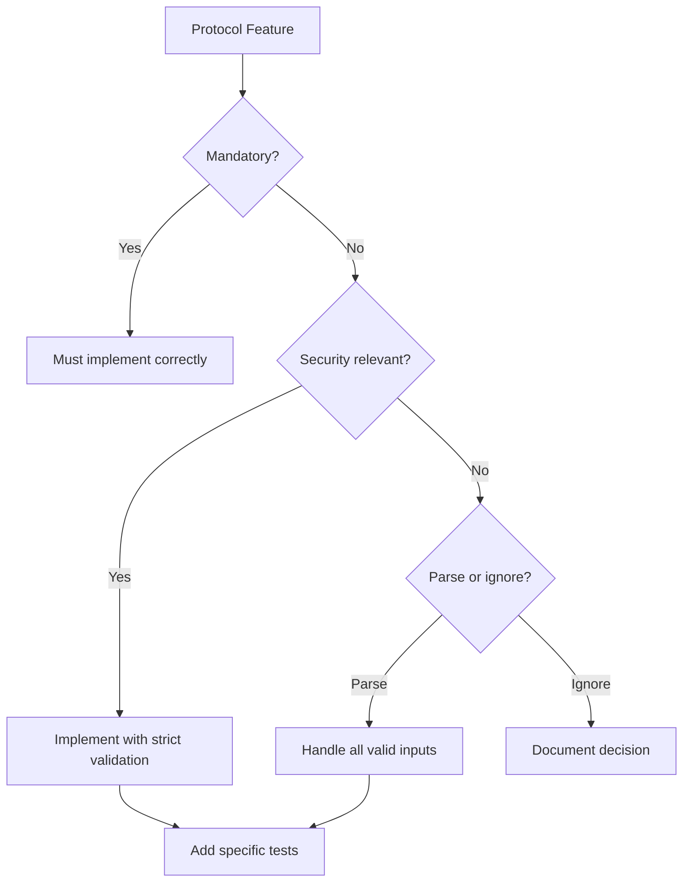

# Securing Protocol Spec Corner Case Review in Cilium Network Security

Author: [nawazdhandala](https://github.com/nawazdhandala)

Tags: Cilium, Network Security, Protocol Specification, Corner Cases, Security Review

Description: A systematic approach to reviewing protocol specifications for corner cases that could create security vulnerabilities in Cilium L7 parsers, covering ambiguous spec language, optional features,...

---

## Introduction

Every protocol specification contains corner cases - scenarios that are technically valid but unusual, ambiguously specified, or interaction points between features that create unexpected behavior. These corner cases are where security vulnerabilities hide in L7 parsers, because developers implement the common cases and may miss or misinterpret the edge cases.

Reviewing the spec for corner cases before finalizing a Cilium parser prevents entire classes of vulnerabilities. A spec ambiguity that leads to a parsing disagreement between client and server can be exploited to bypass policy enforcement - the client sends data that the parser interprets as one command while the server interprets it as another.

This guide provides a structured methodology for identifying and addressing protocol spec corner cases in Cilium L7 parsers.

## Prerequisites

- The complete protocol specification document
- Working parser implementation for comparison
- Reference client and server implementations
- Understanding of common protocol vulnerability patterns
- Access to protocol specification errata or mailing lists

## Identifying Ambiguous Language

Search the specification for language that indicates optional or undefined behavior:

```bash
# Common ambiguity indicators in protocol specs
# Search the spec document for these patterns:
# - "MAY" (optional behavior)
# - "SHOULD" (recommended but not required)
# - "implementation-defined"
# - "unspecified"
# - "reserved for future use"
# - "MUST ignore"
# - "backwards compatible"

grep -in "MAY\|SHOULD\|implementation.defined\|unspecified\|reserved" protocol-spec.txt | head -30
```

Create an ambiguity register:

| Spec Section | Ambiguous Text | Parser Decision | Security Impact |
|-------------|----------------|-----------------|-----------------|
| 3.2.1 | "Servers MAY close idle connections" | Parser does not track idle time | Low |
| 4.1.3 | "Unknown flags SHOULD be ignored" | Parser drops unknown flags | Medium |
| 5.0.2 | "Implementation-defined maximum message size" | Set to 1 MB | High |
| 6.3.1 | "Reserved bytes MUST be zero" | Parser rejects non-zero | Medium |

## Analyzing Optional Features

Optional protocol features create parser complexity:

```go
// Corner case: Optional compression flag
// Spec says "Clients MAY send compressed payloads if the server supports it"
// Security concern: Parser must handle both compressed and uncompressed

func (p *Parser) parsePayload(data []byte, flags byte) ([]byte, error) {
    compressed := flags & 0x01

    if compressed != 0 {
        // Corner case 1: Compressed data that decompresses to oversized payload
        decompressed, err := decompress(data)
        if err != nil {
            return nil, fmt.Errorf("decompression failed: %w", err)
        }

        // CRITICAL: Check decompressed size, not compressed size
        if len(decompressed) > maxMessageSize {
            return nil, fmt.Errorf("decompressed size %d exceeds max %d",
                len(decompressed), maxMessageSize)
        }

        return decompressed, nil
    }

    return data, nil
}
```



## Examining Numeric Boundary Conditions

Protocol specifications define numeric fields with specific ranges. Each boundary is a potential corner case:

```go
// Corner cases for numeric fields from the spec

// 1. Maximum values for each field type
const (
    // Spec says: "Request ID is a 32-bit unsigned integer"
    // Corner case: What happens with request ID 0? Is it valid?
    // Corner case: What happens with request ID 0xFFFFFFFF?
    minRequestID = 0          // Spec silent on minimum
    maxRequestID = 0xFFFFFFFF // Maximum uint32

    // Spec says: "Message length is a 32-bit signed integer"
    // Corner case: Negative lengths (high bit set)
    // Corner case: Length of exactly 0
    // Corner case: Length of exactly MaxInt32
    maxMessageLength = 0x7FFFFFFF // Max positive int32
)

// 2. Test each boundary
func TestNumericBoundaries(t *testing.T) {
    boundaries := []struct {
        name  string
        value int
        valid bool
    }{
        {"length = -1", -1, false},
        {"length = 0", 0, false},  // Check spec: is zero-length valid?
        {"length = 1", 1, true},
        {"length = MaxInt32", 0x7FFFFFFF, true},  // May hit resource limits
        {"length = MaxInt32+1", 0x80000000, false}, // Sign bit set
        {"requestID = 0", 0, true},
        {"requestID = MaxUint32", 0xFFFFFFFF, true},
    }

    for _, b := range boundaries {
        t.Run(b.name, func(t *testing.T) {
            // Test each boundary value
            _ = b
        })
    }
}
```

## Reviewing Protocol State Machine Corners

Check for undefined state transitions in the protocol:

```go
// Corner case: What if client sends request after receiving error?
// Spec may not define this behavior clearly

// Corner case: What if server sends response without matching request?
// This could happen with connection pooling or pipelining

// Corner case: What if connection is half-closed (one direction)?
// TCP allows this but many protocols don't handle it

// Corner case: What if multiple requests are pipelined?
// Parser must handle request N arriving before response N-1
```

## Documenting Corner Case Decisions

For each corner case, document the decision and its security rationale:

```go
// corner_cases.go - Documentation of spec corner case decisions

// CORNER CASE 1: Zero-length message body
// Spec reference: Section 3.2 "Message Format"
// Spec says: "The body field contains the message payload"
// Ambiguity: Does not specify whether zero-length body is valid
// Decision: REJECT zero-length bodies
// Rationale: No legitimate use case identified. Rejecting is safer than allowing
//            potentially malformed messages that could confuse the server.

// CORNER CASE 2: Unknown command types
// Spec reference: Section 4.1 "Command Types"
// Spec says: "Command types 0x01-0x10 are defined. Others are reserved."
// Ambiguity: "reserved" could mean "must reject" or "may be used in future"
// Decision: REJECT unknown commands (DROP)
// Rationale: Forwarding unknown commands could bypass policy if new commands
//            have write/delete semantics that the policy doesn't account for.

// CORNER CASE 3: Request ID reuse
// Spec reference: Section 3.3 "Request Tracking"
// Spec says: "Request IDs SHOULD be unique per connection"
// Ambiguity: SHOULD, not MUST - clients may reuse IDs
// Decision: ALLOW ID reuse, match to most recent unmatched request
// Rationale: Some clients are known to reuse IDs. Rejecting would break compatibility.
```

## Verification

Test all documented corner cases:

```bash
# Run corner case specific tests
go test ./proxylib/myprotocol/... -v -run TestCornerCase

# Fuzz to discover undocumented corner cases
go test ./proxylib/myprotocol/... -fuzz=FuzzOnData -fuzztime=5m

# Review corner case documentation
cat proxylib/myprotocol/corner_cases.go
```

## Troubleshooting

**Problem: Spec is ambiguous and no errata available**
Test against multiple reference implementations. If they disagree, choose the more restrictive interpretation for security.

**Problem: Corner case creates compatibility issues**
Document the incompatibility and provide a configuration option to enable the less restrictive behavior when needed.

**Problem: Too many corner cases to address at once**
Prioritize by security impact. Address corner cases that could lead to policy bypass first, then data corruption, then denial of service.

**Problem: New protocol version changes corner case behavior**
Track protocol version in the parser and handle corner cases differently per version. Maintain backward compatibility documentation.

## Conclusion

Reviewing protocol specifications for corner cases is essential security work that prevents entire classes of vulnerabilities. By systematically identifying ambiguous language, analyzing optional features, testing numeric boundaries, and documenting every corner case decision with its security rationale, you build a parser that handles the full reality of protocol traffic safely. Corner case documentation also provides invaluable context for future maintainers of the parser.
