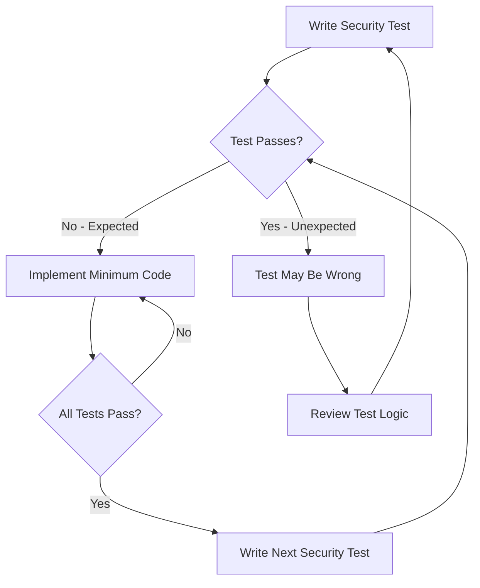

# Securing Unit Testing to Drive Development in Cilium Network Security

Author: [nawazdhandala](https://github.com/nawazdhandala)

Tags: Cilium, Network Security, Unit Testing, TDD, Go, L7 Proxy

Description: Learn how to use security-focused unit testing to drive the development of Cilium L7 parsers, ensuring every parsing path is validated against both correct and adversarial inputs from the start.

---

## Introduction

Test-driven development (TDD) is particularly valuable when building L7 protocol parsers for Cilium, where security correctness is as important as functional correctness. By writing tests before implementation, you define the expected behavior for every class of input — valid, malformed, truncated, and adversarial — before writing any parsing code.

Security-focused TDD differs from standard TDD by emphasizing negative test cases, boundary conditions, and invariant verification alongside the happy-path tests. Each test serves as both a specification and a regression guard, making it harder for future changes to introduce vulnerabilities.

This guide demonstrates how to apply security-focused TDD to Cilium parser development, with practical examples using Go's testing framework and proxylib's test utilities.

## Prerequisites

- Go 1.21 or later
- Cilium source code with proxylib available
- Familiarity with Go's testing package and table-driven tests
- Understanding of Cilium's proxylib Parser interface
- Your target protocol's specification document

## Setting Up the Test Infrastructure

Create the test file alongside your parser with proper test helpers:

```go
// proxylib/myprotocol/myprotocolparser_test.go
package myprotocol

import (
    "bytes"
    "testing"

    "github.com/cilium/cilium/proxylib/proxylib"
)

// testHelper creates common test fixtures
type testHelper struct {
    t *testing.T
}

// makeMessage creates a valid protocol message for testing
func (h *testHelper) makeMessage(command byte, payload []byte) []byte {
    bodyLen := 1 + len(payload) // command byte + payload
    msg := make([]byte, 4+bodyLen)
    // Big-endian length header
    msg[0] = byte(bodyLen >> 24)
    msg[1] = byte(bodyLen >> 16)
    msg[2] = byte(bodyLen >> 8)
    msg[3] = byte(bodyLen)
    msg[4] = command
    copy(msg[5:], payload)
    return msg
}

// makeHeader creates just the length header
func (h *testHelper) makeHeader(length int) []byte {
    header := make([]byte, 4)
    header[0] = byte(length >> 24)
    header[1] = byte(length >> 16)
    header[2] = byte(length >> 8)
    header[3] = byte(length)
    return header
}

// newParser creates a fresh parser in the running state
func (h *testHelper) newParser() *Parser {
    return &Parser{
        state: stateRunning,
    }
}
```

## Writing Security Tests Before Implementation

Start with tests that define the security contract. These tests will initially fail, driving your implementation:

```go
func TestOnData_SecurityBoundaries(t *testing.T) {
    h := &testHelper{t: t}

    tests := []struct {
        name   string
        input  []byte
        wantOp proxylib.OpType
        desc   string
    }{
        {
            name:   "reject negative length",
            input:  []byte{0x80, 0x00, 0x00, 0x00}, // High bit set = negative int32
            wantOp: proxylib.DROP,
            desc:   "Negative lengths indicate malformed or malicious input",
        },
        {
            name:   "reject oversized message",
            input:  h.makeHeader(maxMessageSize + 1),
            wantOp: proxylib.DROP,
            desc:   "Messages exceeding maxMessageSize must be rejected",
        },
        {
            name:   "accept max size message",
            input:  append(h.makeHeader(5), make([]byte, 5)...),
            wantOp: proxylib.PASS,
            desc:   "Messages at exactly the right size should pass",
        },
        {
            name:   "handle empty input gracefully",
            input:  []byte{},
            wantOp: proxylib.MORE,
            desc:   "Empty input must not panic",
        },
        {
            name:   "handle single byte gracefully",
            input:  []byte{0x42},
            wantOp: proxylib.MORE,
            desc:   "Partial header must request more data",
        },
    }

    for _, tt := range tests {
        t.Run(tt.name, func(t *testing.T) {
            parser := h.newParser()
            reader := proxylib.NewTestReader(tt.input)
            op, _ := parser.OnData(false, reader)
            if op != tt.wantOp {
                t.Errorf("%s: got op %v, want %v", tt.desc, op, tt.wantOp)
            }
        })
    }
}
```

## Writing State Machine Tests

Define tests that validate state transitions:

```go
func TestOnData_StateMachine(t *testing.T) {
    h := &testHelper{t: t}

    t.Run("init transitions to running on first data", func(t *testing.T) {
        parser := &Parser{state: stateInit}
        msg := h.makeMessage(0x01, []byte("hello"))
        reader := proxylib.NewTestReader(msg)

        parser.OnData(false, reader)

        if parser.state != stateRunning {
            t.Errorf("Expected state running, got %v", parser.state)
        }
    })

    t.Run("error state always drops", func(t *testing.T) {
        parser := &Parser{state: stateError}
        msg := h.makeMessage(0x01, []byte("hello"))
        reader := proxylib.NewTestReader(msg)

        op, n := parser.OnData(false, reader)

        if op != proxylib.DROP || n != 0 {
            t.Errorf("Error state should DROP/0, got %v/%d", op, n)
        }
    })

    t.Run("closed state always drops", func(t *testing.T) {
        parser := &Parser{state: stateClosed}
        msg := h.makeMessage(0x01, []byte("hello"))
        reader := proxylib.NewTestReader(msg)

        op, n := parser.OnData(false, reader)

        if op != proxylib.DROP || n != 0 {
            t.Errorf("Closed state should DROP/0, got %v/%d", op, n)
        }
    })
}
```



## Writing Multi-Message Stream Tests

Real connections carry multiple messages. Test that the parser correctly handles message boundaries:

```go
func TestOnData_MultipleMessages(t *testing.T) {
    h := &testHelper{t: t}

    t.Run("two consecutive messages", func(t *testing.T) {
        msg1 := h.makeMessage(0x01, []byte("first"))
        msg2 := h.makeMessage(0x02, []byte("second"))
        combined := append(msg1, msg2...)

        parser := h.newParser()
        reader := proxylib.NewTestReader(combined)

        // First call should consume first message only
        op1, n1 := parser.OnData(false, reader)
        if op1 != proxylib.PASS || n1 != len(msg1) {
            t.Errorf("First message: got %v/%d, want PASS/%d", op1, n1, len(msg1))
        }
    })

    t.Run("message split across calls", func(t *testing.T) {
        msg := h.makeMessage(0x01, []byte("complete"))
        half := len(msg) / 2

        parser := h.newParser()

        // First call with partial data
        reader1 := proxylib.NewTestReader(msg[:half])
        op1, n1 := parser.OnData(false, reader1)
        if op1 != proxylib.MORE {
            t.Errorf("Partial message: got %v, want MORE", op1)
        }
        if n1 <= half {
            t.Errorf("MORE should request more than %d bytes, got %d", half, n1)
        }

        // Second call with complete data
        reader2 := proxylib.NewTestReader(msg)
        op2, n2 := parser.OnData(false, reader2)
        if op2 != proxylib.PASS || n2 != len(msg) {
            t.Errorf("Complete message: got %v/%d, want PASS/%d", op2, n2, len(msg))
        }
    })
}
```

## Running and Analyzing Test Results

Execute the TDD cycle:

```bash
# Run tests — expect failures initially for unimplemented features
go test ./proxylib/myprotocol/... -v 2>&1 | head -50

# Run only security boundary tests
go test ./proxylib/myprotocol/... -v -run TestOnData_SecurityBoundaries

# Run with coverage to track progress
go test ./proxylib/myprotocol/... -coverprofile=tdd-coverage.out
go tool cover -func=tdd-coverage.out

# Run with race detector from the start
go test ./proxylib/myprotocol/... -race -v
```

## Verification

Confirm the TDD process has achieved adequate coverage:

```bash
# Check overall coverage
go test ./proxylib/myprotocol/... -coverprofile=cover.out
go tool cover -func=cover.out

# Check that OnData specifically has high coverage
go tool cover -func=cover.out | grep OnData

# Verify no test is skipped
go test ./proxylib/myprotocol/... -v 2>&1 | grep -c SKIP

# Run benchmarks to establish performance baseline
go test ./proxylib/myprotocol/... -bench=BenchmarkOnData -benchmem -count=3
```

## Troubleshooting

**Problem: Tests are too tightly coupled to implementation**
Test behavior (return values, state transitions), not internal details. Avoid testing private helper function internals — test through the public OnData interface.

**Problem: Hard to create test Reader with specific data**
Use `proxylib.NewTestReader()` or create a simple wrapper that implements the Reader interface for testing purposes. Keep test helpers in the test file.

**Problem: Test names are unclear**
Use the pattern `TestOnData_<Category>/<specific_case>`. The category groups related tests, and the specific case describes the scenario being tested.

**Problem: TDD cycle feels slow**
Focus on the security-critical tests first. You do not need 100% coverage from TDD — add normal functional tests after the security boundaries are established.

## Conclusion

Security-focused TDD for Cilium parsers ensures that every boundary condition and error handling path is validated before the implementation exists. By writing tests for negative lengths, oversized messages, state machine transitions, and multi-message streams first, you build a safety net that catches regressions and guides the implementation toward secure patterns. The resulting test suite serves as living documentation of the parser's security properties.
