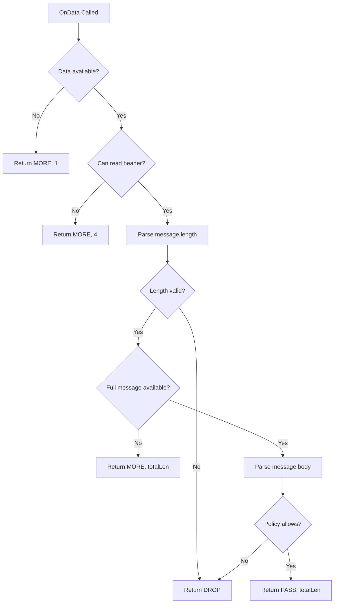

# Securing the OnData Method in Cilium Network Security

Author: [nawazdhandala](https://github.com/nawazdhandala)

Tags: Cilium, Network Security, OnData, L7 Proxy, Input Validation

Description: Learn how to implement a secure OnData method for Cilium L7 parsers with proper input validation, bounds checking, and safe byte-level parsing to prevent common protocol parser vulnerabilities.

---

## Introduction

The `OnData` method is the heart of every Cilium L7 protocol parser. It is called each time new data arrives on a proxied connection, and it must decide whether to pass, drop, or request more data. Because this method processes untrusted network input directly, it is the primary attack surface of any parser.

Securing the OnData method requires disciplined input validation at every step: checking data lengths before accessing bytes, enforcing protocol-specific invariants, and handling malformed input gracefully without panicking or leaking memory. A single unchecked slice access can crash the Envoy proxy process and disrupt all proxied traffic on the node.

This guide covers practical techniques for writing a secure OnData implementation in Cilium's proxylib framework, with code examples drawn from real protocol parsing patterns.

## Prerequisites

- Cilium source code with a proxy skeleton already created
- Go 1.21 or later
- Understanding of the proxylib Reader API
- Familiarity with binary protocol parsing concepts
- Knowledge of your target protocol's wire format

## Safe Data Reading with the Reader API

The proxylib Reader provides safe methods for accessing connection data. Always use Reader methods rather than direct slice operations:

```go
func (p *Parser) OnData(reply bool, reader *proxylib.Reader) (proxylib.OpType, int) {
    // Always check available data first
    dataLen := reader.Length()
    if dataLen == 0 {
        return proxylib.MORE, 1
    }

    // Use Peek to examine data without consuming it
    // This is safe — Peek returns only available bytes
    header, err := reader.PeekSlice(4)
    if err != nil {
        // Not enough data yet — request minimum header size
        return proxylib.MORE, 4
    }

    // Parse the message length from the header
    msgLen := int(header[0])<<24 | int(header[1])<<16 |
              int(header[2])<<8 | int(header[3])

    // Validate message length before proceeding
    if msgLen <= 0 {
        log.Warn("Invalid message length <= 0")
        return proxylib.DROP, 0
    }
    if msgLen > maxMessageSize {
        log.WithField("msgLen", msgLen).Warn("Message exceeds maximum size")
        return proxylib.DROP, 0
    }

    // Check if full message is available
    totalLen := 4 + msgLen // header + body
    if dataLen < totalLen {
        return proxylib.MORE, totalLen
    }

    // Now safe to read the full message
    return p.parseMessage(reply, reader, totalLen)
}
```

## Implementing Bounds-Checked Parsing

Every byte access must be guarded by a preceding length check:

```go
// parseMessage handles a complete protocol message
func (p *Parser) parseMessage(reply bool, reader *proxylib.Reader, totalLen int) (proxylib.OpType, int) {
    // Read the complete message
    data, err := reader.PeekSlice(totalLen)
    if err != nil {
        // Should not happen since we checked length in OnData
        log.WithError(err).Error("Unexpected read error")
        return proxylib.DROP, 0
    }

    // Skip the 4-byte length header
    body := data[4:]

    // Parse command byte (offset 0 in body)
    if len(body) < 1 {
        return proxylib.DROP, 0
    }
    command := body[0]

    // Parse request ID (bytes 1-4 in body)
    if len(body) < 5 {
        return proxylib.DROP, 0
    }
    requestID := uint32(body[1])<<24 | uint32(body[2])<<16 |
                 uint32(body[3])<<8 | uint32(body[4])

    log.WithFields(log.Fields{
        "command":   command,
        "requestID": requestID,
        "reply":     reply,
    }).Debug("Parsed MyProtocol message")

    // Apply L7 policy
    if !p.matchesPolicy(command) {
        return proxylib.DROP, 0
    }

    return proxylib.PASS, totalLen
}
```



## Preventing Integer Overflow Attacks

Protocol parsers commonly read length fields from the wire. These values must be validated to prevent integer overflows:

```go
const (
    maxMessageSize   = 1 << 20 // 1 MB
    maxStringLength  = 1 << 16 // 64 KB
    maxArrayElements = 10000
)

// safeReadLength reads a 4-byte big-endian length and validates it
func safeReadLength(data []byte, offset int, maxLen int) (int, error) {
    if len(data) < offset+4 {
        return 0, fmt.Errorf("insufficient data for length field at offset %d", offset)
    }

    length := int(data[offset])<<24 | int(data[offset+1])<<16 |
              int(data[offset+2])<<8 | int(data[offset+3])

    // Check for negative values (sign bit set in the original int32)
    if length < 0 {
        return 0, fmt.Errorf("negative length %d at offset %d", length, offset)
    }

    // Check against maximum
    if length > maxLen {
        return 0, fmt.Errorf("length %d exceeds maximum %d at offset %d",
            length, maxLen, offset)
    }

    return length, nil
}

// Usage in OnData:
func (p *Parser) OnData(reply bool, reader *proxylib.Reader) (proxylib.OpType, int) {
    dataLen := reader.Length()
    if dataLen < 4 {
        return proxylib.MORE, 4
    }

    header, _ := reader.PeekSlice(4)
    msgLen, err := safeReadLength(header, 0, maxMessageSize)
    if err != nil {
        log.WithError(err).Warn("Invalid message length")
        return proxylib.DROP, 0
    }

    totalLen := 4 + msgLen
    if dataLen < totalLen {
        return proxylib.MORE, totalLen
    }

    return p.parseMessage(reply, reader, totalLen)
}
```

## Handling Partial Reads and Fragmentation

TCP does not preserve message boundaries. Your OnData method will be called with partial messages regularly:

```go
func (p *Parser) OnData(reply bool, reader *proxylib.Reader) (proxylib.OpType, int) {
    dataLen := reader.Length()

    // Phase 1: Need at least the header
    if dataLen < headerSize {
        // Request exactly what we need — do not over-request
        return proxylib.MORE, headerSize
    }

    header, _ := reader.PeekSlice(headerSize)
    msgLen, err := safeReadLength(header, 0, maxMessageSize)
    if err != nil {
        return proxylib.DROP, 0
    }

    totalLen := headerSize + msgLen

    // Phase 2: Need the full message body
    if dataLen < totalLen {
        return proxylib.MORE, totalLen
    }

    // Phase 3: Full message available — parse and decide
    result, consumed := p.parseMessage(reply, reader, totalLen)

    // Log the access for audit trail
    p.logAccess(reply, totalLen, result)

    return result, consumed
}
```

## Verification

Test the OnData method against edge cases:

```bash
# Run parser tests
go test ./proxylib/myprotocol/... -v -run TestOnData

# Run with race detector
go test ./proxylib/myprotocol/... -race -v

# Run fuzzing if available (Go 1.18+)
go test ./proxylib/myprotocol/... -fuzz=FuzzOnData -fuzztime=30s
```

Write specific security-focused tests:

```go
func TestOnDataZeroLengthMessage(t *testing.T) {
    // Zero-length messages should be handled safely
    // ... test implementation
}

func TestOnDataMaxSizeMessage(t *testing.T) {
    // Messages at exactly maxMessageSize should be accepted
    // ... test implementation
}

func TestOnDataOversizedMessage(t *testing.T) {
    // Messages exceeding maxMessageSize should be dropped
    // ... test implementation
}

func TestOnDataNegativeLength(t *testing.T) {
    // Negative length fields (sign bit set) should be dropped
    // ... test implementation
}
```

## Troubleshooting

**Problem: Parser panics on short packets**
A panic in OnData typically means a slice access without a preceding bounds check. Search for all `data[` and `body[` accesses and ensure each has a `len()` guard above it.

**Problem: Connections hang after partial message**
Verify that your MORE return value requests the correct total number of bytes, not just the remaining bytes. The proxylib framework interprets the value as the total data needed.

**Problem: Parser drops valid messages**
Enable debug logging and check the length calculations. Off-by-one errors in header size constants are common. Verify your protocol's header size against the specification.

**Problem: Memory usage spikes during parsing**
Avoid copying data when possible. Use `PeekSlice` to examine data in place rather than allocating new buffers.

## Conclusion

Securing the OnData method is the most critical step in building a Cilium L7 parser. By consistently validating lengths before accessing data, enforcing maximum size limits, handling integer overflows, and gracefully managing TCP fragmentation, you build a parser that is resilient against malformed and malicious input. Combine these techniques with fuzz testing to gain confidence that your parser handles the full spectrum of inputs safely.
