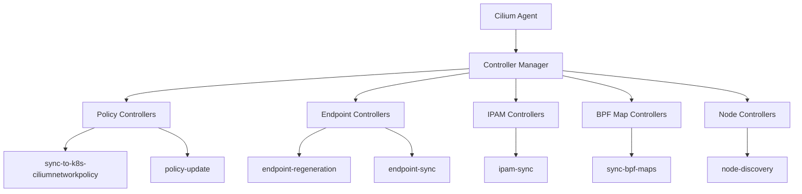

# How to Set Up Controllers in Cilium Observability

Author: [nawazdhandala](https://github.com/nawazdhandala)

Tags: Cilium, Controller, Observability, Kubernetes, Monitoring

Description: A step-by-step guide to setting up and configuring Cilium's internal controller subsystem for observability, including how to monitor controller health and reconciliation loops.

---

## Introduction

Cilium uses an internal controller framework to manage asynchronous operations across its agent. Controllers handle tasks like syncing network policies, updating endpoint state, managing IPAM allocations, and reconciling BPF maps. Each controller runs as an independent reconciliation loop with its own status, error count, and run statistics.

Understanding and monitoring these controllers is essential for diagnosing Cilium agent behavior. When a controller fails repeatedly, it can indicate underlying issues such as API server connectivity problems, resource exhaustion, or configuration errors that affect networking for your entire cluster.

This guide shows you how to set up visibility into Cilium controllers, configure monitoring for controller health, and create alerting rules that catch problems before they cascade into network failures.

## Prerequisites

- Kubernetes cluster with Cilium 1.14 or later installed
- kubectl access with permissions to exec into Cilium pods
- cilium CLI installed
- Prometheus and Grafana deployed (for metrics and dashboards)
- Helm 3 for configuration changes

## Listing and Understanding Cilium Controllers

Each Cilium agent pod runs dozens of controllers. Start by listing them to understand the scope:

```bash
# List all controllers on a specific Cilium agent
kubectl -n kube-system exec ds/cilium -- cilium status controllers

# Get detailed controller status with JSON output for parsing
kubectl -n kube-system exec ds/cilium -- cilium status controllers -o json | python3 -c "
import json, sys
controllers = json.load(sys.stdin)
for c in controllers:
    status = c.get('status', {})
    fail_count = status.get('consecutive-failure-count', 0)
    last_success = status.get('last-success-timestamp', 'never')
    print(f\"{c['name']}: failures={fail_count}, last_success={last_success}\")
" | sort -t= -k2 -rn | head -20
```



## Enabling Controller Metrics

Cilium exposes controller metrics through its Prometheus endpoint. Ensure the metrics are enabled in your Helm values:

```yaml
# cilium-values.yaml
prometheus:
  enabled: true

# Controller-specific metrics are included by default when
# prometheus.enabled is true. The key metrics are:
# - cilium_controllers_runs_total
# - cilium_controllers_runs_duration_seconds
# - cilium_controllers_failing
```

Apply the configuration:

```bash
helm upgrade cilium cilium/cilium -n kube-system \
  --reuse-values \
  --set prometheus.enabled=true
```

Verify that controller metrics are being exposed:

```bash
kubectl -n kube-system exec ds/cilium -- \
  wget -qO- http://localhost:9962/metrics 2>/dev/null | grep cilium_controllers
```

## Configuring Prometheus Alerts for Controller Failures

Create PrometheusRule resources to alert on failing controllers:

```yaml
# cilium-controller-alerts.yaml
apiVersion: monitoring.coreos.com/v1
kind: PrometheusRule
metadata:
  name: cilium-controller-alerts
  namespace: monitoring
  labels:
    release: prometheus
spec:
  groups:
    - name: cilium-controllers
      rules:
        # Alert when any controller has been failing for more than 10 minutes
        - alert: CiliumControllerFailing
          expr: cilium_controllers_failing > 0
          for: 10m
          labels:
            severity: warning
          annotations:
            summary: "Cilium controller failing on {{ $labels.instance }}"
            description: "{{ $value }} controller(s) have been in a failing state for more than 10 minutes."

        # Alert when controller run duration is abnormally high
        - alert: CiliumControllerSlowRuns
          expr: |
            rate(cilium_controllers_runs_duration_seconds_sum[5m])
            / rate(cilium_controllers_runs_duration_seconds_count[5m]) > 30
          for: 5m
          labels:
            severity: warning
          annotations:
            summary: "Cilium controller runs are slow on {{ $labels.instance }}"

        # Alert on high error rate across all controllers
        - alert: CiliumControllerHighErrorRate
          expr: |
            sum by (instance) (rate(cilium_controllers_runs_total{outcome="error"}[5m]))
            / sum by (instance) (rate(cilium_controllers_runs_total[5m])) > 0.1
          for: 15m
          labels:
            severity: critical
          annotations:
            summary: "More than 10% of Cilium controller runs are failing on {{ $labels.instance }}"
```

```bash
kubectl apply -f cilium-controller-alerts.yaml
```

## Building a Controller Health Dashboard

Create a Grafana dashboard to visualize controller health. Here are the key panels:

```bash
# PromQL queries for dashboard panels

# Panel 1: Number of currently failing controllers per node
cilium_controllers_failing

# Panel 2: Controller run success vs failure rate
sum by (outcome) (rate(cilium_controllers_runs_total[5m]))

# Panel 3: Average controller run duration
rate(cilium_controllers_runs_duration_seconds_sum[5m]) / rate(cilium_controllers_runs_duration_seconds_count[5m])

# Panel 4: Top 10 controllers by error count
topk(10, sum by (controller) (rate(cilium_controllers_runs_total{outcome="error"}[5m])))
```

To automate dashboard provisioning, create a ConfigMap:

```yaml
# cilium-controllers-dashboard-cm.yaml
apiVersion: v1
kind: ConfigMap
metadata:
  name: cilium-controllers-dashboard
  namespace: monitoring
  labels:
    grafana_dashboard: "1"
data:
  cilium-controllers.json: |
    {
      "dashboard": {
        "title": "Cilium Controllers Health",
        "panels": [
          {
            "title": "Failing Controllers",
            "type": "stat",
            "targets": [{"expr": "sum(cilium_controllers_failing)"}]
          },
          {
            "title": "Controller Run Outcomes",
            "type": "timeseries",
            "targets": [{"expr": "sum by (outcome) (rate(cilium_controllers_runs_total[5m]))"}]
          }
        ]
      }
    }
```

## Verification

Validate that your controller observability setup is working:

```bash
# 1. Confirm controllers are listed
kubectl -n kube-system exec ds/cilium -- cilium status controllers | wc -l

# 2. Check that Prometheus is scraping controller metrics
curl -s 'http://localhost:9090/api/v1/query?query=cilium_controllers_failing' | python3 -m json.tool

# 3. Verify alerting rules are loaded
curl -s 'http://localhost:9090/api/v1/rules' | python3 -c "
import json, sys
data = json.load(sys.stdin)
for group in data['data']['groups']:
    if 'cilium' in group['name']:
        for rule in group['rules']:
            print(f\"Rule: {rule['name']}, State: {rule['state']}\")
"

# 4. Trigger a test by intentionally causing a controller failure (safe read-only check)
kubectl -n kube-system exec ds/cilium -- cilium status controllers -o json | python3 -c "
import json, sys
data = json.load(sys.stdin)
failing = [c for c in data if c.get('status', {}).get('consecutive-failure-count', 0) > 0]
print(f'Currently failing controllers: {len(failing)}')
for c in failing:
    print(f\"  - {c['name']}: {c['status']['last-failure-msg']}\")
"
```

## Troubleshooting

- **No controller metrics in Prometheus**: Ensure `prometheus.enabled=true` in Helm values and that the Cilium agent pods have been restarted after the change.

- **All controllers show as failing**: This often indicates API server connectivity issues. Check `kubectl -n kube-system logs ds/cilium | grep "api-server"`.

- **A single controller keeps failing**: Examine the controller's error message with `cilium status controllers` and search Cilium's GitHub issues for the specific error.

- **Controller runs are very slow**: High run durations can indicate BPF map contention or large numbers of endpoints. Check endpoint count with `cilium endpoint list | wc -l`.

- **Alerts not firing**: Verify the PrometheusRule labels match your Prometheus operator's `ruleSelector`. Check with `kubectl get prometheus -n monitoring -o yaml | grep -A5 ruleSelector`.

## Conclusion

Cilium's controller framework is the engine that keeps your cluster's networking state consistent. By setting up proper observability for these controllers -- through Prometheus metrics, alerting rules, and Grafana dashboards -- you can detect reconciliation failures early and respond before they affect application connectivity. Regularly review controller health as part of your cluster operations to maintain a reliable networking layer.
