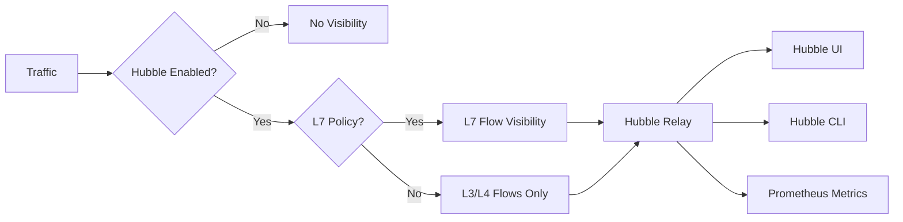

# How to Set Up Observability Policies in Cilium

Author: [nawazdhandala](https://github.com/nawazdhandala)

Tags: Cilium, Observability, Network Policy, Hubble, Monitoring

Description: A practical guide to configuring Cilium observability policies that provide visibility into network traffic, policy decisions, and application behavior without compromising security or performance.

---

## Introduction

Cilium's observability capabilities provide deep insight into network traffic flows, policy decisions, and application communication patterns. Setting up observability policies correctly ensures you have the visibility needed for security monitoring, troubleshooting, and compliance without generating excessive data or impacting performance.

Observability in Cilium is powered by Hubble, which provides flow-level visibility including L3/L4 network flows, L7 protocol details, DNS resolution, and policy verdict information. Proper policy configuration determines which flows are observed, at what detail level, and where the data is exported.

This guide walks through setting up Cilium observability policies from scratch, configuring Hubble, and integrating with monitoring infrastructure.

## Prerequisites

- Kubernetes cluster supported by your Cilium release (Cilium 1.19 supports Kubernetes 1.31-1.34)
- Helm 3 installed
- `kubectl` cluster admin access
- Cilium CLI installed
- Basic understanding of Cilium network policies
- Familiarity with Prometheus and Grafana (for metrics export)

## Installing Cilium with Observability Enabled

Deploy Cilium with Hubble observability features:

```bash
# Add the Cilium Helm repository

helm repo add cilium https://helm.cilium.io/
helm repo update

# Install Cilium with Hubble enabled
helm install cilium cilium/cilium --version 1.19.3 \
    --namespace kube-system \
    --set prometheus.enabled=true \
    --set operator.prometheus.enabled=true \
    --set hubble.enabled=true \
    --set hubble.relay.enabled=true \
    --set hubble.ui.enabled=true \
    --set hubble.metrics.enableOpenMetrics=true \
    --set hubble.metrics.enabled="{dns,drop,tcp,flow,port-distribution,icmp,httpV2:exemplars=true;labelsContext=source_ip\,source_namespace\,source_workload\,destination_ip\,destination_namespace\,destination_workload\,traffic_direction}"

# Verify Hubble is running
kubectl get pods -n kube-system -l k8s-app=hubble-relay
kubectl get pods -n kube-system -l k8s-app=hubble-ui
```

Install the Hubble CLI:

```bash
# Install Hubble CLI
HUBBLE_VERSION=$(curl -s https://raw.githubusercontent.com/cilium/hubble/main/stable.txt)
HUBBLE_ARCH=amd64
if [ "$(uname -m)" = "aarch64" ]; then HUBBLE_ARCH=arm64; fi
curl -L --fail --remote-name-all https://github.com/cilium/hubble/releases/download/$HUBBLE_VERSION/hubble-linux-${HUBBLE_ARCH}.tar.gz{,.sha256sum}
sha256sum --check hubble-linux-${HUBBLE_ARCH}.tar.gz.sha256sum
sudo tar xzvfC hubble-linux-${HUBBLE_ARCH}.tar.gz /usr/local/bin
rm hubble-linux-${HUBBLE_ARCH}.tar.gz{,.sha256sum}

# Verify connectivity
cilium hubble port-forward &
hubble status
```

## Configuring Flow Visibility Policies

Control which flows are visible through L7 CiliumNetworkPolicy rules:

```yaml
# visibility-policy.yaml
# This policy makes HTTP traffic to the frontend service visible at L7
apiVersion: cilium.io/v2
kind: CiliumNetworkPolicy
metadata:
  name: frontend-visibility
  namespace: default
spec:
  endpointSelector:
    matchLabels:
      app: frontend
  ingress:
    - fromEndpoints:
        - {}
      toPorts:
        - ports:
            - port: "80"
              protocol: TCP
          rules:
            http:
              - method: "GET"
              - method: "POST"
```

Historically, Cilium supported L7 visibility through the `policy.cilium.io/proxy-visibility` pod annotation. Current Cilium releases no longer support that method; use L7 Cilium network policies instead and make the L7 match as broad as your security requirements allow.

```yaml
# visibility-all-http.yaml
# This enables L7 visibility for HTTP traffic on port 80 and permits all HTTP requests that match the L4 rule
apiVersion: cilium.io/v2
kind: CiliumNetworkPolicy
metadata:
  name: my-app-http-visibility
  namespace: default
spec:
  endpointSelector:
    matchLabels:
      app: my-app
  ingress:
    - fromEndpoints:
        - {}
      toPorts:
        - ports:
            - port: "80"
              protocol: TCP
          rules:
            http:
              - {}
```


```mermaid
flowchart LR
    A[Traffic] --> B{Hubble Enabled?}
    B -->|No| C[No Visibility]
    B -->|Yes| D{L7 Policy?}
    D -->|No| E[L3/L4 Flows Only]
    D -->|Yes| F[L7 Flow Visibility]
    F --> G[Hubble Relay]
    E --> G
    G --> H[Hubble UI]
    G --> I[Hubble CLI]
    G --> J[Prometheus Metrics]
```

## Setting Up Hubble Metrics Export

Configure Hubble to export metrics to Prometheus. If you want to change metric definitions without restarting agents, use the dynamic metrics exporter:

```yaml
# dynamic-metrics.yaml
apiVersion: v1
kind: ConfigMap
metadata:
  name: cilium-dynamic-metrics-config
  namespace: kube-system
data:
  dynamic-metrics.yaml: |
    metrics:
      - name: dns
      - name: drop
      - name: tcp
      - name: flow
      - name: port-distribution
      - name: icmp
      - name: httpV2
        contextOptions:
          - name: exemplars
            values:
              - "true"
          - name: labelsContext
            values:
              - source_namespace
              - destination_namespace
```

Apply the ConfigMap and enable the dynamic exporter:

```bash
kubectl apply -f dynamic-metrics.yaml

helm upgrade cilium cilium/cilium --version 1.19.3 \
    --namespace kube-system \
    --reuse-values \
    --set hubble.metrics.enabled=[] \
    --set hubble.metrics.dynamic.enabled=true \
    --set hubble.metrics.dynamic.config.configMapName=cilium-dynamic-metrics-config \
    --set hubble.metrics.dynamic.config.createConfigMap=false
```

If you use Prometheus Operator, have the Cilium chart create the ServiceMonitor:

```bash
helm upgrade cilium cilium/cilium --version 1.19.3 \
    --namespace kube-system \
    --reuse-values \
    --set hubble.metrics.serviceMonitor.enabled=true
```

## Observing Traffic Flows

Use Hubble to observe traffic with various filters:

```bash
# Observe all flows
hubble observe

# Filter by namespace
hubble observe --namespace default

# Filter by pod
hubble observe --pod default/frontend

# Filter by verdict (allowed/denied/dropped)
hubble observe --verdict DROPPED

# Filter by L7 protocol
hubble observe --type l7 --protocol http

# Filter by HTTP status code
hubble observe --http-status 500

# Export to JSON for processing
hubble observe --namespace default -o json > flows.json

# Follow flows in real time
hubble observe --follow --namespace default
```

## Verification

Verify the observability setup is working:

```bash
# Check Hubble status
hubble status

# Verify flow observation works
hubble observe --last 10

# Check metrics are being exported
kubectl port-forward -n kube-system svc/hubble-metrics 9965:9965 &
curl -s http://localhost:9965/metrics | head -20

# Verify L7 visibility
hubble observe --type l7 --last 10

# Check Hubble UI is accessible
kubectl port-forward -n kube-system svc/hubble-ui 12000:80
echo "Open http://localhost:12000 in browser"
```

## Troubleshooting

**Problem: hubble status shows "Unavailable"**
Ensure Hubble relay is running: `kubectl get pods -n kube-system -l k8s-app=hubble-relay`. If not running, check that Hubble was enabled during Cilium installation.

**Problem: No L7 flows visible**
L7 visibility requires an L7 network policy. L3/L4-only policies do not generate L7 flow data.

**Problem: Metrics not appearing in Prometheus**
Check that the ServiceMonitor is created and that Prometheus is configured to watch the kube-system namespace. Verify the metrics port is exposed.

**Problem: High CPU usage from Hubble**
Reduce the number of enabled Hubble metrics, avoid high-cardinality `labelsContext` values unless you need them, and consider rate-limiting datapath events with `bpf.events.default.rateLimit` and `bpf.events.default.burstLimit`.

## Conclusion

Setting up Cilium observability policies provides critical visibility into network traffic and policy enforcement. By enabling Hubble with appropriate metrics, configuring L7 visibility through policies, and integrating with Prometheus for metrics export, you build a comprehensive observability stack. Start with L3/L4 visibility for all traffic and add L7 visibility selectively for services that require deep inspection to balance visibility with performance.
