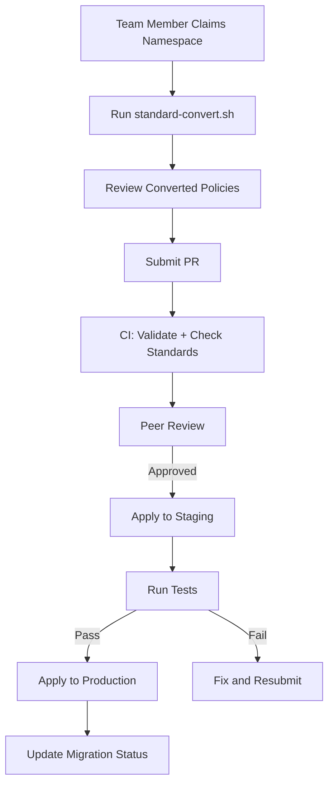

# How to Standardize Team Workflows Around calicoctl convert

Author: [nawazdhandala](https://github.com/nawazdhandala)

Tags: Calico, Kubernetes, Migration, Team Workflows, Calicoctl

Description: Learn how to standardize your team's use of calicoctl convert with migration runbooks, naming conventions, review processes, and automated conversion pipelines.

---

## Introduction

When a team migrates from Kubernetes NetworkPolicy to Calico NetworkPolicy, multiple team members running `calicoctl convert` independently leads to inconsistent results: different naming conventions, varying levels of enhancement applied to converted policies, and no clear tracking of which policies have been migrated.

Standardizing the conversion workflow ensures every team member follows the same process, produces consistently formatted Calico policies, and tracks migration progress in a central location.

This guide covers how to build a standardized team workflow around calicoctl convert for organized, trackable, and reversible policy migration.

## Prerequisites

- A team planning or executing a K8s to Calico policy migration
- Git repository for storing converted policies
- calicoctl v3.27 or later
- CI/CD platform

## Migration Runbook

Create a documented runbook that every team member follows:

```bash
# Migration Runbook Steps:
# 1. Claim a namespace in the tracking spreadsheet/issue
# 2. Export K8s policies for that namespace
# 3. Convert using the standard conversion script
# 4. Enhance with Calico-specific features (order, logging)
# 5. Submit PR for review
# 6. Apply to staging, run tests
# 7. Apply to production
# 8. Update tracking as complete
```

Standard conversion script:

```bash
#!/bin/bash
# standard-convert.sh
# Team-standard conversion script with enhancements

set -euo pipefail

NAMESPACE="${1:?Usage: $0 <namespace>}"
OUTPUT_DIR="calico-policies/${NAMESPACE}"
mkdir -p "$OUTPUT_DIR"

echo "Converting policies for namespace: $NAMESPACE"

# Export all K8s policies
kubectl get networkpolicies -n "$NAMESPACE" -o json | python3 -c "
import json, sys, yaml, subprocess, os

data = json.load(sys.stdin)
namespace = '$NAMESPACE'
output_dir = '$OUTPUT_DIR'

for item in data['items']:
    name = item['metadata']['name']

    # Write K8s policy to temp file
    with open(f'/tmp/k8s-{name}.yaml', 'w') as f:
        yaml.dump(item, f, default_flow_style=False)

    # Convert
    result = subprocess.run(
        ['calicoctl', 'convert', '-f', f'/tmp/k8s-{name}.yaml', '-o', 'yaml'],
        capture_output=True, text=True
    )

    if result.returncode != 0:
        print(f'FAIL: {name} - {result.stderr}')
        continue

    # Parse and enhance
    calico_doc = yaml.safe_load(result.stdout)

    # Standard enhancement: add order
    if 'order' not in calico_doc.get('spec', {}):
        calico_doc['spec']['order'] = 500

    # Standard enhancement: add team annotation
    if 'annotations' not in calico_doc.get('metadata', {}):
        calico_doc['metadata']['annotations'] = {}
    calico_doc['metadata']['annotations']['migration.calico.org/source'] = 'kubernetes-networkpolicy'
    calico_doc['metadata']['annotations']['migration.calico.org/date'] = '$(date +%Y-%m-%d)'

    # Write output
    output_file = os.path.join(output_dir, f'{name}.yaml')
    with open(output_file, 'w') as f:
        yaml.dump(calico_doc, f, default_flow_style=False)

    # Validate
    val_result = subprocess.run(['calicoctl', 'validate', '-f', output_file], capture_output=True)
    status = 'VALID' if val_result.returncode == 0 else 'INVALID'
    print(f'{status}: {name} -> {output_file}')

    os.remove(f'/tmp/k8s-{name}.yaml')
"

echo "Conversion complete. Review files in: $OUTPUT_DIR"
```

## Migration Tracking

Track progress with a structured format:

```yaml
# migration-status.yaml
apiVersion: v1
kind: ConfigMap
metadata:
  name: calico-migration-status
  namespace: calico-system
data:
  status: |
    # Migration Tracking
    # Format: namespace|status|assignee|date
    default|complete|engineer1|2026-03-10
    frontend|complete|engineer2|2026-03-11
    backend|in-progress|engineer1|2026-03-14
    monitoring|pending||
    logging|pending||
```

```bash
#!/bin/bash
# migration-status.sh
# Shows current migration progress

echo "=== Calico Migration Status ==="

# Count K8s NetworkPolicies per namespace
kubectl get networkpolicies --all-namespaces -o json | python3 -c "
import json, sys
from collections import Counter

data = json.load(sys.stdin)
ns_counts = Counter(item['metadata']['namespace'] for item in data['items'])

print(f'Total K8s NetworkPolicies: {len(data[\"items\"])}')
print(f'Namespaces with policies: {len(ns_counts)}')
print('')
for ns, count in sorted(ns_counts.items()):
    print(f'  {ns}: {count} policies')
"

echo ""

# Count Calico NetworkPolicies
export DATASTORE_TYPE=kubernetes
echo "Calico NetworkPolicies (migrated):"
calicoctl get networkpolicies --all-namespaces -o json 2>/dev/null | python3 -c "
import json, sys
from collections import Counter

data = json.load(sys.stdin)
migrated = [item for item in data['items']
    if item.get('metadata',{}).get('annotations',{}).get('migration.calico.org/source') == 'kubernetes-networkpolicy']
ns_counts = Counter(item['metadata']['namespace'] for item in migrated)
print(f'Total migrated: {len(migrated)}')
for ns, count in sorted(ns_counts.items()):
    print(f'  {ns}: {count} policies')
"
```

## PR Template for Converted Policies

```markdown
<!-- .github/pull_request_template.md for policy migrations -->
## Policy Migration: [namespace]

### Converted policies
- [ ] List each converted policy

### Conversion process
- [ ] Used `standard-convert.sh`
- [ ] Added order fields
- [ ] Added migration annotations
- [ ] All policies pass `calicoctl validate`

### Testing
- [ ] Applied to staging
- [ ] Connectivity tests pass
- [ ] No unexpected traffic drops

### Rollback plan
Original K8s policies remain active until Calico policies are verified.
```

## CI/CD Enforcement

```yaml
# .github/workflows/migration-review.yaml
name: Migration Review
on:
  pull_request:
    paths: ['calico-policies/**']

jobs:
  review:
    runs-on: ubuntu-latest
    steps:
      - uses: actions/checkout@v4
      - name: Install calicoctl
        run: |
          curl -L https://github.com/projectcalico/calico/releases/download/v3.27.0/calicoctl-linux-amd64 -o calicoctl
          chmod +x calicoctl && sudo mv calicoctl /usr/local/bin/

      - name: Validate all converted policies
        run: |
          find calico-policies -name "*.yaml" | while read f; do
            calicoctl validate -f "$f" || exit 1
          done

      - name: Check migration annotations
        run: |
          find calico-policies -name "*.yaml" | while read f; do
            if ! grep -q "migration.calico.org/source" "$f"; then
              echo "MISSING migration annotation: $f"
              exit 1
            fi
          done

      - name: Check order fields
        run: |
          find calico-policies -name "*.yaml" | while read f; do
            if ! grep -q "order:" "$f"; then
              echo "WARNING: Missing order field: $f"
            fi
          done
```



## Verification

```bash
# Check migration progress
bash migration-status.sh

# Verify all converted policies follow standards
find calico-policies -name "*.yaml" -exec calicoctl validate -f {} \;

# Check annotations
grep -r "migration.calico.org" calico-policies/
```

## Troubleshooting

- **Different team members produce different output**: Enforce use of the standard conversion script. Add CI checks for consistent formatting.
- **Migration tracking gets out of date**: Automate tracking by checking which namespaces have Calico policies with migration annotations.
- **Converted policies conflict with existing Calico policies**: Check for naming conflicts before applying. Add namespace prefix to avoid collisions.
- **Team members bypass the PR process**: Restrict calicoctl write access to the CI/CD service account only.

## Conclusion

Standardizing calicoctl convert workflows ensures organized, trackable, and consistent policy migration. By providing a standard conversion script, migration tracking, PR templates, and CI/CD enforcement, you enable your team to migrate from Kubernetes to Calico NetworkPolicy efficiently and safely. Every team member follows the same process, produces the same output format, and contributes to a clear migration progress view.
