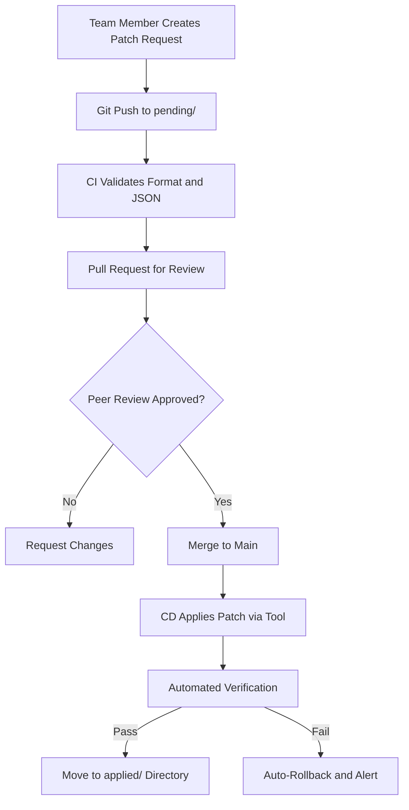

# How to Standardize Team Workflows Around calicoctl patch

Author: [nawazdhandala](https://github.com/nawazdhandala)

Tags: Calico, Kubernetes, Team Workflows, Calicoctl, Best Practices

Description: Learn how to standardize your team's calicoctl patch workflows with naming conventions, approval processes, documentation templates, and shared tooling for consistent network policy management.

---

## Introduction

When multiple team members use `calicoctl patch` without standardized processes, the result is inconsistent naming conventions, undocumented changes, missing backups, and conflicting patches. One engineer patches a policy to add a new ingress rule while another patches the same policy to change the selector, and neither knows about the other's change.

Standardizing calicoctl patch workflows means establishing conventions for how patches are requested, reviewed, applied, validated, and documented. This transforms ad-hoc network policy changes into a structured, auditable process.

This guide covers the practical steps to build standardized team workflows around calicoctl patch, including shared tooling, approval processes, and documentation practices.

## Prerequisites

- A team managing Calico resources in a shared cluster
- calicoctl v3.27 or later
- A Git repository for storing patch definitions
- CI/CD platform for automated patch application
- Basic understanding of GitOps principles

## Establishing a Patch Request Process

Create a structured patch request workflow using Git:

```bash
# Recommended repository structure for patch requests
calico-patches/
  ├── templates/
  │   └── patch-request.yaml
  ├── pending/
  │   └── 2026-03-14-update-frontend-policy.yaml
  ├── applied/
  │   └── 2026-03-10-fix-dns-policy.yaml
  └── scripts/
      ├── apply-patch.sh
      ├── validate-patch.sh
      └── rollback-patch.sh
```

Define a patch request template:

```yaml
# templates/patch-request.yaml
# Calico Patch Request
requestedBy: ""           # GitHub username
requestDate: ""           # YYYY-MM-DD
environment: ""           # staging or production
resourceKind: ""          # e.g., GlobalNetworkPolicy
resourceName: ""          # Name of the resource to patch
reason: ""                # Why this patch is needed
rollbackPlan: ""          # How to rollback if something goes wrong

# The patch to apply (JSON merge patch format)
patch: {}

# Expected result after patching
expectedResult: ""

# Verification steps
verificationSteps:
  - ""
```

Example patch request:

```yaml
# pending/2026-03-14-update-frontend-policy.yaml
requestedBy: "nawazdhandala"
requestDate: "2026-03-14"
environment: "production"
resourceKind: "GlobalNetworkPolicy"
resourceName: "allow-frontend-ingress"
reason: "Add port 8443 for HTTPS health checks from load balancer"
rollbackPlan: "Remove port 8443 from destination ports array"

patch:
  spec:
    ingress:
      - action: Allow
        protocol: TCP
        source:
          nets:
            - 10.0.0.0/8
        destination:
          ports:
            - 80
            - 443
            - 8443

expectedResult: "Frontend pods accept traffic on ports 80, 443, and 8443 from 10.0.0.0/8"

verificationSteps:
  - "curl frontend-pod:8443 from a pod in the 10.0.0.0/8 range"
  - "Verify port 8443 is blocked from outside 10.0.0.0/8"
```

## Shared Tooling for Patch Operations

Create a standardized CLI wrapper for all patch operations:

```bash
#!/bin/bash
# calico-patch-tool.sh
# Standardized calicoctl patch tool for team use

set -euo pipefail

export DATASTORE_TYPE=kubernetes
COMMAND="${1:-help}"
shift || true

BACKUP_DIR="/var/backups/calico-patches"
LOG_FILE="/var/log/calico-patches.log"
mkdir -p "$BACKUP_DIR"

log() {
  echo "$(date -u +%Y-%m-%dT%H:%M:%SZ) [$(whoami)] $*" >> "$LOG_FILE"
  echo "$*"
}

case "$COMMAND" in
  apply)
    PATCH_FILE="${1:?Usage: calico-patch-tool.sh apply <patch-request.yaml>}"

    # Parse patch request
    RESOURCE_KIND=$(python3 -c "import yaml; print(yaml.safe_load(open('$PATCH_FILE'))['resourceKind'])")
    RESOURCE_NAME=$(python3 -c "import yaml; print(yaml.safe_load(open('$PATCH_FILE'))['resourceName'])")
    PATCH_JSON=$(python3 -c "import yaml, json; print(json.dumps(yaml.safe_load(open('$PATCH_FILE'))['patch']))")
    REQUESTED_BY=$(python3 -c "import yaml; print(yaml.safe_load(open('$PATCH_FILE'))['requestedBy'])")

    # Backup current state
    TIMESTAMP=$(date +%Y%m%d-%H%M%S)
    BACKUP_FILE="${BACKUP_DIR}/${RESOURCE_KIND}-${RESOURCE_NAME}-${TIMESTAMP}.yaml"
    calicoctl get "$RESOURCE_KIND" "$RESOURCE_NAME" -o yaml > "$BACKUP_FILE"

    # Apply patch
    log "PATCH ${RESOURCE_KIND}/${RESOURCE_NAME} by ${REQUESTED_BY}"
    calicoctl patch "$RESOURCE_KIND" "$RESOURCE_NAME" -p "$PATCH_JSON"
    log "PATCH APPLIED - backup: $BACKUP_FILE"
    ;;

  rollback)
    RESOURCE_KIND="${1:?Usage: calico-patch-tool.sh rollback <kind> <name>}"
    RESOURCE_NAME="${2:?}"

    # Find the latest backup
    BACKUP_FILE=$(ls -t "${BACKUP_DIR}/${RESOURCE_KIND}-${RESOURCE_NAME}-"*.yaml 2>/dev/null | head -1)
    if [ -z "$BACKUP_FILE" ]; then
      echo "No backup found for ${RESOURCE_KIND}/${RESOURCE_NAME}"
      exit 1
    fi

    log "ROLLBACK ${RESOURCE_KIND}/${RESOURCE_NAME} from ${BACKUP_FILE}"
    calicoctl apply -f "$BACKUP_FILE"
    log "ROLLBACK COMPLETE"
    ;;

  history)
    echo "=== Recent Patch Operations ==="
    tail -20 "$LOG_FILE"
    ;;

  *)
    echo "Usage: calico-patch-tool.sh {apply|rollback|history}"
    echo ""
    echo "  apply <patch-request.yaml>  - Apply a patch request"
    echo "  rollback <kind> <name>      - Rollback to last backup"
    echo "  history                     - Show recent operations"
    ;;
esac
```

## CI/CD Enforcement

Use CI/CD to enforce the standardized workflow:

```yaml
# .github/workflows/calico-patch-workflow.yaml
name: Calico Patch Workflow
on:
  pull_request:
    paths: ['calico-patches/pending/**']

jobs:
  validate:
    runs-on: ubuntu-latest
    steps:
      - uses: actions/checkout@v4

      - name: Validate patch request format
        run: |
          for file in calico-patches/pending/*.yaml; do
            echo "Validating: $file"
            python3 -c "
          import yaml, sys
          doc = yaml.safe_load(open('$file'))
          required = ['requestedBy','resourceKind','resourceName','reason','patch','rollbackPlan']
          missing = [f for f in required if not doc.get(f)]
          if missing:
              print(f'Missing fields: {missing}')
              sys.exit(1)
          print('Valid')
          "
          done

      - name: Validate patch JSON
        run: |
          for file in calico-patches/pending/*.yaml; do
            python3 -c "
          import yaml, json
          doc = yaml.safe_load(open('$file'))
          patch = json.dumps(doc['patch'])
          print(f'Patch JSON: {patch}')
          "
          done
```



## Verification

```bash
# Check patch operation history
./calico-patch-tool.sh history

# Verify applied patches match requests
export DATASTORE_TYPE=kubernetes
calicoctl get globalnetworkpolicy allow-frontend-ingress -o yaml

# List all backups
ls -lt /var/backups/calico-patches/
```

## Troubleshooting

- **Team members bypass the workflow**: Enforce RBAC so that direct calicoctl access is limited to the CI/CD service account. Individual users should only have read access.
- **Conflicting patches from different team members**: The Git-based workflow with pull request reviews prevents conflicting changes from being applied simultaneously.
- **Patch request template too restrictive**: Adjust the required fields based on team feedback. Start with minimal requirements and add fields as needed.
- **CI validation fails on valid patches**: Update the validation script to handle edge cases in the patch format.

## Conclusion

Standardizing team workflows around calicoctl patch transforms network policy management from an ad-hoc, risky process into a structured, auditable workflow. By using patch request templates, shared tooling, CI/CD enforcement, and Git-based review processes, you ensure that every patch is documented, reviewed, backed up, and reversible. This approach scales from small teams to large organizations managing complex Calico deployments.
