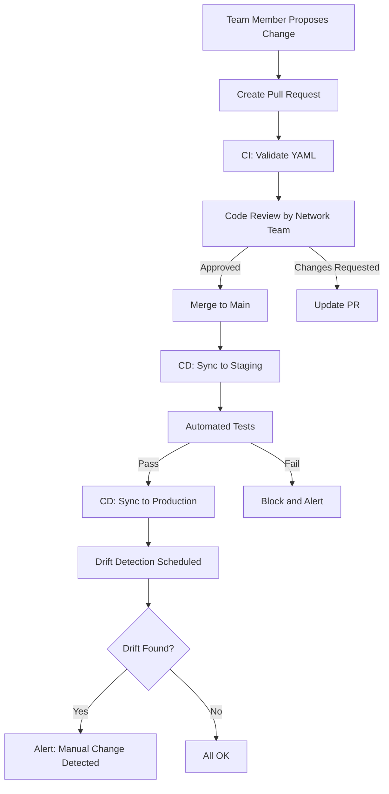

# How to Standardize Team Workflows Around calicoctl replace

Author: [nawazdhandala](https://github.com/nawazdhandala)

Tags: Calico, Kubernetes, Team Workflows, Calicoctl, GitOps

Description: Learn how to standardize your team's calicoctl replace workflows with code review processes, naming conventions, CI/CD enforcement, and shared tooling for consistent resource management.

---

## Introduction

When multiple team members independently run `calicoctl replace` against cluster resources, the result is often conflicting changes, lost configuration, and undocumented modifications. Since `replace` overwrites the entire resource, a team member who replaces a policy without including recent changes made by another team member effectively reverts those changes.

Standardizing replace workflows means establishing a single source of truth (Git), requiring code review for changes, automating the replace process through CI/CD, and providing shared tooling that enforces best practices.

This guide covers the practical steps to standardize team workflows around calicoctl replace for safe, auditable, and consistent Calico resource management.

## Prerequisites

- A team managing Calico resources in shared clusters
- Git repository for Calico resource definitions
- CI/CD platform for automated deployments
- calicoctl v3.27 or later

## Establishing Git as the Single Source of Truth

All Calico resources should be stored in Git and applied through automation:

```bash
# Repository structure
calico-gitops/
  ├── clusters/
  │   ├── production/
  │   │   ├── policies/
  │   │   │   ├── default-deny.yaml
  │   │   │   └── allow-dns.yaml
  │   │   └── config/
  │   │       ├── felix.yaml
  │   │       └── bgp.yaml
  │   └── staging/
  │       ├── policies/
  │       └── config/
  ├── shared/
  │   └── global-policies/
  │       └── security-baseline.yaml
  └── scripts/
      ├── sync.sh
      └── diff.sh
```

Example global policy stored in Git:

```yaml
# shared/global-policies/security-baseline.yaml
apiVersion: projectcalico.org/v3
kind: GlobalNetworkPolicy
metadata:
  name: security-baseline
spec:
  order: 10
  selector: all()
  types:
    - Ingress
    - Egress
  egress:
    # Allow DNS
    - action: Allow
      protocol: UDP
      destination:
        selector: k8s-app == "kube-dns"
        ports:
          - 53
    # Allow established connections
    - action: Allow
```

## Code Review Process for Replace Operations

Enforce pull request reviews for all Calico changes:

```yaml
# .github/CODEOWNERS
# Require review from network team for all Calico changes
calico-gitops/ @network-team

# Require additional review for production changes
calico-gitops/clusters/production/ @network-team @platform-leads
```

Pull request template for Calico changes:

```markdown
<!-- .github/pull_request_template.md -->
## Calico Resource Change

### What is being changed?
- Resource type:
- Resource name:
- Environment:

### Why?


### Verification plan
- [ ] Validated with `calicoctl validate`
- [ ] Tested in staging
- [ ] Connectivity tests pass
- [ ] Rollback plan documented

### Rollback plan

```

## Automated Sync Pipeline

```yaml
# .github/workflows/calico-sync.yaml
name: Calico Sync
on:
  push:
    branches: [main]
    paths: ['calico-gitops/**']

jobs:
  sync-staging:
    runs-on: ubuntu-latest
    environment: staging
    steps:
      - uses: actions/checkout@v4
      - name: Install calicoctl
        run: |
          curl -L https://github.com/projectcalico/calico/releases/download/v3.27.0/calicoctl-linux-amd64 -o calicoctl
          chmod +x calicoctl && sudo mv calicoctl /usr/local/bin/

      - name: Diff against cluster state
        env:
          DATASTORE_TYPE: kubernetes
        run: bash calico-gitops/scripts/diff.sh calico-gitops/clusters/staging

      - name: Sync to staging
        env:
          DATASTORE_TYPE: kubernetes
        run: bash calico-gitops/scripts/sync.sh calico-gitops/clusters/staging

  sync-production:
    needs: sync-staging
    runs-on: ubuntu-latest
    environment: production
    steps:
      - uses: actions/checkout@v4
      - name: Install calicoctl
        run: |
          curl -L https://github.com/projectcalico/calico/releases/download/v3.27.0/calicoctl-linux-amd64 -o calicoctl
          chmod +x calicoctl && sudo mv calicoctl /usr/local/bin/

      - name: Sync to production
        env:
          DATASTORE_TYPE: kubernetes
        run: bash calico-gitops/scripts/sync.sh calico-gitops/clusters/production
```

## Drift Detection

Detect manual changes that bypass the standardized workflow:

```bash
#!/bin/bash
# diff.sh
# Detects drift between Git and cluster state

set -euo pipefail

export DATASTORE_TYPE=kubernetes
RESOURCE_DIR="${1:?Usage: $0 <resource-directory>}"
DRIFT_FOUND=0

find "$RESOURCE_DIR" -name "*.yaml" | while read file; do
  KIND=$(python3 -c "import yaml; print(yaml.safe_load(open('$file'))['kind'])")
  NAME=$(python3 -c "import yaml; print(yaml.safe_load(open('$file'))['metadata']['name'])")

  # Get cluster state
  CLUSTER_STATE=$(calicoctl get "$KIND" "$NAME" -o json 2>/dev/null) || {
    echo "DRIFT: ${KIND}/${NAME} exists in Git but not in cluster"
    continue
  }

  # Compare spec sections
  python3 -c "
import yaml, json

with open('$file') as f:
    git_spec = yaml.safe_load(f).get('spec', {})

cluster_spec = json.loads('''$CLUSTER_STATE''').get('spec', {})

if git_spec != cluster_spec:
    print(f'DRIFT: ${KIND}/${NAME} differs between Git and cluster')
else:
    print(f'OK: ${KIND}/${NAME}')
" 2>/dev/null || echo "CHECK: ${KIND}/${NAME} needs manual review"
done
```



## Verification

```bash
# Verify no drift exists
bash calico-gitops/scripts/diff.sh calico-gitops/clusters/production

# Verify CODEOWNERS is enforced
cat .github/CODEOWNERS

# Check recent sync pipeline runs
gh run list --workflow=calico-sync.yaml --limit=5
```

## Troubleshooting

- **Team members bypass Git and use calicoctl directly**: Restrict direct calicoctl write access through RBAC. Only the CI/CD service account should have replace/apply permissions.
- **Drift detection shows false positives**: Kubernetes may add default fields not present in Git. Normalize both states before comparison by removing auto-populated fields.
- **Staging sync passes but production fails**: Resource names or namespaces may differ between environments. Use environment-specific directories.
- **Code review bottleneck**: Define escalation paths for urgent changes and allow expedited reviews for critical fixes.

## Conclusion

Standardizing calicoctl replace workflows around Git, code review, and CI/CD automation eliminates the risks of ad-hoc resource management. By establishing Git as the single source of truth, requiring peer review, automating the sync process, and detecting drift, you ensure that every Calico resource change is documented, reviewed, and reversible. This approach scales to large teams and complex multi-cluster environments.
