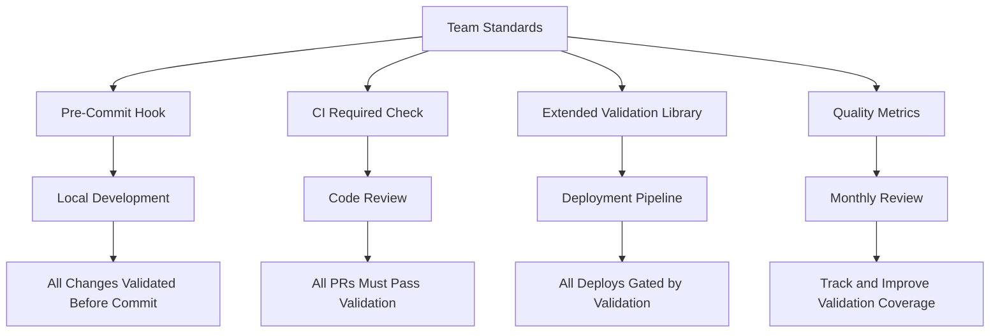

# How to Standardize Team Workflows Around calicoctl validate

Author: [nawazdhandala](https://github.com/nawazdhandala)

Tags: Calico, Kubernetes, Validation, Team Workflows, CI/CD

Description: Learn how to standardize your team's use of calicoctl validate with pre-commit hooks, CI/CD gates, validation libraries, and quality metrics for Calico resource management.

---

## Introduction

Making `calicoctl validate` a consistent part of your team's workflow prevents invalid Calico configurations from reaching any environment. Without standardization, some team members validate their changes while others skip it, leading to inconsistent quality and preventable production incidents.

Standardizing validation means embedding it into every stage of the development lifecycle: local development, code review, CI/CD pipelines, and deployment. It also means creating shared validation libraries and quality metrics that help the team improve over time.

This guide covers how to build a team-wide validation standard around calicoctl validate.

## Prerequisites

- A team managing Calico resources
- Git repository for Calico configurations
- CI/CD platform
- calicoctl v3.27 or later

## Mandatory Pre-Commit Validation

Use a shared pre-commit configuration that all team members install:

```yaml
# .pre-commit-config.yaml
repos:
  - repo: local
    hooks:
      - id: validate-calico
        name: Validate Calico Resources
        entry: bash -c 'for f in "$@"; do calicoctl validate -f "$f" || exit 1; done' --
        language: system
        files: 'calico.*\.yaml$'
        types: [yaml]
```

```bash
# Install pre-commit hooks (team onboarding step)
pip install pre-commit
pre-commit install

# Test it works
echo "invalid:" > calico-resources/test.yaml
git add calico-resources/test.yaml
git commit -m "test" # Should be blocked
rm calico-resources/test.yaml
```

## CI/CD Validation as Required Check

Make validation a required status check on pull requests:

```yaml
# .github/workflows/calico-validate.yaml
name: Calico Validation
on:
  pull_request:
    paths: ['calico-resources/**']

jobs:
  validate:
    runs-on: ubuntu-latest
    steps:
      - uses: actions/checkout@v4
      - name: Install calicoctl
        run: |
          curl -L https://github.com/projectcalico/calico/releases/download/v3.27.0/calicoctl-linux-amd64 -o calicoctl
          chmod +x calicoctl && sudo mv calicoctl /usr/local/bin/

      - name: Validate all Calico resources
        run: |
          PASS=0; FAIL=0
          for file in $(find calico-resources -name "*.yaml" -not -name "kustomization.yaml"); do
            if calicoctl validate -f "$file" > /dev/null 2>&1; then
              PASS=$((PASS + 1))
            else
              echo "::error file=$file::Validation failed"
              calicoctl validate -f "$file" 2>&1
              FAIL=$((FAIL + 1))
            fi
          done
          echo "Validated: $PASS passed, $FAIL failed"
          [ "$FAIL" -eq 0 ] || exit 1
```

Configure as a required check in GitHub branch protection rules to prevent merging without passing validation.

## Shared Validation Library

Create reusable validation scripts that go beyond basic calicoctl validate:

```bash
#!/bin/bash
# validate-extended.sh
# Extended validation that includes business logic checks

set -euo pipefail

RESOURCE_FILE="${1:?Usage: $0 <resource-file.yaml>}"
ERRORS=0

# Check 1: Basic calicoctl validation
echo "Check 1: Syntax validation..."
if ! calicoctl validate -f "$RESOURCE_FILE" 2>&1; then
  ERRORS=$((ERRORS + 1))
fi

# Check 2: Naming convention
echo "Check 2: Naming convention..."
NAME=$(python3 -c "import yaml; print(yaml.safe_load(open('$RESOURCE_FILE'))['metadata']['name'])")
if ! echo "$NAME" | grep -qE '^[a-z][a-z0-9-]*[a-z0-9]$'; then
  echo "  FAIL: Name '$NAME' does not follow convention (lowercase, hyphens only)"
  ERRORS=$((ERRORS + 1))
fi

# Check 3: Required labels/annotations
echo "Check 3: Metadata standards..."
python3 -c "
import yaml, sys
doc = yaml.safe_load(open('$RESOURCE_FILE'))
kind = doc['kind']
metadata = doc.get('metadata', {})

# Check for owner annotation
annotations = metadata.get('annotations', {})
if 'team' not in annotations:
    print('  WARNING: Missing team annotation')
"

# Check 4: Policy order ranges
echo "Check 4: Policy order range..."
python3 -c "
import yaml, sys
doc = yaml.safe_load(open('$RESOURCE_FILE'))
if doc['kind'] in ('GlobalNetworkPolicy', 'NetworkPolicy'):
    order = doc.get('spec', {}).get('order')
    if order is not None:
        if order < 100 or order > 9000:
            print(f'  WARNING: Order {order} outside recommended range (100-9000)')
            sys.exit(1)
        print(f'  OK: Order {order} is within recommended range')
" || ERRORS=$((ERRORS + 1))

echo ""
if [ "$ERRORS" -gt 0 ]; then
  echo "RESULT: $ERRORS validation error(s) found"
  exit 1
else
  echo "RESULT: All checks passed"
fi
```

## Validation Quality Metrics

Track validation effectiveness over time:

```bash
#!/bin/bash
# validation-metrics.sh
# Generates validation quality metrics

set -euo pipefail

RESOURCE_DIR="${1:-.}"
METRICS_FILE="/tmp/calico-validation-metrics.json"

TOTAL=0
VALID=0
INVALID=0
ERRORS_BY_TYPE="{}"

find "$RESOURCE_DIR" -name "*.yaml" -not -name "kustomization.yaml" | while read file; do
  TOTAL=$((TOTAL + 1))
  output=$(calicoctl validate -f "$file" 2>&1)
  if [ $? -eq 0 ]; then
    VALID=$((VALID + 1))
  else
    INVALID=$((INVALID + 1))
    echo "INVALID: $file - $output"
  fi
done

echo "{
  \"date\": \"$(date -u +%Y-%m-%dT%H:%M:%SZ)\",
  \"total_files\": $TOTAL,
  \"valid\": $VALID,
  \"invalid\": $INVALID,
  \"pass_rate\": $(echo "scale=2; $VALID * 100 / $TOTAL" | bc 2>/dev/null || echo "0")
}" > "$METRICS_FILE"

cat "$METRICS_FILE"
```



## Verification

```bash
# Verify pre-commit hook is installed
pre-commit run --all-files

# Verify CI check is configured as required
gh api repos/{owner}/{repo}/branches/main/protection/required_status_checks

# Run the extended validation on all resources
find calico-resources -name "*.yaml" | while read f; do
  bash validate-extended.sh "$f" || true
done
```

## Troubleshooting

- **Pre-commit hook too slow**: Cache the calicoctl binary and only validate changed files, not the entire directory.
- **CI validation inconsistent with local**: Pin the exact same calicoctl version in both environments.
- **Extended validation too strict**: Start with warnings instead of errors for new checks. Gradually convert to errors as the team adapts.
- **Team members disable pre-commit hooks**: Use CI as the enforcing gate. Pre-commit is convenience; CI is the mandatory checkpoint.

## Conclusion

Standardizing calicoctl validate across your team creates a consistent quality baseline for all Calico resource changes. By combining pre-commit hooks for immediate feedback, CI gates for enforcement, extended validation for business logic, and metrics for continuous improvement, you build a validation culture that prevents misconfigurations at every stage. The result is fewer production incidents, faster reviews, and higher confidence in Calico changes.
