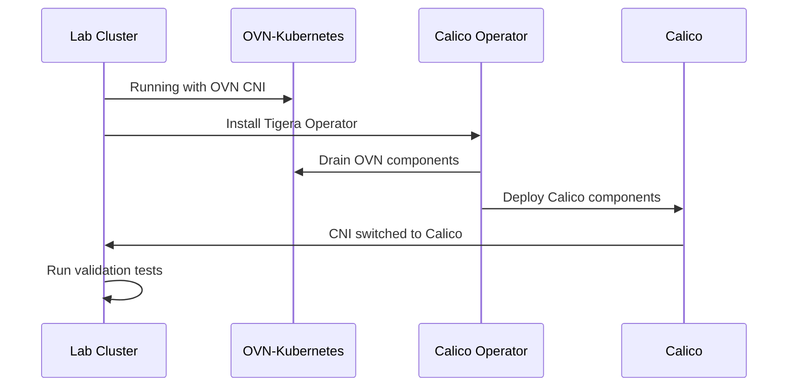

# How to Test Migration from OVN to Calico on OpenShift in a Lab Environment

Author: [nawazdhandala](https://github.com/nawazdhandala)

Tags: Calico, OpenShift, OVN, Testing, Lab

Description: Step-by-step instructions for setting up a lab environment to safely test OVN-to-Calico migration on OpenShift, including test scenarios, validation procedures, and rollback planning.

---

## Introduction

Testing the migration from OVN-Kubernetes to Calico in a lab environment is a critical step before touching production clusters. A well-structured lab test catches networking regressions, policy translation errors, and performance issues before they affect real workloads.

This guide walks you through building a representative lab environment, executing the migration, and running a comprehensive test suite that covers connectivity, policy enforcement, and performance benchmarks. The goal is to build confidence that the migration will succeed in production.

A lab environment does not need to match production scale, but it must replicate the networking topology, policy structure, and workload patterns that matter most to your applications.

## Prerequisites

- A dedicated OpenShift 4.x lab cluster (3 control plane nodes, 2+ worker nodes minimum)
- OVN-Kubernetes configured as the current CNI
- Exported network policies and configuration from production (sanitized)
- Access to container images used by production workloads
- A test automation framework such as shell scripts or Ansible

## Setting Up the Lab Cluster

Provision a lab cluster that mirrors your production networking topology. Use the OpenShift installer with a configuration that matches production network CIDRs.

```bash
# Create an install-config.yaml matching production network settings
cat > install-config.yaml << 'EOF'
apiVersion: v1
metadata:
  name: calico-migration-lab
networking:
  # Match production cluster network CIDR
  clusterNetwork:
    - cidr: 10.128.0.0/14
      hostPrefix: 23
  # Match production service network CIDR
  serviceNetwork:
    - 172.30.0.0/16
  networkType: OVNKubernetes
baseDomain: lab.example.com
compute:
  - name: worker
    replicas: 2
controlPlane:
  name: master
  replicas: 3
EOF

# Deploy the lab cluster
openshift-install create cluster --dir=. --log-level=info
```

Deploy representative workloads that exercise the same networking patterns as production:

```bash
# Create test namespaces matching production structure
oc create namespace test-frontend
oc create namespace test-backend
oc create namespace test-database

# Deploy a multi-tier application for connectivity testing
oc apply -f - << 'EOF'
apiVersion: apps/v1
kind: Deployment
metadata:
  name: web-server
  namespace: test-frontend
spec:
  replicas: 2
  selector:
    matchLabels:
      app: web-server
  template:
    metadata:
      labels:
        app: web-server
    spec:
      containers:
        - name: nginx
          image: nginx:1.25
          ports:
            - containerPort: 80
          # Resource limits for realistic scheduling
          resources:
            requests:
              cpu: 100m
              memory: 128Mi
---
apiVersion: v1
kind: Service
metadata:
  name: web-server
  namespace: test-frontend
spec:
  selector:
    app: web-server
  ports:
    - port: 80
      targetPort: 80
EOF
```

## Executing the Migration in the Lab

Apply network policies that mirror production before starting the migration. This ensures policy translation is tested.

```yaml
# test-network-policy.yaml
# Mirrors a production network policy for testing
apiVersion: networking.k8s.io/v1
kind: NetworkPolicy
metadata:
  name: allow-frontend-to-backend
  namespace: test-backend
spec:
  podSelector:
    matchLabels:
      app: api-server
  policyTypes:
    - Ingress
  ingress:
    - from:
        - namespaceSelector:
            matchLabels:
              kubernetes.io/metadata.name: test-frontend
      ports:
        - protocol: TCP
          port: 8080
```

Install the Calico operator and trigger the CNI switch:

```bash
# Install the Tigera operator for Calico
oc apply -f https://docs.projectcalico.org/archive/v3.27/manifests/tigera-operator.yaml

# Apply Calico installation CR to switch from OVN
oc apply -f - << 'EOF'
apiVersion: operator.tigera.io/v1
kind: Installation
metadata:
  name: default
spec:
  variant: Calico
  calicoNetwork:
    ipPools:
      - cidr: 10.128.0.0/14
        encapsulation: VXLAN
        natOutgoing: Enabled
        nodeSelector: all()
EOF

# Monitor the migration progress
oc get pods -n calico-system -w
```



## Running the Test Suite

Execute a comprehensive test suite that validates connectivity, policy enforcement, and performance.

```bash
#!/bin/bash
# migration-test-suite.sh
# Comprehensive test suite for OVN to Calico migration validation

set -euo pipefail

PASS=0
FAIL=0

run_test() {
  local name="$1"
  local cmd="$2"
  echo -n "Testing: ${name}... "
  if eval "$cmd" > /dev/null 2>&1; then
    echo "PASS"
    ((PASS++))
  else
    echo "FAIL"
    ((FAIL++))
  fi
}

# Test 1: Pod-to-pod connectivity within the same namespace
run_test "intra-namespace connectivity" \
  "oc exec -n test-frontend deploy/web-server -- wget -qO- --timeout=5 http://web-server.test-frontend.svc.cluster.local"

# Test 2: Cross-namespace connectivity (frontend to backend)
run_test "cross-namespace connectivity" \
  "oc exec -n test-frontend deploy/web-server -- wget -qO- --timeout=5 http://api-server.test-backend.svc.cluster.local:8080"

# Test 3: DNS resolution
run_test "DNS resolution" \
  "oc exec -n test-frontend deploy/web-server -- nslookup kubernetes.default.svc.cluster.local"

# Test 4: External egress connectivity
run_test "external egress" \
  "oc exec -n test-frontend deploy/web-server -- wget -qO- --timeout=5 http://httpbin.org/get"

# Test 5: Calico node health
run_test "calico-node pods healthy" \
  "oc get pods -n calico-system -l k8s-app=calico-node --no-headers | grep -v Running | wc -l | grep -q '^0$'"

echo ""
echo "Results: ${PASS} passed, ${FAIL} failed"
exit $FAIL
```

## Verification

After the test suite passes, perform additional manual verification:

```bash
# Verify all Calico components are healthy
oc get tigerastatus

# Check that IP pools are correctly configured
oc get ippools.projectcalico.org -o yaml

# Verify no pods are in error state
oc get pods --all-namespaces --field-selector=status.phase!=Running,status.phase!=Succeeded

# Run a bandwidth test between pods on different nodes
oc run iperf-server --image=networkstatic/iperf3 --restart=Never -- iperf3 -s
oc run iperf-client --image=networkstatic/iperf3 --restart=Never -- iperf3 -c iperf-server -t 30
oc logs iperf-client
```

## Troubleshooting

- **Lab cluster provisioning fails**: Verify that your infrastructure provider has sufficient resources. Check `openshift-install` logs in the `.openshift_install.log` file.
- **Calico pods crash-looping**: Check operator logs with `oc logs -n tigera-operator -l name=tigera-operator`. Common cause is CIDR conflicts between IP pools.
- **Test suite DNS failures**: CoreDNS may need time to stabilize after CNI switch. Wait 2-3 minutes and retry. Check CoreDNS pod logs if failures persist.
- **Network policy tests failing**: Verify policies were applied correctly with `oc get networkpolicies -n test-backend -o yaml`. Calico may need a few seconds to program new policies.
- **Rollback needed**: If the migration fails, reinstall the cluster with OVN-Kubernetes. In a lab, a fresh install is faster than attempting a CNI rollback.

## Conclusion

Testing the OVN to Calico migration in a lab environment protects your production clusters from unexpected networking issues. By deploying representative workloads, applying production-equivalent policies, and running a systematic test suite, you build the evidence needed to proceed with confidence. Document all test results and share them with your team before scheduling the production migration window.
