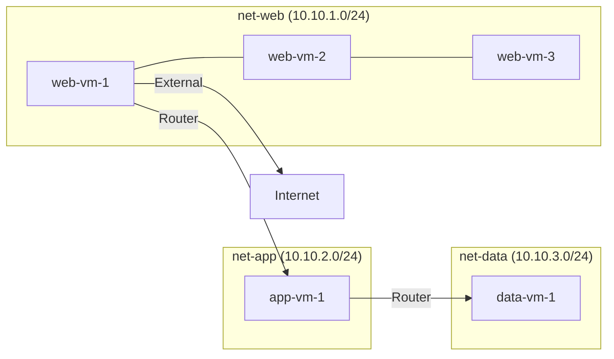

# How to Test OpenStack Connectivity with Calico in Production-Like Environments

Author: [nawazdhandala](https://github.com/nawazdhandala)

Tags: OpenStack, Calico, Connectivity, Testing, Production

Description: A practical guide to systematically testing OpenStack VM connectivity under Calico networking in production-like environments, covering VM-to-VM, cross-network, and external connectivity scenarios.

---

## Introduction

Testing OpenStack connectivity with Calico requires a methodical approach that goes beyond simple ping tests. Calico's Layer 3 networking model routes traffic differently than traditional OpenStack networking, and each connectivity path must be validated independently to catch issues before they affect production workloads.

This guide walks through a structured connectivity test plan covering intra-network VM communication, cross-network routing, external access, and metadata service availability. Each test includes expected behavior specific to Calico's architecture.

Understanding how Calico handles OpenStack networking is essential: there are no virtual switches, no overlay networks for intra-host traffic, and security groups are enforced via iptables or eBPF rules directly on the compute node.

## Prerequisites

- An OpenStack environment with Calico as the networking backend
- At least 3 compute nodes for cross-node testing
- OpenStack CLI tools configured with admin and tenant credentials
- VM images with networking tools (curl, ping, traceroute, nc)
- Access to compute node logs and Calico configuration

## Setting Up Test Infrastructure

Create a comprehensive test environment with multiple networks and VM types.

```bash
# Create test project
openstack project create connectivity-test

# Create three separate networks to test different connectivity paths
openstack network create --project connectivity-test net-web
openstack subnet create --project connectivity-test \
  --network net-web --subnet-range 10.10.1.0/24 \
  --dns-nameserver 8.8.8.8 subnet-web

openstack network create --project connectivity-test net-app
openstack subnet create --project connectivity-test \
  --network net-app --subnet-range 10.10.2.0/24 \
  --dns-nameserver 8.8.8.8 subnet-app

openstack network create --project connectivity-test net-data
openstack subnet create --project connectivity-test \
  --network net-data --subnet-range 10.10.3.0/24 \
  --dns-nameserver 8.8.8.8 subnet-data

# Create a router connecting the networks
openstack router create --project connectivity-test test-router
openstack router add subnet test-router subnet-web
openstack router add subnet test-router subnet-app
openstack router add subnet test-router subnet-data
```

Deploy test VMs across networks and compute nodes:

```bash
# Deploy VMs on the web network (spread across compute nodes)
for i in 1 2 3; do
  openstack server create --project connectivity-test \
    --flavor m1.small --image ubuntu-22.04 \
    --network net-web --security-group default \
    --availability-zone nova:compute-0${i} \
    web-vm-${i}
done

# Deploy VMs on the app network
openstack server create --project connectivity-test \
  --flavor m1.small --image ubuntu-22.04 \
  --network net-app --security-group default \
  app-vm-1

# Deploy VMs on the data network
openstack server create --project connectivity-test \
  --flavor m1.small --image ubuntu-22.04 \
  --network net-data --security-group default \
  data-vm-1
```

## Running Connectivity Tests

Execute a systematic test suite covering all connectivity paths.

```bash
#!/bin/bash
# connectivity-test-suite.sh
# Systematic OpenStack Calico connectivity testing

PASS=0
FAIL=0

test_connectivity() {
  local desc="$1"
  local cmd="$2"
  echo -n "  ${desc}: "
  if eval "${cmd}" > /dev/null 2>&1; then
    echo "PASS"
    ((PASS++))
  else
    echo "FAIL"
    ((FAIL++))
  fi
}

echo "=== Intra-Network Tests (Same Network) ==="
WEB1_IP=$(openstack server show web-vm-1 -f value -c addresses | grep -oP '10\.10\.1\.\d+')
WEB2_IP=$(openstack server show web-vm-2 -f value -c addresses | grep -oP '10\.10\.1\.\d+')

test_connectivity "web-vm-1 -> web-vm-2 ICMP" \
  "ssh ubuntu@${WEB1_IP} 'ping -c 3 -W 5 ${WEB2_IP}'"
test_connectivity "web-vm-2 -> web-vm-1 ICMP" \
  "ssh ubuntu@${WEB2_IP} 'ping -c 3 -W 5 ${WEB1_IP}'"

echo ""
echo "=== Cross-Network Tests (Via Router) ==="
APP1_IP=$(openstack server show app-vm-1 -f value -c addresses | grep -oP '10\.10\.2\.\d+')
DATA1_IP=$(openstack server show data-vm-1 -f value -c addresses | grep -oP '10\.10\.3\.\d+')

test_connectivity "web-vm-1 -> app-vm-1 ICMP" \
  "ssh ubuntu@${WEB1_IP} 'ping -c 3 -W 5 ${APP1_IP}'"
test_connectivity "web-vm-1 -> data-vm-1 ICMP" \
  "ssh ubuntu@${WEB1_IP} 'ping -c 3 -W 5 ${DATA1_IP}'"
test_connectivity "app-vm-1 -> data-vm-1 ICMP" \
  "ssh ubuntu@${APP1_IP} 'ping -c 3 -W 5 ${DATA1_IP}'"

echo ""
echo "=== DNS and Metadata Tests ==="
test_connectivity "DNS resolution from web-vm-1" \
  "ssh ubuntu@${WEB1_IP} 'nslookup google.com'"
test_connectivity "Metadata service from web-vm-1" \
  "ssh ubuntu@${WEB1_IP} 'curl -s --connect-timeout 5 http://169.254.169.254/latest/meta-data/instance-id'"

echo ""
echo "Results: ${PASS} passed, ${FAIL} failed"
```



## Testing Under Load

Validate connectivity remains stable under network load.

```bash
# Install iperf3 on test VMs
ssh ubuntu@${WEB1_IP} "sudo apt-get install -y iperf3"
ssh ubuntu@${WEB2_IP} "sudo apt-get install -y iperf3"

# Start iperf3 server on web-vm-2
ssh ubuntu@${WEB2_IP} "iperf3 -s -D"

# Generate sustained load while testing connectivity
ssh ubuntu@${WEB1_IP} "iperf3 -c ${WEB2_IP} -t 60 -P 8" &

# While load is running, test connectivity from other VMs
sleep 5
ssh ubuntu@${WEB1_IP} "ping -c 10 ${APP1_IP}"
ssh ubuntu@${APP1_IP} "ping -c 10 ${DATA1_IP}"
```

## Verification

Generate a final connectivity matrix:

```bash
#!/bin/bash
# generate-connectivity-matrix.sh
# Create a connectivity verification matrix

VMS=("web-vm-1" "web-vm-2" "app-vm-1" "data-vm-1")
echo "Connectivity Matrix - $(date)"
echo "================================"

for src in "${VMS[@]}"; do
  SRC_IP=$(openstack server show ${src} -f value -c addresses | grep -oP '10\.\d+\.\d+\.\d+')
  for dst in "${VMS[@]}"; do
    if [ "${src}" != "${dst}" ]; then
      DST_IP=$(openstack server show ${dst} -f value -c addresses | grep -oP '10\.\d+\.\d+\.\d+')
      result=$(ssh ubuntu@${SRC_IP} "ping -c 1 -W 3 ${DST_IP}" > /dev/null 2>&1 && echo "OK" || echo "FAIL")
      echo "${src} -> ${dst}: ${result}"
    fi
  done
done
```

## Troubleshooting

- **Intra-network ping fails**: Check that both VMs are on the same Calico network. Verify Felix is running on both compute nodes with `sudo calicoctl node status`.
- **Cross-network routing fails**: Verify the OpenStack router is configured and that Calico has routes for all subnets. Check route tables on compute nodes.
- **Metadata service unreachable**: Calico requires specific metadata proxy configuration. Verify that the metadata agent is running and that iptables rules for 169.254.169.254 exist on the compute node.
- **Intermittent connectivity**: Check for asymmetric routing. Calico programs routes on each node independently, and transient inconsistencies can cause brief connectivity gaps during convergence.

## Conclusion

Systematic connectivity testing in a production-like OpenStack environment with Calico ensures that all traffic paths work correctly before real workloads are deployed. By testing intra-network, cross-network, external, and metadata connectivity under various conditions, you validate that Calico's Layer 3 approach meets your requirements. Keep these test scripts for regression testing after upgrades.
