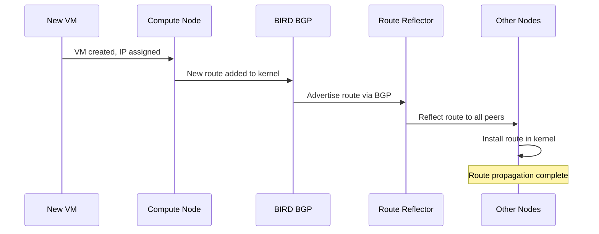

# How to Test OpenStack Host Routes with Calico in Production-Like Environments

Author: [nawazdhandala](https://github.com/nawazdhandala)

Tags: OpenStack, Calico, Host Routes, Testing, Production

Description: A practical guide to testing host route behavior in OpenStack environments using Calico, covering route propagation validation, failover testing, and route convergence benchmarking.

---

## Introduction

Host routes in a Calico-based OpenStack deployment are the backbone of all VM connectivity. Every VM's IP address is advertised as a route through BGP, and every compute node maintains a route table that determines how traffic reaches its destination. Testing these routes thoroughly ensures that VMs can communicate reliably across the deployment.

This guide provides a structured testing approach for host routes, covering route propagation correctness, convergence timing, failover behavior, and the impact of route table changes on running workloads. These tests should be run in a production-like environment before deploying changes to production.

Route testing is especially important after changes to BGP configuration, IP pool settings, or compute node additions, as these events trigger route table updates across the entire deployment.

## Prerequisites

- An OpenStack test environment with Calico networking (3+ compute nodes)
- `calicoctl` and `openstack` CLI tools configured
- SSH access to compute nodes
- Test VM images with networking diagnostic tools
- A baseline route table snapshot from a known-good state

## Creating a Route Testing Baseline

Capture the current route state to compare against after changes.

```bash
#!/bin/bash
# capture-route-baseline.sh
# Capture route table baseline from all compute nodes

TIMESTAMP=$(date +%Y%m%d_%H%M%S)
BASELINE_DIR="/tmp/route-baseline-${TIMESTAMP}"
mkdir -p ${BASELINE_DIR}

for node in $(openstack compute service list -f value -c Host | sort -u); do
  echo "Capturing routes from ${node}..."

  # Capture full route table
  ssh ${node} 'ip route show' > ${BASELINE_DIR}/${node}-routes.txt

  # Capture BGP-learned routes specifically
  ssh ${node} 'ip route show proto bird' > ${BASELINE_DIR}/${node}-bgp-routes.txt

  # Capture BGP peer status
  ssh ${node} 'sudo calicoctl node status' > ${BASELINE_DIR}/${node}-bgp-status.txt

  # Count routes
  echo "${node}: $(wc -l < ${BASELINE_DIR}/${node}-routes.txt) total routes"
done

echo "Baseline saved to ${BASELINE_DIR}"
```

## Testing Route Propagation

Validate that new VM routes propagate correctly to all compute nodes.

```bash
#!/bin/bash
# test-route-propagation.sh
# Test that new VM routes appear on all compute nodes

echo "=== Route Propagation Test ==="

# Create a test VM
openstack server create --project calico-test \
  --flavor m1.small --image ubuntu-22.04 \
  --network test-network \
  route-test-vm

# Wait for VM to become active
echo "Waiting for VM to become active..."
openstack server wait route-test-vm

# Get the VM's IP address
VM_IP=$(openstack server show route-test-vm -f value -c addresses | grep -oP '\d+\.\d+\.\d+\.\d+')
echo "VM IP: ${VM_IP}"

# Check that the route appears on all compute nodes
echo ""
echo "Checking route propagation..."
sleep 10  # Allow BGP convergence time

ALL_GOOD=true
for node in $(openstack compute service list -f value -c Host | sort -u); do
  route=$(ssh ${node} "ip route show ${VM_IP}")
  if [ -n "${route}" ]; then
    echo "${node}: FOUND - ${route}"
  else
    echo "${node}: MISSING - route to ${VM_IP} not found"
    ALL_GOOD=false
  fi
done

if ${ALL_GOOD}; then
  echo ""
  echo "Route propagation: PASS"
else
  echo ""
  echo "Route propagation: FAIL"
fi
```



## Testing Route Withdrawal

Verify that routes are properly cleaned up when VMs are deleted.

```bash
#!/bin/bash
# test-route-withdrawal.sh
# Test that VM deletion removes routes from all compute nodes

echo "=== Route Withdrawal Test ==="

VM_IP=$(openstack server show route-test-vm -f value -c addresses | grep -oP '\d+\.\d+\.\d+\.\d+')
echo "VM IP to be withdrawn: ${VM_IP}"

# Delete the test VM
openstack server delete route-test-vm

# Wait for route withdrawal
echo "Waiting for route withdrawal..."
sleep 15

# Verify route is removed from all nodes
ALL_CLEAN=true
for node in $(openstack compute service list -f value -c Host | sort -u); do
  route=$(ssh ${node} "ip route show ${VM_IP}")
  if [ -z "${route}" ]; then
    echo "${node}: CLEAN - route removed"
  else
    echo "${node}: STALE - route still present: ${route}"
    ALL_CLEAN=false
  fi
done

if ${ALL_CLEAN}; then
  echo "Route withdrawal: PASS"
else
  echo "Route withdrawal: FAIL (stale routes detected)"
fi
```

## Testing Route Convergence Time

Measure how long it takes for routes to propagate across the deployment.

```bash
#!/bin/bash
# test-convergence-time.sh
# Measure route convergence time across the cluster

echo "=== Convergence Time Test ==="

# Record start time
START=$(date +%s%N)

# Create a test VM
openstack server create --project calico-test \
  --flavor m1.small --image cirros \
  --network test-network \
  convergence-test-vm

openstack server wait convergence-test-vm

VM_IP=$(openstack server show convergence-test-vm -f value -c addresses | grep -oP '\d+\.\d+\.\d+\.\d+')

# Poll all nodes until the route appears everywhere
MAX_WAIT=60
ELAPSED=0
while [ ${ELAPSED} -lt ${MAX_WAIT} ]; do
  ALL_FOUND=true
  for node in $(openstack compute service list -f value -c Host | sort -u); do
    route=$(ssh ${node} "ip route show ${VM_IP}" 2>/dev/null)
    if [ -z "${route}" ]; then
      ALL_FOUND=false
      break
    fi
  done

  if ${ALL_FOUND}; then
    END=$(date +%s%N)
    CONVERGENCE_MS=$(( (END - START) / 1000000 ))
    echo "Route converged on all nodes in ${CONVERGENCE_MS}ms"
    break
  fi

  sleep 1
  ((ELAPSED++))
done

if [ ${ELAPSED} -ge ${MAX_WAIT} ]; then
  echo "FAIL: Route did not converge within ${MAX_WAIT} seconds"
fi

# Cleanup
openstack server delete convergence-test-vm
```

## Verification

Run the complete route test suite and generate a report.

```bash
#!/bin/bash
# route-test-report.sh
# Generate comprehensive route test report

echo "Host Route Test Report - $(date)"
echo "==================================="
echo ""
echo "Environment:"
echo "  Compute nodes: $(openstack compute service list -f value -c Host | sort -u | wc -l)"
echo "  Total VMs: $(openstack server list --all-projects -f value -c ID | wc -l)"
echo ""
echo "Route Summary:"
for node in $(openstack compute service list -f value -c Host | sort -u); do
  total=$(ssh ${node} 'ip route show | wc -l')
  bgp=$(ssh ${node} 'ip route show proto bird | wc -l')
  echo "  ${node}: ${total} total, ${bgp} via BGP"
done
```

## Troubleshooting

- **Routes not propagating**: Check BIRD logs on the compute node with `sudo journalctl -u calico-bird`. Verify BGP sessions are established with `calicoctl node status`.
- **Stale routes after VM deletion**: Check that the Calico Felix agent is cleaning up endpoints. Verify with `calicoctl get workloadendpoints` and look for orphaned entries.
- **Slow convergence**: Check BGP timer settings. Default hold time is 90 seconds; reducing it speeds up failure detection but increases BGP traffic. Check route reflector load.
- **Route flapping**: Monitor BIRD logs for repeated route announcements and withdrawals. This usually indicates an unstable BGP session, often caused by resource exhaustion on the compute node.

## Conclusion

Testing host routes in a Calico-based OpenStack environment ensures that route propagation, withdrawal, and convergence work correctly under realistic conditions. By establishing baselines, measuring convergence times, and testing failover scenarios, you can validate that your routing infrastructure handles the demands of your deployment. Run these tests before and after any BGP or IP pool configuration changes.
