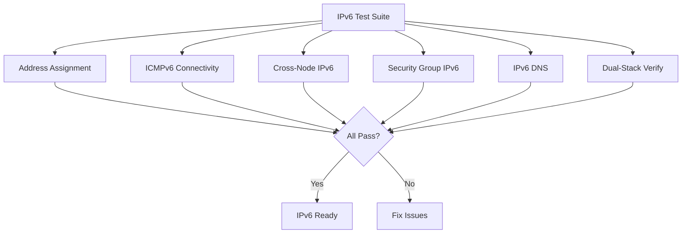

# How to Test OpenStack IPv6 with Calico in Production-Like Environments

Author: [nawazdhandala](https://github.com/nawazdhandala)

Tags: OpenStack, Calico, IPv6, Testing, Production

Description: A comprehensive testing guide for IPv6 networking in OpenStack with Calico, covering dual-stack validation, ICMPv6 requirements, security group testing, and IPv6 performance benchmarking.

---

## Introduction

Testing IPv6 in OpenStack with Calico requires covering scenarios that do not exist in IPv4-only environments. ICMPv6 is mandatory for basic IPv6 operations, neighbor discovery behaves differently from ARP, and security groups must explicitly allow IPv6 traffic types that are essential for connectivity.

This guide provides a structured test plan for IPv6 networking with Calico, covering address assignment, connectivity between VMs, security group enforcement, and performance comparisons between IPv4 and IPv6 paths. Each test includes pass/fail criteria specific to IPv6 behavior.

Running these tests in a production-like environment catches IPv6-specific issues that are invisible in basic IPv4 testing, such as missing ICMPv6 rules, incorrect router advertisement configuration, and NDP timeout problems.

## Prerequisites

- An OpenStack test environment with Calico and IPv6 enabled
- Dual-stack subnets configured in OpenStack
- VM images with IPv6-capable networking tools
- `openstack` CLI and `calicoctl` configured
- Understanding of IPv6 address types (link-local, ULA, GUA)

## Setting Up the IPv6 Test Environment

Create dual-stack networks and subnets for testing.

```bash
# Create a dual-stack network
openstack network create --project ipv6-test dual-stack-net

# Create IPv4 subnet
openstack subnet create --project ipv6-test \
  --network dual-stack-net \
  --subnet-range 10.20.1.0/24 \
  --dns-nameserver 8.8.8.8 \
  dual-stack-v4

# Create IPv6 subnet with SLAAC
openstack subnet create --project ipv6-test \
  --network dual-stack-net \
  --subnet-range fd00:20:1::/64 \
  --ip-version 6 \
  --ipv6-ra-mode slaac \
  --ipv6-address-mode slaac \
  dual-stack-v6

# Create security group allowing ICMPv6 (essential for IPv6)
openstack security group create --project ipv6-test ipv6-test-sg
openstack security group rule create --project ipv6-test \
  --protocol icmpv6 ipv6-test-sg
openstack security group rule create --project ipv6-test \
  --protocol icmp ipv6-test-sg
openstack security group rule create --project ipv6-test \
  --protocol tcp --dst-port 22 ipv6-test-sg
```

Deploy test VMs:

```bash
# Launch dual-stack VMs
openstack server create --project ipv6-test \
  --flavor m1.small --image ubuntu-22.04 \
  --network dual-stack-net \
  --security-group ipv6-test-sg \
  ipv6-test-vm-1

openstack server create --project ipv6-test \
  --flavor m1.small --image ubuntu-22.04 \
  --network dual-stack-net \
  --security-group ipv6-test-sg \
  ipv6-test-vm-2

# Verify VMs have both IPv4 and IPv6 addresses
openstack server show ipv6-test-vm-1 -f value -c addresses
openstack server show ipv6-test-vm-2 -f value -c addresses
```

## Running IPv6 Connectivity Tests

```bash
#!/bin/bash
# ipv6-test-suite.sh
# Comprehensive IPv6 connectivity test suite

PASS=0
FAIL=0

test_it() {
  local desc="$1"; local cmd="$2"
  echo -n "  ${desc}: "
  if eval "${cmd}" > /dev/null 2>&1; then
    echo "PASS"; ((PASS++))
  else
    echo "FAIL"; ((FAIL++))
  fi
}

VM1_V4="10.20.1.10"   # Replace with actual IPs
VM1_V6="fd00:20:1::10"
VM2_V4="10.20.1.11"
VM2_V6="fd00:20:1::11"

echo "=== IPv6 Address Assignment ==="
test_it "VM1 has IPv6 address" \
  "ssh ubuntu@${VM1_V4} 'ip -6 addr show | grep fd00'"
test_it "VM2 has IPv6 address" \
  "ssh ubuntu@${VM2_V4} 'ip -6 addr show | grep fd00'"

echo ""
echo "=== IPv6 Connectivity ==="
test_it "VM1 -> VM2 ICMPv6" \
  "ssh ubuntu@${VM1_V4} 'ping6 -c 3 ${VM2_V6}'"
test_it "VM2 -> VM1 ICMPv6" \
  "ssh ubuntu@${VM2_V4} 'ping6 -c 3 ${VM1_V6}'"

echo ""
echo "=== IPv6 DNS Resolution ==="
test_it "IPv6 DNS from VM1" \
  "ssh ubuntu@${VM1_V4} 'host -t AAAA google.com'"

echo ""
echo "=== IPv4 Still Works (Dual-Stack) ==="
test_it "VM1 -> VM2 IPv4" \
  "ssh ubuntu@${VM1_V4} 'ping -c 3 ${VM2_V4}'"

echo ""
echo "Results: ${PASS} passed, ${FAIL} failed"
```



## Testing IPv6 Security Group Enforcement

```bash
#!/bin/bash
# test-ipv6-security.sh
# Test that security groups work correctly with IPv6

echo "=== IPv6 Security Group Tests ==="

# Test: ICMPv6 allowed (should work with our security group)
echo -n "ICMPv6 allowed: "
ssh ubuntu@${VM1_V4} "ping6 -c 1 ${VM2_V6}" > /dev/null 2>&1 && echo "PASS" || echo "FAIL"

# Test: TCP 22 allowed
echo -n "SSH over IPv6: "
ssh ubuntu@${VM1_V4} "ssh -6 -o ConnectTimeout=5 -o StrictHostKeyChecking=no ubuntu@${VM2_V6} 'echo ok'" > /dev/null 2>&1 && echo "PASS" || echo "FAIL"

# Test: Unallowed port blocked
echo -n "TCP 8080 blocked over IPv6: "
ssh ubuntu@${VM1_V4} "nc -6 -zv -w 3 ${VM2_V6} 8080" > /dev/null 2>&1 && echo "FAIL (should be blocked)" || echo "PASS"
```

## IPv6 Performance Comparison

```bash
# Compare IPv4 and IPv6 performance
echo "=== IPv4 vs IPv6 Performance ==="

# Install iperf3
ssh ubuntu@${VM1_V4} "sudo apt-get install -y iperf3"
ssh ubuntu@${VM2_V4} "sudo apt-get install -y iperf3"

# Start server on VM2 (listens on both IPv4 and IPv6)
ssh ubuntu@${VM2_V4} "iperf3 -s -D"

# IPv4 benchmark
echo "IPv4 bandwidth:"
ssh ubuntu@${VM1_V4} "iperf3 -c ${VM2_V4} -t 10"

# IPv6 benchmark
echo "IPv6 bandwidth:"
ssh ubuntu@${VM1_V4} "iperf3 -c ${VM2_V6} -t 10 -6"
```

## Verification

```bash
#!/bin/bash
# ipv6-verification-report.sh
echo "IPv6 Test Report - $(date)"
echo "=========================="
echo ""
echo "Dual-Stack Networks:"
openstack subnet list --project ipv6-test -f table
echo ""
echo "VM Addresses:"
for vm in ipv6-test-vm-1 ipv6-test-vm-2; do
  echo "${vm}: $(openstack server show ${vm} -f value -c addresses)"
done
echo ""
echo "IPv6 Routes on Compute Nodes:"
for node in $(openstack compute service list -f value -c Host | sort -u); do
  echo "${node}: $(ssh ${node} 'ip -6 route show proto bird | wc -l') IPv6 routes"
done
```

## Troubleshooting

- **VMs do not get IPv6 addresses**: Verify the IPv6 subnet uses SLAAC or DHCPv6. Check that router advertisements are being sent on the network.
- **ICMPv6 ping fails**: ICMPv6 must be explicitly allowed in security groups. Without it, NDP fails and no IPv6 connectivity works.
- **IPv6 works within a node but not across nodes**: Check that BGP is advertising IPv6 routes. Verify with `ip -6 route show proto bird` on compute nodes.
- **IPv6 performance significantly worse than IPv4**: Check MTU settings. IPv6 has a larger header (40 bytes vs 20 bytes), and if MTU is already at limit, fragmentation may occur.

## Conclusion

Testing IPv6 in OpenStack with Calico requires attention to IPv6-specific requirements like ICMPv6 rules, NDP behavior, and dual-stack policy configuration. By systematically validating address assignment, connectivity, security enforcement, and performance, you ensure your dual-stack deployment works correctly before production traffic arrives. These tests should be part of your standard validation suite for any network configuration changes.
