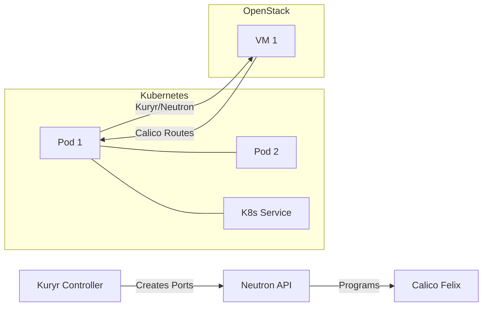

# How to Test OpenStack Kuryr with Calico in Production-Like Environments

Author: [nawazdhandala](https://github.com/nawazdhandala)

Tags: OpenStack, Calico, Kuryr, Testing, Production

Description: A guide to testing Kuryr-Kubernetes integration with Calico in OpenStack environments, covering pod networking validation, VM-to-pod connectivity, and cross-system policy enforcement testing.

---

## Introduction

Testing Kuryr integration with Calico in OpenStack involves validating a complex interaction between three systems: Kubernetes pod scheduling, OpenStack Neutron port management, and Calico route programming. Each system must work correctly for pods to receive network connectivity, communicate with VMs, and have security policies enforced.

This guide provides a structured test plan that validates the full Kuryr-Calico integration path, from pod creation through network connectivity to policy enforcement. Tests are designed to run in a production-like environment that exercises realistic workload patterns.

The critical integration points to test are: Kuryr creating Neutron ports for pods, Calico programming routes for those ports, and security policies applying consistently across both VM and pod endpoints.

## Prerequisites

- An OpenStack environment with Calico networking and Kuryr-Kubernetes deployed
- A Kubernetes cluster running on OpenStack VMs
- `kubectl`, `openstack`, and `calicoctl` CLI tools configured
- Test container images and VM images with networking tools
- Understanding of both Kubernetes and OpenStack networking concepts

## Setting Up the Test Environment

Deploy test workloads across both Kubernetes and OpenStack.

```bash
# Create an OpenStack VM for VM-to-pod testing
openstack server create --project kuryr-test \
  --flavor m1.small --image ubuntu-22.04 \
  --network shared-network \
  --security-group default \
  test-vm-1

# Deploy Kubernetes test pods
kubectl create namespace kuryr-test

kubectl apply -f - << 'EOF'
apiVersion: apps/v1
kind: Deployment
metadata:
  name: test-web
  namespace: kuryr-test
spec:
  replicas: 3
  selector:
    matchLabels:
      app: test-web
  template:
    metadata:
      labels:
        app: test-web
    spec:
      containers:
        - name: nginx
          image: nginx:1.25
          ports:
            - containerPort: 80
          resources:
            requests:
              cpu: 100m
              memory: 64Mi
---
apiVersion: v1
kind: Service
metadata:
  name: test-web
  namespace: kuryr-test
spec:
  selector:
    app: test-web
  ports:
    - port: 80
      targetPort: 80
EOF
```

## Testing Pod Networking via Kuryr

Validate that pods receive Neutron-managed network addresses through Kuryr.

```bash
#!/bin/bash
# test-kuryr-pod-networking.sh
# Validate pod networking through Kuryr

echo "=== Kuryr Pod Networking Tests ==="

# Test 1: Pods have IP addresses from Neutron
echo ""
echo "--- Pod IP Assignment ---"
kubectl get pods -n kuryr-test -o wide
for pod in $(kubectl get pods -n kuryr-test -o name); do
  POD_IP=$(kubectl get ${pod} -n kuryr-test -o jsonpath='{.status.podIP}')
  echo "${pod}: ${POD_IP}"

  # Verify a matching Neutron port exists
  PORT=$(openstack port list --fixed-ip ip-address=${POD_IP} -f value -c ID)
  if [ -n "${PORT}" ]; then
    echo "  Neutron port: ${PORT} (OK)"
  else
    echo "  Neutron port: NOT FOUND (FAIL)"
  fi
done

# Test 2: Pod-to-pod connectivity
echo ""
echo "--- Pod-to-Pod Connectivity ---"
POD1=$(kubectl get pods -n kuryr-test -l app=test-web -o name | head -1)
POD2_IP=$(kubectl get pods -n kuryr-test -l app=test-web -o jsonpath='{.items[1].status.podIP}')
kubectl exec -n kuryr-test ${POD1} -- wget -qO- --timeout=5 http://${POD2_IP} > /dev/null && echo "PASS" || echo "FAIL"

# Test 3: Pod can reach Kubernetes service
echo ""
echo "--- Pod-to-Service Connectivity ---"
kubectl exec -n kuryr-test ${POD1} -- wget -qO- --timeout=5 http://test-web.kuryr-test.svc.cluster.local > /dev/null && echo "PASS" || echo "FAIL"
```

## Testing VM-to-Pod Connectivity

```bash
#!/bin/bash
# test-vm-to-pod.sh
# Test connectivity between OpenStack VMs and Kubernetes pods

VM_IP=$(openstack server show test-vm-1 -f value -c addresses | grep -oP '\d+\.\d+\.\d+\.\d+')
POD_IP=$(kubectl get pods -n kuryr-test -l app=test-web -o jsonpath='{.items[0].status.podIP}')

echo "=== VM-to-Pod Connectivity ==="
echo "VM IP: ${VM_IP}"
echo "Pod IP: ${POD_IP}"

# Test VM can reach pod
echo ""
echo -n "VM -> Pod ICMP: "
ssh ubuntu@${VM_IP} "ping -c 3 -W 5 ${POD_IP}" > /dev/null 2>&1 && echo "PASS" || echo "FAIL"

echo -n "VM -> Pod HTTP: "
ssh ubuntu@${VM_IP} "wget -qO- --timeout=5 http://${POD_IP}" > /dev/null 2>&1 && echo "PASS" || echo "FAIL"

# Test pod can reach VM
echo ""
echo -n "Pod -> VM ICMP: "
kubectl exec -n kuryr-test $(kubectl get pods -n kuryr-test -l app=test-web -o name | head -1) -- ping -c 3 -W 5 ${VM_IP} > /dev/null 2>&1 && echo "PASS" || echo "FAIL"
```



## Testing Policy Enforcement Across VM and Pod Boundaries

```yaml
# kuryr-network-policy.yaml
# Test that Kubernetes NetworkPolicy works via Kuryr
apiVersion: networking.k8s.io/v1
kind: NetworkPolicy
metadata:
  name: deny-all-ingress
  namespace: kuryr-test
spec:
  podSelector:
    matchLabels:
      app: test-web
  policyTypes:
    - Ingress
  ingress: []
```

```bash
# Apply restrictive policy
kubectl apply -f kuryr-network-policy.yaml

# Verify VM can no longer reach pod (should timeout)
echo -n "VM -> Pod blocked by policy: "
ssh ubuntu@${VM_IP} "wget -qO- --timeout=3 http://${POD_IP}" > /dev/null 2>&1 && echo "FAIL (should be blocked)" || echo "PASS"

# Clean up policy
kubectl delete -f kuryr-network-policy.yaml

# Verify connectivity restored
echo -n "VM -> Pod after policy removal: "
ssh ubuntu@${VM_IP} "wget -qO- --timeout=5 http://${POD_IP}" > /dev/null 2>&1 && echo "PASS" || echo "FAIL"
```

## Verification

```bash
#!/bin/bash
# kuryr-verification.sh
echo "Kuryr + Calico Test Report - $(date)"
echo "======================================"
echo ""
echo "Kubernetes Pods:"
kubectl get pods -n kuryr-test -o wide
echo ""
echo "Neutron Ports for Pods:"
openstack port list --device-owner kuryr:bound -f table
echo ""
echo "Calico Endpoints:"
calicoctl get workloadendpoints -n kuryr-test -o wide 2>/dev/null
```

## Troubleshooting

- **Pods stuck in ContainerCreating**: Check Kuryr controller logs with `kubectl logs -n kube-system -l app=kuryr-controller`. Common cause is Neutron API timeout during port creation.
- **VM cannot reach pod**: Verify that routes for pod IPs exist on the VM's compute node. Check with `ip route show <pod-ip>` on the compute node.
- **Network policies not enforced on pods**: Verify Kuryr is translating Kubernetes NetworkPolicy to Neutron security groups. Check that Calico Felix has programmed the corresponding rules.
- **Pod gets IP but no connectivity**: Check that the Neutron port is in ACTIVE state with `openstack port show <port-id>`. A port in DOWN or BUILD state indicates Neutron backend issues.

## Conclusion

Testing Kuryr integration with Calico validates the critical bridge between Kubernetes and OpenStack networking. By testing pod networking, VM-to-pod connectivity, and cross-system policy enforcement, you ensure that the integrated environment works correctly for production workloads. Run these tests after any Kuryr, Calico, or Neutron configuration changes.
