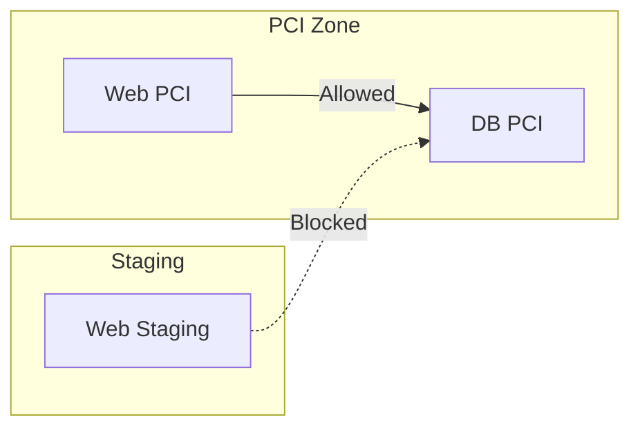

# How to Test OpenStack Labels with Calico in Production-Like Environments

Author: [nawazdhandala](https://github.com/nawazdhandala)

Tags: OpenStack, Calico, Labels, Testing, Production

Description: A guide to testing label-based network policies in OpenStack with Calico, covering label propagation validation, policy selector testing, and label change impact analysis.

---

## Introduction

Labels drive network policy in Calico, and in an OpenStack environment, labels on workload endpoints must be correctly propagated from OpenStack metadata to Calico for policies to work. Testing labels in a production-like environment catches issues with label propagation, policy selector logic, and the impact of label changes on active traffic.

This guide provides a structured test plan for validating label-based policies in OpenStack with Calico, from verifying label assignment through testing policy enforcement based on those labels. Each test validates a specific aspect of the label-to-policy pipeline.

Label testing is critical because a missing or incorrect label can silently bypass security policies, leaving workloads exposed without any obvious error indication.

## Prerequisites

- An OpenStack test environment with Calico networking
- VMs with various labels assigned through OpenStack metadata
- `calicoctl` and `openstack` CLI tools configured
- Understanding of your label taxonomy and associated policies
- Test VMs with networking diagnostic tools

## Setting Up Label Test Scenarios

Create VMs with specific labels to test policy enforcement.

```bash
# Create VMs with different labels via OpenStack properties
openstack server create --project label-test \
  --flavor m1.small --image ubuntu-22.04 \
  --network test-network \
  --property calico-label-role=web \
  --property calico-label-environment=production \
  --property calico-label-compliance-zone=pci \
  label-test-web-1

openstack server create --project label-test \
  --flavor m1.small --image ubuntu-22.04 \
  --network test-network \
  --property calico-label-role=db \
  --property calico-label-environment=production \
  --property calico-label-compliance-zone=pci \
  label-test-db-1

openstack server create --project label-test \
  --flavor m1.small --image ubuntu-22.04 \
  --network test-network \
  --property calico-label-role=web \
  --property calico-label-environment=staging \
  label-test-web-staging
```

## Testing Label Propagation

Verify that labels assigned in OpenStack appear correctly on Calico workload endpoints.

```bash
#!/bin/bash
# test-label-propagation.sh
# Verify labels propagate from OpenStack to Calico

echo "=== Label Propagation Tests ==="

PASS=0
FAIL=0

check_label() {
  local vm_name="$1"
  local label_key="$2"
  local expected_value="$3"

  # Get VM IP
  VM_IP=$(openstack server show ${vm_name} -f value -c addresses | grep -oP '[0-9]+\.[0-9]+\.[0-9]+\.[0-9]+')

  # Check Calico endpoint labels
  actual_value=$(calicoctl get workloadendpoints --all-namespaces -o json 2>/dev/null | \
    python3 -c "
import json, sys
data = json.load(sys.stdin)
for item in data.get('items', []):
    labels = item.get('metadata', {}).get('labels', {})
    spec = item.get('spec', {})
    if '${VM_IP}' in str(spec.get('ipNetworks', [])):
        print(labels.get('${label_key}', 'NOT_FOUND'))
        break
")

  echo -n "  ${vm_name} label ${label_key}=${expected_value}: "
  if [ "${actual_value}" = "${expected_value}" ]; then
    echo "PASS"
    ((PASS++))
  else
    echo "FAIL (got: ${actual_value})"
    ((FAIL++))
  fi
}

check_label "label-test-web-1" "role" "web"
check_label "label-test-web-1" "environment" "production"
check_label "label-test-web-1" "compliance-zone" "pci"
check_label "label-test-db-1" "role" "db"
check_label "label-test-web-staging" "environment" "staging"

echo ""
echo "Results: ${PASS} passed, ${FAIL} failed"
```

## Testing Label-Based Policy Enforcement

Apply policies that use labels and verify enforcement.

```yaml
# label-test-policy.yaml
# Policy: Only PCI-zone web servers can reach PCI-zone databases
apiVersion: projectcalico.org/v3
kind: GlobalNetworkPolicy
metadata:
  name: pci-db-access
spec:
  selector: role == 'db' && compliance-zone == 'pci'
  types:
    - Ingress
  ingress:
    # Allow from PCI web servers only
    - action: Allow
      source:
        selector: role == 'web' && compliance-zone == 'pci'
      protocol: TCP
      destination:
        ports:
          - 5432
```

```bash
# Apply the policy
calicoctl apply -f label-test-policy.yaml

# Test: PCI web should reach PCI database
WEB_PCI_IP=$(openstack server show label-test-web-1 -f value -c addresses | grep -oP '[0-9.]+')
DB_PCI_IP=$(openstack server show label-test-db-1 -f value -c addresses | grep -oP '[0-9.]+')

echo -n "PCI web -> PCI db (should work): "
ssh ubuntu@${WEB_PCI_IP} "nc -zv -w 5 ${DB_PCI_IP} 5432" 2>&1 | grep -q "succeeded" && echo "PASS" || echo "FAIL"

# Test: Staging web should NOT reach PCI database
WEB_STAGING_IP=$(openstack server show label-test-web-staging -f value -c addresses | grep -oP '[0-9.]+')
echo -n "Staging web -> PCI db (should block): "
ssh ubuntu@${WEB_STAGING_IP} "nc -zv -w 3 ${DB_PCI_IP} 5432" 2>&1 | grep -q "timed out" && echo "PASS" || echo "FAIL"

# Cleanup
calicoctl delete -f label-test-policy.yaml
```



## Testing Label Changes

Verify that changing labels correctly updates policy enforcement.

```bash
#!/bin/bash
# test-label-change.sh
# Test that label changes update policy enforcement

echo "=== Label Change Impact Test ==="

# Change staging VM to production/PCI
openstack server set label-test-web-staging \
  --property calico-label-environment=production \
  --property calico-label-compliance-zone=pci

# Wait for label propagation
sleep 15

# Re-apply policy
calicoctl apply -f label-test-policy.yaml

# Now the formerly-staging VM should be able to reach the DB
echo -n "Relabeled VM -> PCI db (should now work): "
ssh ubuntu@${WEB_STAGING_IP} "nc -zv -w 5 ${DB_PCI_IP} 5432" 2>&1 | grep -q "succeeded" && echo "PASS" || echo "FAIL"
```

## Verification

```bash
#!/bin/bash
# label-verification-report.sh
echo "Label Test Report - $(date)"
echo "=========================="
echo ""
echo "All endpoint labels:"
calicoctl get workloadendpoints --all-namespaces -o yaml 2>/dev/null | grep -A10 "labels:"
echo ""
echo "Active label-based policies:"
calicoctl get globalnetworkpolicies -o yaml | grep "selector:"
```

## Troubleshooting

- **Labels not appearing on Calico endpoints**: Check that the OpenStack-to-Calico label mapping is configured. Verify the Neutron Calico plugin is translating VM properties to endpoint labels.
- **Policy not matching expected VMs**: Use `calicoctl get workloadendpoints -o yaml` to inspect actual labels on endpoints. Compare against policy selectors.
- **Label changes not taking effect**: Felix re-evaluates policies when labels change, but propagation from OpenStack to Calico may have delay. Check Felix logs for label update events.
- **Policy matches too many endpoints**: Audit label values across all endpoints. Labels with unexpected values can cause overly broad policy matches.

## Conclusion

Testing labels in OpenStack with Calico validates the entire policy pipeline from label assignment through enforcement. By verifying label propagation, testing selector-based policies, and validating label change behavior, you ensure that your network security policies work as intended. Include label testing in your standard deployment validation process for every new workload.
