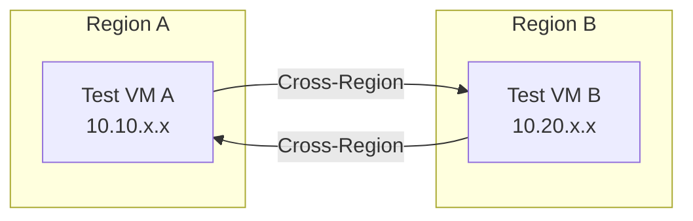

# How to Test OpenStack Multiple Regions with Calico in Production-Like Environments

Author: [nawazdhandala](https://github.com/nawazdhandala)

Tags: OpenStack, Calico, Multi-Region, Testing, Production

Description: A testing guide for multi-region OpenStack networking with Calico, covering cross-region connectivity validation, failover testing, and policy consistency verification.

---

## Introduction

Testing a multi-region OpenStack deployment with Calico requires validating that connectivity works both within regions and across region boundaries. Cross-region testing is more complex than single-region testing because it involves BGP peering between regions, route propagation through hierarchical reflectors, and policy enforcement at region boundaries.

This guide provides a structured test plan for multi-region Calico deployments, covering intra-region connectivity, cross-region routing, failover scenarios, and policy consistency across regions. Tests should be run whenever regions are added, BGP configuration changes, or policies are updated.

The unique challenge of multi-region testing is that failures can be intermittent and depend on which region's route reflectors handle the traffic, making systematic testing essential.

## Prerequisites

- Two or more OpenStack regions with Calico networking configured
- Cross-region network connectivity (VPN or dedicated links)
- `calicoctl` and `openstack` CLI tools configured for each region
- Test VMs deployed in each region
- Understanding of the cross-region BGP topology

## Setting Up Cross-Region Test Infrastructure

Deploy test VMs in each region for connectivity testing.

```bash
#!/bin/bash
# setup-multi-region-test.sh
# Deploy test VMs in each region

REGIONS=("region-a" "region-b")

for region in "${REGIONS[@]}"; do
  echo "Setting up test VMs in ${region}..."
  export OS_REGION_NAME=${region}

  # Create test VM
  openstack server create --project multi-region-test \
    --flavor m1.small --image ubuntu-22.04 \
    --network test-network \
    --security-group default \
    ${region}-test-vm-1

  # Wait for VM to be active
  openstack server wait ${region}-test-vm-1
  echo "${region}: $(openstack server show ${region}-test-vm-1 -f value -c addresses)"
done
```

## Testing Intra-Region Connectivity

Verify that within each region, networking works correctly.

```bash
#!/bin/bash
# test-intra-region.sh
# Test connectivity within each region

echo "=== Intra-Region Connectivity Tests ==="

REGIONS=("region-a" "region-b")

for region in "${REGIONS[@]}"; do
  export OS_REGION_NAME=${region}
  echo ""
  echo "--- ${region} ---"

  VM1_IP=$(openstack server show ${region}-test-vm-1 -f value -c addresses | grep -oP '[0-9]+\.[0-9]+\.[0-9]+\.[0-9]+')

  # Test DNS resolution
  echo -n "  DNS: "
  ssh ubuntu@${VM1_IP} "nslookup google.com" > /dev/null 2>&1 && echo "PASS" || echo "FAIL"

  # Test external connectivity
  echo -n "  External: "
  ssh ubuntu@${VM1_IP} "wget -qO- --timeout=5 http://httpbin.org/get" > /dev/null 2>&1 && echo "PASS" || echo "FAIL"

  # Test Calico node health
  echo -n "  Calico health: "
  ssh ${region}-compute-01 "sudo calicoctl node status" 2>/dev/null | grep -q "Established" && echo "PASS" || echo "FAIL"
done
```

## Testing Cross-Region Connectivity

Validate that VMs in different regions can communicate.

```bash
#!/bin/bash
# test-cross-region.sh
# Test connectivity between regions

echo "=== Cross-Region Connectivity Tests ==="

# Get VM IPs from each region
export OS_REGION_NAME=region-a
REGION_A_IP=$(openstack server show region-a-test-vm-1 -f value -c addresses | grep -oP '[0-9]+\.[0-9]+\.[0-9]+\.[0-9]+')

export OS_REGION_NAME=region-b
REGION_B_IP=$(openstack server show region-b-test-vm-1 -f value -c addresses | grep -oP '[0-9]+\.[0-9]+\.[0-9]+\.[0-9]+')

echo "Region A VM: ${REGION_A_IP}"
echo "Region B VM: ${REGION_B_IP}"

# Test Region A -> Region B
echo -n "Region A -> Region B ICMP: "
ssh ubuntu@${REGION_A_IP} "ping -c 5 -W 10 ${REGION_B_IP}" > /dev/null 2>&1 && echo "PASS" || echo "FAIL"

# Test Region B -> Region A
echo -n "Region B -> Region A ICMP: "
ssh ubuntu@${REGION_B_IP} "ping -c 5 -W 10 ${REGION_A_IP}" > /dev/null 2>&1 && echo "PASS" || echo "FAIL"

# Test TCP connectivity cross-region
echo -n "Region A -> Region B TCP: "
ssh ubuntu@${REGION_B_IP} "nc -l -p 8080 &"
sleep 2
ssh ubuntu@${REGION_A_IP} "echo test | nc -w 5 ${REGION_B_IP} 8080" > /dev/null 2>&1 && echo "PASS" || echo "FAIL"
```



## Testing Policy Consistency

Verify that the same policies produce the same behavior in all regions.

```bash
#!/bin/bash
# test-policy-consistency.sh
# Verify policies are consistent across regions

echo "=== Policy Consistency Tests ==="

# Compare policy counts
declare -A POLICY_COUNTS
for region in region-a region-b; do
  KUBECONFIG="/etc/calico/regions/${region}/kubeconfig"
  count=$(DATASTORE_TYPE=kubernetes KUBECONFIG=${KUBECONFIG} \
    calicoctl get globalnetworkpolicies -o name 2>/dev/null | sort | md5sum)
  POLICY_COUNTS[${region}]=${count}
  echo "${region} policy hash: ${count}"
done

# Check if all regions have the same policies
if [ "${POLICY_COUNTS[region-a]}" = "${POLICY_COUNTS[region-b]}" ]; then
  echo "Policy consistency: PASS"
else
  echo "Policy consistency: FAIL (policies differ between regions)"
fi
```

## Testing Region Failover

Simulate a region failure and verify traffic handles it correctly.

```bash
#!/bin/bash
# test-region-failover.sh
echo "=== Region Failover Test ==="

# Record baseline cross-region connectivity
echo "Baseline connectivity:"
ssh ubuntu@${REGION_A_IP} "ping -c 3 ${REGION_B_IP}" 2>&1 | tail -1

# Simulate route reflector failure in Region A
echo ""
echo "Simulating RR failure in Region A..."
ssh region-a-rr-01 "sudo systemctl stop calico-node" 2>/dev/null

# Wait for BGP reconvergence
sleep 30

# Test: intra-region should still work (via remaining RR or mesh)
echo -n "Region A intra-region after RR failure: "
ssh ubuntu@${REGION_A_IP} "ping -c 3 -W 10 ${REGION_A_VM2_IP}" > /dev/null 2>&1 && echo "PASS" || echo "FAIL"

# Restore the route reflector
ssh region-a-rr-01 "sudo systemctl start calico-node" 2>/dev/null
sleep 15
echo "Route reflector restored"
```

## Verification

```bash
#!/bin/bash
# multi-region-test-report.sh
echo "Multi-Region Test Report - $(date)"
echo "===================================="
echo ""
for region in region-a region-b; do
  export OS_REGION_NAME=${region}
  echo "${region}:"
  echo "  VMs: $(openstack server list --project multi-region-test -f value | wc -l)"
  echo "  Calico nodes: $(DATASTORE_TYPE=kubernetes KUBECONFIG=/etc/calico/regions/${region}/kubeconfig calicoctl get nodes -o name 2>/dev/null | wc -l)"
done
```

## Troubleshooting

- **Cross-region ping works but TCP fails**: Check security groups in both regions. Ensure both allow the test port. Also check for MTU issues on the inter-region link.
- **Routes from one region not visible in another**: Verify BGP peering between route reflectors. Check `calicoctl node status` on route reflectors for session state.
- **Policy consistency test fails**: Check the policy sync mechanism. Verify that all regions pulled the same version from the policy repository.
- **Failover takes too long**: Tune BGP hold timers. Default is 90 seconds; reducing to 30 seconds speeds detection but increases BGP traffic.

## Conclusion

Testing multi-region OpenStack with Calico validates the critical cross-region networking paths that single-region testing cannot cover. By systematically testing intra-region connectivity, cross-region routing, policy consistency, and failover scenarios, you build confidence that your multi-region deployment handles both normal operation and failure conditions correctly. Run these tests before and after any topology or policy changes.
