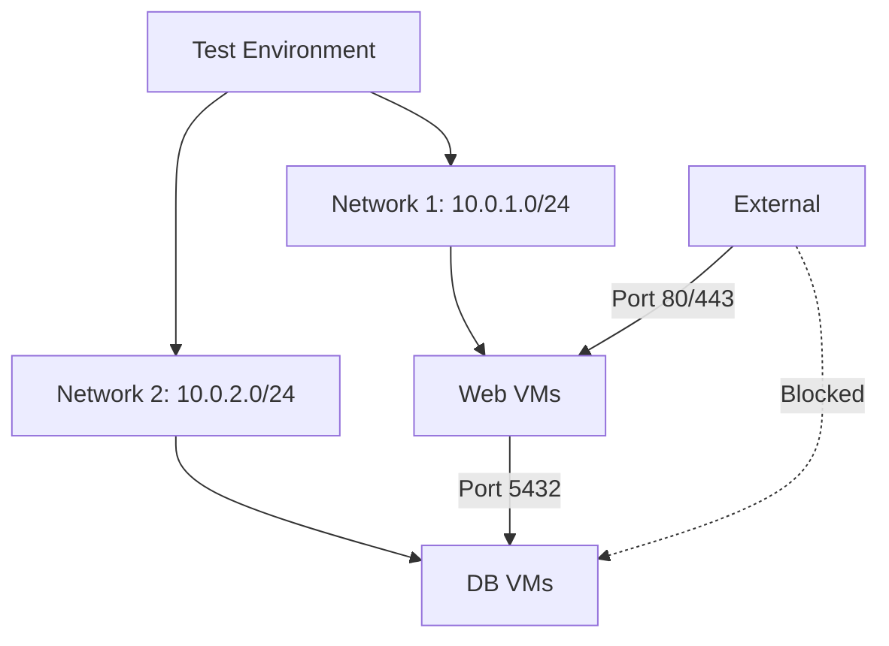

# How to Test OpenStack Networking with Calico in Production-Like Environments

Author: [nawazdhandala](https://github.com/nawazdhandala)

Tags: OpenStack, Calico, Networking, Testing, Production

Description: A comprehensive guide to testing OpenStack networking with Calico in environments that simulate production conditions, covering connectivity validation, security group testing, and performance benchmarking.

---

## Introduction

Testing OpenStack networking with Calico before production deployment requires an environment that accurately represents your production topology. Calico replaces the traditional OVS-based networking in OpenStack with a pure Layer 3 approach, which changes how traffic flows between VMs, how security groups are enforced, and how external connectivity works.

This guide covers setting up a production-like test environment, running connectivity and security tests, and establishing performance baselines. The goal is to validate that Calico-based networking meets your operational requirements before handling real workloads.

A production-like environment differs from a simple lab in that it includes realistic network topologies, multiple tenants, security group configurations, and representative VM workloads that exercise the networking stack under load.

## Prerequisites

- An OpenStack deployment with Calico configured as the networking backend
- At least 3 compute nodes for realistic placement testing
- Administrative access to OpenStack and the underlying infrastructure
- `openstack` CLI configured with admin credentials
- Access to VM images for test workloads
- Network test tools (iperf3, netperf) available as VM images or packages

## Configuring the Test Environment

Set up OpenStack projects, networks, and security groups that mirror your production configuration.

```bash
# Create a test project with quotas matching production
openstack project create calico-net-test
openstack quota set calico-net-test --instances 20 --cores 40 --ram 81920

# Create test networks
openstack network create --project calico-net-test test-network-1
openstack subnet create --project calico-net-test \
  --network test-network-1 \
  --subnet-range 10.0.1.0/24 \
  --dns-nameserver 8.8.8.8 \
  test-subnet-1

openstack network create --project calico-net-test test-network-2
openstack subnet create --project calico-net-test \
  --network test-network-2 \
  --subnet-range 10.0.2.0/24 \
  --dns-nameserver 8.8.8.8 \
  test-subnet-2
```

Create security groups that match production policies:

```bash
# Create a web-tier security group
openstack security group create --project calico-net-test web-tier
openstack security group rule create --project calico-net-test \
  --protocol tcp --dst-port 80 --remote-ip 0.0.0.0/0 web-tier
openstack security group rule create --project calico-net-test \
  --protocol tcp --dst-port 443 --remote-ip 0.0.0.0/0 web-tier
openstack security group rule create --project calico-net-test \
  --protocol tcp --dst-port 22 --remote-ip 10.0.0.0/8 web-tier

# Create a database-tier security group
openstack security group create --project calico-net-test db-tier
openstack security group rule create --project calico-net-test \
  --protocol tcp --dst-port 5432 --remote-group web-tier db-tier
```



## Running Connectivity Tests

Deploy test VMs and validate connectivity across different scenarios.

```bash
# Launch web-tier VMs on network 1
openstack server create --project calico-net-test \
  --flavor m1.small \
  --image ubuntu-22.04 \
  --network test-network-1 \
  --security-group web-tier \
  --min 2 --max 2 \
  web-vm

# Launch database VM on network 2
openstack server create --project calico-net-test \
  --flavor m1.medium \
  --image ubuntu-22.04 \
  --network test-network-2 \
  --security-group db-tier \
  db-vm-1

# Wait for VMs to become active
openstack server list --project calico-net-test

# Test intra-network connectivity (web VM to web VM)
# SSH into web-vm-1 and ping web-vm-2
WEB_VM2_IP=$(openstack server show web-vm-2 -f value -c addresses | grep -oP '10\.0\.1\.\d+')
ssh ubuntu@web-vm-1 "ping -c 5 ${WEB_VM2_IP}"

# Test cross-network connectivity (web to database)
DB_VM_IP=$(openstack server show db-vm-1 -f value -c addresses | grep -oP '10\.0\.2\.\d+')
ssh ubuntu@web-vm-1 "nc -zv ${DB_VM_IP} 5432"
```

## Security Group Enforcement Testing

Verify that Calico correctly enforces OpenStack security groups.

```bash
#!/bin/bash
# test-security-groups.sh
# Validate security group enforcement with Calico

echo "=== Security Group Tests ==="

# Test 1: Web tier should accept HTTP traffic
echo -n "Web HTTP access: "
curl -s --connect-timeout 5 http://${WEB_VM1_IP} > /dev/null && echo "PASS" || echo "FAIL"

# Test 2: Database should only accept traffic from web tier
echo -n "DB access from web tier: "
ssh ubuntu@web-vm-1 "nc -zv -w 5 ${DB_VM_IP} 5432" 2>&1 | grep -q "succeeded" && echo "PASS" || echo "FAIL"

# Test 3: Database should reject direct external access
echo -n "DB direct access blocked: "
nc -zv -w 3 ${DB_VM_IP} 5432 2>&1 | grep -q "refused\|timed out" && echo "PASS" || echo "FAIL"

# Test 4: Web tier SSH restricted to internal network
echo -n "Web SSH from internal: "
ssh -o ConnectTimeout=5 ubuntu@${WEB_VM1_IP} "echo ok" 2>/dev/null && echo "PASS" || echo "FAIL"
```

## Performance Benchmarking

Establish networking performance baselines under Calico.

```bash
# Install iperf3 on test VMs
ssh ubuntu@web-vm-1 "sudo apt-get update && sudo apt-get install -y iperf3"
ssh ubuntu@web-vm-2 "sudo apt-get update && sudo apt-get install -y iperf3"

# Run bandwidth test between VMs on the same network
ssh ubuntu@web-vm-2 "iperf3 -s -D"
ssh ubuntu@web-vm-1 "iperf3 -c ${WEB_VM2_IP} -t 30 -P 4"

# Run latency test
ssh ubuntu@web-vm-1 "ping -c 100 -i 0.1 ${WEB_VM2_IP}" | tail -1

# Run cross-network bandwidth test
ssh ubuntu@db-vm-1 "iperf3 -s -D"
ssh ubuntu@web-vm-1 "iperf3 -c ${DB_VM_IP} -t 30 -P 4"
```

## Verification

After all tests complete, generate a summary report:

```bash
#!/bin/bash
# verification-report.sh
# Generate test environment verification report

echo "OpenStack Calico Networking Test Report"
echo "========================================"
echo "Date: $(date)"
echo ""

echo "=== Infrastructure ==="
echo "Compute Nodes: $(openstack compute service list -f value -c Host | sort -u | wc -l)"
echo "Networks: $(openstack network list --project calico-net-test -f value -c Name | wc -l)"
echo "VMs: $(openstack server list --project calico-net-test -f value -c Name | wc -l)"

echo ""
echo "=== Calico Status ==="
# Check Calico Felix status on compute nodes
for node in $(openstack compute service list -f value -c Host | sort -u); do
  echo "Node ${node}: $(ssh ${node} 'sudo calicoctl node status 2>/dev/null | head -1')"
done
```

## Troubleshooting

- **VMs cannot reach each other on the same network**: Verify that Calico Felix is running on all compute nodes. Check that the Neutron Calico plugin is correctly translating network and subnet information.
- **Security groups not enforced**: Check Felix logs on the compute node hosting the VM. Verify that the OpenStack security group rules were correctly translated to Calico policy rules.
- **External connectivity fails**: Verify that NAT is configured for outbound traffic. Check that the Calico IP pool for the OpenStack network has `natOutgoing: true`.
- **Performance lower than expected**: Check for MTU mismatches between the VM and the host. Calico's Layer 3 approach should reduce overhead compared to OVS, but MTU issues can negate this benefit.

## Conclusion

Testing OpenStack networking with Calico in a production-like environment validates that the Layer 3 networking model meets your operational requirements. By systematically testing connectivity, security group enforcement, and performance, you build confidence that Calico will handle production workloads correctly. Keep the test environment available for regression testing after Calico upgrades.
