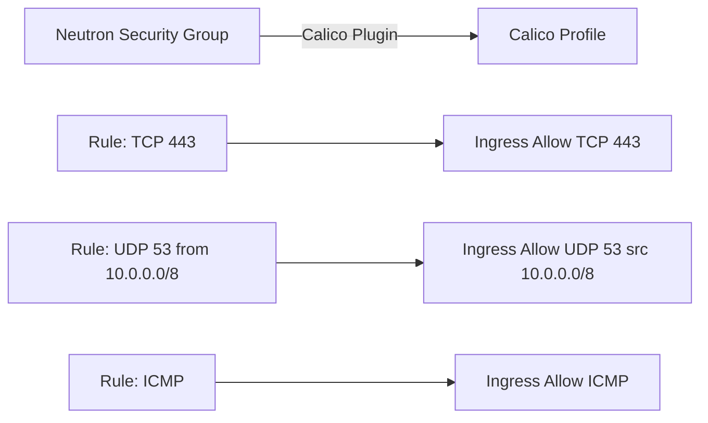

# How to Test OpenStack Neutron API Integration with Calico

Author: [nawazdhandala](https://github.com/nawazdhandala)

Tags: OpenStack, Calico, Neutron, API, Testing

Description: A testing guide for the Neutron API integration with Calico, covering API endpoint validation, security group translation testing, and integration stress testing.

---

## Introduction

Testing the Neutron API integration with Calico verifies that the entire control plane path works correctly: from API request to Calico data plane configuration. This integration is the critical bridge that makes OpenStack networking work with Calico, and testing it thoroughly prevents issues that only manifest when real workloads create networks, ports, and security groups.

This guide provides a structured test plan covering API endpoint functionality, security group translation to Calico profiles, port lifecycle management, and stress testing the integration under load.

The Neutron-Calico integration has several subtle failure modes: security groups may not translate correctly, ports may be created in Neutron but not reflected in Calico, or bulk operations may time out. Systematic testing catches these issues.

## Prerequisites

- An OpenStack environment with Calico configured as the Neutron backend
- Admin and tenant OpenStack credentials
- `openstack` CLI and `calicoctl` tools configured
- A script execution environment for automated testing
- Access to Neutron server logs

## Testing API Endpoint Functionality

Validate all Neutron API operations that interact with Calico.

```bash
#!/bin/bash
# test-neutron-api.sh
# Test Neutron API operations with Calico backend

PASS=0
FAIL=0

test_api() {
  local desc="$1"; local cmd="$2"
  echo -n "  ${desc}: "
  if eval "${cmd}" > /dev/null 2>&1; then
    echo "PASS"; ((PASS++))
  else
    echo "FAIL"; ((FAIL++))
  fi
}

echo "=== Neutron API Integration Tests ==="

# Network operations
echo ""
echo "--- Network Operations ---"
test_api "Create network" \
  "openstack network create api-test-net"
test_api "Show network" \
  "openstack network show api-test-net"
test_api "List networks" \
  "openstack network list"

# Subnet operations
echo ""
echo "--- Subnet Operations ---"
test_api "Create subnet" \
  "openstack subnet create --network api-test-net --subnet-range 10.99.0.0/24 api-test-subnet"
test_api "Show subnet" \
  "openstack subnet show api-test-subnet"

# Port operations
echo ""
echo "--- Port Operations ---"
test_api "Create port" \
  "openstack port create --network api-test-net api-test-port"
test_api "Show port" \
  "openstack port show api-test-port"

# Security group operations
echo ""
echo "--- Security Group Operations ---"
test_api "Create security group" \
  "openstack security group create api-test-sg"
test_api "Create security group rule" \
  "openstack security group rule create --protocol tcp --dst-port 80 api-test-sg"

# Cleanup
openstack port delete api-test-port 2>/dev/null
openstack security group delete api-test-sg 2>/dev/null
openstack subnet delete api-test-subnet 2>/dev/null
openstack network delete api-test-net 2>/dev/null

echo ""
echo "Results: ${PASS} passed, ${FAIL} failed"
```

## Testing Security Group Translation

Verify that Neutron security groups are correctly translated to Calico profiles.

```bash
#!/bin/bash
# test-sg-translation.sh
# Test security group to Calico profile translation

echo "=== Security Group Translation Tests ==="

# Create a security group with specific rules
openstack security group create sg-translation-test
openstack security group rule create \
  --protocol tcp --dst-port 443 --remote-ip 0.0.0.0/0 sg-translation-test
openstack security group rule create \
  --protocol udp --dst-port 53 --remote-ip 10.0.0.0/8 sg-translation-test
openstack security group rule create \
  --protocol icmp sg-translation-test

# Check that Calico profile was created
echo ""
echo "Calico profile for security group:"
SG_ID=$(openstack security group show sg-translation-test -f value -c id)
calicoctl get profiles -o wide 2>/dev/null | grep "${SG_ID}"

# Verify rules translated correctly
echo ""
echo "Calico profile rules:"
calicoctl get profile "${SG_ID}" -o yaml 2>/dev/null | grep -A30 "spec:"

# Cleanup
openstack security group delete sg-translation-test
```



## Stress Testing the Integration

Test the API integration under load to identify bottlenecks.

```bash
#!/bin/bash
# stress-test-neutron-calico.sh
# Stress test the Neutron-Calico integration

echo "=== Neutron-Calico Stress Test ==="

NETWORK="stress-test-net"
SUBNET="stress-test-subnet"
NUM_PORTS=50

# Setup
openstack network create ${NETWORK}
openstack subnet create --network ${NETWORK} --subnet-range 10.88.0.0/24 ${SUBNET}

# Create many ports rapidly
echo ""
echo "Creating ${NUM_PORTS} ports..."
START=$(date +%s)

for i in $(seq 1 ${NUM_PORTS}); do
  openstack port create --network ${NETWORK} stress-port-${i} > /dev/null 2>&1 &
  # Limit concurrency to 10
  if [ $((i % 10)) -eq 0 ]; then
    wait
    echo "  Created ${i}/${NUM_PORTS} ports"
  fi
done
wait

END=$(date +%s)
DURATION=$((END - START))
RATE=$(echo "scale=1; ${NUM_PORTS} / ${DURATION}" | bc)

echo "Created ${NUM_PORTS} ports in ${DURATION}s (${RATE} ports/sec)"

# Verify all ports exist in Calico
echo ""
echo "Verifying Calico endpoints..."
CALICO_ENDPOINTS=$(calicoctl get workloadendpoints --all-namespaces -o json 2>/dev/null | \
  python3 -c "import json,sys; print(len(json.load(sys.stdin).get('items',[])))")
echo "Calico endpoints: ${CALICO_ENDPOINTS}"

# Cleanup
echo ""
echo "Cleaning up..."
for i in $(seq 1 ${NUM_PORTS}); do
  openstack port delete stress-port-${i} > /dev/null 2>&1 &
  if [ $((i % 10)) -eq 0 ]; then wait; fi
done
wait
openstack subnet delete ${SUBNET}
openstack network delete ${NETWORK}
```

## Verification

```bash
#!/bin/bash
# verify-neutron-calico-integration.sh
echo "=== Integration Verification ==="

echo "Neutron server status:"
systemctl is-active neutron-server

echo ""
echo "Calico plugin loaded:"
grep "core_plugin" /etc/neutron/neutron.conf | grep -v "#"

echo ""
echo "API response time:"
time openstack network list > /dev/null 2>&1

echo ""
echo "Security group count:"
openstack security group list --all-projects -f value | wc -l

echo ""
echo "Calico profile count:"
calicoctl get profiles -o name 2>/dev/null | wc -l
```

## Troubleshooting

- **API returns 500 errors**: Check Neutron server logs at `/var/log/neutron/server.log`. Common causes are etcd connection failures or database connection exhaustion.
- **Security groups not creating Calico profiles**: Verify the Calico plugin security group driver is configured. Check that the `networking-calico` package version matches your Calico version.
- **Port creation succeeds but no Calico endpoint**: Check the Calico plugin logs for errors. Verify etcd connectivity from the Neutron server.
- **Stress test shows degraded performance**: Monitor database and etcd during the test. The bottleneck is usually database writes or etcd latency.

## Conclusion

Testing the Neutron API integration with Calico validates the control plane path that all OpenStack networking depends on. By testing API operations, security group translation, and stress-testing under load, you ensure the integration handles production demands. Run these tests after any Neutron or Calico upgrade to catch regression issues early.
