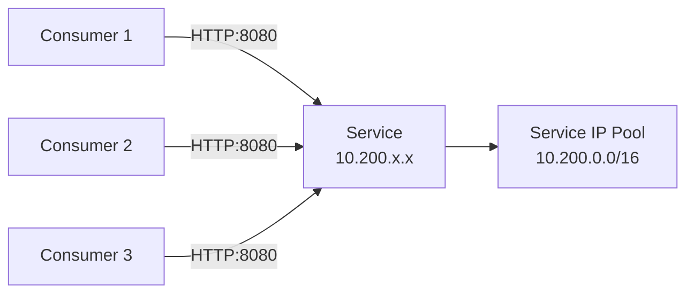

# How to Test OpenStack Service IPs with Calico in Production-Like Environments

Author: [nawazdhandala](https://github.com/nawazdhandala)

Tags: OpenStack, Calico, Service IPs, Testing, Production

Description: A testing guide for OpenStack service IP functionality with Calico, covering IP allocation testing, service endpoint connectivity, and failover validation in production-like environments.

---

## Introduction

Testing service IPs in OpenStack with Calico validates that services receive stable IP addresses, those addresses are routable from consumers, and policies correctly control access. Service IPs are critical infrastructure endpoints, and failures in their allocation or routing can cascade to application-level outages.

This guide provides a test plan for service IP functionality, covering IP allocation from dedicated pools, routing correctness, policy enforcement, and behavior during node failures. Tests should simulate realistic service deployment patterns.

Service IP testing differs from VM IP testing because services typically have different availability requirements, access patterns, and policy needs than general-purpose VM workloads.

## Prerequisites

- An OpenStack test environment with Calico and configured service IP pools
- `calicoctl` and `openstack` CLI tools configured
- Test VMs that can host services
- Understanding of your service IP allocation strategy

## Testing Service IP Allocation

Verify that service IPs are allocated correctly from the dedicated pool.

```bash
#!/bin/bash
# test-service-ip-allocation.sh
# Test service IP allocation from dedicated pools

echo "=== Service IP Allocation Tests ==="

# Record initial allocation state
INITIAL_ALLOC=$(calicoctl ipam show 2>/dev/null | grep "allocated")
echo "Initial allocation: ${INITIAL_ALLOC}"

# Create a service VM with a service IP
openstack server create --project service-test \
  --flavor m1.small --image ubuntu-22.04 \
  --network service-network \
  test-service-1

openstack server wait test-service-1

# Get the assigned IP
SERVICE_IP=$(openstack server show test-service-1 -f value -c addresses | grep -oP '[0-9]+\.[0-9]+\.[0-9]+\.[0-9]+')
echo "Service IP assigned: ${SERVICE_IP}"

# Verify IP is from the service pool range
if echo "${SERVICE_IP}" | grep -q "^10\.200\."; then
  echo "IP from service pool: PASS"
else
  echo "IP from service pool: FAIL (IP not in expected range)"
fi

# Check IPAM allocation
echo ""
echo "Post-allocation state:"
calicoctl ipam show 2>/dev/null | grep "allocated"
```

## Testing Service Endpoint Connectivity

```bash
#!/bin/bash
# test-service-connectivity.sh
# Test that service IPs are reachable from consumers

echo "=== Service Endpoint Connectivity Tests ==="

SERVICE_IP=$(openstack server show test-service-1 -f value -c addresses | grep -oP '[0-9]+\.[0-9]+\.[0-9]+\.[0-9]+')

# Start a service on the VM
ssh ubuntu@${SERVICE_IP} "python3 -m http.server 8080 &"
sleep 2

# Test from a consumer VM on a different network
CONSUMER_IP=$(openstack server show test-consumer-1 -f value -c addresses | grep -oP '[0-9]+\.[0-9]+\.[0-9]+\.[0-9]+')

echo -n "Consumer -> Service HTTP: "
ssh ubuntu@${CONSUMER_IP} "wget -qO- --timeout=5 http://${SERVICE_IP}:8080" > /dev/null 2>&1 && echo "PASS" || echo "FAIL"

echo -n "Consumer -> Service ICMP: "
ssh ubuntu@${CONSUMER_IP} "ping -c 3 -W 5 ${SERVICE_IP}" > /dev/null 2>&1 && echo "PASS" || echo "FAIL"

# Test from multiple consumers
for i in 1 2 3; do
  C_IP=$(openstack server show test-consumer-${i} -f value -c addresses 2>/dev/null | grep -oP '[0-9]+\.[0-9]+\.[0-9]+\.[0-9]+')
  if [ -n "${C_IP}" ]; then
    echo -n "Consumer-${i} -> Service: "
    ssh ubuntu@${C_IP} "wget -qO- --timeout=5 http://${SERVICE_IP}:8080" > /dev/null 2>&1 && echo "PASS" || echo "FAIL"
  fi
done
```



## Testing Service IP Policy Enforcement

```bash
#!/bin/bash
# test-service-ip-policy.sh
echo "=== Service IP Policy Tests ==="

# Apply a policy restricting service access
calicoctl apply -f - << 'EOF'
apiVersion: projectcalico.org/v3
kind: GlobalNetworkPolicy
metadata:
  name: test-service-restriction
spec:
  selector: role == 'service'
  types:
    - Ingress
  ingress:
    - action: Allow
      source:
        selector: role == 'authorized-consumer'
      protocol: TCP
      destination:
        ports:
          - 8080
EOF

# Test: Authorized consumer should connect
echo -n "Authorized consumer access: "
ssh ubuntu@${CONSUMER_IP} "wget -qO- --timeout=5 http://${SERVICE_IP}:8080" > /dev/null 2>&1 && echo "PASS" || echo "FAIL"

# Test: Unauthorized source should be blocked
echo -n "Unauthorized access blocked: "
ssh ubuntu@${UNAUTH_IP} "wget -qO- --timeout=3 http://${SERVICE_IP}:8080" > /dev/null 2>&1 && echo "FAIL (should be blocked)" || echo "PASS"

# Cleanup
calicoctl delete globalnetworkpolicy test-service-restriction
```

## Testing Service IP Failover

```bash
#!/bin/bash
# test-service-ip-failover.sh
echo "=== Service IP Failover Tests ==="

# Record which node hosts the service
SERVICE_HOST=$(openstack server show test-service-1 -f value -c OS-EXT-SRV-ATTR:host)
echo "Service hosted on: ${SERVICE_HOST}"

# Verify route exists on all compute nodes
echo ""
echo "Route verification before failover:"
for node in $(openstack compute service list -f value -c Host | sort -u); do
  route=$(ssh ${node} "ip route show ${SERVICE_IP}" 2>/dev/null)
  echo "  ${node}: ${route:-NO ROUTE}"
done

# Stop the service VM and verify route is withdrawn
echo ""
echo "Stopping service VM..."
openstack server stop test-service-1
sleep 15

echo "Route verification after stop:"
for node in $(openstack compute service list -f value -c Host | sort -u); do
  route=$(ssh ${node} "ip route show ${SERVICE_IP}" 2>/dev/null)
  echo "  ${node}: ${route:-WITHDRAWN (correct)}"
done

# Restart and verify route returns
openstack server start test-service-1
openstack server wait test-service-1
sleep 15

echo ""
echo "Route verification after restart:"
for node in $(openstack compute service list -f value -c Host | sort -u); do
  route=$(ssh ${node} "ip route show ${SERVICE_IP}" 2>/dev/null)
  echo "  ${node}: ${route:-NO ROUTE}"
done
```

## Verification

```bash
#!/bin/bash
# service-ip-test-report.sh
echo "Service IP Test Report - $(date)"
echo "================================="
echo ""
echo "Service IP Pool:"
calicoctl get ippools openstack-service-ips -o wide 2>/dev/null
echo ""
echo "Allocated IPs:"
calicoctl ipam show 2>/dev/null
echo ""
echo "Test VMs:"
openstack server list --project service-test
```

## Troubleshooting

- **Service IP not allocated from correct pool**: Check IP pool node selectors. Verify the VM is scheduled on a node that matches the pool's nodeSelector.
- **Service unreachable from consumers**: Check routes on consumer compute nodes. Verify the service IP route exists and points to the correct compute node.
- **Policy not enforced on service IPs**: Verify the service endpoint has the expected labels. Check that the policy selector matches.
- **Route not withdrawn after VM stop**: Check Felix garbage collection timing. Routes should be withdrawn within seconds of the endpoint being removed.

## Conclusion

Testing service IPs in OpenStack with Calico validates the critical path from IP allocation through routing to policy enforcement. By testing allocation, connectivity, policy, and failover scenarios, you ensure service IPs provide the stable, reliable endpoints that production services require. Run these tests after any IP pool or policy changes.
