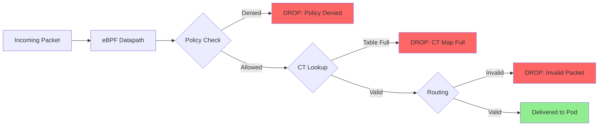

# How to Trace Dropped Packets in Cilium Before They Reach the Pod

Author: [nawazdhandala](https://github.com/nawazdhandala)

Tags: Cilium, Packet Drops, Debugging, eBPF, Networking

Description: Learn how to trace and analyze packets that are dropped by Cilium's eBPF datapath before they reach the destination pod, using Hubble, monitor, and BPF tools for deep packet-level debugging.

---

## Introduction

When packets are dropped by Cilium before reaching a pod, the destination application has no visibility into what happened. The connection simply times out or resets with no indication of why. These drops occur in the eBPF datapath -- in the kernel, before the packet ever reaches the pod's network namespace.

Cilium drops packets for several reasons: policy denial, invalid packet state, connection tracking table overflow, or BPF program errors. Each drop type requires a different debugging approach, and Cilium provides multiple tools to trace these events at different levels of detail.

This guide shows you how to use Hubble, the Cilium monitor, and BPF debugging tools to trace every dropped packet and identify the root cause.

## Prerequisites

- Kubernetes cluster with Cilium installed and Hubble enabled
- cilium CLI and hubble CLI installed
- kubectl access to kube-system namespace
- Understanding of basic networking concepts (TCP, UDP, ICMP)

## Using Hubble to Trace Drops

Hubble is the fastest way to see dropped packets with context:

```bash
# View all drops across the cluster
hubble observe --verdict DROPPED

# Filter drops for a specific destination pod
hubble observe --verdict DROPPED --to-pod default/my-service

# Filter drops by protocol and port
hubble observe --verdict DROPPED --protocol TCP --to-port 8080

# Get detailed drop information in JSON
hubble observe --verdict DROPPED --last 50 -o json | python3 -c "
import json, sys
for line in sys.stdin:
    f = json.loads(line)
    flow = f.get('flow', {})
    src = flow.get('source', {})
    dst = flow.get('destination', {})
    reason = flow.get('drop_reason_desc', 'unknown')
    drop_reason = flow.get('drop_reason', 0)
    print(f'{src.get(\"namespace\",\"?\")}/{src.get(\"pod_name\",\"?\")} -> {dst.get(\"namespace\",\"?\")}/{dst.get(\"pod_name\",\"?\")}:{dst.get(\"port\",0)}')
    print(f'  Reason: {reason} (code: {drop_reason})')
    print()
"
```



## Using Cilium Monitor for Real-Time Tracing

The Cilium monitor provides lower-level packet tracing:

```bash
# Start the monitor for drop events
kubectl -n kube-system exec ds/cilium -- cilium monitor --type drop

# Filter for a specific endpoint
ENDPOINT_ID=$(kubectl -n kube-system exec ds/cilium -- cilium endpoint list -o json | python3 -c "
import json, sys
for ep in json.load(sys.stdin):
    labels = ep.get('status',{}).get('identity',{}).get('labels',[])
    for l in labels:
        if 'my-service' in l:
            print(ep['id'])
            break
")
kubectl -n kube-system exec ds/cilium -- cilium monitor --type drop --related-to $ENDPOINT_ID

# Get verbose output with packet headers
kubectl -n kube-system exec ds/cilium -- cilium monitor --type drop -v
```

## Analyzing Drop Reasons

Each drop reason code maps to a specific cause:

```bash
# Get a breakdown of drop reasons
kubectl -n kube-system exec ds/cilium -- \
  wget -qO- http://localhost:9962/metrics 2>/dev/null | \
  grep "cilium_drop_count_total" | \
  grep -v "^#" | \
  sort -t'"' -k2

# Common drop reason codes and their meanings:
# 0   - Success (not a drop)
# 2   - Invalid source MAC
# 3   - Invalid destination MAC
# 4   - Invalid source IP
# 130 - Policy denied (L3)
# 131 - Policy denied (L4)
# 132 - Policy denied (L7)
# 133 - Proxy redirection failure
# 140 - Connection tracking map insertion failure
# 141 - Invalid connection tracking state
# 148 - Authentication required
# 163 - No mapping for NAT
# 181 - Unsupported L3 protocol
```

Investigate specific drop reasons:

```bash
# Policy denials (most common)
hubble observe --verdict DROPPED --last 100 -o json | python3 -c "
import json, sys
policy_drops = []
for line in sys.stdin:
    f = json.loads(line)
    flow = f.get('flow', {})
    reason = flow.get('drop_reason_desc', '')
    if 'policy' in reason.lower() or 'denied' in reason.lower():
        src = flow.get('source', {})
        dst = flow.get('destination', {})
        policy_drops.append({
            'src': f\"{src.get('namespace','?')}/{src.get('pod_name','?')}\",
            'dst': f\"{dst.get('namespace','?')}/{dst.get('pod_name','?')}:{dst.get('port',0)}\",
            'reason': reason
        })
for drop in policy_drops[:10]:
    print(f\"{drop['src']} -> {drop['dst']}: {drop['reason']}\")
"

# CT map overflow
kubectl -n kube-system exec ds/cilium -- cilium bpf ct list global | wc -l
kubectl -n kube-system exec ds/cilium -- cilium status | grep "CT Map"
```

## Deep Packet Tracing with BPF Debug

For difficult cases, enable BPF-level packet tracing:

```bash
# Enable debug on a specific endpoint
kubectl -n kube-system exec ds/cilium -- cilium endpoint config $ENDPOINT_ID Debug=true

# Watch the debug output (very verbose)
kubectl -n kube-system exec ds/cilium -- cilium monitor --type drop --type trace --related-to $ENDPOINT_ID -v

# The trace output shows every BPF decision point:
# - Policy lookup result
# - Connection tracking table lookup
# - NAT translation
# - Routing decision

# IMPORTANT: Disable debug after investigation (it affects performance)
kubectl -n kube-system exec ds/cilium -- cilium endpoint config $ENDPOINT_ID Debug=false
```

## Investigating Policy-Related Drops

Most drops are caused by network policies:

```bash
# Check which policies apply to the endpoint
kubectl -n kube-system exec ds/cilium -- cilium endpoint get $ENDPOINT_ID -o json | python3 -c "
import json, sys
ep = json.load(sys.stdin)
policy = ep[0].get('status', {}).get('policy', {})
print('Ingress enforcement:', policy.get('spec', {}).get('policy-enabled', 'unknown'))

# Show applied policy rules
realized = policy.get('realized', {}).get('l4', {})
if realized:
    print('Realized L4 policy:')
    for direction in ['ingress', 'egress']:
        rules = realized.get(direction, [])
        print(f'  {direction}: {len(rules)} rules')
"

# List all CiliumNetworkPolicies affecting the namespace
kubectl get cnp -n default
kubectl get ccnp  # Cluster-wide policies
```

## Verification

After identifying and fixing the drop cause:

```bash
# 1. Verify drops have stopped
hubble observe --verdict DROPPED --to-pod default/my-service --last 10

# 2. Verify traffic is flowing
hubble observe --verdict FORWARDED --to-pod default/my-service --last 10

# 3. Check drop metrics are no longer increasing
kubectl -n kube-system exec ds/cilium -- \
  wget -qO- http://localhost:9962/metrics 2>/dev/null | \
  grep "cilium_drop_count_total" | grep -v "^#"
# Run twice and compare counts

# 4. Test connectivity from the source
kubectl run curl-test --image=curlimages/curl --rm -it --restart=Never -- \
  curl -s --connect-timeout 5 http://my-service.default/
```

## Troubleshooting

- **Drops happening but Hubble shows none**: Monitor aggregation may be hiding individual drop events. Set `monitorAggregation=none` temporarily for debugging.

- **Policy drops but no policy exists**: Check for default-deny behavior. A CiliumNetworkPolicy with an empty ingress or egress list acts as a default deny.

- **CT map full**: Increase connection tracking table size in Helm values: `bpf.ctTcpMax` and `bpf.ctAnyMax`.

- **Drops only on one node**: Check if that node has a different Cilium configuration or an older version. Run `kubectl -n kube-system exec <specific-pod> -- cilium version`.

- **Cannot reproduce drops**: Drops may be transient. Use Hubble export to capture drops to a file for later analysis.

## Conclusion

Tracing dropped packets in Cilium requires working through layers of tools: Hubble for quick context-rich visibility, Cilium monitor for real-time packet tracing, and BPF debug mode for deep kernel-level investigation. The drop reason code is your primary diagnostic signal -- it tells you exactly why the packet was dropped. Most drops are caused by policy denials, which you can fix by adjusting your CiliumNetworkPolicies. For CT map overflow or routing issues, infrastructure-level tuning is required.
