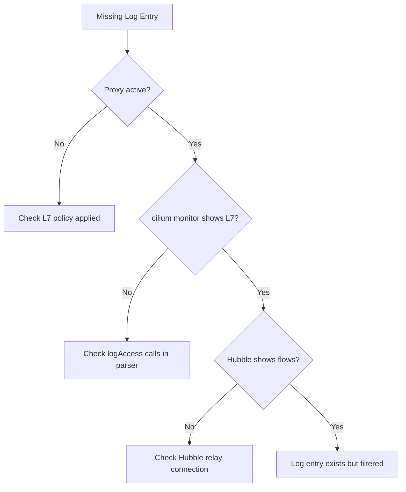

# Troubleshooting Access Logging in Cilium Network Security

Author: [nawazdhandala](https://github.com/nawazdhandala)

Tags: Cilium, Network Security, Access Logging, Troubleshooting, Hubble

Description: Diagnose and resolve common issues with access logging in Cilium L7 parsers, including missing log entries, incorrect metadata, Hubble integration problems, and log pipeline bottlenecks.

---

## Introduction

Access logging issues in Cilium L7 parsers range from missing entries (events happen but are not logged) to incorrect entries (logged with wrong metadata) to delivery failures (logs are generated but never reach the observation pipeline). Each failure mode has different diagnostic approaches.

Missing access logs are particularly concerning because they create blind spots in security monitoring. If denied requests are not logged, security teams cannot detect scanning or brute-force attempts. If allowed requests are not logged, compliance audits fail.

This guide covers systematic troubleshooting for access logging problems in Cilium L7 parsers.

## Prerequisites

- Cilium cluster with L7 policy applied
- Hubble enabled and operational
- Access to Cilium agent logs
- `cilium monitor` CLI tool
- Parser source code for reference

## Diagnosing Missing Log Entries

When expected log entries do not appear:

```bash
# Step 1: Verify the proxy is active and processing traffic
kubectl exec -n kube-system ds/cilium -- cilium bpf proxy list

# Step 2: Check if L7 policy is applied
kubectl exec -n kube-system ds/cilium -- cilium endpoint list | grep -i policy

# Step 3: Monitor for any L7 events
kubectl exec -n kube-system ds/cilium -- cilium monitor --type l7

# Step 4: Check Hubble specifically
hubble observe --type l7 --last 100

# Step 5: Check Cilium agent logs for access log errors
kubectl logs -n kube-system ds/cilium -c cilium-agent | grep -i "access.log\|accesslog"
```

Common causes of missing entries:

```go
// PROBLEM: logAccess is only called on the PASS path
func (p *Parser) OnData(reply bool, reader *proxylib.Reader) (proxylib.OpType, int) {
    // ... parse ...

    if !p.matchesPolicy(command) {
        return proxylib.DROP, 0  // BUG: No access log for denied requests!
    }

    p.logAccess(reply, command, requestID, accesslog.VerdictForwarded)
    return proxylib.PASS, totalLen
}

// FIX: Log both allowed and denied requests
func (p *Parser) OnData(reply bool, reader *proxylib.Reader) (proxylib.OpType, int) {
    // ... parse ...

    if !p.matchesPolicy(command) {
        p.logAccess(reply, command, requestID, accesslog.VerdictDenied)
        return proxylib.DROP, 0
    }

    p.logAccess(reply, command, requestID, accesslog.VerdictForwarded)
    return proxylib.PASS, totalLen
}
```



## Fixing Incorrect Metadata

When log entries exist but contain wrong information:

```bash
# Compare actual flow with logged data
hubble observe --type l7 --protocol myprotocol -o json | jq '.flow.l7'

# Check source/destination identity
hubble observe --type l7 --protocol myprotocol -o json | jq '{src: .flow.source, dst: .flow.destination}'
```

```go
// PROBLEM: Request and response logging swapped
func (p *Parser) logAccess(reply bool, command byte, requestID uint32, verdict accesslog.FlowVerdict) {
    entry := &accesslog.LogRecord{
        // BUG: Type should be TypeResponse when reply is true
        Type: accesslog.TypeRequest, // Always logs as request!
    }
    // ...
}

// FIX: Set type based on direction
func (p *Parser) logAccess(reply bool, command byte, requestID uint32, verdict accesslog.FlowVerdict) {
    logType := accesslog.TypeRequest
    if reply {
        logType = accesslog.TypeResponse
    }

    entry := &accesslog.LogRecord{
        Type: logType,
    }
    // ...
}
```

## Resolving Hubble Integration Issues

When logs reach Cilium agent but not Hubble:

```bash
# Check Hubble relay status
hubble status

# Check Hubble relay logs
kubectl logs -n kube-system deployment/hubble-relay

# Verify Hubble is listening
kubectl exec -n kube-system ds/cilium -- cilium status | grep Hubble

# Test Hubble connectivity
hubble observe --last 1
```

Check Cilium Hubble configuration:

```bash
# Verify Hubble is enabled in Cilium config
kubectl get configmap -n kube-system cilium-config -o yaml | grep hubble

# Required settings
# hubble-enabled: "true"
# hubble-listen-address: ":4244"
```

## Handling Log Pipeline Backpressure

When logging causes performance degradation:

```bash
# Check Envoy proxy latency metrics
kubectl exec -n kube-system ds/cilium -c cilium-agent -- \
    curl -s http://localhost:9901/stats | grep downstream_rq_time

# Check for log buffer overflow indicators
kubectl logs -n kube-system ds/cilium -c cilium-agent | grep -i "buffer\|overflow\|dropped"
```

```go
// Implement async logging to prevent blocking the parser
type asyncLogger struct {
    entries chan *accesslog.LogRecord
    done    chan struct{}
}

func newAsyncLogger(bufferSize int) *asyncLogger {
    al := &asyncLogger{
        entries: make(chan *accesslog.LogRecord, bufferSize),
        done:    make(chan struct{}),
    }
    go al.processEntries()
    return al
}

func (al *asyncLogger) log(entry *accesslog.LogRecord) {
    select {
    case al.entries <- entry:
        // Sent successfully
    default:
        // Buffer full — log a warning but do not block the parser
        log.Warn("Access log buffer full, dropping entry")
    }
}

func (al *asyncLogger) processEntries() {
    defer close(al.done)
    for entry := range al.entries {
        accesslog.Log(entry)
    }
}
```

## Verification

Verify logging is complete and correct:

```bash
# Send a mix of allowed and denied requests
kubectl exec test-client -- protocol-client batch-send \
    --commands "GET,SET,DELETE,GET,DELETE" \
    --target myservice:9000

# Check that all requests were logged
hubble observe --type l7 --protocol myprotocol --last 10 -o json | jq '.flow.verdict'

# Count allowed vs denied
hubble observe --type l7 --protocol myprotocol --last 100 -o json | \
    jq -r '.flow.verdict' | sort | uniq -c

# Verify response logging
hubble observe --type l7 --protocol myprotocol --last 100 -o json | \
    jq -r '.flow.l7.type' | sort | uniq -c
```

## Troubleshooting

**Problem: Logs appear for HTTP but not for custom protocol**
Ensure your parser calls `accesslog.Log()` explicitly. HTTP logging is built into Envoy, but custom proxylib parsers must implement logging themselves.

**Problem: Log timestamps are inconsistent across nodes**
Use NTP-synchronized clocks and always log in UTC. If precision is critical, include monotonic timestamps alongside wall clock time.

**Problem: Hubble observe shows no protocol field**
Check that the `Protocol` field is set in your log entry. Some Hubble versions may filter by known protocols — verify with raw Hubble API output.

**Problem: Log volume overwhelms storage**
Implement per-connection or per-endpoint sampling. Log 100% of denied requests but sample allowed requests at a configurable rate (e.g., 10%).

## Conclusion

Troubleshooting access logging requires tracing the log entry from creation in the parser, through the Cilium agent, to Hubble. Missing entries usually indicate code paths that skip the logging call, while incorrect metadata points to parameter mapping errors. Hubble integration issues are typically configuration problems. Systematic checking of each pipeline stage identifies the failure point efficiently.
