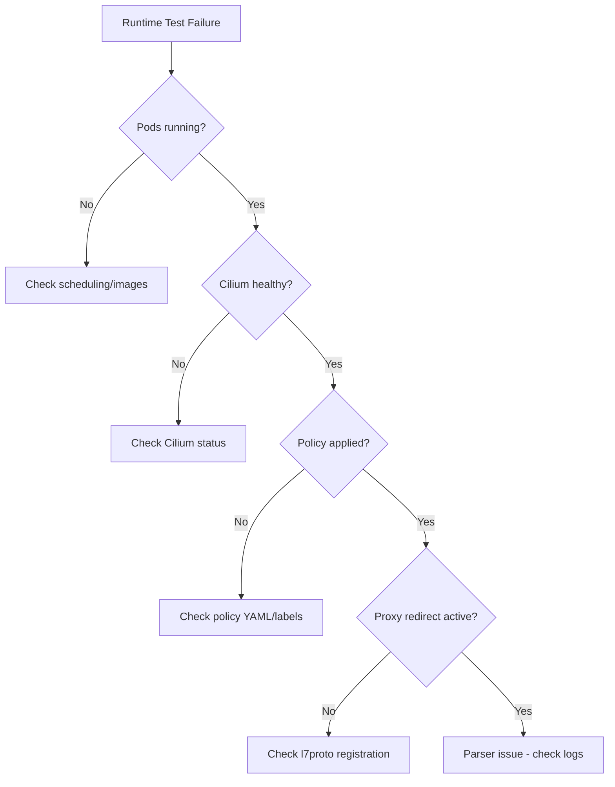

# Troubleshooting Runtime Tests for Cilium Network Security

Author: [nawazdhandala](https://github.com/nawazdhandala)

Tags: Cilium, Network Security, Runtime Tests, Troubleshooting, Integration Testing

Description: Diagnose and resolve common failures in Cilium L7 parser runtime tests, including cluster setup issues, policy propagation delays, flaky test behavior, and CI/CD pipeline integration problems.

---

## Introduction

Runtime tests for Cilium L7 parsers run in real Kubernetes environments, making them susceptible to infrastructure issues that unit tests never encounter. Network latency, pod scheduling delays, policy propagation timing, and resource constraints all contribute to test failures that have nothing to do with the parser code itself.

Distinguishing between infrastructure failures and genuine parser bugs is the primary challenge when troubleshooting runtime tests. This guide provides systematic approaches for each category of failure.

## Prerequisites

- Kubernetes cluster used for runtime tests
- Access to Cilium agent logs and metrics
- `kubectl`, `cilium`, and `hubble` CLIs
- Understanding of the runtime test framework
- CI/CD pipeline logs (if tests run in CI)

## Diagnosing Infrastructure Failures

When runtime tests fail before exercising the parser:

```bash
# Check cluster health
kubectl get nodes -o wide
kubectl get pods -n kube-system

# Check Cilium status
kubectl exec -n kube-system ds/cilium -- cilium status --brief

# Check available resources
kubectl top nodes
kubectl top pods -n kube-system

# Check for scheduling issues
kubectl get events -n cilium-test --sort-by='.lastTimestamp' | tail -20
```

Common infrastructure failures:

```bash
# Issue: Pods stuck in Pending
kubectl describe pod -n cilium-test <pod-name>
# Look for: Insufficient cpu/memory, node affinity mismatches
# Fix: Reduce resource requests or add nodes

# Issue: Image pull failures
kubectl get events -n cilium-test | grep "Failed to pull"
# Fix: Ensure images are pushed to the registry or loaded into Kind

# Issue: Cilium not ready
kubectl exec -n kube-system ds/cilium -- cilium status
# Look for: "Controller Manager: Failing" or unhealthy components
# Fix: Restart Cilium pods or check for CRD issues
```



## Fixing Policy Propagation Timing

The most common runtime test flake is checking too soon after policy application:

```go
// BAD: Fixed sleep that may be too short
func testDeniedTraffic(kubectl *helpers.Kubectl) func(t *testing.T) {
    return func(t *testing.T) {
        kubectl.Apply(policyFile)
        time.Sleep(5 * time.Second)  // May not be enough
        // ... test traffic ...
    }
}

// GOOD: Poll for policy readiness
func testDeniedTraffic(kubectl *helpers.Kubectl) func(t *testing.T) {
    return func(t *testing.T) {
        kubectl.Apply(policyFile)

        // Wait for policy to be enforced
        err := waitForPolicyEnforcement(kubectl, "cilium-test",
            "myprotocol-server", 60*time.Second)
        if err != nil {
            t.Fatalf("Policy not enforced in time: %v", err)
        }
        // ... test traffic ...
    }
}

func waitForPolicyEnforcement(kubectl *helpers.Kubectl, namespace, podPrefix string, timeout time.Duration) error {
    deadline := time.Now().Add(timeout)
    for time.Now().Before(deadline) {
        // Check proxy redirect is active
        output, err := kubectl.ExecInCilium("cilium bpf proxy list")
        if err == nil && strings.Contains(output, "9000") {
            return nil
        }
        time.Sleep(2 * time.Second)
    }
    return fmt.Errorf("timed out waiting for policy enforcement")
}
```

## Debugging Flaky Tests

When tests pass sometimes and fail sometimes:

```bash
# Run tests multiple times to identify patterns
for i in $(seq 1 10); do
    echo "=== Run $i ==="
    go test -tags=integration ./proxylib/myprotocol/... -v -run TestMyProtocolRuntime -count=1 2>&1 | \
        grep -E "PASS|FAIL|---"
done

# Check if failures correlate with cluster load
kubectl top nodes
kubectl top pods -n kube-system

# Check for resource limits being hit
kubectl describe pod -n cilium-test <pod-name> | grep -A 5 "Last State"
```

Common flake patterns and fixes:

```go
// Pattern 1: Connection refused - server not ready
// Fix: Wait for server readiness
func waitForServer(kubectl *helpers.Kubectl, namespace, service string, port int, timeout time.Duration) error {
    deadline := time.Now().Add(timeout)
    for time.Now().Before(deadline) {
        output, err := kubectl.Exec(namespace, "test-client",
            fmt.Sprintf("nc -zv %s %d", service, port))
        if err == nil && strings.Contains(output, "succeeded") {
            return nil
        }
        time.Sleep(2 * time.Second)
    }
    return fmt.Errorf("server not ready")
}

// Pattern 2: Stale policy from previous test
// Fix: Always clean up policy before applying new one
func applyPolicyClean(kubectl *helpers.Kubectl, namespace, policyFile string) error {
    // Delete any existing policies first
    kubectl.ExecShort(fmt.Sprintf("kubectl delete cnp -n %s --all", namespace))
    time.Sleep(3 * time.Second)

    // Apply the new policy
    return kubectl.Apply(policyFile)
}
```

## CI/CD Pipeline Issues

When tests pass locally but fail in CI:

```bash
# Common CI differences:
# 1. Smaller cluster (fewer resources)
# 2. Different Kubernetes version
# 3. No persistent image cache
# 4. Network restrictions

# Check CI cluster capabilities
kubectl cluster-info
kubectl version
kubectl get nodes -o jsonpath='{.items[*].status.allocatable}'
```

Adapt tests for CI environments:

```go
func TestMyProtocolRuntime(t *testing.T) {
    // Increase timeouts in CI
    timeout := 60 * time.Second
    if os.Getenv("CI") != "" {
        timeout = 180 * time.Second
        t.Log("Running in CI - increased timeouts")
    }

    // ... tests using timeout variable ...
    _ = timeout
}
```

## Verification

After fixing runtime test issues:

```bash
# Run the full suite
go test -tags=integration ./proxylib/myprotocol/... -v -timeout 15m

# Run multiple times to check for flakes
for i in 1 2 3; do
    go test -tags=integration ./proxylib/myprotocol/... -v -timeout 15m -count=1
done

# Check test artifacts were cleaned up
kubectl get all -n cilium-test
kubectl get cnp -n cilium-test
```

## Troubleshooting

**Problem: Tests leave resources behind after failure**
Add `t.Cleanup()` functions that run even when tests fail. Use deferred resource deletion to ensure cleanup happens regardless of test outcome.

**Problem: Cannot reproduce CI failure locally**
Create a Kind cluster that matches CI specifications: same Kubernetes version, same resource limits, same Cilium version. Use the CI Dockerfile to build test images.

**Problem: Test timeouts in CI but not locally**
CI machines often have slower I/O and networking. Double all timeouts for CI and use polling instead of fixed sleeps.

**Problem: Parallel tests interfere with each other**
Use separate namespaces per test function, or run tests sequentially with `-parallel=1`. Ensure each test creates and deletes its own policies.

## Conclusion

Troubleshooting runtime tests for Cilium L7 parsers requires distinguishing infrastructure issues from parser bugs. Most failures stem from timing (policy propagation delays), resources (insufficient cluster capacity), or state (leftover artifacts from previous tests). Using polling instead of fixed sleeps, cleaning up between tests, and adapting timeouts for CI environments eliminates the majority of flaky behavior. When infrastructure issues are ruled out, focus on Cilium logs to diagnose parser-specific problems.
