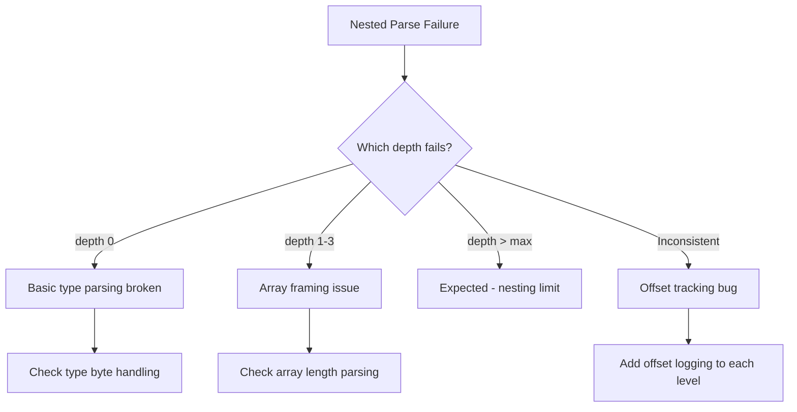

# Troubleshooting Advanced Parsing in Cilium Network Security

Author: [nawazdhandala](https://github.com/nawazdhandala)

Tags: Cilium, Network Security, Advanced Parsing, Troubleshooting, Debugging

Description: Diagnose and resolve complex parsing issues in Cilium L7 parsers, including nested structure failures, encoding mismatches, state corruption, and performance degradation in advanced protocol handlers.

---

## Introduction

Advanced parsing in Cilium L7 parsers introduces failure modes that are not present in basic message framing. Nested structures can fail at any depth, variable-length field encodings can mismatch between client and server implementations, and multi-message state tracking can become corrupted under specific traffic patterns.

These issues are harder to diagnose than basic parsing failures because the symptoms are often indirect — a message parses partially, produces wrong policy decisions, or silently corrupts subsequent messages in the stream. Effective troubleshooting requires understanding the protocol specification deeply and using structured debugging approaches.

This guide covers diagnostic techniques for the most common advanced parsing problems in Cilium parsers.

## Prerequisites

- A Cilium cluster with L7 policy applied
- Parser source code access
- Go debugging tools (Delve, pprof)
- Protocol-specific traffic generator for reproduction
- `cilium monitor` and Envoy admin interface access

## Diagnosing Nested Structure Parsing Failures

When nested structures fail to parse correctly, the error may cascade through the rest of the message:

```bash
# Enable debug logging for the parser
kubectl exec -n kube-system ds/cilium -- cilium config set debug true

# Watch for parser errors in real time
kubectl logs -n kube-system ds/cilium -c cilium-agent -f | grep -i "parse\|parser\|myprotocol"
```

Create a diagnostic test that isolates nesting levels:

```go
func TestParseValue_NestingDiagnostic(t *testing.T) {
    // Test each nesting level individually to find where parsing breaks
    for depth := 0; depth <= maxNestingDepth+1; depth++ {
        t.Run(fmt.Sprintf("depth_%d", depth), func(t *testing.T) {
            data := buildNestedArray(depth)
            _, consumed, err := parseValue(data, 0, 0)

            if depth <= maxNestingDepth {
                if err != nil {
                    t.Errorf("Depth %d should succeed, got error: %v", depth, err)
                }
                if consumed != len(data) {
                    t.Errorf("Depth %d: consumed %d of %d bytes",
                        depth, consumed, len(data))
                }
            } else {
                if err == nil {
                    t.Errorf("Depth %d should fail with nesting limit error", depth)
                }
            }
        })
    }
}

// buildNestedArray creates an array nested to the specified depth
func buildNestedArray(depth int) []byte {
    if depth == 0 {
        // Base case: a simple integer value
        return []byte{0x01, 0x00, 0x00, 0x00, 0x42} // type=int, value=66
    }

    inner := buildNestedArray(depth - 1)
    // Wrap in an array of 1 element
    result := []byte{0x03} // type=array
    arrayLen := make([]byte, 4)
    arrayLen[3] = 0x01 // 1 element
    result = append(result, arrayLen...)
    result = append(result, inner...)
    return result
}
```



## Fixing Encoding Mismatches

When the parser and the application disagree on encoding:

```go
// Diagnostic: Log raw bytes at parse boundaries
func readStringDiagnostic(data []byte, offset int) (string, int, error) {
    if len(data) < offset+2 {
        return "", 0, fmt.Errorf("insufficient data at offset %d (have %d bytes)",
            offset, len(data))
    }

    // Log the raw length bytes for debugging
    log.WithFields(log.Fields{
        "offset":    offset,
        "byte0":     fmt.Sprintf("0x%02x", data[offset]),
        "byte1":     fmt.Sprintf("0x%02x", data[offset+1]),
        "bigEndian": int(data[offset])<<8 | int(data[offset+1]),
        "litEndian": int(data[offset+1])<<8 | int(data[offset]),
    }).Debug("String length bytes")

    // Try big-endian (most protocols)
    strLen := int(data[offset])<<8 | int(data[offset+1])

    // Sanity check: if big-endian produces unreasonable length,
    // the protocol might use little-endian
    if strLen > len(data)-offset-2 {
        littleEndian := int(data[offset+1])<<8 | int(data[offset])
        log.WithFields(log.Fields{
            "bigEndian":    strLen,
            "littleEndian": littleEndian,
            "available":    len(data) - offset - 2,
        }).Warn("Big-endian length exceeds data, check byte order")
    }

    if strLen > maxStringLen {
        return "", 0, fmt.Errorf("string length %d exceeds max %d", strLen, maxStringLen)
    }
    if len(data) < offset+2+strLen {
        return "", 0, fmt.Errorf("insufficient data for string body")
    }

    return string(data[offset+2 : offset+2+strLen]), 2 + strLen, nil
}
```

## Resolving State Tracking Corruption

When request-response correlation breaks down:

```bash
# Monitor for mismatched requests/responses
kubectl logs -n kube-system ds/cilium -c cilium-agent | grep "unmatched\|orphan\|mismatch"
```

```go
// Add diagnostics to the request tracker
func (rt *requestTracker) diagnosticDump() string {
    var buf strings.Builder
    buf.WriteString(fmt.Sprintf("Pending requests: %d/%d\n", len(rt.pendingRequests), rt.maxPending))

    now := time.Now().UnixNano()
    for id, info := range rt.pendingRequests {
        age := time.Duration(now - info.timestamp)
        buf.WriteString(fmt.Sprintf("  ID=%d cmd=%x age=%v\n", id, info.command, age))
    }

    return buf.String()
}

// Add periodic cleanup for stale requests
func (rt *requestTracker) cleanupStale(maxAge time.Duration) int {
    threshold := time.Now().Add(-maxAge).UnixNano()
    cleaned := 0

    for id, info := range rt.pendingRequests {
        if info.timestamp < threshold {
            log.WithFields(log.Fields{
                "requestID": id,
                "command":   info.command,
                "age":       time.Duration(time.Now().UnixNano() - info.timestamp),
            }).Warn("Cleaning stale request entry")
            delete(rt.pendingRequests, id)
            cleaned++
        }
    }

    return cleaned
}
```

## Debugging Performance Regressions

When advanced parsing causes latency:

```bash
# Profile parsing performance
go test ./proxylib/myprotocol/... -bench=BenchmarkParseComplex -cpuprofile=cpu.prof -memprofile=mem.prof

# Analyze CPU profile
go tool pprof -top cpu.prof

# Analyze memory allocations
go tool pprof -top -alloc_objects mem.prof

# Check Envoy proxy latency
kubectl exec -n kube-system ds/cilium -c cilium-agent -- \
    curl -s http://localhost:9901/stats | grep downstream_cx_length
```

Common performance issues and fixes:

```go
// SLOW: String concatenation in hot path
func formatKey(parts []string) string {
    result := ""
    for _, p := range parts {
        result += "/" + p  // Creates new string each iteration
    }
    return result
}

// FAST: Use strings.Builder
func formatKey(parts []string) string {
    var buf strings.Builder
    for _, p := range parts {
        buf.WriteByte('/')
        buf.WriteString(p)
    }
    return buf.String()
}
```

## Verification

Confirm fixes for advanced parsing issues:

```bash
# Run full test suite
go test ./proxylib/myprotocol/... -v -race -count=1

# Run nesting-specific tests
go test ./proxylib/myprotocol/... -v -run TestParseValue

# Fuzz advanced parsing
go test ./proxylib/myprotocol/... -fuzz=FuzzParseValue -fuzztime=60s

# Benchmark to confirm no regression
go test ./proxylib/myprotocol/... -bench=. -benchmem
```

## Troubleshooting

**Problem: Parsing works for small messages but fails for large ones**
Check for integer overflow in offset calculations. When offset and length are both large, their sum can overflow int32 on 32-bit builds. Use explicit overflow checks.

**Problem: Parser works with one client but not another**
Different client implementations may use different protocol versions or optional features. Capture raw traffic from both clients and compare byte-by-byte to find the divergence point.

**Problem: Performance degrades over time**
Check for memory leaks in the request tracker or any per-connection state that grows unbounded. Add metrics for tracker size and trigger cleanup at regular intervals.

**Problem: Tests pass but real traffic fails**
Test data may not accurately represent real protocol traffic. Capture a pcap of real traffic and replay it through the parser test framework to find discrepancies.

## Conclusion

Troubleshooting advanced parsing in Cilium requires structured diagnosis that isolates the parsing layer where failure occurs. By testing each nesting depth independently, logging raw bytes at encoding boundaries, monitoring state tracker health, and profiling performance, you can efficiently identify and resolve complex parsing issues. Always validate fixes against real traffic in addition to unit tests.
