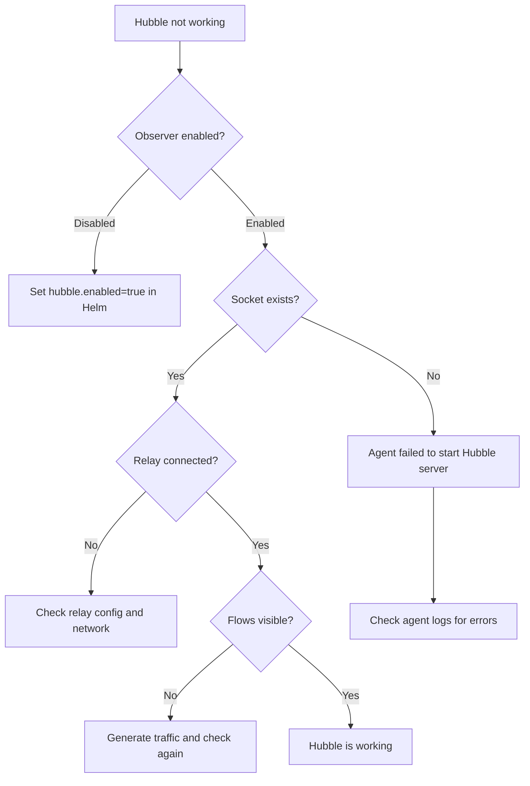

# How to Troubleshoot Basic Configuration in Cilium Hubble

Author: [nawazdhandala](https://github.com/nawazdhandala)

Tags: Cilium, Hubble, Troubleshooting, Configuration, Kubernetes

Description: Diagnose and fix common basic configuration issues in Cilium Hubble, including disabled observer, relay connection failures, missing flows, and UI rendering problems.

---

## Introduction

Hubble's basic configuration involves three interconnected components: the observer in each Cilium agent, the relay service, and the UI. When any of these components is misconfigured, the symptoms can range from missing flow data to a completely non-functional observability pipeline.

Basic configuration issues are often the result of incomplete Helm values, version mismatches between components, or resource constraints that prevent components from starting. The good news is that these problems follow predictable patterns and can be diagnosed systematically.

This guide covers the most common basic configuration failures in Hubble and provides step-by-step resolution procedures for each.

## Prerequisites

- Kubernetes cluster with Cilium installed
- kubectl access to kube-system namespace
- cilium CLI installed
- Helm 3 for configuration inspection

## Diagnosing Hubble Observer Issues

The observer is the foundation. If it is not working, nothing else will function:

```bash
# Check if Hubble is enabled
kubectl -n kube-system exec ds/cilium -- cilium status 2>&1 | grep -i hubble

# If it shows "Disabled", check the config
kubectl -n kube-system exec ds/cilium -- cilium config | grep -i hubble

# Verify the Helm values
helm get values cilium -n kube-system -o yaml | grep -A5 "^hubble:"
```



If the observer is enabled but not producing flows:

```bash
# Check the Hubble socket
kubectl -n kube-system exec ds/cilium -- ls -la /var/run/cilium/hubble.sock

# Check agent logs for Hubble-related errors
kubectl -n kube-system logs ds/cilium --tail=100 | grep -i "hubble\|observer"

# Verify the event buffer is allocated
kubectl -n kube-system exec ds/cilium -- cilium status --verbose 2>&1 | grep -A5 "Hubble"
```

## Fixing Relay Connection Failures

The relay must connect to every Cilium agent via gRPC:

```bash
# Check relay pod status
kubectl -n kube-system get pods -l k8s-app=hubble-relay

# View relay logs
kubectl -n kube-system logs deploy/hubble-relay --tail=50

# Common errors in relay logs:
# "dial tcp: connect: connection refused" - Hubble server not running on agent
# "context deadline exceeded" - Network connectivity issue
# "tls: first record does not look like a TLS handshake" - TLS mismatch

# Check if the Hubble peer service exists
kubectl -n kube-system get svc hubble-peer

# Verify the peer service endpoints
kubectl -n kube-system get endpoints hubble-peer
```

Fix TLS mismatch between relay and agents:

```bash
# Check if TLS is enabled on the agent side
helm get values cilium -n kube-system -o yaml | grep -A10 "tls:"

# If TLS settings are inconsistent, reset them
helm upgrade cilium cilium/cilium -n kube-system \
  --reuse-values \
  --set hubble.tls.enabled=true \
  --set hubble.tls.auto.enabled=true \
  --set hubble.tls.auto.method=cronJob \
  --set hubble.relay.tls.server.enabled=true
```

## Resolving Missing Flow Data

When Hubble is running but flows are missing or incomplete:

```bash
# Generate test traffic
kubectl run curl-test --image=curlimages/curl --rm -it --restart=Never -- \
  curl -s http://kubernetes.default/healthz

# Check if flows are visible locally on the agent
kubectl -n kube-system exec ds/cilium -- hubble observe --last 10

# Check if flows are visible through the relay
cilium hubble port-forward &
hubble observe --last 10

# If agent has flows but relay does not, the issue is relay connectivity
# If agent has no flows, the issue is the observer
```

Common causes of missing flows:

```bash
# 1. Hubble monitor events not enabled for the datapath
kubectl -n kube-system exec ds/cilium -- cilium config | grep MonitorAggregation

# 2. BPF programs not updated after enabling Hubble
# Fix: trigger endpoint regeneration
kubectl -n kube-system exec ds/cilium -- cilium endpoint regenerate --all

# 3. Event buffer too small for the traffic volume
kubectl -n kube-system exec ds/cilium -- cilium status --verbose | grep "current/max"
```

## Fixing UI Configuration Problems

The Hubble UI depends on the relay for flow data:

```bash
# Check UI pod status
kubectl -n kube-system get pods -l k8s-app=hubble-ui

# View UI pod logs
kubectl -n kube-system logs deploy/hubble-ui -c frontend --tail=20
kubectl -n kube-system logs deploy/hubble-ui -c backend --tail=20

# Verify the UI can reach the relay
kubectl -n kube-system exec deploy/hubble-ui -c backend -- \
  wget -qO- --timeout=5 http://hubble-relay:4245 2>&1

# Port-forward and test the UI
kubectl -n kube-system port-forward svc/hubble-ui 12000:80 &
curl -s -o /dev/null -w '%{http_code}' http://localhost:12000
```

If the UI returns 502 or shows no data:

```bash
# Check the backend configuration
kubectl -n kube-system get deploy hubble-ui -o yaml | grep -A5 "env:"

# Verify the relay service is reachable from the UI namespace
kubectl -n kube-system get svc hubble-relay
kubectl -n kube-system get endpoints hubble-relay
```

## Verification

After resolving configuration issues, run a full health check:

```bash
# 1. Observer status
kubectl -n kube-system exec ds/cilium -- cilium status | grep "Hubble"

# 2. Relay connectivity
cilium hubble port-forward &
hubble status

# 3. Flow data available
hubble observe --last 5

# 4. UI accessible
kubectl -n kube-system port-forward svc/hubble-ui 12000:80 &
curl -s -o /dev/null -w '%{http_code}\n' http://localhost:12000

# 5. Metrics endpoint responding
kubectl -n kube-system exec ds/cilium -- wget -qO- http://localhost:9965/metrics 2>/dev/null | grep hubble | head -5
```

## Troubleshooting

- **Hubble enabled but cilium status shows "Disabled"**: The Cilium agent may need a restart. Run `kubectl -n kube-system rollout restart ds/cilium`.

- **Relay pod in CrashLoopBackOff**: Check logs for the specific error. Most common cause is TLS certificate issues. Try disabling TLS temporarily to verify.

- **UI shows "Waiting for data"**: Navigate to a namespace that has active pods. The default namespace view may be empty if no workloads are running there.

- **Flows appear briefly then disappear**: The event buffer may be too small and getting overwritten. Increase `hubble.eventBufferCapacity` in Helm values.

- **Helm upgrade does not take effect**: Some Hubble settings require a full pod restart. Run `kubectl -n kube-system rollout restart ds/cilium` after the Helm upgrade.

## Conclusion

Basic Hubble configuration issues typically fall into four categories: disabled observer, relay connectivity failures, missing flow data, and UI problems. Each category has a clear diagnostic path that starts with checking pod status and logs, then verifying connectivity between components. By following the structured approach in this guide, you can quickly identify which component is failing and apply the appropriate fix.
