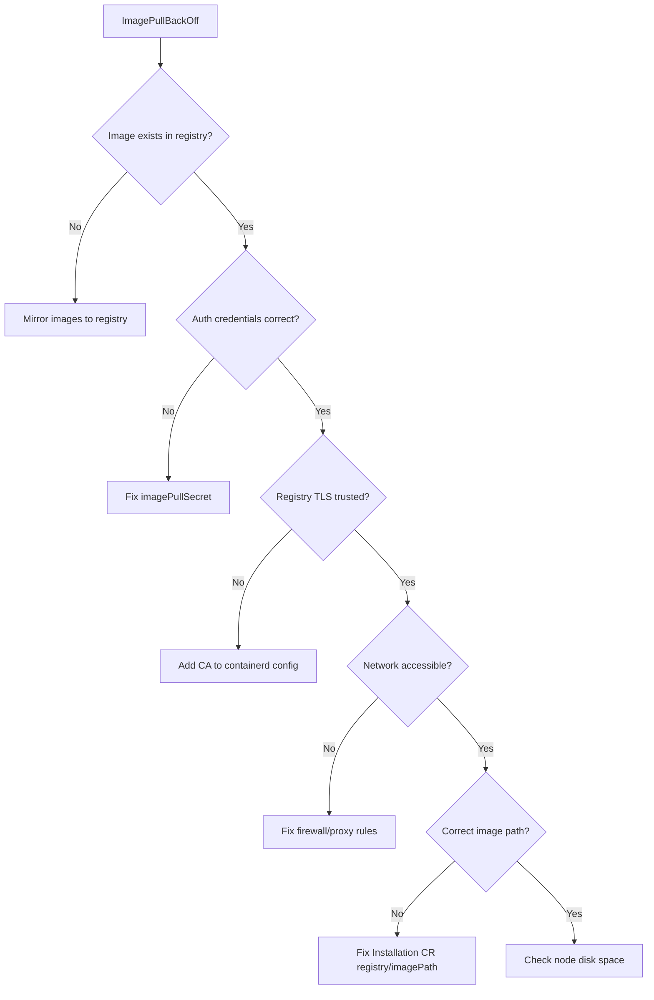

# Troubleshooting Calico Alternate Registry Configuration

Author: [nawazdhandala](https://github.com/nawazdhandala)

Tags: Calico, Container Registry, Troubleshooting, Kubernetes, DevOps

Description: A systematic guide to diagnosing and fixing Calico alternate registry configuration issues including image pull failures, authentication errors, and registry connectivity problems.

---

## Introduction

Configuring Calico to pull images from an alternate registry is a common requirement in enterprise environments, but it introduces several potential failure points. Image pull errors, authentication failures, certificate trust issues, and registry connectivity problems can prevent Calico components from starting or upgrading.

These issues are particularly challenging because they manifest at the pod level with generic error messages like "ImagePullBackOff" that do not immediately reveal the root cause. A systematic troubleshooting approach that checks registry connectivity, authentication, image availability, and Kubernetes configuration is essential.

This guide provides a structured troubleshooting workflow for Calico alternate registry issues with specific diagnostic commands and solutions.

## Prerequisites

- Kubernetes cluster with Calico configured for an alternate registry
- kubectl access with permissions to view pods and events
- Access to the private registry for verification
- crane or skopeo CLI for registry inspection
- Basic understanding of container image registries

## Step 1: Identify the Failing Component

Start by identifying which Calico component is failing and what error it reports:

```bash
# Check pod status across Calico namespaces
kubectl get pods -n calico-system -o wide
kubectl get pods -n tigera-operator -o wide

# Look for image pull errors in events
kubectl get events -n calico-system --sort-by='.lastTimestamp' | grep -i "pull\|image\|registry"

# Get detailed error from a specific failing pod
kubectl describe pod -n calico-system <pod-name> | grep -A 5 "Events:"
```

Common error messages and their meanings:

```text
# ErrImagePull / ImagePullBackOff
# The image cannot be pulled -- could be auth, network, or missing image

# "repository does not exist or may require docker login"
# Image not found in registry or authentication failed

# "x509: certificate signed by unknown authority"
# The registry uses a TLS certificate not trusted by the node
```

## Step 2: Verify Image Availability in the Registry

Confirm that the required images exist in your private registry:

```bash
# List available Calico images and tags
crane ls registry.example.com/calico/node
crane ls registry.example.com/calico/cni
crane ls registry.example.com/calico/kube-controllers
crane ls registry.example.com/calico/typha

# Check a specific image manifest
crane manifest registry.example.com/calico/node:v3.27.0

# Verify the image architecture matches your nodes
crane config registry.example.com/calico/node:v3.27.0 | \
  python3 -c "import sys,json; c=json.load(sys.stdin); print(f\"OS: {c['os']}, Arch: {c['architecture']}\")"
```

## Step 3: Test Registry Authentication

Verify that Kubernetes can authenticate to the private registry:

```bash
# Check if image pull secrets exist
kubectl get secrets -n calico-system | grep docker

# Inspect the pull secret contents (base64 encoded)
kubectl get secret calico-registry-secret -n calico-system -o jsonpath='{.data.\.dockerconfigjson}' | base64 -d | python3 -m json.tool

# Test authentication from a debug pod
kubectl run registry-test --rm -it \
  --image=gcr.io/go-containerregistry/crane:debug \
  --overrides='{
    "spec": {
      "imagePullSecrets": [{"name": "calico-registry-secret"}],
      "containers": [{
        "name": "test",
        "image": "gcr.io/go-containerregistry/crane:debug",
        "command": ["crane", "ls", "registry.example.com/calico/node"]
      }]
    }
  }' -- crane ls registry.example.com/calico/node

# Recreate the pull secret if credentials are wrong
kubectl delete secret calico-registry-secret -n calico-system
kubectl create secret docker-registry calico-registry-secret \
  -n calico-system \
  --docker-server=registry.example.com \
  --docker-username=calico-pull \
  --docker-password="${REGISTRY_PASSWORD}"
```

## Step 4: Check Registry TLS Configuration

If your registry uses a self-signed or enterprise CA certificate:

```bash
# Test TLS connectivity to the registry from a node
openssl s_client -connect registry.example.com:443 -servername registry.example.com < /dev/null 2>/dev/null | openssl x509 -noout -subject -issuer

# Check if containerd trusts the registry CA
# For containerd-based nodes
cat /etc/containerd/config.toml | grep -A 10 "registry.example.com"

# Configure containerd to trust the private CA
# Add to /etc/containerd/config.toml on each node:
# [plugins."io.containerd.grpc.v1.cri".registry.configs."registry.example.com".tls]
#   ca_file = "/etc/containerd/certs.d/registry.example.com/ca.crt"
```



## Step 5: Verify Operator and Installation Configuration

Ensure the Tigera operator is configured with the correct registry:

```bash
# Check the Installation resource
kubectl get installation default -o yaml | grep -A 5 "registry\|imagePath"

# Expected output:
# registry: registry.example.com
# imagePath: calico

# Check what images the operator is actually setting
kubectl get deployment -n calico-system calico-kube-controllers -o jsonpath='{.spec.template.spec.containers[*].image}'
kubectl get daemonset -n calico-system calico-node -o jsonpath='{.spec.template.spec.containers[*].image}'

# If the registry is wrong, update the Installation resource
kubectl patch installation default --type merge -p '{
  "spec": {
    "registry": "registry.example.com",
    "imagePath": "calico"
  }
}'
```

## Step 6: Check Node-Level Registry Access

Verify that each node can reach the private registry:

```bash
# Run a debug pod on a specific node to test connectivity
kubectl debug node/<node-name> -it --image=busybox -- sh -c \
  "wget -q -O /dev/null --timeout=5 https://registry.example.com/v2/ && echo 'Registry reachable' || echo 'Registry unreachable'"

# Check for proxy settings that might block registry access
kubectl get daemonset -n calico-system calico-node -o jsonpath='{.spec.template.spec.containers[*].env}' | python3 -m json.tool | grep -i proxy
```

## Verification

```bash
# After fixing the issue, verify all pods are running
kubectl get pods -n calico-system -w

# Verify no image pull errors remain
kubectl get events -n calico-system --field-selector reason=Failed --sort-by='.lastTimestamp' | tail -5

# Confirm all images are from the private registry
kubectl get pods -n calico-system -o jsonpath='{range .items[*]}{.metadata.name}: {.spec.containers[*].image}{"\n"}{end}'
```

## Troubleshooting

- **Pods stuck in ImagePullBackOff after fixing**: Delete the failing pods to force re-creation. The daemonset/deployment controller will recreate them: `kubectl delete pods -n calico-system -l k8s-app=calico-node`.
- **Some nodes pull images but others fail**: Check node-specific network policies, proxy settings, or containerd configurations that may differ between nodes.
- **Operator reverts image changes**: Do not modify pod images directly. Always update the Installation CR, as the operator reconciles pod specs.
- **Multi-arch images missing**: Ensure you mirror the manifest list (multi-arch) rather than a single platform image. Use `crane copy` which handles manifest lists correctly.

## Conclusion

Troubleshooting Calico alternate registry configuration requires checking each layer systematically: image availability in the registry, authentication credentials, TLS trust, network connectivity, and operator configuration. By working through these steps methodically, you can quickly identify and resolve the root cause of image pull failures and ensure all Calico components pull images from your private registry reliably.
